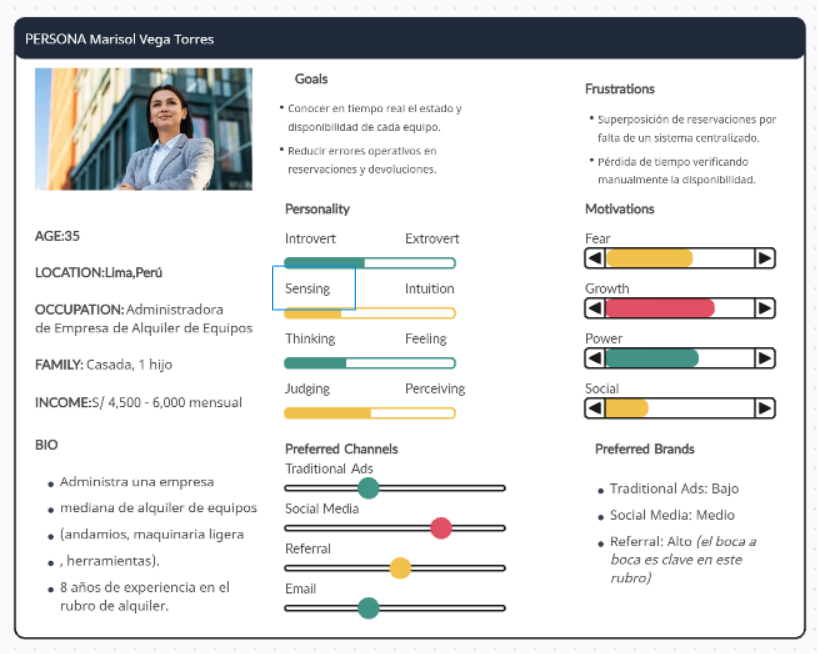
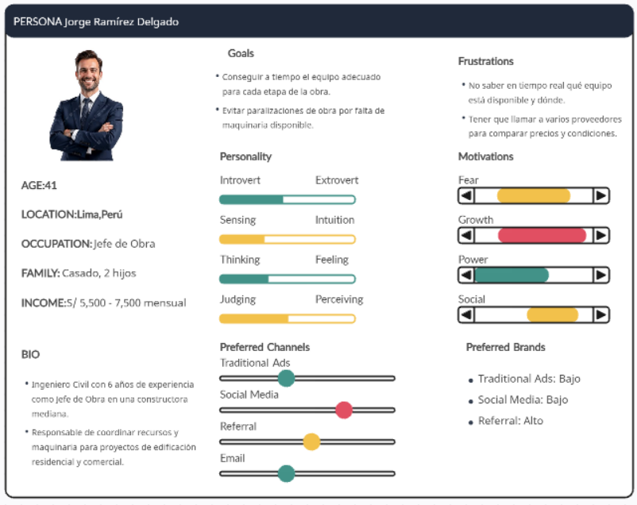
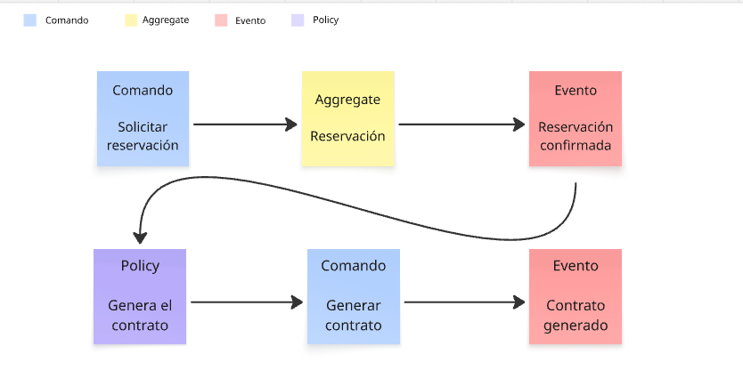

# RentBuild

  

  
Universidad Peruana de Ciencias Aplicadas

  
Facultad de Ingeniería

  
Carrera de Ingeniería de Software

  
Ciclo académico 2026-20
 

  
<b>1ASI0730</b>

  
<b>Aplicaciones Web</b>

  
NRC

  
<b>8093</b>

  
<b>Informe de Trabajo Final</b>

  
Docente

  
<b>Bautista Ubillús, Efraín Ricardo</b>

  
Startup

  
<b>DataFlux</b>
 
  
Producto

  
<b>RentBuild</b>

  <h3>Integrantes</h3>

  <table>
    <thead>
      <tr>
        <th>Código</th>
        <th>Apellidos y Nombres</th>
      </tr>
    </thead>
    <tbody>
      <tr>
        <td>U20211B198</td>
        <td>Cisneros Salas, Luis Angel</td>
      </tr>
      <tr>
        <td>U202410211</td>
        <td>Manosalva Tovar, Miroslav Oscar</td>
      </tr>
      <tr>
        <td>U202111529</td>
        <td>Montalvo Vásquez, Bruno Rodrigo</td>
      </tr>
      <tr>
        <td>U20211F962</td>
        <td>Vargas Manchinelli, Deiby Juan</td>
      </tr>
      <tr>
        <td>U2023228489</td>
        <td>Viza Quispe, Marlon Packard</td>
      </tr>
    </tbody>
  </table>
   

  
<b>Septiembre, 2026</b>

## Registro de Versiones del Informe

| Versión | Fecha |  Autor   |                                                  Descripción de modificación                                                   |
| :-----: |:-----:|:--------:| :----------------------------------------------------------------------------------------------------------------------------: |
|   AV1   |       |  Todos   | Se agregó la primera versión del informe, incluyendo carátula, registro de versiones, perfiles del equipo, análisis inicial del problema, artefactos de UX, arquitectura preliminar y evidencias del Sprint 1. |

## Project Report Collaboration Insights

A continuación, se presenta el repositorio utilizado para la elaboración colaborativa del informe del proyecto RentBuild.

#### Link del repositorio del Reporte:

- https://github.com/upc-pre-202620-1asi0730-8093-dataflux/dataflux-project-report.git

### Entrega AV1:

#### Participación por integrante:

##### Commits en el Project Report:

# Contenido

## Índice

- [Registro de Versiones del Informe](#registro-de-versiones-del-informe)
- [Project Report Collaboration Insights](#project-report-collaboration-insights)
- [Contenido](#contenido)
- [Student Outcome](#student-outcome)
- [Capítulo I: Introducción](#capítulo-i-introducción)
    - [1.1. Startup Profile](#11-startup-profile)
        - [1.1.1. Descripción de la Startup](#111-descripción-de-la-startup)
        - [1.1.2. Perfiles de integrantes del equipo](#112-perfiles-de-integrantes-del-equipo)
    - [1.2. Solution Profile](#12-solution-profile)
        - [1.2.1. Antecedentes y problemática](#121-antecedentes-y-problemática)
        - [1.2.2. Lean UX Process](#122-lean-ux-process)
            - [1.2.2.1. Lean UX Problem Statements](#1221-lean-ux-problem-statements)
            - [1.2.2.2. Lean UX Assumptions](#1222-lean-ux-assumptions)
            - [1.2.2.3. Lean UX Hypothesis Statements](#1223-lean-ux-hypothesis-statements)
            - [1.2.2.4. Lean UX Canvas](#1224-lean-ux-canvas)
    - [1.3. Segmentos objetivo](#13-segmentos-objetivo)
- [Capítulo II: Requirements Elicitation & Analysis](#capítulo-ii-requirements-elicitation--analysis)
    - [2.1. Competidores](#21-competidores)
        - [2.1.1. Análisis competitivo](#211-análisis-competitivo)
        - [2.1.2. Estrategias y tácticas frente a competidores](#212-estrategias-y-tácticas-frente-a-competidores)
    - [2.2. Entrevistas](#22-entrevistas)
        - [2.2.1. Diseño de entrevistas](#221-diseño-de-entrevistas)
        - [2.2.2. Registro de entrevistas](#222-registro-de-entrevistas)
        - [2.2.3. Análisis de entrevistas](#223-análisis-de-entrevistas)
    - [2.3. Needfinding](#23-needfinding)
        - [2.3.1. User Personas](#231-user-personas)
        - [2.3.2. User Task Matrix](#232-user-task-matrix)
        - [2.3.3. User Journey Mapping](#233-user-journey-mapping)
        - [2.3.4. Empathy Mapping](#234-empathy-mapping)
    - [2.4. Big Picture Event Storming](#24-big-picture-event-storming)
    - [2.5. Ubiquitous Language](#25-ubiquitous-language)
- [Capítulo III: Requirements Specification](#capítulo-iii-requirements-specification)
    - [3.1. User Stories](#31-user-stories)
    - [3.2. Impact Mapping](#32-impact-mapping)
    - [3.3. Product Backlog](#33-product-backlog)
- [Capítulo IV: Product Design](#capítulo-iv-product-design)
    - [4.1. Style Guidelines](#41-style-guidelines)
        - [4.1.1. General Style Guidelines](#411-general-style-guidelines)
        - [4.1.2. Web Style Guidelines](#412-web-style-guidelines)
    - [4.2. Information Architecture](#42-information-architecture)
        - [4.2.1. Organization Systems](#421-organization-systems)
        - [4.2.2. Labeling Systems](#422-labeling-systems)
        - [4.2.3. SEO Tags and Meta Tags](#423-seo-tags-and-meta-tags)
        - [4.2.4. Searching Systems](#424-searching-systems)
        - [4.2.5. Navigation Systems](#425-navigation-systems)
    - [4.3. Landing Page UI Design](#43-landing-page-ui-design)
        - [4.3.1. Landing Page Wireframe](#431-landing-page-wireframe)
        - [4.3.2. Landing Page Mock-up](#432-landing-page-mock-up)
    - [4.4. Web Applications UX/UI Design](#44-web-applications-uxui-design)
        - [4.4.1. Web Applications Wireframes](#441-web-applications-wireframes)
        - [4.4.2. Web Applications Wireflow Diagrams](#442-web-applications-wireflow-diagrams)
        - [4.4.3. Web Applications Mock-ups](#443-web-applications-mock-ups)
        - [4.4.4. Web Applications User Flow Diagrams](#444-web-applications-user-flow-diagrams)
    - [4.5. Web Applications Prototyping](#45-web-applications-prototyping)
    - [4.6. Domain-Driven Software Architecture](#46-domain-driven-software-architecture)
        - [4.6.1. Design-Level Event Storming](#461-design-level-event-storming)
        - [4.6.2. Software Architecture Context Diagram](#462-software-architecture-context-diagram)
        - [4.6.3. Software Architecture Container Diagrams](#463-software-architecture-container-diagrams)
        - [4.6.4. Software Architecture Components Diagrams](#464-software-architecture-components-diagrams)
    - [4.7. Software Object-Oriented Design](#47-software-object-oriented-design)
        - [4.7.1. Class Diagrams](#471-class-diagrams)
    - [4.8. Database Design](#48-database-design)
        - [4.8.1. Database Diagrams](#481-database-diagrams)
- [Capítulo V: Product Implementation, Validation & Deployment](#capítulo-v-product-implementation-validation--deployment)
    - [5.1. Software Configuration Management](#51-software-configuration-management)
        - [5.1.1. Software Development Environment Configuration](#511-software-development-environment-configuration)
        - [5.1.2. Source Code Management](#512-source-code-management)
        - [5.1.3. Source Code Style Guide & Conventions](#513-source-code-style-guide--conventions)
        - [5.1.4. Software Deployment Configuration](#514-software-deployment-configuration)
    - [5.2. Landing Page, Services & Applications Implementation](#52-landing-page-services--applications-implementation)
        - [5.2.1. Sprint 1](#521-sprint-1)
            - [5.2.1.1. Sprint Planning 1](#5211-sprint-planning-1)
            - [5.2.1.2. Aspect Leaders and Collaborators](#5212-aspect-leaders-and-collaborators)
            - [5.2.1.3. Sprint Backlog 1](#5213-sprint-backlog-1)
            - [5.2.1.4. Development Evidence for Sprint Review](#5214-development-evidence-for-sprint-review)
            - [5.2.1.5. Execution Evidence for Sprint Review](#5215-execution-evidence-for-sprint-review)
            - [5.2.1.6. Services Documentation Evidence for Sprint Review](#5216-services-documentation-evidence-for-sprint-review)
            - [5.2.1.7. Software Deployment Evidence for Sprint Review](#5217-software-deployment-evidence-for-sprint-review)
            - [5.2.1.8. Team Collaboration Insights during Sprint](#5218-team-collaboration-insights-during-sprint)
- [Conclusiones](#conclusiones)
    - [Conclusiones y recomendaciones](#conclusiones-y-recomendaciones)
- [Bibliografía](#bibliografía)
- [Anexos](#anexos)

## Student Outcome

El curso contribuye al cumplimiento del Student Outcome ABET:  
**ABET - EAC - Student Outcome 5**

**Criterio:** *La capacidad de funcionar efectivamente en un equipo cuyos miembros
juntos proporcionan liderazgo, crean un entorno de colaboración e inclusivo,
establecen objetivos, planifican tareas y cumplen objetivos.*

En el siguiente cuadro se describe las acciones realizadas y enunciados de conclusiones por parte del grupo, que permiten sustentar el haber alcanzado el logro del ABET - EAC - Student Outcome 5.

| Criterio específico                                                                                 | Acciones realizadas                                                                                                                                                                                            | Conclusiones |
|:----------------------------------------------------------------------------------------------------|:---------------------------------------------------------------------------------------------------------------------------------------------------------------------------------------------------------------|:-------------|
| **Trabaja en equipo para proporcionar liderazgo en forma conjunta.**                                | **Cisneros Salas, Luis Angel** **AV1:**  **Manosalva Tovar, Miroslav Oscar** **AV1:**  **Montalvo Vásquez, Bruno Rodrigo** **AV1:**  **Vargas Manchinelli, Deiby Juan** **AV1:**  **Viza Quispe, Marlon Packard** **AV1:** | **AV1:**     |
| **Crea un entorno colaborativo e inclusivo, establece metas, planifica tareas y cumple objetivos.** | **Cisneros Salas, Luis Angel** **AV1:**  **Manosalva Tovar, Miroslav Oscar** **AV1:**  **Montalvo Vásquez, Bruno Rodrigo** **AV1:**  **Vargas Manchinelli, Deiby Juan** **AV1:**  **Viza Quispe, Marlon Packard** **AV1:** | **AV1:**     |

# Capítulo I: Introducción

## 1.1. Startup Profile

### 1.1.1. Descripción de la Startup

### 1.1.2. Perfiles de integrantes del equipo

|   Código   | Nombre completo del integrante  | Descripción de la carrera                                          |                               Fotografía                                | Conocimientos y habilidades                                                                                                                                                                                                                                                                                                                                                                                                                                                                                                                                                                                                                                                                                                                                                                                                                                                                                                                                                                                                   |
|:----------:|:--------------------------------| :----------------------------------------------------------------- |:----------------------------------------------------------------------------:|:------------------------------------------------------------------------------------------------------------------------------------------------------------------------------------------------------------------------------------------------------------------------------------------------------------------------------------------------------------------------------------------------------------------------------------------------------------------------------------------------------------------------------------------------------------------------------------------------------------------------------------------------------------------------------------------------------------------------------------------------------------------------------------------------------------------------------------------------------------------------------------------------------------------------------------------------------------------------------------------------------------------------------|
| U20211B198 | Cisneros Salas, Luis            | Ingeniería de Software - Universidad Peruana de Ciencias Aplicadas |          | Soy estudiante de Ingeniería de Software interesado en crear soluciones digitales que simplifiquen procesos y resuelvan problemas reales. Actualmente fortalezco mis conocimientos en C#, y cuento con experiencia en C++, Java, JavaScript, HTML y CSS. Me interesa especialmente el desarrollo frontend, las bases de datos y las aplicaciones web. Soy una persona organizada, responsable, de rápido aprendizaje y con facilidad para trabajar en equipo. Busco esta oportunidad para adquirir experiencia y seguir creciendo profesionalmente.                                                                                                                                                                                                                                                                                                                                                                                                                                                                           |
| U202410211 | Manosalva Tovar, Miroslav       | Ingeniería de Software - Universidad Peruana de Ciencias Aplicadas |  | Soy Miroslav Manosalva Tovar, estudiante de Ingeniería de Software. Tengo conocimientos en el área de programación y experiencia en la elaboración de interfaces de usuario (UI), que puedo aportar al desarrollo de RentBuild. Mi experiencia trabajando con interfaces me permite contribuir a la presentación de la información y a la organización visual de las funcionalidades de la plataforma. Me considero una persona responsable y persistente: procuro cumplir con las actividades que asumo y mantener el esfuerzo cuando encuentro dificultades. En este proyecto, busco aplicar mis conocimientos de programación y diseño de interfaces, seguir fortaleciendo mi formación y contribuir al desarrollo de una solución útil para sus usuarios.                                                                                                                                                                                                                                                                 |
| U202111529 | Montalvo Vasquez, Bruno Rodrigo | Ingeniería de Software - Universidad Peruana de Ciencias Aplicadas |       | Soy Bruno Rodrigo Montalvo Vasquez, estudiante de la carrera de Ingeniería de Software. Me encuentro interesado y motivado por aprender nuevos temas relacionados con mi carrera. Asimismo, estoy abierto a trabajar con profesionales de mi área académica para mejorar mis conocimientos, adquirir experiencia y fortalecer mis habilidades de trabajo en equipo.                                                                                                                                                                                                                                                                                                                                                                                                                                                                                                                                                                                                                                                           |
| U20211F962 | Vargas Manchinelli, Deiby Juan  | Ingeniería de Software - Universidad Peruana de Ciencias Aplicadas |        | Estudio Ingeniería de Software y me apasiona usar la tecnología para convertir problemas en soluciones prácticas. Actualmente estoy aprendiendo y fortaleciendo mis conocimientos en C#, además de tener experiencia con C++, Java, JavaScript, HTML y CSS. Me interesa el frontend, las bases de datos y el desarrollo web. Soy organizado, aprendo rápido y disfruto trabajar en equipo. Mi objetivo es ganar experiencia, aprender y seguir creciendo en el mundo del software.                                                                                                                                                                                                                                                                                                                                                                                                                                                                                                                                            |
| U202322849 | Viza Quispe, Marlon Packard     | Ingeniería de Software - Universidad Peruana de Ciencias Aplicadas |         | Soy estudiante de Ingeniería de Software con interés en el desarrollo web, frontend y bases de datos. Tengo experiencia con C++, Java, JavaScript, HTML y CSS, y actualmente estoy fortaleciendo mis conocimientos en C#. Me motiva crear soluciones útiles y eficientes, aprender constantemente y enfrentar nuevos desafíos. Me considero una persona organizada, creativa y con buena capacidad para trabajar en equipo.                                                                                                                                                                                                                                                                                                                                                                                                                                                                                                                                                                                                   |

## 1.2. Solution Profile

### 1.2.1. Antecedentes y problemática

### 1.2.2. Lean UX Process

#### 1.2.2.1. Lean UX Problem Statements

#### 1.2.2.2. Lean UX Assumptions

#### 1.2.2.3. Lean UX Hypothesis Statements

#### 1.2.2.4. Lean UX Canvas

## 1.3. Segmentos objetivo

# Capítulo II: Requirements Elicitation & Analysis

## 2.1. Competidores

### 2.1.1. Análisis competitivo

### 2.1.2. Estrategias y tácticas frente a competidores

## 2.2. Entrevistas

### 2.2.1. Diseño de entrevistas

**Segmento 1: Pequeñas y medianas empresas de alquiler de maquinaria**

**Objetivo:** Conocer cómo gestionan actualmente sus máquinas y alquileres, qué problemas enfrentan y qué tan útil podría resultarles una solución como RentBuild.

**Contexto**

1. ¿A qué se dedica actualmente su empresa y qué tipo de maquinaria suelen alquilar?

2. ¿Quién se encarga normalmente de gestionar los alquileres y las máquinas?

**Situación actual**

3. Cuando un cliente quiere alquilar una máquina, ¿cómo realizan normalmente todo el proceso?

4. ¿Cómo saben qué máquinas están disponibles, alquiladas o fuera de servicio?

5. ¿Qué herramientas utilizan actualmente para llevar el control de sus máquinas y alquileres?

**Problemas**

6. ¿Cuál es la principal dificultad que tienen al gestionar sus alquileres?

7. ¿Alguna vez han tenido problemas porque una máquina fue reservada para más de un cliente o no estaba disponible cuando debía estarlo?

8. ¿Qué ocurre cuando una máquina es devuelta con algún daño o presenta una falla?

9. ¿Cómo controlan actualmente los mantenimientos y cuándo una máquina puede volver a alquilarse?

10. ¿Qué parte del proceso de alquiler les toma más tiempo o les genera más problemas?

**Opinión sobre RentBuild**

> *"Estamos desarrollando RentBuild, una plataforma pensada para pequeñas y medianas empresas de alquiler de maquinaria. La idea es permitir gestionar las máquinas y alquileres desde un solo lugar, desde la reserva hasta la devolución y mantenimiento, de una manera sencilla."*

11. ¿Qué le parece esta idea? ¿Cree que podría ser útil para su empresa? ¿Por qué?

12. Si pudiera mejorar una sola parte de la gestión de sus alquileres, ¿cuál sería?

**Segmento 2: Pequeñas empresas constructoras**

**Objetivo:** Conocer cómo buscan y alquilan maquinaria actualmente, qué dificultades encuentran y qué tan útil podría resultarles RentBuild.

**Contexto**

1. ¿A qué tipo de proyectos de construcción o remodelación se dedica su empresa?

2. ¿Con qué frecuencia necesitan alquilar maquinaria o equipos?

**Situación actual**

3. Cuando necesitan una máquina para un proyecto, ¿cómo buscan actualmente dónde alquilarla?

4. ¿Cómo averiguan si una máquina está disponible para las fechas que necesitan?

5. ¿Qué información necesitan conocer antes de decidir alquilar una máquina?

**Problemas**

6. ¿Cuál es la principal dificultad que encuentran cuando necesitan conseguir maquinaria?

7. ¿Alguna vez han necesitado una máquina y no pudieron conseguirla cuando la necesitaban? ¿Qué ocurrió?

8. ¿Han tenido problemas con la entrega, el uso o la devolución de una máquina alquilada?

9. ¿Qué parte del proceso de conseguir y alquilar maquinaria les toma más tiempo?

10. ¿Qué cambiarían de la forma en que actualmente buscan o alquilan maquinaria?

**Opinión sobre RentBuild**

> *"Estamos desarrollando RentBuild, una plataforma pensada para facilitar el alquiler de maquinaria. La idea es que las empresas puedan buscar equipos, consultar información y disponibilidad y gestionar sus alquileres desde un solo lugar, de una manera sencilla."*

11. ¿Qué le parece esta idea? ¿Cree que podría ser útil para su empresa? ¿Por qué?

12. Si pudiera encontrar toda la información de una máquina en un solo lugar, ¿qué información sería indispensable para usted?

### 2.2.2. Registro de entrevistas

### 2.2.3. Análisis de entrevistas

## 2.3. Needfinding

### 2.3.1. User Personas

En esta sección se presentan las fichas de User Personas construidas a partir de los datos recogidos del análisis de entrevistas al segmento #1: "Empresas de alquiler de equipos" y al segmento #2: "Empresas constructoras". Estas fichas permiten representar de forma clara y estratégica los perfiles del segmento objetivo, considerando sus metas, habilidades, motivaciones y dificultades. Al integrar tanto la perspectiva del usuario como las tendencias del sector, estas representaciones sirven como una herramienta clave para el diseño de soluciones digitales centradas en el usuario y alineadas con las oportunidades del mercado.

**Segmento objetivo 1: Pequeñas y medianas empresas de alquiler de maquinaria**

Segmento Objetivo 1: https://app.creately.com/d/QwlCIfA0o0k/edit

Segmento Objetivo 2: https://app.creately.com/d/DyKHPyVwNtd/edit

### 2.3.2. User Task Matrix

En esta sección se presenta el User Task Matrix, que concentra las tareas que realizan Marisol Vega Torres (Segmento 1 — Empresas de Alquiler) y Jorge Ramírez Delgado (Segmento 2 — Empresas Constructoras) para cumplir sus objetivos, independientemente de la existencia de una solución de software. Se considera para cada tarea su frecuencia (qué tan seguido la realiza) y su importancia (qué tan crítica es para su rol), en una escala de Baja / Media / Alta.

| Tarea | Marisol Vega Torres — Frecuencia | Marisol Vega Torres — Importancia | Jorge Ramírez Delgado — Frecuencia | Jorge Ramírez Delgado — Importancia |
| :--- | :---: | :---: | :---: | :---: |
| Verificar disponibilidad de equipo | Alta | Alta | Alta | Alta |
| Registrar/actualizar inventario de equipos | Alta | Alta | — | — |
| Gestionar reservaciones de clientes | Alta | Alta | — | — |
| Buscar y comparar proveedores de alquiler | — | — | Alta | Alta |
| Coordinar entrega y recojo de equipo | Alta | Alta | Media | Alta |
| Revisar condiciones y costos de alquiler | Media | Alta | Alta | Alta |
| Elaborar y firmar contratos de alquiler | Media | Alta | Media | Media |
| Dar seguimiento a fechas de devolución | Alta | Alta | Alta | Alta |
| Registrar incidentes o daños del equipo | Media | Alta | Media | Media |
| Programar mantenimiento preventivo | Media | Alta | — | — |
| Comunicarse con proveedores/clientes vía teléfono o WhatsApp | Alta | Media | Alta | Alta |
| Reportar avance de gastos/costos de alquiler a su empresa | Media | Media | Media | Alta |

Del análisis del cuadro se observa que las tareas con mayor frecuencia e importancia para ambos segmentos son verificar disponibilidad de equipo y dar seguimiento a fechas de devolución, lo que confirma que la visibilidad en tiempo real del estado del inventario es una necesidad crítica compartida. Marisol dedica más tiempo a tareas internas de gestión (inventario, mantenimiento, contratos), mientras que Jorge se enfoca en tareas de búsqueda y coordinación externa (comparar proveedores, coordinar entregas). Ambos coinciden en la alta dependencia de canales informales como el teléfono y WhatsApp para comunicarse, lo que representa una oportunidad clara para una solución digital centralizada.

Las principales diferencias se encuentran en las tareas asociadas a la responsabilidad de cada segmento. Armando realiza actividades relacionadas con la administración del inventario, el registro de maquinaria, las devoluciones y el mantenimiento, debido a que la empresa de alquiler es responsable de gestionar los equipos. En cambio, Andrea se enfoca en localizar maquinaria adecuada, consultar sus condiciones y realizar solicitudes de alquiler según las necesidades de sus proyectos. Por esta razón, determinadas tareas se identifican como N/A para alguno de los User Personas, ya que no forman parte de sus responsabilidades dentro de la plataforma.

### 2.3.3. User Journey Mapping

El User Journey Mapping permite representar de manera integral la experiencia de los principales usuarios de RentBuild a lo largo del proceso de alquiler de maquinaria y equipos para pequeñas construcciones. El recorrido end-to-end que se pretende ilustrar comprende las distintas etapas que atraviesan la Persona Alquiler y la Persona Constructora, desde la identificación de una necesidad y la búsqueda o gestión de un equipo, hasta la reservación, formalización del alquiler, entrega, utilización y posterior devolución de la maquinaria. A través de este recorrido se busca identificar las acciones, necesidades, expectativas y principales dificultades que experimentan ambos segmentos, con el propósito de reconocer oportunidades de mejora que puedan ser abordadas mediante las funcionalidades propuestas en RentBuild.

**1. User Journey Map - Pequeñas y medianas empresas de alquiler de maquinaria**

**2. User Journey Map para el segundo segmento**

### 2.3.4. Empathy Mapping

El Empathy Mapping permite profundizar en la comprensión de los principales segmentos de usuarios de RentBuild mediante la identificación de sus pensamientos, sentimientos, comportamientos, necesidades y dificultades. Para la elaboración de este artefacto se tomó como referencia la información definida previamente en las User Personas, analizando lo que cada usuario piensa y siente, dice y hace, observa y escucha dentro de su contexto. Asimismo, se identificaron sus principales frustraciones y los beneficios que esperan obtener durante el proceso de alquiler y gestión de maquinaria. Este análisis permite representar de forma estructurada la perspectiva de la Persona Alquiler y la Persona Constructora, facilitando la identificación de necesidades y oportunidades que pueden ser atendidas mediante la solución propuesta.

**1. Empathy Map - Pequeñas y medianas empresas de alquiler de maquinaria**

**2. Empathy Map - Pequeñas empresas constructoras**

## 2.4. Big Picture Event Storming

En esta sección el equipo presenta el proceso y los resultados de la sesión de Big Picture EventStorming realizada para el proyecto RentBuild. Esta técnica permitió al equipo entender de forma colaborativa el dominio del negocio de alquiler de maquinaria para construcción en su conjunto, identificando los eventos significativos (Domain Events) que ocurren a lo largo del proceso de negocio, así como los comandos, agregados y políticas que los desencadenan. Se trata de una primera aproximación visual de alto nivel que explora el landscape del negocio, permitiendo identificar los procesos clave del dominio junto con las relaciones causa-efecto entre ellos, sirviendo como base para la posterior identificación de Bounded Contexts.

El flujo modelado por el equipo describe el proceso de reservación y contratación dentro de RentBuild, siguiendo la siguiente secuencia:

1. Comando: Solicitar reservación
2. Aggregate: Reservación
3. Evento: Reservación confirmada
4. Policy: Genera el contrato
5. Comando: Generar contrato
6. Evento: Contrato generado

Miro: https://miro.com/welcomeonboard/bXFFSkpkdTBCYnBvUTdtSEJJT242NnpTQ0pTTTA4dWdleTJ2QTN0YmZRcUsrRmR4RjZ2ODBvb0JsdzJMZXVlbjljK1RPWFBpNjBPWHFZSWhhNkQwQ1hNczRUelBUWlJSenZCcml6aERpZG1RTFZ5WDZZUk42cjZPVXQ2RVUyR1ZBS2NFMDFkcUNFSnM0d3FEN050ekl3PT0hdjE=?share_link_id=904943457433

## 2.5. Ubiquitous Language

En esta sección se presenta el glosario de términos y conceptos utilizados en el dominio del negocio de MaquiGest, con el objetivo de establecer un lenguaje común, sin ambigüedades, entre todos los miembros del equipo y stakeholders del proyecto. Mantener un Ubiquitous Language actualizado permite que la comunicación entre las áreas de negocio y desarrollo sea clara y consistente a lo largo de todo el ciclo de vida del producto. Eric Evans, en su libro *Domain-Driven Design: Tackling Complexity in the Heart of Software*, establece que el Ubiquitous Language debe modelarse dentro de un Bounded Context, donde los términos y conceptos del dominio del negocio son identificados y no deben presentar ambigüedad.

| Término | Definición |
| :--- | :--- |
| Equipo | Maquinaria o herramienta perteneciente al inventario de una empresa de alquiler, disponible para ser rentada por un periodo determinado (ej. andamios, mezcladoras, plataformas elevadoras, generadores). |
| Empresa de Alquiler | Empresa propietaria del equipo, responsable de administrar su inventario, disponibilidad, reservaciones y mantenimiento dentro de la plataforma. |
| Empresa Constructora | Empresa que busca y solicita el alquiler de equipos para el desarrollo de sus proyectos de construcción. |
| Inventario | Conjunto de equipos registrados por una empresa de alquiler, junto con sus características, estado y ubicación. |
| Disponibilidad | Estado que indica si un equipo puede ser reservado o alquilado en una fecha determinada, sin superposición con otra reservación o alquiler activo. |
| Reservación | Solicitud realizada por una empresa constructora para apartar un equipo durante un periodo específico, antes de confirmarse como un alquiler formal. |
| Contrato de Alquiler | Documento que formaliza las condiciones del alquiler de un equipo, incluyendo tarifas, plazos, responsabilidades y condiciones de devolución. |
| Entrega | Proceso mediante el cual el equipo alquilado es trasladado o puesto a disposición de la empresa constructora en el lugar acordado. |
| Devolución | Proceso mediante el cual el equipo alquilado es devuelto a la empresa de alquiler al finalizar el periodo de alquiler. |
| Mantenimiento | Conjunto de actividades de inspección, reparación o servicio preventivo realizadas sobre un equipo para garantizar su correcto funcionamiento y disponibilidad. |
| Incidencia | Registro de un daño, falla o problema detectado en un equipo, ya sea durante su uso, entrega o devolución. |
| Estado del Equipo | Condición actual de un equipo dentro del inventario: disponible, alquilado o en mantenimiento. |
| Período de Alquiler | Rango de fechas durante el cual un equipo se encuentra reservado o alquilado por una empresa constructora. |
| Tarifa | Costo asociado al alquiler de un equipo, generalmente calculado por día, semana o periodo acordado. |
| Operador de Alquiler | Colaborador de una empresa de alquiler responsable de gestionar las reservaciones, contratos, entregas, devoluciones e incidencias del equipo. |
| Jefe de Obra | Responsable dentro de una empresa constructora encargado de identificar, solicitar y coordinar el alquiler de equipo necesario para su proyecto. |
| Perfil de Proveedor | Información pública de una empresa de alquiler visible para las empresas constructoras, incluyendo su historial de cumplimiento y equipo disponible. |

# Capítulo III: Requirements Specification

## 3.1. User Stories

<table>
<tr>
<th>Epic / Story ID</th>
<th>Título</th>
<th>Descripción</th>
<th>Criterios de Aceptación</th>
<th>Relacionado con</th>
</tr>

<tr>
<td>EP01</td>
<td>Gestión de usuarios y acceso</td>
<td>Epic orientado al registro, autenticación y gestión básica de las cuentas de los usuarios de RentBuild.</td>
<td>-</td>
<td>-</td>
</tr>

<tr>
<td>US01</td>
<td>Registro de usuario</td>
<td>Como usuario, quiero registrarme en RentBuild para acceder a las funcionalidades de la plataforma.</td>
<td>
Given que el usuario accede al formulario de registro 
When ingresa sus datos correctamente 
Then el sistema crea su cuenta 
And muestra un mensaje de confirmación
</td>
<td>EP01</td>
</tr>

<tr>
<td>US02</td>
<td>Inicio de sesión</td>
<td>Como usuario registrado, quiero iniciar sesión para acceder a las funcionalidades correspondientes a mi cuenta.</td>
<td>
Given que el usuario posee una cuenta registrada 
When ingresa credenciales válidas 
Then el sistema permite el acceso a la plataforma
</td>
<td>EP01</td>
</tr>

<tr>
<td>US03</td>
<td>Gestionar perfil</td>
<td>Como usuario, quiero consultar y actualizar mis datos personales y de contacto para mantener mi información actualizada.</td>
<td>
Given que el usuario ha iniciado sesión 
When modifica sus datos de perfil 
Then el sistema guarda la información actualizada 
And muestra los nuevos datos
</td>
<td>EP01</td>
</tr>

<tr>
<td>US04</td>
<td>Recuperar contraseña</td>
<td>Como usuario, quiero recuperar mi contraseña para volver a acceder a mi cuenta.</td>
<td>
Given que el usuario solicita recuperación 
When ingresa su correo 
Then el sistema envía instrucciones de recuperación
</td>
<td>EP01</td>
</tr>

<tr>
<td>US05</td>
<td>Cerrar sesión</td>
<td>Como usuario, quiero cerrar sesión para proteger mi cuenta.</td>
<td>
Given que el usuario está autenticado 
When selecciona cerrar sesión 
Then el sistema finaliza su sesión
</td>
<td>EP01</td>
</tr>

<tr>
<td>EP02</td>
<td>Gestión de maquinaria</td>
<td>Epic orientado al registro, organización y consulta del inventario de maquinaria disponible para alquiler.</td>
<td>-</td>
<td>-</td>
</tr>

<tr>
<td>US06</td>
<td>Registrar maquinaria</td>
<td>Como empresa de alquiler, quiero registrar mis máquinas y equipos para mantener organizado mi inventario.</td>
<td>
Given que el usuario tiene permisos para gestionar maquinaria 
When registra los datos de un equipo 
Then el sistema almacena la maquinaria en el inventario 
And muestra el equipo registrado
</td>
<td>EP02</td>
</tr>

<tr>
<td>US07</td>
<td>Consultar maquinaria</td>
<td>Como empresa de alquiler, quiero consultar las máquinas registradas para conocer la información de mis equipos.</td>
<td>
Given que existen equipos registrados 
When el usuario consulta el inventario 
Then el sistema muestra la lista de maquinaria 
And muestra información relevante de cada equipo
</td>
<td>EP02</td>
</tr>

<tr>
<td>US08</td>
<td>Actualizar información de maquinaria</td>
<td>Como empresa de alquiler, quiero actualizar la información de mis equipos para mantener el inventario actualizado.</td>
<td>
Given que existe una maquinaria registrada 
When el usuario modifica sus datos 
Then el sistema guarda la información actualizada
</td>
<td>EP02</td>
</tr>

<tr>
<td>US09</td>
<td>Consultar disponibilidad de maquinaria</td>
<td>Como empresa de alquiler, quiero conocer la disponibilidad de cada equipo para evitar conflictos al gestionar nuevos alquileres.</td>
<td>
Given que existen equipos registrados 
When el usuario consulta su disponibilidad 
Then el sistema muestra si cada equipo está disponible, reservado o alquilado
</td>
<td>EP02</td>
</tr>

<tr>
<td>US10</td>
<td>Consultar estado de maquinaria</td>
<td>Como empresa de alquiler, quiero conocer el estado de mis equipos para evitar alquilar maquinaria que no se encuentra en condiciones de uso.</td>
<td>
Given que existe una maquinaria registrada 
When el usuario consulta su información 
Then el sistema muestra su estado actual 
And permite identificar si está disponible para alquiler
</td>
<td>EP02</td>
</tr>

<tr>
<td>EP03</td>
<td>Búsqueda y solicitud de alquiler</td>
<td>Epic orientado a permitir que las pequeñas empresas constructoras encuentren maquinaria y gestionen solicitudes de alquiler.</td>
<td>-</td>
<td>-</td>
</tr>

<tr>
<td>US11</td>
<td>Buscar maquinaria</td>
<td>Como empresa constructora, quiero buscar maquinaria según mis necesidades para encontrar equipos adecuados para mi proyecto.</td>
<td>
Given que el usuario accede al catálogo de maquinaria 
When busca o filtra equipos 
Then el sistema muestra las maquinarias que coinciden con sus necesidades
</td>
<td>EP03</td>
</tr>

<tr>
<td>US12</td>
<td>Consultar información de maquinaria</td>
<td>Como empresa constructora, quiero consultar las características de una maquinaria para determinar si es adecuada para mi proyecto.</td>
<td>
Given que el usuario visualiza una maquinaria 
When selecciona el equipo 
Then el sistema muestra sus características, estado y condiciones de alquiler
</td>
<td>EP03</td>
</tr>

<tr>
<td>US13</td>
<td>Consultar disponibilidad para un periodo</td>
<td>Como empresa constructora, quiero consultar la disponibilidad de una maquinaria para un periodo determinado antes de solicitar el alquiler.</td>
<td>
Given que el usuario selecciona una maquinaria y un periodo 
When consulta su disponibilidad 
Then el sistema indica si el equipo puede ser alquilado durante dicho periodo
</td>
<td>EP03</td>
</tr>

<tr>
<td>US14</td>
<td>Solicitar alquiler de maquinaria</td>
<td>Como empresa constructora, quiero solicitar el alquiler de una maquinaria para utilizarla en mi proyecto.</td>
<td>
Given que la maquinaria está disponible 
When el usuario registra una solicitud de alquiler 
Then el sistema registra la solicitud 
And muestra su estado
</td>
<td>EP03</td>
</tr>

<tr>
<td>EP04</td>
<td>Planes y suscripciones</td>
<td>Epic orientado a la gestión de planes.</td>
<td>-</td>
<td>-</td>
</tr>

<tr>
<td>US15</td>
<td>Visualizar planes disponibles</td>
<td>Como usuario, quiero ver los planes para elegir uno.</td>
<td>
Given que el usuario accede a la sección de planes 
When visualiza opciones 
Then el sistema muestra los planes con sus características y precios
</td>
<td>EP04</td>
</tr>

<tr>
<td>US16</td>
<td>Suscribirse a un plan</td>
<td>Como usuario, quiero suscribirme a un plan para acceder a funciones premium.</td>
<td>
Given que el usuario selecciona un plan 
When confirma la suscripción 
Then el sistema registra el plan
</td>
<td>EP04</td>
</tr>

<tr>
<td>US17</td>
<td>Cambiar de plan</td>
<td>Como usuario, quiero cambiar de plan según mis necesidades.</td>
<td>
Given que el usuario tiene un plan activo 
When selecciona otro 
Then el sistema actualiza la suscripción
</td>
<td>EP04</td>
</tr>

<tr>
<td>EP05</td>
<td>Gestión de reservas y alquileres</td>
<td>Epic orientado a la administración de reservas y al seguimiento del ciclo de alquiler de los equipos.</td>
<td>-</td>
<td>-</td>
</tr>

<tr>
<td>US18</td>
<td>Gestionar solicitudes de alquiler</td>
<td>Como empresa de alquiler, quiero revisar las solicitudes recibidas para decidir cuáles atender y mantener control sobre mis alquileres.</td>
<td>
Given que existen solicitudes de alquiler 
When el usuario consulta las solicitudes 
Then el sistema muestra la información de cada solicitud 
And permite identificar su estado
</td>
<td>EP05</td>
</tr>

<tr>
<td>US19</td>
<td>Confirmar o rechazar una solicitud</td>
<td>Como empresa de alquiler, quiero aceptar o rechazar solicitudes de alquiler para controlar la disponibilidad de mis equipos.</td>
<td>
Given que existe una solicitud pendiente 
When el usuario selecciona aceptar o rechazar 
Then el sistema actualiza el estado de la solicitud 
And muestra el nuevo estado
</td>
<td>EP05</td>
</tr>

<tr>
<td>US20</td>
<td>Consultar alquileres activos</td>
<td>Como empresa de alquiler, quiero consultar mis alquileres activos para conocer qué equipos están actualmente alquilados.</td>
<td>
Given que existen alquileres activos 
When el usuario consulta sus alquileres 
Then el sistema muestra los equipos alquilados 
And muestra información del periodo correspondiente
</td>
<td>EP05</td>
</tr>

<tr>
<td>US21</td>
<td>Consultar estado de una solicitud de alquiler</td>
<td>Como empresa constructora, quiero consultar el estado de mi solicitud para saber si mi alquiler fue aceptado, rechazado o aún está pendiente.</td>
<td>
Given que el usuario ha realizado una solicitud 
When consulta sus solicitudes 
Then el sistema muestra el estado actualizado de cada una
</td>
<td>EP05</td>
</tr>

<tr>
<td>US22</td>
<td>Gestionar entregas y devoluciones</td>
<td>Como empresa de alquiler, quiero registrar las entregas y devoluciones de maquinaria para mantener trazabilidad sobre los equipos alquilados.</td>
<td>
Given que existe un alquiler confirmado 
When se registra la entrega o devolución 
Then el sistema actualiza el estado del alquiler 
And registra la operación realizada
</td>
<td>EP05</td>
</tr>

<tr>
<td>EP06</td>
<td>Gestión de mantenimiento e incidencias</td>
<td>Epic orientado al seguimiento del estado operativo de la maquinaria y a la gestión de mantenimientos e incidencias.</td>
<td>-</td>
<td>-</td>
</tr>

<tr>
<td>US23</td>
<td>Registrar mantenimiento</td>
<td>Como empresa de alquiler, quiero registrar mantenimientos realizados a una maquinaria para mantener un historial de su estado operativo.</td>
<td>
Given que existe una maquinaria registrada 
When el usuario registra un mantenimiento 
Then el sistema almacena la información 
And la relaciona con el equipo correspondiente
</td>
<td>EP06</td>
</tr>

<tr>
<td>US24</td>
<td>Programar mantenimiento</td>
<td>Como empresa de alquiler, quiero programar mantenimientos para evitar que los equipos sean utilizados cuando requieren atención.</td>
<td>
Given que una maquinaria requiere mantenimiento 
When el usuario registra una fecha de mantenimiento 
Then el sistema guarda la programación 
And permite consultar el mantenimiento pendiente
</td>
<td>EP06</td>
</tr>

<tr>
<td>US25</td>
<td>Registrar incidencia de maquinaria</td>
<td>Como empresa de alquiler, quiero registrar incidencias de mis equipos para llevar un control de problemas y reparaciones.</td>
<td>
Given que una maquinaria presenta una incidencia 
When el usuario registra el problema 
Then el sistema almacena la incidencia 
And la relaciona con la maquinaria correspondiente
</td>
<td>EP06</td>
</tr>

<tr>
<td>US26</td>
<td>Consultar historial de maquinaria</td>
<td>Como empresa de alquiler, quiero consultar el historial de una maquinaria para conocer sus alquileres, incidencias y mantenimientos.</td>
<td>
Given que existe una maquinaria registrada 
When el usuario consulta su historial 
Then el sistema muestra las operaciones asociadas al equipo
</td>
<td>EP06</td>
</tr>

<tr>
<td>EP07</td>
<td>Información y contratación del servicio</td>
<td>Epic orientado a brindar información sobre RentBuild y facilitar el contacto de potenciales clientes con la plataforma.</td>
<td>-</td>
<td>-</td>
</tr>

<tr>
<td>US27</td>
<td>Consultar información de RentBuild</td>
<td>Como visitante, quiero conocer las funcionalidades y beneficios de RentBuild para determinar si la solución se adapta a las necesidades de mi empresa.</td>
<td>
Given que el visitante accede al Landing Page 
When revisa la información del producto 
Then el sistema muestra sus principales funcionalidades y beneficios
</td>
<td>EP07</td>
</tr>

<tr>
<td>US28</td>
<td>Solicitar demostración</td>
<td>Como potencial cliente, quiero solicitar una demostración de RentBuild para conocer cómo funciona antes de utilizar el servicio.</td>
<td>
Given que el visitante desea conocer la plataforma 
When completa y envía el formulario de demostración 
Then el sistema registra la solicitud 
And muestra un mensaje de confirmación
</td>
<td>EP07</td>
</tr>

<tr>
<td>US29</td>
<td>Contactar con RentBuild</td>
<td>Como potencial cliente, quiero contactar con el equipo de RentBuild para realizar consultas sobre el servicio.</td>
<td>
Given que el visitante accede a la sección de contacto 
When completa y envía sus datos y consulta 
Then el sistema registra la solicitud de contacto
</td>
<td>EP07</td>
</tr>

</table>

## 3.2. Impact Mapping

## 3.3. Product Backlog

# Capítulo IV: Product Design

## 4.1. Style Guidelines

### 4.1.1. General Style Guidelines

### 4.1.2. Web Style Guidelines

## 4.2. Information Architecture

### 4.2.1. Organization Systems

### 4.2.2. Labeling Systems

### 4.2.3. SEO Tags and Meta Tags

### 4.2.4. Searching Systems

### 4.2.5. Navigation Systems

## 4.3. Landing Page UI Design

### 4.3.1. Landing Page Wireframe

### 4.3.2. Landing Page Mock-up

## 4.4. Web Applications UX/UI Design

### 4.4.1. Web Applications Wireframes

### 4.4.2. Web Applications Wireflow Diagrams

### 4.4.3. Web Applications Mock-ups

### 4.4.4. Web Applications User Flow Diagrams

## 4.5. Web Applications Prototyping

## 4.6. Domain-Driven Software Architecture

### 4.6.1. Design-Level Event Storming

### 4.6.2. Software Architecture Context Diagram

### 4.6.3. Software Architecture Container Diagrams

### 4.6.4. Software Architecture Components Diagrams

## 4.7. Software Object-Oriented Design

### 4.7.1. Class Diagrams

## 4.8. Database Design

### 4.8.1. Database Diagrams

# Capítulo V: Product Implementation, Validation & Deployment

## 5.1. Software Configuration Management

### 5.1.1. Software Development Environment Configuration

**Project Management**

Para la administración del proyecto RentBuild se recurrió al uso de herramientas de comunicación, planificación y control de versiones. Se creó una organización en GitHub para centralizar la gestión del código fuente y su versionado. En cuanto a la planificación y asignación de tareas del equipo, se utilizó Trello mediante tableros personalizados para cada Sprint. Para la comunicación interna y coordinación de reuniones, se utilizó WhatsApp.

- Organización del trabajo: GitHub
- Planificación y asignación de tareas: Trello
- Comunicación: WhatsApp

Enlaces:

- GitHub: https://github.com/
- Trello: https://trello.com/
- WhatsApp: https://www.whatsapp.com/

**Requirement Management**

Para esta fase, el equipo utilizó Trello como herramienta visual para gestionar y priorizar los requisitos y tareas del proyecto mediante tableros organizados por Sprint. Se utilizó UXPressia para desarrollar los User Personas, Empathy Maps, Journey Maps e Impact Maps correspondientes a los dos segmentos objetivo de RentBuild: empresas de alquiler de maquinaria y pequeñas empresas constructoras.

Enlaces:

- Trello: https://trello.com/
- UXPressia: https://uxpressia.com/

**Product UX/UI Design**

En el diseño de la experiencia e interfaz de usuario, el equipo utilizó Figma para la creación de Wireframes, Mock-ups y Prototipos interactivos del Landing Page y de la Web Application, lo que permitió validar la propuesta visual y de interacción antes de la implementación.

Enlaces:

- Figma: https://www.figma.com/

**Software Development**

Para el desarrollo de la primera versión del Landing Page de RentBuild se utilizaron los lenguajes HTML, CSS y JavaScript en Visual Studio Code.

Enlaces:

- Visual Studio Code: https://code.visualstudio.com/

**Software Documentation**

Para el control de versiones y la colaboración en el desarrollo del informe, se utilizó GitHub siguiendo la estrategia de trabajo GitFlow, mediante el uso de ramas específicas para cada funcionalidad o corrección, lo que facilitó el trabajo colaborativo del equipo. Todo el contenido del proyecto fue centralizado en un repositorio dentro de una organización creada en GitHub. Para la documentación técnica se optó por archivos en formato Markdown, debido a su simplicidad, legibilidad y compatibilidad con GitHub.

Enlaces:

- GitHub: https://github.com/upc-pre-202620-1asi0730-8093-dataflux/dataflux-project-report

**Software Deployment**

Para el despliegue de la primera versión del Landing Page de RentBuild se utilizó Vercel.

Enlaces:

- Vercel: https://dataflux-landing-page.vercel.app/

### 5.1.2. Source Code Management

Para el control de versiones del código fuente de RentBuild, el equipo utiliza Git como sistema de versionado, gestionado a través de GitHub como plataforma de alojamiento. Se ha creado una organización pública en GitHub que centraliza los repositorios correspondientes a cada producto de la solución. Para esta primera entrega (AV1), el repositorio activo corresponde al Landing Page; los repositorios de Web Services (RESTful API) y Frontend Web Applications se incorporarán en las siguientes entregas conforme avance el desarrollo del proyecto.

**Repositorio del proyecto (AV1):**

| Producto | Repositorio |
| :--- | :--- |
| Informe del Proyecto | upc-pre-202620-1asi0730-8093-dataflux/dataflux-landing-page |
| Landing Page | https://dataflux-landing-page.vercel.app/ |

**Workflow de control de versiones: GitFlow**

El equipo aplica GitFlow como estrategia de ramificación, complementando la rama principal (`main`) y la rama de desarrollo (`develop`) con ramas específicas según el tipo de trabajo:

- **Feature branches**: se crean a partir de `develop` para el desarrollo de nuevas funcionalidades. Convención de nombres: `feature/nombre-de-la-funcionalidad` (ej. `feature/landing-hero-section`, `feature/landing-footer`).
- **Release branches**: se crean a partir de `develop` cuando el conjunto de features está listo para una nueva versión. Convención de nombres: `release/vX.Y.Z` (ej. `release/v1.0.0`).
- **Hotfix branches**: se crean a partir de `main` para corregir errores críticos detectados en producción. Convención de nombres: `hotfix/nombre-del-fix` (ej. `hotfix/fix-broken-navbar-link`).

**Semantic Versioning**

Las versiones (Releases) del Landing Page se nombran siguiendo Semantic Versioning 2.0.0, bajo el formato `MAJOR.MINOR.PATCH`:

- **MAJOR**: cambios incompatibles con versiones anteriores.
- **MINOR**: nuevas funcionalidades compatibles con versiones anteriores.
- **PATCH**: correcciones de errores compatibles con versiones anteriores.

Ejemplo: la primera versión desplegada del Landing Page se etiqueta como `v1.0.0`.

**Conventional Commits**

Todos los mensajes de commit siguen la convención de Conventional Commits, con el formato `tipo: descripción breve`, utilizando prefijos como:

- `feat`: para nuevas funcionalidades (ej. `feat: add landing page hero section`)
- `fix`: para corrección de errores (ej. `fix: correct broken footer link`)
- `docs`: para cambios en documentación (ej. `docs: update README with setup instructions`)
- `style`: para cambios de formato que no afectan la lógica
- `refactor`: para reestructuración de código sin cambiar su comportamiento

Esta convención permite mantener un historial de cambios claro y trazable para todo el equipo, incluso en esta etapa inicial del proyecto.

### 5.1.3. Source Code Style Guide & Conventions

El equipo adoptará nomenclatura en inglés para todas las variables, funciones, clases y archivos del proyecto, con el objetivo de mantener flexibilidad, escalabilidad y coherencia en el desarrollo de MaquiGest.

**HTML / CSS**

Se sigue el Google HTML/CSS Style Guide. Las clases CSS estarán en `kebab-case`. Se utilizarán etiquetas semánticas e identificadores claros y descriptivos para accesibilidad y mantenimiento. Se usaron diferentes etiquetas para conformar la estructura del Landing Page del producto:

- `header`: Define todo el contenido introductorio de la página, incluyendo el logo de MaquiGest y el menú de navegación principal.
- `nav`: Define la sección de la página dedicada a la navegación.
- `main`: Define el contenido principal de la página, agrupando las secciones informativas del Landing Page.
- `section`: Delimita cada bloque temático de la página.
- `div`: Permite la separación de diferentes objetos dentro de la página, lo que nos permitió aplicar hojas de estilo específicas para cada parte de los componentes visuales.
- `img`: Permite la inserción de imágenes en la página web. Todas las imágenes incluyen el atributo `alt` como parte de las prácticas de Accessibility (a11y).
- `ul` / `li`: La etiqueta `ul` define una lista desordenada, usada principalmente para el menú de navegación y la lista de beneficios de la plataforma; `li` define cada elemento dentro de dichas listas.
- `a`: Se usó para definir hipervínculos que trasladan a los usuarios entre las diferentes secciones de la página, así como los Call-to-Action que redirigen al registro/login en la Web Application.
- `p`: Define los párrafos de texto, separándolos del resto del contenido.
- `button`: Declara un botón interactivo que permite al usuario realizar una acción específica.
- `footer`: Define el contenido final de la página, incluyendo enlaces a Términos y Condiciones, Privacy Policy y datos de contacto.
- `h1` - `h4`: Definen los diferentes títulos y subtítulos de la página, siendo `h1` el mayor nivel y `h4` el más bajo.

**JavaScript**

Se sigue el Google JavaScript Style Guide y las MDN JavaScript guidelines. Se utiliza `camelCase` para variables y funciones, `const` y `let` en lugar de `var`, y punto y coma obligatorio al final de cada sentencia. Los nombres de archivo siguen `kebab-case`.

### 5.1.4. Software Deployment Configuration

Para el despliegue del Landing Page de RentBuild se utilizó Vercel, importando el repositorio `dataflux-landing-page` de la organización de GitHub del equipo desde la rama `main`. La configuración del proyecto utiliza el preset de aplicación Vite y el directorio raíz `./`.

Una vez importado el proyecto, Vercel genera el Production Deployment, el cual queda en estado *Ready* y accesible públicamente en el dominio `dataflux-landing-page.vercel.app`. El despliegue toma como fuente la rama `main`, por lo que cada actualización de esta rama se refleja en producción.

## 5.2. Landing Page, Services & Applications Implementation

### 5.2.1. Sprint 1

#### 5.2.1.1. Sprint Planning 1

| | |
| :--- | :--- |
| **Sprint #** | Sprint 1 |
| **Sprint Planning Background** | |
| Date | 2026-09-17 |
| Time | 10:00 PM |
| Location | Vía Discord |
| Prepared By | Luis Angel Cisneros Salas |
| Attendees | Cisneros Salas, Luis Angel Viza Quispe, Marlon Packard Manosalva Tovar, Miroslav Oscar Montalvo Vásquez, Bruno Rodrigo Vargas Manchinelli, Deiby Juan |
| Sprint 1 Review Summary | Durante el Sprint 1, el equipo completó exitosamente el desarrollo de la primera versión del Landing Page de RentBuild utilizando HTML, CSS y JavaScript, tomando como base los Wireframes y Mock-ups diseñados previamente en Figma. Asimismo, se avanzó con las pantallas iniciales de la Web Application correspondientes a la gestión de usuarios (Registro, Login, Perfil), gestión de maquinaria (Inventario, Registro, Detalle, Estado/Disponibilidad), solicitudes de alquiler (Bandeja de solicitudes, Mis solicitudes, Alquileres activos), mantenimiento e incidencias (Registro, Historial), y el Catálogo/búsqueda de maquinaria. El Landing Page se desplegó en un entorno de producción mediante Vercel, permitiendo su acceso público, y todas las tareas planificadas en el Sprint Backlog fueron completadas dentro del tiempo estimado. |
| Sprint 1 Retrospective Summary | En esta sección tuvimos varios aciertos, ya que la división de tareas entre diseño (Figma), desarrollo del Landing Page (HTML/CSS/JS) y desarrollo de las pantallas de la Web Application permitió avanzar en paralelo sin bloqueos. Sin embargo, nos quedamos con dos pendientes específicos: la definición temprana de la herramienta de despliegue y la integración de la lógica de negocio en algunas pantallas de la Web Application, lo cual puso a prueba nuestra capacidad de resolución de problemas sobre la marcha. |
| **Sprint Goal & User Stories** | |
| Sprint 1 Goal | Desarrollar e implementar la primera versión funcional del Landing Page de RentBuild, incluyendo su estructura y diseño visual basado en los prototipos definidos en Figma, así como las pantallas iniciales de la Web Application correspondientes a la gestión de usuarios, maquinaria, solicitudes de alquiler, mantenimiento/incidencias y catálogo de búsqueda, asegurando su despliegue en un entorno de producción accesible públicamente. |
| Sprint 1 Velocity | 59 |
| Sum of Story Points | 59 story points |

#### 5.2.1.2. Aspect Leaders and Collaborators

En esta sección se presenta el Leadership-and-Collaboration Matrix (LACX) elaborado por el equipo para el Sprint 1, el cual identifica al líder y a los colaboradores responsables de cada aspecto dentro del alcance definido para este sprint.

| Team Member (Last, First) | GitHub Username | Diseño visual y maquetación (Landing Page) | Desarrollo Web Application | Despliegue (Vercel) |
| :--- | :--- | :---: | :---: | :---: |
| Cisneros Salas, Luis Angel | LuisCS03 | C | L | C |
| Viza Quispe, Marlon Packard | V8Z5 | L | C | C |
| Manosalva Tovar, Miroslav Oscar | Miroa123 | C | C | L |
| Montalvo Vásquez, Bruno Rodrigo | TartaroZ | C | C | C |
| Vargas Manchinelli, Deiby Juan | poluxbinPe | C | C | C |

#### 5.2.1.3. Sprint Backlog 1

El propósito central de este Sprint fue construir la primera versión del Landing Page de RentBuild y avanzar en paralelo con las pantallas iniciales de la Web Application, cubriendo la gestión de usuarios, maquinaria, solicitudes de alquiler y mantenimiento/incidencias. El trabajo se organizó a partir de las User Stories asociadas a los Epics comprendidos en este Sprint (EP01, EP02, EP03, EP04, EP05 y EP06). Como herramienta de seguimiento y control de tareas, el equipo optó por Trello.

**Trello:** https://trello.com/invite/b/6aacc6b9cc0413f772436a35/ATTI72782e0013e72d3ec63864ccbd335c7099570315/dataflux

| User Story ID | User Story Title | Work-Item ID | Work-Item Title | Description | Assigned To | Status (To do / In Process / To Review / Done) |
| :--- | :--- | :--- | :--- | :--- | :--- | :--- |
| US-01 | Registro | UT-01 | Crear estructura HTML | Maquetar el formulario de registro de usuario | Luis Cisneros | Done |
| US-01 | Registro | UT-02 | Añadir estilos CSS | Aplicar estilos según el diseño de Figma | Luis Cisneros | Done |
| US-01 | Registro | UT-03 | Añadir validaciones JS | Validar campos y mostrar mensaje de confirmación | Luis Cisneros | Done |
| US-02 | Login | UT-04 | Crear estructura HTML | Maquetar formulario de inicio de sesión | Marlon Viza | Done |
| US-02 | Login | UT-05 | Añadir estilos CSS | Aplicar estilos según diseño aprobado | Marlon Viza | Done |
| US-02 | Login | UT-06 | Añadir lógica JS | Validar credenciales y manejo de errores | Marlon Viza | Done |
| US-03 | Perfil de usuario | UT-07 | Crear estructura HTML | Maquetar sección de datos personales | Deiby Vargas | Done |
| US-03 | Perfil de usuario | UT-08 | Añadir estilos CSS | Aplicar estilos según diseño | Deiby Vargas | Done |
| US-04 | Registrar nueva maquinaria | UT-09 | Crear formulario de registro | Maquetar campos del equipo (nombre, tipo, estado) | Miroslav Manosalva | Done |
| US-04 | Registrar nueva maquinaria | UT-10 | Añadir validaciones JS | Validar datos ingresados del equipo | Miroslav Manosalva | Done |
| US-05 | Inventario de maquinaria | UT-11 | Crear vista de lista | Maquetar tabla/lista de maquinaria registrada | Bruno Montalvo | Done |
| US-05 | Inventario de maquinaria | UT-12 | Añadir estilos CSS | Aplicar estilos responsivos a la lista | Bruno Montalvo | Done |
| US-07/08 | Detalle + estado/disponibilidad | UT-13 | Crear vista de detalle | Maquetar sección con info, estado y disponibilidad | Luis Cisneros | Done |
| US-07/08 | Detalle + estado/disponibilidad | UT-14 | Añadir lógica JS | Mostrar estado dinámico (disponible/reservado/alquilado) | Luis Cisneros | Done |
| US-09 | Catálogo/búsqueda | UT-15 | Crear buscador | Maquetar barra de búsqueda y filtros | Marlon Viza | Done |
| US-09 | Catálogo/búsqueda | UT-16 | Añadir lógica JS | Filtrar resultados según criterios | Marlon Viza | Done |
| US-13/14 | Bandeja de solicitudes | UT-17 | Añadir acciones JS | Maquetar lista de solicitudes recibidas | Miroslav Manosalva | Done |
| US-15 | Alquileres activos | UT-18 | Crear vista de alquileres | Maquetar lista de equipos alquilados vigentes | Miroslav Manosalva | Done |
| US-16 | Mis solicitudes | UT-19 | Crear vista de solo lectura | Maquetar estado de solicitudes del cliente | Bruno Montalvo | Done |
| US-18/20 | Registrar mantenimiento/incidencia | UT-20 | Crear formulario | Maquetar registro de mantenimiento e incidencias | Deiby Vargas | Done |
| US-18/20 | Registrar mantenimiento/incidencia | UT-21 | Añadir validaciones JS | Validar tipo y fecha del registro | Luis Cisneros | Done |
| US-21 | Historial de maquinaria | UT-22 | Crear vista de historial | Maquetar historial de alquileres/incidencias/mantenimientos | Luis Cisneros | Done |
| US-21 | Historial de maquinaria | UT-23 | Añadir estilos CSS | Aplicar estilos a la línea de tiempo del historial | Marlon Viza | Done |

#### 5.2.1.4. Development Evidence for Sprint Review

#### 5.2.1.5. Execution Evidence for Sprint Review

#### 5.2.1.6. Services Documentation Evidence for Sprint Review

#### 5.2.1.7. Software Deployment Evidence for Sprint Review

#### 5.2.1.8. Team Collaboration Insights during Sprint

# Conclusiones

## Conclusiones y recomendaciones

# Bibliografía

# Anexos