# RentBuild

  

  
Universidad Peruana de Ciencias Aplicadas

  
Facultad de Ingeniería

  
Carrera de Ingeniería de Software

  
Ciclo académico 2026-20
 

  
<b>1ASI0730</b>

  
<b>Aplicaciones Web</b>

  
NRC

  
<b>8093</b>

  
<b>Informe de Trabajo Final</b>

  
Docente

  
<b>Bautista Ubillús, Efraín Ricardo</b>

  
Startup

  
<b>DataFlux</b>
 
  
Producto

  
<b>RentBuild</b>

  <h3>Integrantes</h3>

  <table>
    <thead>
      <tr>
        <th>Código</th>
        <th>Apellidos y Nombres</th>
      </tr>
    </thead>
    <tbody>
      <tr>
        <td>U20211B198</td>
        <td>Cisneros Salas, Luis Angel</td>
      </tr>
      <tr>
        <td>U202410211</td>
        <td>Manosalva Tovar, Miroslav Oscar</td>
      </tr>
      <tr>
        <td>U202111529</td>
        <td>Montalvo Vásquez, Bruno Rodrigo</td>
      </tr>
      <tr>
        <td>U20211F962</td>
        <td>Vargas Manchinelli, Deiby Juan</td>
      </tr>
      <tr>
        <td>U2023228489</td>
        <td>Viza Quispe, Marlon Packard</td>
      </tr>
    </tbody>
  </table>
   

  
<b>Septiembre, 2026</b>

## Registro de Versiones del Informe

| Versión | Fecha |  Autor   |                                                  Descripción de modificación                                                   |
| :-----: |:-----:|:--------:| :----------------------------------------------------------------------------------------------------------------------------: |
| 1.0 | 13/09/2026 | Cisneros Salas Luis Angel, Viza Quispe Marlon Packard, Manosalva Tovar Miroslav Oscar, Montalvo Vásquez Bruno Rodrigo, Vargas Manchinelli Deiby Juan | **Capítulo I: Introducción** &emsp;1.1. Startup Profile &emsp;&emsp;1.1.1. Descripción de la Startup &emsp;&emsp;1.1.2. Perfiles de integrantes del equipo &emsp;1.2. Solution Profile &emsp;&emsp;1.2.1. Antecedentes y problemática &emsp;&emsp;1.2.2. Lean UX Process &emsp;&emsp;&emsp;1.2.2.1. Lean UX Problem Statements &emsp;&emsp;&emsp;1.2.2.2. Lean UX Assumptions &emsp;&emsp;&emsp;1.2.2.3. Lean UX Hypothesis Statements &emsp;&emsp;&emsp;1.2.2.4. Lean UX Canvas &emsp;1.3. Segmentos objetivo **Capítulo II: Requirements Elicitation & Analysis** &emsp;2.1. Competidores &emsp;&emsp;2.1.1. Análisis competitivo &emsp;&emsp;2.1.2. Estrategias y tácticas frente a competidores &emsp;2.2. Entrevistas &emsp;&emsp;2.2.1. Diseño de entrevistas &emsp;&emsp;2.2.2. Registro de entrevistas &emsp;&emsp;2.2.3. Análisis de entrevistas &emsp;2.3. Needfinding &emsp;&emsp;2.3.1. User Personas &emsp;&emsp;2.3.2. User Task Matrix &emsp;&emsp;2.3.3. User Journey Mapping &emsp;&emsp;2.3.4. Empathy Mapping &emsp;2.4. Big Picture EventStorming &emsp;2.5. Ubiquitous Language **Capítulo III: Requirements Specification** &emsp;3.1. User Stories &emsp;3.2. Impact Mapping &emsp;3.3. Product Backlog **Capítulo IV: Product Design** &emsp;4.1. Style Guidelines &emsp;&emsp;4.1.1. General Style Guidelines &emsp;&emsp;4.1.2. Web Style Guidelines &emsp;4.2. Information Architecture &emsp;&emsp;4.2.1. Organization Systems &emsp;&emsp;4.2.2. Labeling Systems &emsp;&emsp;4.2.3. SEO Tags and Meta Tags &emsp;&emsp;4.2.4. Searching Systems &emsp;&emsp;4.2.5. Navigation Systems &emsp;4.3. Landing Page UI Design &emsp;&emsp;4.3.1. Landing Page Wireframe &emsp;&emsp;4.3.2. Landing Page Mock-up &emsp;4.4. Web Applications UX/UI Design &emsp;&emsp;4.4.1. Web Applications Wireframes &emsp;&emsp;4.4.2. Web Applications Wireflow Diagrams &emsp;&emsp;4.4.3. Web Applications Mock-ups &emsp;&emsp;4.4.4. Web Applications User Flow Diagrams &emsp;4.5. Web Applications Prototyping &emsp;4.6. Domain-Driven Software Architecture &emsp;&emsp;4.6.1. Design-Level EventStorming &emsp;&emsp;4.6.2. Software Architecture Context Diagram &emsp;&emsp;4.6.3. Software Architecture Container Diagrams &emsp;&emsp;4.6.4. Software Architecture Components Diagrams &emsp;4.7. Software Object-Oriented Design &emsp;&emsp;4.7.1. Class Diagrams &emsp;4.8. Database Design &emsp;&emsp;4.8.1. Database Diagrams **Capítulo V: Product Implementation, Validation & Deployment** &emsp;5.1. Software Configuration Management &emsp;&emsp;5.1.1. Software Development Environment Configuration &emsp;&emsp;5.1.2. Source Code Management &emsp;&emsp;5.1.3. Source Code Style Guide & Conventions &emsp;&emsp;5.1.4. Software Deployment Configuration &emsp;5.2. Landing Page, Services & Applications Implementation &emsp;&emsp;&emsp;5.2.1.1. Sprint Planning 1 &emsp;&emsp;&emsp;5.2.1.2. Aspect Leaders and Collaborators &emsp;&emsp;&emsp;5.2.1.3. Sprint Backlog 1 &emsp;&emsp;&emsp;5.2.1.4. Development Evidence for Sprint Review &emsp;&emsp;&emsp;5.2.1.5. Execution Evidence for Sprint Review &emsp;&emsp;&emsp;5.2.1.6. Services Documentation Evidence for Sprint Review &emsp;&emsp;&emsp;5.2.1.7. Software Deployment Evidence for Sprint Review &emsp;&emsp;&emsp;5.2.1.8. Team Collaboration Insights during Sprint |

## Project Report Collaboration Insights

A continuación, se presenta el repositorio utilizado para la elaboración colaborativa del informe del proyecto RentBuild.

#### Link del repositorio del Reporte:

- https://github.com/upc-pre-202620-1asi0730-8093-dataflux/dataflux-project-report.git

| Entrega | Semana | Descripción |
| :--- | :---: | :--- |
| AV1 – Sprint Review | 4 | **Cisneros Salas Luis Angel:** En este Sprint 1 realicé el Needfinding del proyecto (User Personas, User Task Matrix, Big Picture EventStorming y Ubiquitous Language), la definición de los sistemas de búsqueda y navegación de la Información Architecture, el diseño UX/UI de la Web Application (Wireframes y Wireflow Diagrams), la configuración del entorno de desarrollo, y la documentación completa del Sprint 1 (Sprint Planning, matriz de liderazgo y colaboración, Sprint Backlog, evidencia de desarrollo, ejecución, servicios y despliegue). **Viza Quispe Marlon Packard:** En este Sprint 1 realicé el análisis competitivo del proyecto RentBuild, incluyendo la comparación de competidores, sus fortalezas, debilidades y estrategias de diferenciación. Asimismo, desarrollé el diseño UX/UI de la Landing Page mediante Wireframes y Mock-ups, definiendo su estructura visual y distribución de contenidos. Finalmente, participé en la implementación del código de la Landing Page, trasladando los diseños realizados a una interfaz web funcional y responsive.  **Manosalva Tovar Miroslav Oscar:** En este Sprint 1 elaboré el Solution Profile, el Lean UX Process y los Target Segments del proyecto RentBuild, definiendo el problema y los segmentos a los que se dirige la solución. Asimismo, desarrollé las Style Guidelines, la Information Architecture, y los Web Applications User Flow Diagrams y Wireflow Diagrams, estableciendo la base visual y de navegación de la plataforma. Finalmente, participé en la implementación de la Web Application, desarrollando las pantallas de registro de maquinaria, bandeja de solicitudes y alquileres activos. **Montalvo Vásquez Bruno Rodrigo:** **Vargas Manchinelli Deiby Juan:** En este Sprint 1 elaboré el Startup Profile y participé en el Solution Profile, describiendo a la startup y la propuesta de valor de RentBuild. Asimismo, definí las Style Guidelines del proyecto, estableciendo los lineamientos visuales para el diseño de la Landing Page y la Web Application. Finalmente, desarrollé los diagramas de arquitectura de software (contexto, contenedores y componentes) y los diagramas de clases y de base de datos. |
| TB1 – Stage Review | 7 | |
| AV2 – Sprint Review | 12 | |
| TB2 – Release Review | 15 | |

### Entrega AV1:

#### Participación por integrante:

##### Commits en el Project Report:

# Contenido

## Índice

- [Registro de Versiones del Informe](#registro-de-versiones-del-informe)
- [Project Report Collaboration Insights](#project-report-collaboration-insights)
- [Contenido](#contenido)
- [Student Outcome](#student-outcome)
- [Capítulo I: Introducción](#capítulo-i-introducción)
    - [1.1. Startup Profile](#11-startup-profile)
        - [1.1.1. Descripción de la Startup](#111-descripción-de-la-startup)
        - [1.1.2. Perfiles de integrantes del equipo](#112-perfiles-de-integrantes-del-equipo)
    - [1.2. Solution Profile](#12-solution-profile)
        - [1.2.1. Antecedentes y problemática](#121-antecedentes-y-problemática)
        - [1.2.2. Lean UX Process](#122-lean-ux-process)
            - [1.2.2.1. Lean UX Problem Statements](#1221-lean-ux-problem-statements)
            - [1.2.2.2. Lean UX Assumptions](#1222-lean-ux-assumptions)
            - [1.2.2.3. Lean UX Hypothesis Statements](#1223-lean-ux-hypothesis-statements)
            - [1.2.2.4. Lean UX Canvas](#1224-lean-ux-canvas)
    - [1.3. Segmentos objetivo](#13-segmentos-objetivo)
- [Capítulo II: Requirements Elicitation & Analysis](#capítulo-ii-requirements-elicitation--analysis)
    - [2.1. Competidores](#21-competidores)
        - [2.1.1. Análisis competitivo](#211-análisis-competitivo)
        - [2.1.2. Estrategias y tácticas frente a competidores](#212-estrategias-y-tácticas-frente-a-competidores)
    - [2.2. Entrevistas](#22-entrevistas)
        - [2.2.1. Diseño de entrevistas](#221-diseño-de-entrevistas)
        - [2.2.2. Registro de entrevistas](#222-registro-de-entrevistas)
        - [2.2.3. Análisis de entrevistas](#223-análisis-de-entrevistas)
    - [2.3. Needfinding](#23-needfinding)
        - [2.3.1. User Personas](#231-user-personas)
        - [2.3.2. User Task Matrix](#232-user-task-matrix)
        - [2.3.3. User Journey Mapping](#233-user-journey-mapping)
        - [2.3.4. Empathy Mapping](#234-empathy-mapping)
    - [2.4. Big Picture Event Storming](#24-big-picture-event-storming)
    - [2.5. Ubiquitous Language](#25-ubiquitous-language)
- [Capítulo III: Requirements Specification](#capítulo-iii-requirements-specification)
    - [3.1. User Stories](#31-user-stories)
    - [3.2. Impact Mapping](#32-impact-mapping)
    - [3.3. Product Backlog](#33-product-backlog)
- [Capítulo IV: Product Design](#capítulo-iv-product-design)
    - [4.1. Style Guidelines](#41-style-guidelines)
        - [4.1.1. General Style Guidelines](#411-general-style-guidelines)
        - [4.1.2. Web Style Guidelines](#412-web-style-guidelines)
    - [4.2. Information Architecture](#42-information-architecture)
        - [4.2.1. Organization Systems](#421-organization-systems)
        - [4.2.2. Labeling Systems](#422-labeling-systems)
        - [4.2.3. SEO Tags and Meta Tags](#423-seo-tags-and-meta-tags)
        - [4.2.4. Searching Systems](#424-searching-systems)
        - [4.2.5. Navigation Systems](#425-navigation-systems)
    - [4.3. Landing Page UI Design](#43-landing-page-ui-design)
        - [4.3.1. Landing Page Wireframe](#431-landing-page-wireframe)
        - [4.3.2. Landing Page Mock-up](#432-landing-page-mock-up)
    - [4.4. Web Applications UX/UI Design](#44-web-applications-uxui-design)
        - [4.4.1. Web Applications Wireframes](#441-web-applications-wireframes)
        - [4.4.2. Web Applications Wireflow Diagrams](#442-web-applications-wireflow-diagrams)
        - [4.4.3. Web Applications Mock-ups](#443-web-applications-mock-ups)
        - [4.4.4. Web Applications User Flow Diagrams](#444-web-applications-user-flow-diagrams)
    - [4.5. Web Applications Prototyping](#45-web-applications-prototyping)
    - [4.6. Domain-Driven Software Architecture](#46-domain-driven-software-architecture)
        - [4.6.1. Design-Level Event Storming](#461-design-level-event-storming)
        - [4.6.2. Software Architecture Context Diagram](#462-software-architecture-context-diagram)
        - [4.6.3. Software Architecture Container Diagrams](#463-software-architecture-container-diagrams)
        - [4.6.4. Software Architecture Components Diagrams](#464-software-architecture-components-diagrams)
    - [4.7. Software Object-Oriented Design](#47-software-object-oriented-design)
        - [4.7.1. Class Diagrams](#471-class-diagrams)
    - [4.8. Database Design](#48-database-design)
        - [4.8.1. Database Diagrams](#481-database-diagrams)
- [Capítulo V: Product Implementation, Validation & Deployment](#capítulo-v-product-implementation-validation--deployment)
    - [5.1. Software Configuration Management](#51-software-configuration-management)
        - [5.1.1. Software Development Environment Configuration](#511-software-development-environment-configuration)
        - [5.1.2. Source Code Management](#512-source-code-management)
        - [5.1.3. Source Code Style Guide & Conventions](#513-source-code-style-guide--conventions)
        - [5.1.4. Software Deployment Configuration](#514-software-deployment-configuration)
    - [5.2. Landing Page, Services & Applications Implementation](#52-landing-page-services--applications-implementation)
        - [5.2.1. Sprint 1](#521-sprint-1)
            - [5.2.1.1. Sprint Planning 1](#5211-sprint-planning-1)
            - [5.2.1.2. Aspect Leaders and Collaborators](#5212-aspect-leaders-and-collaborators)
            - [5.2.1.3. Sprint Backlog 1](#5213-sprint-backlog-1)
            - [5.2.1.4. Development Evidence for Sprint Review](#5214-development-evidence-for-sprint-review)
            - [5.2.1.5. Execution Evidence for Sprint Review](#5215-execution-evidence-for-sprint-review)
            - [5.2.1.6. Services Documentation Evidence for Sprint Review](#5216-services-documentation-evidence-for-sprint-review)
            - [5.2.1.7. Software Deployment Evidence for Sprint Review](#5217-software-deployment-evidence-for-sprint-review)
            - [5.2.1.8. Team Collaboration Insights during Sprint](#5218-team-collaboration-insights-during-sprint)
- [Conclusiones](#conclusiones)
    - [Conclusiones y recomendaciones](#conclusiones-y-recomendaciones)
- [Video About-The-Team](#video-about-the-team)
- [Bibliografía](#bibliografía)
- [Anexos](#anexos)

## Student Outcome

El curso contribuye al cumplimiento del Student Outcome ABET:  
**ABET - EAC - Student Outcome 5**

**Criterio:** *La capacidad de funcionar efectivamente en un equipo cuyos miembros juntos proporcionan liderazgo, crean un entorno de colaboración e inclusivo, establecen objetivos, planifican tareas y cumplen objetivos.*

En el siguiente cuadro se describe las acciones realizadas y enunciados de conclusiones por parte del grupo, que permiten sustentar el avance en el logro del ABET - EAC - Student Outcome 5.

| Criterio específico | Acciones realizadas | Conclusiones |
|:---|:---|:---|
| **Trabaja en equipo para proporcionar liderazgo en forma conjunta.** | **Cisneros Salas, Luis Angel** **AV1:** Lideró la documentación y coordinación del Sprint 1, incluyendo el Sprint Planning, la definición de objetivos y la elaboración de la matriz de Leadership-and-Collaboration (LACX), asignando líderes y colaboradores por cada aspecto del sprint entre los integrantes del equipo. Organizó el Sprint Backlog en Trello, desglosando las User Stories del equipo en Work-Items con estimaciones y asignaciones claras para cada miembro. Coordinó y documentó la evidencia de desarrollo, ejecución y despliegue del Sprint 1, consolidando el trabajo individual del equipo en un reporte conjunto. Definió y distribuyó los User Goals, Task Flows y Wireflow Diagrams de la Web Application, estableciendo la base de diseño que el resto del equipo siguió para el desarrollo de las pantallas.  **Manosalva Tovar, Miroslav Oscar** **AV1:** Durante el desarrollo del proyecto RentBuild, participé activamente en la elaboración de diferentes componentes relacionados con la experiencia de usuario y la documentación de la solución, entre ellos el Lean UX Process, Target Segments, Style Guidelines, Information Architecture, Web Applications User Flow y Web Applications WireFlow. Estas actividades requirieron coordinación con los demás integrantes del equipo para mantener coherencia entre la propuesta de valor, las necesidades de los usuarios, el diseño de las interfaces y la documentación general del proyecto. El trabajo colaborativo se gestionó mediante una organización en GitHub, utilizando repositorios independientes para la documentación de la solución y para el desarrollo de la Landing Page. Cada integrante trabajó sobre ramas específicas de acuerdo con las tareas asignadas y posteriormente realizó Pull Requests hacia la rama develop. Este procedimiento permitió que los cambios fueran revisados por otros miembros antes de ser integrados, promoviendo una responsabilidad compartida sobre la calidad del proyecto. Asimismo, participé en la revisión, corrección y actualización de diferentes elementos del trabajo, contribuyendo a mantener la continuidad entre las actividades realizadas por los distintos miembros y facilitando la integración de los entregables del equipo.  **Montalvo Vásquez, Bruno Rodrigo** **AV1:** Durante el desarrollo de la primera entrega de RentBuild, participé activamente en el trabajo colaborativo del equipo mediante la realización de actividades relacionadas con la identificación de necesidades de los usuarios y la definición inicial de la solución. Participé en el diseño y realización de entrevistas, así como en el registro y análisis de la información obtenida durante el proceso de Needfinding. A partir de estos resultados, contribuí en la elaboración del Impact Mapping, las User Stories y el Product Backlog, permitiendo organizar las necesidades identificadas y relacionarlas con los objetivos y funcionalidades iniciales de RentBuild. Asimismo, participé en la elaboración de los diagramas de clase y diagramas de datos, y colaboré en el desarrollo del diagramado C4 junto con otros integrantes del equipo. Estas actividades requirieron coordinación con los demás miembros para mantener coherencia entre las necesidades identificadas, los requisitos definidos y la representación de la solución.  **Vargas Manchinelli, Deiby Juan** **AV1:** Durante el desarrollo de la primera entrega de RentBuild, participé en la elaboración del diagramado C4 de la solución, coordinando este trabajo con los demás integrantes para representar de manera coherente la arquitectura propuesta y sus principales componentes. Asimismo, participé en la estructura y despliegue de la Landing Page, contribuyendo a integrar el trabajo de desarrollo con los demás artefactos definidos para el proyecto. Estas actividades requirieron coordinación con el equipo para mantener consistencia entre la arquitectura, la estructura de la solución y los avances de implementación.  **Viza Quispe, Marlon Packard** **AV1:** Durante el desarrollo del Sprint 1 de RentBuild, participé activamente en la elaboración del análisis competitivo, identificando las fortalezas, debilidades y estrategias de diferenciación frente a otras plataformas. Asimismo, asumí la responsabilidad del diseño UX/UI de la Landing Page mediante la elaboración de Wireframes y Mock-ups, definiendo su estructura visual y organización de contenidos. Posteriormente, participé en la implementación del código de la Landing Page, trasladando los diseños a una interfaz web funcional y responsive. Estas actividades requirieron coordinación con los demás integrantes del equipo para mantener la coherencia entre la propuesta de valor, el diseño y el desarrollo del producto, contribuyendo al cumplimiento de los objetivos establecidos para el Sprint 1. | **AV1:** Como equipo, concluimos que el liderazgo compartido permitió distribuir las responsabilidades de acuerdo con las actividades asignadas a cada integrante y avanzar de manera paralela en los diferentes artefactos de la primera entrega. La participación en actividades de investigación, definición de requisitos, diseño, arquitectura y desarrollo permitió integrar los distintos aportes en una primera versión de RentBuild. La coordinación entre los integrantes permitió relacionar los resultados del Needfinding con las User Stories, el Product Backlog, los diagramas de arquitectura y los primeros avances de la Landing Page, estableciendo una base para continuar el desarrollo en las siguientes entregas. |
| **Crea un entorno colaborativo e inclusivo, establece metas, planifica tareas y cumple objetivos.** | **Cisneros Salas, Luis Angel** **AV1:** Estableció las metas del Sprint 1 al definir el Sprint Goal y coordinar con el equipo el alcance de las User Stories a cubrir, articulando la meta común del equipo antes de iniciar el desarrollo. Planificó las tareas del sprint mediante el desglose del Sprint Backlog en Trello, distribuyendo el trabajo entre los integrantes según sus fortalezas y disponibilidad. Fomentó un entorno colaborativo al coordinar la comunicación del equipo mediante WhatsApp y Trello, facilitando que cada integrante conociera el avance y los pendientes del resto. Dio seguimiento al cumplimiento de los objetivos planteados, verificando que las tareas asignadas se completaran dentro del tiempo estimado del sprint.  **Manosalva Tovar, Miroslav Oscar** **AV1:** Durante el proyecto mantuve una participación activa y colaborativa, considerando las observaciones y aportes realizados por los demás integrantes antes de incorporar cambios a los entregables. La división del trabajo mediante ramas de Git permitió establecer responsabilidades específicas y desarrollar las tareas de forma organizada, mientras que el uso de Pull Requests proporcionó un espacio para revisar los cambios, realizar observaciones y proponer mejoras antes de integrarlos a la versión principal del proyecto. Ante observaciones o inconsistencias identificadas durante las revisiones, se analizaron los comentarios del equipo y se realizaron los ajustes necesarios buscando mantener la coherencia entre las distintas secciones del proyecto. Este flujo de trabajo permitió que los integrantes pudieran participar tanto en la elaboración como en la validación de los entregables. De esta manera, se promovió la cooperación y la integración del grupo mediante una metodología de trabajo en la que las contribuciones individuales eran revisadas y complementadas por otros miembros, permitiendo avanzar de forma coordinada hacia los objetivos establecidos para RentBuild.  **Montalvo Vásquez, Bruno Rodrigo** **AV1:** Participé en la planificación y desarrollo de las actividades asignadas para la primera entrega, coordinando con los integrantes del equipo la realización de entrevistas, el proceso de Needfinding y la definición de los requisitos iniciales de RentBuild. Los resultados obtenidos fueron utilizados como base para elaborar el Impact Mapping, las User Stories y el Product Backlog, contribuyendo a establecer y organizar las funcionalidades que formarían parte de la solución. Asimismo, participé en la elaboración de los diagramas de clase, diagramas de datos y diagramado C4, coordinando estos artefactos con el resto de la documentación del proyecto. El trabajo fue desarrollado de manera colaborativa, considerando los aportes y avances de los demás integrantes para mantener la coherencia entre las diferentes partes de la solución y cumplir con los objetivos establecidos para la AV1.  **Vargas Manchinelli, Deiby Juan** **AV1:** Participé en el cumplimiento de los objetivos de la primera entrega mediante el desarrollo de las actividades relacionadas con el diagramado C4 y la estructura y despliegue de la Landing Page. Coordiné con los integrantes responsables de otros artefactos para mantener coherencia entre la arquitectura planteada y la implementación realizada. Asimismo, participé en la revisión e integración de los avances de la Landing Page, contribuyendo a que las tareas asignadas se desarrollaran de acuerdo con los objetivos establecidos para la AV1.  **Viza Quispe, Marlon Packard** **AV1:** Durante el Sprint 1 de RentBuild, contribuí al cumplimiento de los objetivos del equipo mediante la planificación y ejecución de mis responsabilidades en el análisis competitivo, diseño UX/UI e implementación de la Landing Page. Mantuve una comunicación constante con mis compañeros para coordinar los avances, recibir observaciones y realizar los ajustes necesarios en los entregables. Asimismo, participé en la integración del diseño y desarrollo de la plataforma, procurando mantener la coherencia visual y funcional del producto. Esta colaboración permitió cumplir con las tareas asignadas dentro de los plazos establecidos y contribuir al logro de las metas del Sprint 1. | **AV1:** La definición del Sprint Goal, la organización de las tareas y la distribución de responsabilidades permitieron establecer una forma de trabajo coordinada durante esta primera entrega. El uso de herramientas de colaboración y control de versiones permitió organizar los aportes individuales e integrar progresivamente los diferentes artefactos del proyecto. Como resultado, el equipo logró avanzar en la identificación de necesidades, definición de requisitos, arquitectura, diseño y desarrollo de la Landing Page. Estos resultados corresponden al avance alcanzado durante la AV1 y servirán como base para continuar con la implementación y validación de RentBuild en las siguientes etapas del proyecto. |

# Capítulo I: Introducción

## 1.1. Startup Profile

### 1.1.1. Descripción de la Startup

### 1.1.2. Perfiles de integrantes del equipo

|   Código   | Nombre completo del integrante  | Descripción de la carrera                                          |                                  Fotografía                                  | Conocimientos y habilidades                                                                                                                                                                                                                                                                                                                                                                                                                                                                                                                                                                                                                                                                                                                                                                                                                                                                                                                                                                                                   |
|:----------:|:--------------------------------| :----------------------------------------------------------------- |:----------------------------------------------------------------------------:|:------------------------------------------------------------------------------------------------------------------------------------------------------------------------------------------------------------------------------------------------------------------------------------------------------------------------------------------------------------------------------------------------------------------------------------------------------------------------------------------------------------------------------------------------------------------------------------------------------------------------------------------------------------------------------------------------------------------------------------------------------------------------------------------------------------------------------------------------------------------------------------------------------------------------------------------------------------------------------------------------------------------------------|
| U20211B198 | Cisneros Salas, Luis            | Ingeniería de Software - Universidad Peruana de Ciencias Aplicadas |          | Soy estudiante de Ingeniería de Software interesado en crear soluciones digitales que simplifiquen procesos y resuelvan problemas reales. Actualmente fortalezco mis conocimientos en C#, y cuento con experiencia en C++, Java, JavaScript, HTML y CSS. Me interesa especialmente el desarrollo frontend, las bases de datos y las aplicaciones web. Soy una persona organizada, responsable, de rápido aprendizaje y con facilidad para trabajar en equipo. Busco esta oportunidad para adquirir experiencia y seguir creciendo profesionalmente.                                                                                                                                                                                                                                                                                                                                                                                                                                                                           |
| U202410211 | Manosalva Tovar, Miroslav       | Ingeniería de Software - Universidad Peruana de Ciencias Aplicadas |  | Soy Miroslav Manosalva Tovar, estudiante de Ingeniería de Software. Tengo conocimientos en el área de programación y experiencia en la elaboración de interfaces de usuario (UI), que puedo aportar al desarrollo de RentBuild. Mi experiencia trabajando con interfaces me permite contribuir a la presentación de la información y a la organización visual de las funcionalidades de la plataforma. Me considero una persona responsable y persistente: procuro cumplir con las actividades que asumo y mantener el esfuerzo cuando encuentro dificultades. En este proyecto, busco aplicar mis conocimientos de programación y diseño de interfaces, seguir fortaleciendo mi formación y contribuir al desarrollo de una solución útil para sus usuarios.                                                                                                                                                                                                                                                                 |
| U202111529 | Montalvo Vasquez, Bruno Rodrigo | Ingeniería de Software - Universidad Peruana de Ciencias Aplicadas |       | Soy Bruno Rodrigo Montalvo Vasquez, estudiante de la carrera de Ingeniería de Software. Me encuentro interesado y motivado por aprender nuevos temas relacionados con mi carrera. Asimismo, estoy abierto a trabajar con profesionales de mi área académica para mejorar mis conocimientos, adquirir experiencia y fortalecer mis habilidades de trabajo en equipo.                                                                                                                                                                                                                                                                                                                                                                                                                                                                                                                                                                                                                                                           |
| U20211F962 | Vargas Manchinelli, Deiby Juan  | Ingeniería de Software - Universidad Peruana de Ciencias Aplicadas |        | Estudio Ingeniería de Software y me apasiona usar la tecnología para convertir problemas en soluciones prácticas. Actualmente estoy aprendiendo y fortaleciendo mis conocimientos en C#, además de tener experiencia con C++, Java, JavaScript, HTML y CSS. Me interesa el frontend, las bases de datos y el desarrollo web. Soy organizado, aprendo rápido y disfruto trabajar en equipo. Mi objetivo es ganar experiencia, aprender y seguir creciendo en el mundo del software.                                                                                                                                                                                                                                                                                                                                                                                                                                                                                                                                            |
| U202322849 | Viza Quispe, Marlon Packard     | Ingeniería de Software - Universidad Peruana de Ciencias Aplicadas |          | Soy estudiante de Ingeniería de Software con interés en el desarrollo web, frontend y bases de datos. Tengo experiencia con C++, Java, JavaScript, HTML y CSS, y actualmente estoy fortaleciendo mis conocimientos en C#. Me motiva crear soluciones útiles y eficientes, aprender constantemente y enfrentar nuevos desafíos. Me considero una persona organizada, creativa y con buena capacidad para trabajar en equipo.                                                                                                                                                                                                                                                                                                                                                                                                                                                                                                                                                                                                   |

## 1.2. Solution Profile

### 1.2.1. Antecedentes y problemática

**What (¿Qué?)**
- ¿Cuál es el problema? 
Las pequeñas y medianas empresas dedicadas al alquiler de maquinaria y equipos para construcción tienen dificultades para gestionar de manera centralizada sus equipos, disponibilidad, reservas, contratos, pagos, entregas, devoluciones y mantenimiento. 

- ¿Cuál es la relación con la persona en cuestión?
Actualmente, muchas de estas actividades pueden gestionarse mediante herramientas dispersas como hojas de cálculo, mensajes, llamadas telefónicas y registros manuales. Esto puede generar errores en las reservas, desconocimiento del estado de los equipos, dificultades para controlar las fechas de devolución y poca visibilidad sobre el mantenimiento de la maquinaria. 

**Why (¿Por qué?)**

El objetivo es simplificar y centralizar la gestión del alquiler de maquinaria, permitiendo que las empresas tengan mayor control sobre sus equipos y operaciones.
RentBuild busca reducir errores relacionados con la disponibilidad y las reservas, facilitar el seguimiento del estado de cada equipo y mejorar la gestión de los procesos de alquiler, devolución y mantenimiento.
Para las empresas constructoras, el objetivo es facilitar la búsqueda y gestión de maquinaria disponible para sus proyectos.

**When (¿Cuándo?)**

- ¿Cuándo sucede el problema?
El problema surge principalmente cuando una empresa debe realizar tareas como registrar o consultar la disponibilidad de un equipo, gestionar varias reservas simultáneamente, coordinar entregas y devoluciones, entre otros. La dificultad aumenta a medida que crece la cantidad de equipos, clientes y alquileres.

- ¿Cuándo utiliza el cliente el producto?
Las empresas de alquiler utilizarían RentBuild durante todo el ciclo del alquiler, desde el registro y disponibilidad del equipo hasta su reserva, entrega, devolución, inspección y mantenimiento. Las empresas constructoras utilizarían la plataforma principalmente cuando necesitan buscar, solicitar, reservar y realizar seguimiento de maquinaria para un proyecto.

**Where (¿Dónde?)**
- ¿Dónde está el cliente cuando utiliza el producto?
El cliente puede utilizar RentBuild desde: La oficina de la empresa de alquiler, el almacén o patio donde se encuentran los equipos, una obra o proyecto de construcción y desde un dispositivo móvil durante una entrega o devolución.

- ¿A dónde se dirige?
Las empresas de alquiler gestionan equipos que pueden desplazarse entre su almacén, las instalaciones del cliente y diferentes proyectos de construcción. Las empresas constructoras utilizan los equipos principalmente en sus obras y proyectos de construcción.

- ¿Dónde surge el problema?
El problema puede surgir tanto en la oficina administrativa como durante las operaciones en campo. Por ejemplo, puede producirse un conflicto cuando un equipo aparece como disponible en un registro, pero realmente está alquilado, se encuentra en mantenimiento o está asignado a otra obra.

**Who (¿Quienes?)**
- ¿Quiénes están involucrados?
Las empresas de alquiler de maquinaria (propietarios, administradores, operadores de alquiler) y las pequeñas empresas constructoras. 

- ¿A quiénes les sucede el problema?
Principalmente a los propietarios, administradores y operadores de pequeñas y medianas empresas de alquiler de maquinaria, especialmente cuando manejan varios equipos y alquileres simultáneamente. También afecta a las empresas constructoras cuando necesitan conseguir maquinaria disponible dentro de un periodo determinado.

- ¿Quién utiliza el producto?
Los principales usuarios de RentBuild serían por una parte usuarios internos como administradores, operadores, personal de logística y personal de mantenimiento. Mientras que por otra parte, usuarios externos como las empresas constructoras, encargados de proyectos y personal responsable de alquilar maquinaria. 

- ¿Cuál es la causa del problema?
Uso de herramientas no integradas, registros manuales o duplicados, información distribuida entre diferentes personas y canales, falta de actualización de la disponibilidad de los equipos, dificultad para realizar seguimiento del ciclo de vida de la maquinaria y 
falta de una solución especializada y adaptada a pequeñas empresas del sector.

**How (¿Cómo?)**
- ¿En qué condiciones nuestros clientes usan el producto?
RentBuild será utilizado principalmente en contextos donde los usuarios necesitan consultar o actualizar información rápidamente: Registrar un nuevo equipo, consultar disponibilidad, crear una reserva, registrar una alquiler, gestionar una entrega, entre otros. 

- ¿Cómo nos conocieron nuestros compradores?
Los clientes podrán conocer RentBuild mediante redes sociales, publicidad digital dirigida al sector construcción, recomendaciones entre empresas o contacto directo con empresas de alquiler.

- ¿Cómo prefieren nuestros consumidores acceder a nuestro producto?
Al tratarse de un producto SaaS, los usuarios podrán acceder mediante una plataforma web, utilizando sus credenciales desde cualquier dispositivo con conexión a Internet. 

- ¿Qué llevó a la persona a esa situación?
El crecimiento de la cantidad de equipos, clientes y alquileres hace que la gestión manual o mediante herramientas independientes sea cada vez más difícil. Cuando aumenta el volumen de operaciones, mantener actualizada la información sobre disponibilidad, reservas, entregas, devoluciones y mantenimiento se vuelve más complejo y aumenta el riesgo de errores.

**How much (¿Cuánto?)**

Según Clements (2025), el 67 % de las empresas de alquiler de equipos encuestadas opera con sistemas parcialmente integrados que requieren transferencia manual de información, lo que evidencia la existencia de dificultades para centralizar y conectar los procesos de gestión dentro de este sector.
En ese contexto, DataFlux busca abordar esta problemática mediante RentBuild, una plataforma SaaS especializada en la gestión del alquiler de maquinaria y equipos para construcción, que permite centralizar en un solo lugar procesos como el control de inventario, disponibilidad, reservas, contratos, pagos, entregas, devoluciones y mantenimiento.

#### Objetivos

**Corto plazo**

* Identificar y validar las necesidades principales de las empresas de alquiler y de las personas que solicitan maquinaria.
* Diseñar una experiencia digital comprensible para los dos segmentos objetivo.
* Implementar y desplegar la primera versión del Landing Page de RentBuild.
* Definir las funcionalidades iniciales relacionadas con inventario, disponibilidad, reservas y alquileres.

**Mediano plazo**

* Implementar progresivamente la gestión de contratos, pagos, entregas, devoluciones, incidencias y mantenimiento.
* Integrar la Web Application con el RESTful API desarrollado por el equipo.
* Incorporar un servicio externo que complemente las funcionalidades de la plataforma.
* Mejorar el producto a partir de las entrevistas y validaciones realizadas con los segmentos objetivo.

**Largo plazo**

* Conseguir una adopción recurrente de RentBuild por parte de pequeñas y medianas empresas del sector.
* Reducir los errores relacionados con reservas, disponibilidad y seguimiento de equipos.
* Incorporar nuevas herramientas de análisis y seguimiento de las operaciones.
* Posicionar RentBuild como una solución especializada para la gestión del alquiler de maquinaria de construcción.

#### Restricciones

* RentBuild debe desarrollarse como una solución web distribuida compuesta por un Landing Page, una Web Application y un RESTful API propio.
* La lógica del lado servidor debe desarrollarse con C# sobre ASP.NET Core y tecnologías open-source, conforme a los lineamientos del curso.
* La plataforma debe integrar al menos un servicio externo de terceros.
* La interfaz debe adaptarse a las dimensiones de computadoras, tabletas y dispositivos móviles.
* La experiencia visual y funcional debe ser consistente entre el Landing Page y la Web Application.
* Los call-to-action del Landing Page deben dirigir a las vistas correspondientes de la Web Application.
* El funcionamiento de la plataforma dependerá de una conexión a Internet para consultar y actualizar la información.
* El alcance de la primera versión debe priorizar las funcionalidades principales que puedan desarrollarse dentro del ciclo académico.
* El código y la documentación deben gestionarse en repositorios públicos de la organización de GitHub de DataFlux.
* El equipo debe aplicar GitFlow y Conventional Commits durante la evolución del proyecto.

### 1.2.2. Lean UX Process

#### 1.2.2.1. Lean UX Problem Statements

La situación actual del sector de alquiler de maquinaria y equipos para pequeñas construcciones se ha centrado principalmente en empresas que gestionan sus operaciones mediante herramientas dispersas como hojas de cálculo, llamadas, mensajes y sistemas independientes, dificultando el control de la disponibilidad, reservas, contratos, entregas, devoluciones y mantenimiento de sus equipos.

Lo que los productos y servicios existentes no logran abordar completamente es la necesidad de las pequeñas empresas de contar con una solución especializada, sencilla y accesible, que les permita gestionar de manera integral el ciclo de vida de su maquinaria sin enfrentarse a la complejidad de plataformas orientadas a operaciones de mayor escala.

Nuestro producto abordará esta brecha mediante una plataforma SaaS especializada en pequeñas empresas de alquiler de maquinaria para construcción, que centralizará en un único lugar la gestión de inventario, disponibilidad, reservas, contratos, pagos, entregas, devoluciones, incidencias y mantenimiento, permitiendo realizar un seguimiento del equipo durante todo su ciclo de alquiler.

Nuestro enfoque inicial será pequeñas y medianas empresas dedicadas al alquiler de maquinaria y equipos utilizados en proyectos de construcción de pequeña escala, que necesitan profesionalizar y organizar sus operaciones sin incorporar herramientas excesivamente complejas.

Sabremos que hemos tenido éxito cuando veamos una adopción recurrente de la plataforma por parte de estas empresas, una reducción de errores relacionados con reservas y disponibilidad, un mayor control sobre el estado de los equipos y un incremento en el uso de funcionalidades como gestión de alquileres y mantenimiento

#### 1.2.2.2. Lean UX Assumptions

**Business Assumptions:**
* Creemos que las pequeñas y medianas empresas de alquiler de equipo necesitan una solución digital especializada para gestionar sus operaciones de alquiler.

* Creemos que las pequeñas empresas de construcción están dispuestas a utilizar una plataforma digital para buscar, reservar y gestionar el alquiler de equipo de construcción.

* Creemos que las empresas de alquiler de equipo están dispuestas a pagar una suscripción mensual de SaaS por una plataforma que centralice y simplifique sus operaciones de alquiler.

* Creemos que un modelo de suscripción de tres niveles puede adaptarse a las diferentes necesidades operativas y niveles de crecimiento de las pequeñas y medianas empresas de alquiler de equipo.

**Business Outcome Assumptions:**

* Creemos que RentBuild logrará un número cada vez mayor de empresas de alquiler que paguen por el servicio gracias a la adopción de su plataforma SaaS.

* Creemos que RentBuild  logrará una alta tasa de retención de clientes al brindar valor continuo a las empresas de alquiler de equipos.

* Creemos que RentBuild aumentará la adopción de planes de suscripción de mayor nivel a medida que las empresas de alquiler amplíen su inventario y sus necesidades operativas.

* Creemos que la participación de las empresas de construcción aumentará el número de transacciones de alquiler gestionadas a través de la plataforma.

**User Assumptions:**

* Creemos que los propietarios y administradores de pequeñas y medianas empresas de alquiler de equipos son usuarios clave que necesitan supervisar el inventario, los alquileres, los ingresos y el mantenimiento de los equipos.

* Creemos que los operadores de alquiler son responsables de gestionar las reservaciones, los contratos, las entregas de equipo, las devoluciones y los incidentes.

* Creemos que los gerentes de compras o los jefes de obra en pequeñas empresas constructoras son responsables de buscar y alquilar el equipo necesario para sus proyectos.

* Creemos que las empresas constructoras necesitan conocer la disponibilidad del equipo, las condiciones de alquiler y las fechas de devolución al gestionar sus proyectos.

**User Outcome and Benefit Assumptions:**

* Creemos que los administradores de las empresas de alquiler desean conocer rápidamente el estado, la ubicación y la disponibilidad de cada equipo para poder tomar mejores decisiones operativas.

* Creemos que los operadores de alquiler desean gestionar de manera eficiente las reservaciones, entregas y devoluciones para reducir los errores operativos y ahorrar tiempo.

* Creemos que los administradores de empresas de alquiler desean monitorear el estado de los equipos y el historial de mantenimiento para maximizar la disponibilidad y la vida útil de los mismos.

* Creemos que los gerentes de construcción desean encontrar rápidamente equipos adecuados y disponibles para obtener a tiempo los recursos necesarios para sus proyectos.

* Creemos que las empresas constructoras desean contar con información clara sobre las condiciones de alquiler, los costos y las fechas de devolución para planificar mejor los recursos y gastos de sus proyectos.

**Feature Assumptions:**

* Creemos que las empresas de alquiler necesitan un módulo de administración de inventario para registrar el equipo, sus características, ubicación, estado y disponibilidad.

* Creemos que las empresas de alquiler necesitan un sistema de reservaciones que verifique automáticamente la disponibilidad de los equipos y evite que se superpongan las reservaciones.

* Creemos que las empresas de alquiler necesitan un módulo integrado de gestión de alquileres para administrar contratos, tarifas, pagos, entregas y devoluciones.

* Creemos que las empresas de alquiler necesitan un módulo de gestión de mantenimiento para registrar inspecciones, incidentes, reparaciones, costos y mantenimiento programado.

* Creemos que las empresas constructoras necesitan una interfaz de búsqueda y alquiler de equipos para encontrar la maquinaria adecuada, verificar la disponibilidad y solicitar alquileres de acuerdo con los requisitos de sus proyectos.

* Creemos que las empresas constructoras necesitan una interfaz de seguimiento de alquileres para monitorear sus alquileres activos, los períodos de alquiler, los costos y las fechas de devolución

#### 1.2.2.3. Lean UX Hypothesis Statements

* Creemos que lograremos una mayor retención de clientes si los administradores de las empresas de alquiler pueden conocer rápidamente el estado, la ubicación y la disponibilidad de su equipo mediante un módulo centralizado de gestión de inventario.

* Creemos que lograremos una mayor satisfacción y retención de los clientes si las empresas de alquiler pueden gestionar de manera eficiente las reservaciones y evitar conflictos de disponibilidad mediante un sistema automatizado de gestión de reservaciones.

* Creemos que aumentaremos el número de transacciones de alquiler completadas si los operadores de alquiler pueden gestionar los contratos, los pagos, las entregas y las devoluciones en un solo lugar mediante un módulo integrado de gestión de alquileres.

* Creemos que podremos aumentar la utilización de los equipos y reducir el tiempo de inactividad operativa si los administradores de las empresas de alquiler pueden monitorear de manera proactiva el estado y las necesidades de mantenimiento de sus equipos mediante un módulo de gestión de mantenimiento.

* Creemos que aumentaremos el número de transacciones de alquiler gestionadas a través de RentBuild si los gerentes de construcción pueden encontrar rápidamente el equipo adecuado y disponible para sus proyectos mediante una interfaz de búsqueda y alquiler de equipo.

* Creemos que lograremos aumentar la retención de usuarios entre las empresas de construcción si los gerentes de obra pueden monitorear fácilmente sus alquileres activos, los costos y las fechas de devolución mediante una interfaz de seguimiento de alquileres.

#### 1.2.2.4. Lean UX Canvas

## 1.3. Segmentos objetivo

**Segmento #1: Pequeñas y medianas empresas de alquiler de maquinaria**

Empresas dedicadas al alquiler de maquinaria y equipos utilizados principalmente en construcción, remodelación, movimiento de tierras y obras civiles. 

* Aspectos demográficos:
  - Edades: aproximadamente 30–55 años. 
  - Ubicación: principalmente zonas urbanas donde existe concentración de actividad empresarial y construcción.
* Aspectos psicográficos:
  - Comportamiento tecnológico: utiliza computadora y smartphone para gestionar el negocio; suele utilizar WhatsApp, Excel, correo electrónico y sistemas administrativos básicos.
  - Motivación: reducir pérdidas, mantener los equipos disponibles y tener mayor control sobre el negocio.

**Segmento #2: Pequeñas empresas constructoras**

Pequeñas empresas constructoras y contratistas que necesitan alquilar maquinaria para ejecutar proyectos de construcción de pequeña y mediana escala. 

* Aspectos demográficos:
  - Edades: aproximadamente 28–50 años. 
  - Ubicación: zonas urbanas y áreas con actividad constructiva. 
* Aspectos psicográficos:
  - Comportamiento: Prefieren procesos de solicitud simples y rápidos.
  - Motivación: reducir costos y evitar retrasos en sus proyectos.

# Capítulo II: Requirements Elicitation & Analysis

## 2.1. Competidores

### 2.1.1. Análisis competitivo

<table style="text-align: center; width: 100%;">
  <tr>
    <th colspan="6">Competitive Analysis Landscape</th>
  </tr>

  <tr>
    <td colspan="2"><strong>¿Por qué llevar a cabo este análisis?</strong></td>
    <td colspan="4">
      Identificar oportunidades de diferenciación frente a soluciones existentes de alquiler de equipos y determinar cómo RentBuild puede ofrecer una solución más simple y especializada para PYMES del sector construcción.
    </td>
  </tr>

  <tr>
      <td colspan="2"><strong>Logotipos</strong></td>
      <td>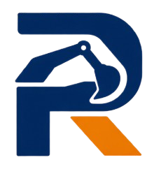</td>
      <td></td>
      <td></td>
      <td></td>
  </tr>

  <tr>
    <td rowspan="2"><strong>Perfil</strong></td>
    <td><strong>Overview</strong></td>
    <td>RentBuild</td>
    <td>Booqable</td>
    <td>Rentman</td>
    <td>Odoo Rental</td>
  </tr>

  <tr>
    <td><strong>Ventaja Competitiva</strong></td>
    <td>Gestión del ciclo completo de la maquinaria, desde reserva y alquiler hasta devolución, inspección, mantenimiento y nueva disponibilidad.</td>
    <td>Facilidad para gestionar reservas, inventario y pedidos de alquiler desde una misma plataforma.</td>
    <td>Gestión avanzada de inventario, almacenes, disponibilidad, mantenimiento y trazabilidad de equipos.</td>
    <td>Integración con otros módulos como inventario, ventas, facturación y mantenimiento.</td>
  </tr>

  <tr>
    <td rowspan="2"><strong>Perfil de Marketing</strong></td>
    <td><strong>Mercado Objetivo</strong></td>
    <td>Pequeñas y medianas empresas de alquiler de maquinaria para construcción y pequeñas empresas constructoras.</td>
    <td>Empresas de alquiler de diferentes tamaños y sectores.</td>
    <td>Empresas de alquiler, eventos y organizaciones que administran grandes cantidades de equipos.</td>
    <td>Empresas de distintos sectores que necesitan integrar alquileres con otros procesos administrativos.</td>
  </tr>

  <tr>
    <td><strong>Estrategias de Marketing</strong></td>
    <td>Marketing B2B, publicidad digital dirigida al sector construcción, demostraciones, prueba inicial y contacto directo con empresas de alquiler.</td>
    <td>Promoción de digitalización del negocio de alquiler, reservas online y facilidad de administración.</td>
    <td>Promoción basada en eficiencia operativa, control de equipos y reducción de errores mediante automatización.</td>
    <td>Promoción mediante el ecosistema integrado de aplicaciones empresariales de Odoo.</td>
  </tr>

  <tr>
    <td rowspan="3"><strong>Perfil de Producto</strong></td>
    <td><strong>Productos y Servicios</strong></td>
    <td>Inventario, disponibilidad, reservas, contratos, pagos, entregas, devoluciones, incidencias, inspecciones y mantenimiento.</td>
    <td>Inventario, reservas, pedidos, contratos, facturación, pagos, recogidas y devoluciones.</td>
    <td>Inventario, planificación, almacenes, proyectos, códigos QR, reparaciones, mantenimiento y facturación.</td>
    <td>Reservas, alquileres, cotizaciones, facturación, recogidas y devoluciones, con integración a otros módulos.</td>
  </tr>

  <tr>
    <td><strong>Precios y Costos</strong></td>
    <td>Modelo SaaS con planes de suscripción escalables según las necesidades de las PYMES.</td>
    <td>Suscripción mensual o anual mediante diferentes planes.</td>
    <td>Suscripción según usuarios, módulos y funcionalidades utilizadas.</td>
    <td>Suscripción mediante planes y aplicaciones del ecosistema Odoo.</td>
  </tr>

  <tr>
    <td><strong>Canales de Distribución (Web y/o Móvil)</strong></td>
    <td>Plataforma web responsive accesible desde computadora, tablet o smartphone.</td>
    <td>Plataforma web y herramientas móviles para determinadas operaciones.</td>
    <td>Plataforma web y aplicación móvil.</td>
    <td>Plataforma web y aplicación móvil.</td>
  </tr>

  <tr>
    <td rowspan="4"><strong>Análisis SWOT</strong></td>
    <td><strong>Fortalezas</strong></td>
    <td>
      • Gestión integral del ciclo de alquiler. 
      • Control de disponibilidad y estado de equipos. 
      • Integración de alquiler y mantenimiento. 
      • Plataforma centralizada.
    </td>
    <td>
      • Gestión de inventario en tiempo real. 
      • Reservas y pagos online. 
      • Plataforma especializada en alquiler. 
      • Automatización de procesos.
    </td>
    <td>
      • Gestión avanzada de inventario. 
      • Seguimiento mediante QR. 
      • Control de múltiples almacenes. 
      • Gestión de reparaciones.
    </td>
    <td>
      • Amplio ecosistema ERP. 
      • Integración entre diferentes módulos. 
      • Alta capacidad de personalización. 
      • Gestión de alquiler y facturación.
    </td>
  </tr>

  <tr>
    <td><strong>Debilidades</strong></td>
    <td>
      • Marca nueva. 
      • Poco reconocimiento en el mercado. 
      • Menor cantidad de integraciones iniciales. 
      • Funcionalidades aún en crecimiento.
    </td>
    <td>
      • Solución general para diferentes tipos de alquiler. 
      • Algunas funciones dependen del plan contratado. 
      • Menor especialización en maquinaria. 
      • Dependencia de servicios en línea.
    </td>
    <td>
      • Mayor complejidad de uso. 
      • Curva de aprendizaje más alta. 
      • Funciones avanzadas pueden resultar innecesarias. 
      • Dependencia de módulos adicionales.
    </td>
    <td>
      • Configuración más compleja. 
      • Curva de aprendizaje elevada. 
      • Gran cantidad de módulos. 
      • Menor especialización en alquiler de maquinaria.
    </td>
  </tr>

  <tr>
    <td><strong>Oportunidades</strong></td>
    <td>
      • Incorporar nuevas automatizaciones. 
      • Integrar nuevas funcionalidades de mantenimiento. 
      • Ampliar integraciones con otros sistemas. 
      • Expandir la gestión hacia nuevos tipos de equipos.
    </td>
    <td>
      • Incorporar nuevas tecnologías de automatización. 
      • Expandir funcionalidades de gestión de activos. 
      • Mejorar integraciones externas. 
      • Ampliar servicios digitales de alquiler.
    </td>
    <td>
      • Fortalecer automatización del mantenimiento. 
      • Mejorar análisis de datos de equipos. 
      • Incorporar nuevas integraciones. 
      • Expandir funcionalidades de trazabilidad.
    </td>
    <td>
      • Ampliar su ecosistema de aplicaciones. 
      • Incorporar nuevas automatizaciones. 
      • Mejorar la integración entre módulos. 
      • Expandir funciones relacionadas con alquiler.
    </td>
  </tr>

  <tr>
    <td><strong>Amenazas</strong></td>
    <td>
      • Competidores internacionales consolidados. 
      • Aparición de nuevas plataformas especializadas. 
      • Evolución rápida de tecnologías de gestión. 
      • Competidores con mayor cantidad de integraciones.
    </td>
    <td>
      • Nuevas plataformas especializadas. 
      • Competidores con precios más bajos. 
      • Mayor competencia SaaS. 
      • Soluciones con mayor especialización.
    </td>
    <td>
      • Plataformas más simples. 
      • Nuevos competidores especializados. 
      • Alternativas con menores costos. 
      • Evolución tecnológica del sector.
    </td>
    <td>
      • Plataformas SaaS especializadas. 
      • Soluciones con implementación más rápida. 
      • Competidores con menor complejidad. 
      • Herramientas específicas para alquiler de equipos.
    </td>
  </tr>
</table>

### 2.1.2. Estrategias y tácticas frente a competidores

A partir del análisis competitivo, DataFlux aplicará estrategias para afrontar las fortalezas de sus competidores, aprovechar sus debilidades y responder a las oportunidades y amenazas del mercado.

#### Estrategia ofensiva: aprovechar la menor especialización de Booqable

Booqable posee una plataforma consolidada de alquiler, pero su enfoque es general para distintos tipos de equipos. RentBuild aprovechará esta menor especialización.

- **Gestión especializada:** integrar alquiler, devolución, incidencias y mantenimiento de maquinaria.
- **Control del equipo:** mantener actualizado el estado y disponibilidad de cada maquinaria.

#### Estrategia defensiva: responder a la gestión avanzada de Rentman

Rentman destaca por su gestión avanzada de inventario y equipos. RentBuild responderá con una plataforma más simple y enfocada.

- **Interfaz sencilla:** facilitar las operaciones principales con menos pasos.
- **Dashboard operativo:** visualizar rápidamente disponibilidad, alquileres y mantenimientos.

#### Estrategia competitiva: aprovechar la complejidad de Odoo Rental

Odoo Rental cuenta con un amplio ecosistema de módulos, pero su configuración puede resultar más compleja.

- **Enfoque específico:** concentrar las funciones necesarias para la gestión de alquiler de maquinaria.
- **Implementación simple:** reducir la dependencia de módulos y configuraciones adicionales.

#### Estrategia adaptativa: aprovechar oportunidades tecnológicas

RentBuild buscará fortalecer sus capacidades conforme evolucionen las necesidades del mercado.

- **Automatización:** incorporar alertas y seguimiento automático de equipos.
- **Integraciones:** añadir progresivamente servicios complementarios a la plataforma.

#### Estrategia defensiva frente a amenazas del mercado

La presencia de competidores consolidados y nuevas plataformas especializadas representa una amenaza para RentBuild.

- **Diferenciación:** reforzar la gestión integral del ciclo de alquiler como ventaja principal.
- **Mejora continua:** incorporar nuevas funcionalidades para mantener la competitividad de la plataforma.

## 2.2. Entrevistas

### 2.2.1. Diseño de entrevistas

**Segmento 1: Pequeñas y medianas empresas de alquiler de maquinaria**

**Objetivo:** Conocer cómo gestionan actualmente sus máquinas y alquileres, qué problemas enfrentan y qué tan útil podría resultarles una solución como RentBuild.

**Contexto**

1. ¿A qué se dedica actualmente su empresa y qué tipo de maquinaria suelen alquilar?

2. ¿Quién se encarga normalmente de gestionar los alquileres y las máquinas?

**Situación actual**

3. Cuando un cliente quiere alquilar una máquina, ¿cómo realizan normalmente todo el proceso?

4. ¿Cómo saben qué máquinas están disponibles, alquiladas o fuera de servicio?

5. ¿Qué herramientas utilizan actualmente para llevar el control de sus máquinas y alquileres?

**Problemas**

6. ¿Cuál es la principal dificultad que tienen al gestionar sus alquileres?

7. ¿Alguna vez han tenido problemas porque una máquina fue reservada para más de un cliente o no estaba disponible cuando debía estarlo?

8. ¿Qué ocurre cuando una máquina es devuelta con algún daño o presenta una falla?

9. ¿Cómo controlan actualmente los mantenimientos y cuándo una máquina puede volver a alquilarse?

10. ¿Qué parte del proceso de alquiler les toma más tiempo o les genera más problemas?

**Opinión sobre RentBuild**

> *"Estamos desarrollando RentBuild, una plataforma pensada para pequeñas y medianas empresas de alquiler de maquinaria. La idea es permitir gestionar las máquinas y alquileres desde un solo lugar, desde la reserva hasta la devolución y mantenimiento, de una manera sencilla."*

11. ¿Qué le parece esta idea? ¿Cree que podría ser útil para su empresa? ¿Por qué?

12. Si pudiera mejorar una sola parte de la gestión de sus alquileres, ¿cuál sería?

**Segmento 2: Pequeñas empresas constructoras**

**Objetivo:** Conocer cómo buscan y alquilan maquinaria actualmente, qué dificultades encuentran y qué tan útil podría resultarles RentBuild.

**Contexto**

1. ¿A qué tipo de proyectos de construcción o remodelación se dedica su empresa?

2. ¿Con qué frecuencia necesitan alquilar maquinaria o equipos?

**Situación actual**

3. Cuando necesitan una máquina para un proyecto, ¿cómo buscan actualmente dónde alquilarla?

4. ¿Cómo averiguan si una máquina está disponible para las fechas que necesitan?

5. ¿Qué información necesitan conocer antes de decidir alquilar una máquina?

**Problemas**

6. ¿Cuál es la principal dificultad que encuentran cuando necesitan conseguir maquinaria?

7. ¿Alguna vez han necesitado una máquina y no pudieron conseguirla cuando la necesitaban? ¿Qué ocurrió?

8. ¿Han tenido problemas con la entrega, el uso o la devolución de una máquina alquilada?

9. ¿Qué parte del proceso de conseguir y alquilar maquinaria les toma más tiempo?

10. ¿Qué cambiarían de la forma en que actualmente buscan o alquilan maquinaria?

**Opinión sobre RentBuild**

> *"Estamos desarrollando RentBuild, una plataforma pensada para facilitar el alquiler de maquinaria. La idea es que las empresas puedan buscar equipos, consultar información y disponibilidad y gestionar sus alquileres desde un solo lugar, de una manera sencilla."*

11. ¿Qué le parece esta idea? ¿Cree que podría ser útil para su empresa? ¿Por qué?

12. Si pudiera encontrar toda la información de una máquina en un solo lugar, ¿qué información sería indispensable para usted?

### 2.2.2. Registro de entrevistas

### Entrevista 1 — Pedro González

| Campo | Detalle |
|-------|---------|
| Nombres y apellidos | Pedro González |
| Edad | 27 años |
| Distrito | Villa El Salvador |
| Segmento objetivo | Primer segmento objetivo: Pequeñas y medianas empresas de alquiler de maquinaria |
| Fecha de entrevista | 18 setiembre 2026 |
| Duración | 02:48 |
| Timing en el video | 00:00 - 02:48 |
| URL del video | [Ver video](https://upcedupe-my.sharepoint.com/:v:/g/personal/u202111529_upc_edu_pe/IQBFiR1QwYfTSL96qzfO9KaTATUN322TsrAuqI6OxMv3ymk?nav=eyJyZWZlcnJhbEluZm8iOnsicmVmZXJyYWxBcHAiOiJTdHJlYW1XZWJBcHAiLCJyZWZlcnJhbFZpZXciOiJTaGFyZURpYWxvZy1MaW5rIiwicmVmZXJyYWxBcHBQbGF0Zm9ybSI6IldlYiIsInJlZmVycmFsTW9kZSI6InZpZXcifX0%3D&e=FaBBc3)|

  

**Resumen:**  
Pedro González se desempeña como contratista en el rubro de alquiler de maquinaria pesada (tractores, camiones y mezcladoras). Su gestión la realiza de forma manual y mediante correos electrónicos. Mantiene el control de la disponibilidad y el estado de sus equipos a través de documentación física y papeles, lo que dificulta el seguimiento constante y puede ocasionar el traspapeleo de registros importantes. Confirmó haber tenido inconvenientes debido a la falta de trazabilidad en las reservas. Cuando una maquinaria es devuelta con fallas o daños, aplican penalidades previamente pactadas. Para el control de salidas y mantenimientos, realizan una inspección previa con fotografías y escaneo preventivo antes de liberar la máquina. Identifica que la etapa más crítica y propensa a problemas es el registro de retorno de los equipos por mal uso o daños no reportados. Mostró gran interés en la propuesta de RentBuild, destacando que una solución web centralizada agilizaría considerablemente sus procesos y reduciría la dependencia de documentos físicos, siendo el módulo de registro de entrada y salida de equipos la función que más valoraría.

### Entrevista 2 — Carlos Rodríguez

| Campo | Detalle |
|-------|---------|
| Nombres y apellidos | Carlos Rodríguez |
| Edad | 51 años |
| Distrito | San Juan de Miraflores |
| Segmento objetivo | Primer segmento objetivo: Pequeñas y medianas empresas de alquiler de maquinaria |
| Fecha de entrevista | 18 setiembre 2026 |
| Duración | 04:34 |
| Timing en el video | 02:49 - 07:23 |
| URL del video | [Ver video](https://upcedupe-my.sharepoint.com/:v:/g/personal/u202111529_upc_edu_pe/IQBFiR1QwYfTSL96qzfO9KaTATUN322TsrAuqI6OxMv3ymk?nav=eyJyZWZlcnJhbEluZm8iOnsicmVmZXJyYWxBcHAiOiJTdHJlYW1XZWJBcHAiLCJyZWZlcnJhbFZpZXciOiJTaGFyZURpYWxvZy1MaW5rIiwicmVmZXJyYWxBcHBQbGF0Zm9ybSI6IldlYiIsInJlZmVycmFsTW9kZSI6InZpZXcifX0%3D&e=FaBBc3)|

  

**Resumen:**  
Carlos Rodríguez es técnico mecánico y también se dedica al alquiler de camiones de carga. Gestiona los alquileres y el control de las unidades de manera directa e informal junto a su esposa, utilizando únicamente un cuaderno de apuntes para registrar las fechas de retorno, mantenimiento y disponibilidad. Esta falta de un sistema centralizado les ha ocasionado problemas frecuentes como duplicidad de reservas, vehículos parados por falta de fluidez en la demanda y complicaciones cuando una unidad presenta fallas técnicas en ruta. Respecto a la propuesta del aplicativo, mostró una valoración positiva destacando que permitiría automatizar el proceso, evitar errores en los apuntes manuales y optimizar significativamente los tiempos de gestión de su negocio.

### Entrevista 3 — Carmen Losada Paredes

| Campo | Detalle |
|-------|---------|
| Nombres y apellidos | Carmen Losada Paredes |
| Edad | 51 años |
| Distrito | San Juan de Lurigancho |
| Segmento objetivo | Primer segmento objetivo: Pequeñas y medianas empresas de alquiler de maquinaria |
| Fecha de entrevista | 18 setiembre 2026 |
| Duración | 03:13 |
| Timing en el video | 07:24 - 10:38 |
| URL del video | [Ver video](https://upcedupe-my.sharepoint.com/:v:/g/personal/u202111529_upc_edu_pe/IQBFiR1QwYfTSL96qzfO9KaTATUN322TsrAuqI6OxMv3ymk?nav=eyJyZWZlcnJhbEluZm8iOnsicmVmZXJyYWxBcHAiOiJTdHJlYW1XZWJBcHAiLCJyZWZlcnJhbFZpZXciOiJTaGFyZURpYWxvZy1MaW5rIiwicmVmZXJyYWxBcHBQbGF0Zm9ybSI6IldlYiIsInJlZmVycmFsTW9kZSI6InZpZXcifX0%3D&e=FaBBc3)|

  

**Resumen:**  
Carmen Losada Paredes administra una pequeña empresa dedicada al alquiler de camiones concreteros (mixers). Gestiona el negocio de manera directa a través de redes sociales para la captación de clientes y utiliza una base de datos en Excel como única herramienta para controlar la disponibilidad de las unidades y los mantenimientos. La falta de una herramienta centralizada y automatizada le ha generado problemas de duplicidad de reservas, alquilando la misma máquina a dos clientes distintos en una misma fecha. Además, considera que el trámite administrativo actual es bastante pesado y tedioso. Respecto a la propuesta del aplicativo, mostró una recepción positiva, destacando que le permitiría agilizar los procesos de tramitación, evitar errores en las reservas y lograr una mayor rotación en el alquiler de sus equipos.

### Entrevista 4 — Yovani Meléndez Zuleta

| Campo | Detalle |
|-------|---------|
| Nombres y apellidos | Yovani Meléndez Zuleta |
| Edad | 49 años |
| Distrito | San Juan de Lurigancho |
| Segmento objetivo | Segundo segmento objetivo: Pequeñas empresas constructoras |
| Fecha de entrevista | 18 setiembre 2026 |
| Duración | 04:22 |
| Timing en el video | 10:39 - 14:59 |
| URL del video | [Ver video](https://upcedupe-my.sharepoint.com/:v:/g/personal/u202111529_upc_edu_pe/IQBFiR1QwYfTSL96qzfO9KaTATUN322TsrAuqI6OxMv3ymk?nav=eyJyZWZlcnJhbEluZm8iOnsicmVmZXJyYWxBcHAiOiJTdHJlYW1XZWJBcHAiLCJyZWZlcnJhbFZpZXciOiJTaGFyZURpYWxvZy1MaW5rIiwicmVmZXJyYWxBcHBQbGF0Zm9ybSI6IldlYiIsInJlZmVycmFsTW9kZSI6InZpZXcifX0%3D&e=FaBBc3)|

  

**Resumen:**  
Yovani Meléndez Zuleta es administrador de maquinaria en una empresa dedicada a la ejecución de obras públicas y privadas, principalmente enfocado en áreas verdes, parques y pistas. Requiere alquilar maquinaria con alta frecuencia y actualmente recurre a anuncios en internet, avisos publicitarios y coordinación directa telefónica para ubicar proveedores. Su principal problema radica en la pérdida de tiempo durante la búsqueda y la falta de disponibilidad oportuna de equipos en buen estado técnico. Destaca la recepción positiva hacia la propuesta de la plataforma, manifestando que centralizar la disponibilidad e información en un solo lugar les permitirá optimizar tiempos de gestión y agilizar la contratación de las máquinas para sus obras.

### Entrevista 5 — Sonia Gutiérrez

| Campo | Detalle |
|-------|---------|
| Nombres y apellidos | Sonia Gutiérrez |
| Edad | 41 años |
| Distrito | San Juan de Miraflores |
| Segmento objetivo | Segundo segmento objetivo: Pequeñas empresas constructoras |
| Fecha de entrevista | 18 setiembre 2026 |
| Duración | 03:33 |
| Timing en el video | 14:59 - 18:32 |
| URL del video | [Ver video](https://upcedupe-my.sharepoint.com/:v:/g/personal/u202111529_upc_edu_pe/IQBFiR1QwYfTSL96qzfO9KaTATUN322TsrAuqI6OxMv3ymk?nav=eyJyZWZlcnJhbEluZm8iOnsicmVmZXJyYWxBcHAiOiJTdHJlYW1XZWJBcHAiLCJyZWZlcnJhbFZpZXciOiJTaGFyZURpYWxvZy1MaW5rIiwicmVmZXJyYWxBcHBQbGF0Zm9ybSI6IldlYiIsInJlZmVycmFsTW9kZSI6InZpZXcifX0%3D&e=FaBBc3)|

  

**Resumen:**  
Sonia Gutiérrez trabaja en una empresa inmobiliaria ubicada en San Juan de Miraflores y requieren alquilar maquinaria o equipos de construcción aproximadamente cada 15 días. Actualmente, cuando necesitan equipos para sus proyectos u obras inmobiliarias, buscan proveedores navegando por internet y se comunican directamente con ellos para consultar precios y disponibilidad. Mencionó que han enfrentado problemas como la cancelación o falta de disponibilidad a última hora por parte de proveedores que ya habían confirmado el alquiler. Además, señala que el proceso actual de buscar y comparar proveedores uno por uno les consume bastante tiempo. Mostró una recepción muy positiva hacia la propuesta de la plataforma centralizada, destacando que les facilitaría encontrar en un solo lugar la oferta disponible, la capacidad/carga técnica de las máquinas y los precios, agilizando considerablemente su gestión.

### Entrevista 6 — Ana Rivera Quispe

| Campo | Detalle |
|-------|---------|
| Nombres y apellidos | Ana Rivera Quispe |
| Edad | 36 años |
| Distrito | Los Olivos |
| Segmento objetivo | Segundo segmento objetivo: Pequeñas empresas constructoras |
| Fecha de entrevista | 18 setiembre 2026 |
| Duración | 02:50 |
| Timing en el video | 18:33 - 21:22 |
| URL del video | [Ver video](https://upcedupe-my.sharepoint.com/:v:/g/personal/u202111529_upc_edu_pe/IQBFiR1QwYfTSL96qzfO9KaTATUN322TsrAuqI6OxMv3ymk?nav=eyJyZWZlcnJhbEluZm8iOnsicmVmZXJyYWxBcHAiOiJTdHJlYW1XZWJBcHAiLCJyZWZlcnJhbFZpZXciOiJTaGFyZURpYWxvZy1MaW5rIiwicmVmZXJyYWxBcHBQbGF0Zm9ybSI6IldlYiIsInJlZmVycmFsTW9kZSI6InZpZXcifX0%3D&e=FaBBc3)|

  

**Resumen:**  
Ana Rivera Quispe se dedica a la administración de pequeñas empresas dedicadas a la construcción de pequeños edificios, departamentos y casas. Requieren alquilar maquinaria con mucha frecuencia debido a la demanda de sus obras. Actualmente, buscan proveedores principalmente mediante redes sociales por ser un canal más rápido y confirman la disponibilidad conversando directamente con la persona encargada. La principal condición que evalúan antes de alquilar es que las máquinas se encuentren en buenas condiciones de operatividad. Señala que el mayor obstáculo y la parte que les toma más tiempo en todo el proceso es lograr comunicarse y conversar directamente con la persona indicada o el propietario de la máquina. Valora de forma positiva la propuesta del aplicativo centralizado, destacando que les permitiría encontrar los equipos adecuados de manera mucho más rápida.

### 2.2.3. Análisis de entrevistas

### Primera entrevista - Pedro González (Segmento 1)

La entrevista con Pedro González, contratista de una empresa de El Salvador dedicada al alquiler de maquinaria pesada, permitió conocer que actualmente gestionan sus alquileres principalmente mediante documentación y correos electrónicos. La empresa trabaja con maquinaria como tractores, camiones y mezcladoras.

Para controlar el estado de las máquinas antes de entregarlas, realizan una revisión mediante fotografías y escaneo. La entrevista permitió identificar la necesidad de contar con una plataforma centralizada que facilite la gestión de máquinas, reservas, devoluciones y mantenimiento.

#### Hallazgos importantes

* El proceso actual de gestión se basa principalmente en documentación y correos electrónicos, lo que puede dificultar tener una visión centralizada del estado y disponibilidad de las máquinas.
* La empresa necesita controlar qué maquinaria está disponible, alquilada o fuera de servicio para evitar problemas durante las reservas.
* Antes de entregar una máquina, realizan una revisión mediante fotografías y escaneo para comprobar que salga en buenas condiciones.
* Existe una necesidad de registrar y conservar evidencias del estado de cada equipo.
* También resulta importante controlar posibles daños o fallas durante la devolución y relacionarlos con el historial de cada máquina.
* La propuesta de una plataforma que centralice las reservas, disponibilidad, devolución y mantenimiento resulta pertinente para este tipo de empresas, especialmente para pequeñas y medianas empresas de alquiler de maquinaria.
* La entrevista quedó incompleta, ya que el entrevistado no llegó a responder las preguntas sobre cuál es la principal dificultad del proceso, qué parte genera más problemas, su valoración concreta de la plataforma y qué aspecto mejoraría prioritariamente.

### Segunda entrevista - Carlos Rodríguez (Segmento 1)

La entrevista con Carlos Rodríguez, de 51 años, técnico mecánico y dedicado al alquiler de camiones en San Juan de Miraflores, permitió conocer que actualmente administra junto con su esposa una flota de cinco camiones utilizando principalmente un cuaderno de apuntes. Los alquileres se coordinan mediante llamadas telefónicas y registran manualmente dónde se encuentra cada vehículo, quién lo tiene alquilado y cuándo debe regresar al taller.

Esta forma de gestión ha generado problemas de control, como reservas duplicadas cuando ambos coordinan con clientes diferentes. También presentan dificultades cuando los camiones sufren fallas durante los viajes, ya que deben realizar auxilios, reparaciones y mantenimientos antes de volver a alquilarlos.

El entrevistado consideró que el aplicativo propuesto sería muy útil porque permitiría centralizar y automatizar el control, reducir tiempos y mejorar la precisión de la información.

#### Hallazgos importantes

* **Gestión actual:** utilizan un cuaderno para registrar camiones, clientes, ubicaciones, alquileres y retornos.
* **Proceso de alquiler:** los clientes se comunican principalmente por teléfono con Carlos o su esposa.
* **Problema de disponibilidad:** han tenido reservas duplicadas porque ambos pueden comprometer el mismo camión con clientes diferentes.
* **Baja fluidez:** algunos camiones permanecen varios días sin alquilarse porque esperan llamadas de clientes.
* **Fallos y devoluciones:** cuando un camión presenta problemas, debe regresar al taller para revisión y reparación antes de volver a estar disponible.
* **Mantenimiento:** se realiza según los viajes y se registra manualmente en el cuaderno.
* **Mayor dificultad:** las fallas durante la ruta generan problemas y requieren realizar auxilios, lo que consume bastante tiempo.
* **Aceptación de la solución:** considera que el aplicativo permitiría tener un mejor control de todo el proceso, reemplazando los apuntes manuales por una gestión más práctica y automática.
* **Necesidad principal identificada:** centralizar la disponibilidad, reservas, mantenimiento, ubicación y estado de los camiones para evitar errores y ahorrar tiempo.

---

### Tercera entrevista - Sonia Gutiérrez (Segmento 2)

La entrevista muestra que una empresa inmobiliaria ubicada en San Juan de Miraflores necesita alquilar maquinaria aproximadamente cada 15 días para sus proyectos. Actualmente buscan proveedores por internet y deben comunicarse individualmente con cada uno para verificar la disponibilidad, el precio y las características de las máquinas.

Una de las principales dificultades es encontrar equipos adecuados según el tamaño, peso y capacidad de carga que requieren, además de asegurarse de que estén completamente operativos. También señalaron que el proceso de búsqueda consume tiempo porque deben revisar diferentes páginas y proveedores por separado.

La persona entrevistada consideró muy útil la plataforma propuesta, ya que permitiría encontrar en un solo lugar las máquinas disponibles, evitando buscar proveedor por proveedor.

#### Hallazgos importantes

* **Frecuencia de alquiler:** aproximadamente cada 15 días.
* **Búsqueda actual:** utilizan internet para encontrar proveedores y luego contactan directamente con ellos.
* **Información indispensable:** principalmente precio, capacidad de carga, peso que soporta y características de la maquinaria.
* **Principal dificultad:** encontrar una máquina con el tamaño y capacidad adecuados para proyectos inmobiliarios y que esté 100 % operativa.
* **Problema de disponibilidad:** han tenido ocasiones en las que necesitaban maquinaria, pero el proveedor ya tenía el equipo ocupado.
* **Mayor pérdida de tiempo:** revisar diferentes páginas y consultar a los proveedores uno por uno.
* **Necesidad identificada:** contar con una plataforma que reúna todas las maquinarias disponibles y sus proveedores en un solo lugar.
* **Validación de la idea:** la propuesta fue considerada muy buena y útil, principalmente porque reduciría el tiempo de búsqueda y facilitaría la comparación de opciones.
* **Funcionalidad clave:** mostrar claramente la disponibilidad y las especificaciones técnicas de cada máquina, especialmente su capacidad de carga.

---

### Cuarta entrevista - Giovanni Mena Zuleta (Segmento 2)

La entrevista con Giovanni Mena Zuleta, de 49 años, administrador de maquinaria y de subconstrucción en San Juan de Lurigancho, permitió identificar que su empresa trabaja principalmente en obras de áreas verdes, parques y pistas, por lo que necesita alquilar maquinaria con mucha frecuencia.

Actualmente buscan equipos mediante anuncios de internet y publicidad, y verifican la disponibilidad coordinando directamente con el encargado del alquiler. Una de sus principales dificultades es encontrar rápidamente proveedores y máquinas en buenas condiciones, ya que algunos equipos están en mal estado o ya fueron alquilados.

El proceso de búsqueda mediante publicidad les genera pérdida de tiempo. El entrevistado consideró útil la plataforma propuesta porque facilitaría encontrar maquinaria, ahorrar tiempo y mejorar la coordinación entre la empresa y los proveedores.

#### Hallazgos importantes

* **Frecuencia de alquiler:** necesitan maquinaria muy frecuentemente debido a sus actividades.
* **Tipo de proyectos:** áreas verdes, parques y pistas.
* **Búsqueda actual:** anuncios en internet y otros medios publicitarios.
* **Verificación de disponibilidad:** coordinan directamente con el encargado del alquiler.
* **Información importante:** que la maquinaria esté en buenas condiciones y operativa para el trabajo.
* **Principal dificultad:** localizar rápidamente al responsable del alquiler y encontrar equipos disponibles.
* **Problemas de disponibilidad:** algunas máquinas ya estaban alquiladas y otras no se encontraban en buenas condiciones.
* **Mayor pérdida de tiempo:** buscar mediante anuncios y publicidad en internet.
* **Necesidad identificada:** facilitar la búsqueda y el contacto con proveedores desde un solo lugar.
* **Validación de la plataforma:** considera que sería factible y útil, principalmente porque permitiría ahorrar tiempo durante el proceso de alquiler.
* **Funcionalidad clave:** facilitar la comunicación y coordinación entre el cliente y el proveedor.

---

### Quinta entrevista - Carmen Glosada (Segmento 1)

La entrevista con Carmen Glosada Paredes, de 51 años, administradora de una pequeña empresa de alquiler de camiones en San Juan de Lurigancho, permitió identificar que actualmente gestiona los alquileres mediante redes sociales y utiliza una base de datos en Excel para controlar la disponibilidad de sus unidades.

A pesar de contar con este registro, han tenido problemas de control, incluyendo casos en los que una misma maquinaria fue alquilada a dos clientes. Cuando una unidad es entregada, elaboran un documento que registra que se encuentra en buenas condiciones y establece una penalidad en caso de daños durante la devolución.

El mantenimiento y la disponibilidad también se controlan mediante Excel. La entrevistada señaló que el trámite del alquiler es una de las partes más tediosas del proceso y consideró que una plataforma centralizada sería útil porque podría facilitar la gestión y generar más oportunidades de alquiler.

#### Hallazgos importantes

* **Gestión actual:** la propietaria administra personalmente los alquileres.
* **Contacto con clientes:** los clientes llegan principalmente mediante redes sociales.
* **Control de disponibilidad:** utilizan una base de datos en Excel.
* **Problema crítico:** han ocurrido reservas duplicadas de una misma maquinaria para dos clientes.
* **Control de daños:** antes de entregar la maquinaria elaboran un documento que registra su buen estado y establece una penalidad por daños al devolverla.
* **Mantenimiento:** actualmente también se controla mediante la base de datos.
* **Principal dificultad:** el trámite y proceso del alquiler resulta tedioso.
* **Necesidad identificada:** centralizar y simplificar el proceso completo, desde la reserva hasta la devolución y mantenimiento.
* **Validación de la plataforma:** considera que sería útil porque podría facilitar la gestión y permitir más salidas de alquileres.

---

### Sexta entrevista - Ana Rivera (Segmento 1)

La entrevista con Ana Rivera Quispe, de 36 años, administradora de pequeñas empresas en Los Olivos, permitió identificar que su empresa se dedica a la construcción de pequeños edificios, departamentos y casas, por lo que requiere maquinaria con frecuencia.

Actualmente buscan equipos principalmente mediante redes sociales y verifican su disponibilidad comunicándose directamente con la persona encargada. La principal dificultad identificada es encontrar y contactar rápidamente a la persona indicada para gestionar el alquiler.

Hasta el momento no han tenido problemas con la disponibilidad, entrega, uso o devolución de las máquinas. La entrevistada considera que una plataforma centralizada sería útil porque permitiría encontrar más rápidamente la maquinaria adecuada y facilitar el contacto con el propietario.

#### Hallazgos importantes

* **Tipo de proyectos:** construcción de pequeños edificios, departamentos y casas.
* **Frecuencia de alquiler:** requieren maquinaria con bastante frecuencia.
* **Búsqueda actual:** utilizan principalmente redes sociales porque consideran que es más rápido.
* **Verificación de disponibilidad:** deben comunicarse directamente con la persona encargada.
* **Información importante:** que la maquinaria se encuentre en buenas condiciones.
* **Principal dificultad:** localizar y comunicarse con la persona indicada o propietaria de la máquina.
* **Problemas de disponibilidad:** hasta el momento no han tenido casos en los que no consiguieran una máquina cuando la necesitaban.
* **Entrega, uso y devolución:** tampoco han experimentado problemas hasta ahora.
* **Mayor pérdida de tiempo:** establecer comunicación con el propietario o responsable de la maquinaria.
* **Necesidad identificada:** facilitar la búsqueda y el contacto directo con los proveedores.
* **Validación de la plataforma:** considera que sería útil para encontrar más rápidamente las máquinas indicadas y centralizar la información.

#### Análisis general de entrevistas

Se entrevistaron **6 personas/empresas vinculadas al alquiler o uso de maquinaria**. Los principales hallazgos identificados fueron los siguientes:

### Gestión y búsqueda de maquinaria

El principal problema identificado corresponde a la **gestión y búsqueda de maquinaria**, ya que **5 de 6 entrevistados (83%)** mencionaron dificultades relacionadas con encontrar proveedores, contactar a la persona encargada, verificar disponibilidad o gestionar el alquiler.

Además, **4 de 6 entrevistados (67%)** utilizan herramientas manuales o poco centralizadas, como **cuadernos, Excel, documentación y llamadas**, mientras que **2 de 6 (33%)** dependen principalmente de **internet y redes sociales** para encontrar maquinaria.

### Disponibilidad y reservas

Un problema relevante para RentBuild es el **control de disponibilidad y reservas**. **2 de 6 entrevistados (33%)** reportaron directamente problemas relacionados con **reservas duplicadas o falta de disponibilidad**, incluyendo casos en los que una misma máquina fue comprometida con dos clientes.

Por otro lado, **4 de 6 entrevistados (67%)** señalaron como una necesidad importante poder conocer o verificar que la maquinaria se encuentre **disponible y en buenas condiciones** antes de realizar el alquiler.

### Mantenimiento y condición de la maquinaria

En relación con el mantenimiento y estado de las máquinas, **3 de 6 entrevistados (50%)** mencionaron explícitamente problemas o procesos relacionados con **fallas, reparaciones, mantenimiento o condiciones de la maquinaria**.

Entre los casos mencionados se encuentran devoluciones con fallas, mantenimientos periódicos y la necesidad de comprobar que el equipo se encuentre operativo antes de realizar un alquiler.

### Tiempo de búsqueda y coordinación

Respecto al proceso de búsqueda, **4 de 6 entrevistados (67%)** identificaron la **búsqueda, comunicación o coordinación con proveedores** como una actividad que consume tiempo.

Los entrevistados señalaron que deben buscar proveedor por proveedor, revisar anuncios, realizar llamadas o comunicarse directamente con los responsables para confirmar la disponibilidad de la maquinaria.

### Aceptación de una plataforma como RentBuild

Finalmente, **6 de 6 entrevistados (100%)** mostraron una **respuesta favorable hacia una plataforma como RentBuild**. Entre los principales beneficios mencionados se encuentran la posibilidad de **centralizar información, conocer la disponibilidad, reducir tiempos, mejorar el control y simplificar el proceso de alquiler**.

En conjunto, los resultados evidencian oportunidades de mejora principalmente en la **búsqueda y gestión de maquinaria, control de disponibilidad, coordinación con proveedores y seguimiento del estado de los equipos**.

## 2.3. Needfinding

### 2.3.1. User Personas

El user persona se construyó a partir de patrones encontrados en las entrevistas.

**Segmento objetivo 1: Pequeñas y medianas empresas de alquiler de maquinaria**

**Segmento Objetivo 2: Pequeñas empresas constructoras**

### 2.3.2. User Task Matrix

En esta sección se presenta el User Task Matrix, que concentra las tareas que realizan Marisol Vega Torres (Segmento 1 — Empresas de Alquiler) y Jorge Ramírez Delgado (Segmento 2 — Empresas Constructoras) para cumplir sus objetivos, independientemente de la existencia de una solución de software. Se considera para cada tarea su frecuencia (qué tan seguido la realiza) y su importancia (qué tan crítica es para su rol), en una escala de Baja / Media / Alta.

| Tarea | Marisol Vega Torres — Frecuencia | Marisol Vega Torres — Importancia | Jorge Ramírez Delgado — Frecuencia | Jorge Ramírez Delgado — Importancia |
| :--- | :---: | :---: | :---: | :---: |
| Verificar disponibilidad de equipo | Alta | Alta | Alta | Alta |
| Registrar/actualizar inventario de equipos | Alta | Alta | — | — |
| Gestionar reservaciones de clientes | Alta | Alta | — | — |
| Buscar y comparar proveedores de alquiler | — | — | Alta | Alta |
| Coordinar entrega y recojo de equipo | Alta | Alta | Media | Alta |
| Revisar condiciones y costos de alquiler | Media | Alta | Alta | Alta |
| Elaborar y firmar contratos de alquiler | Media | Alta | Media | Media |
| Dar seguimiento a fechas de devolución | Alta | Alta | Alta | Alta |
| Registrar incidentes o daños del equipo | Media | Alta | Media | Media |
| Programar mantenimiento preventivo | Media | Alta | — | — |
| Comunicarse con proveedores/clientes vía teléfono o WhatsApp | Alta | Media | Alta | Alta |
| Reportar avance de gastos/costos de alquiler a su empresa | Media | Media | Media | Alta |

Del análisis del cuadro se observa que las tareas con mayor frecuencia e importancia para ambos segmentos son verificar disponibilidad de equipo y dar seguimiento a fechas de devolución, lo que confirma que la visibilidad en tiempo real del estado del inventario es una necesidad crítica compartida. Marisol dedica más tiempo a tareas internas de gestión (inventario, mantenimiento, contratos), mientras que Jorge se enfoca en tareas de búsqueda y coordinación externa (comparar proveedores, coordinar entregas). Ambos coinciden en la alta dependencia de canales informales como el teléfono y WhatsApp para comunicarse, lo que representa una oportunidad clara para una solución digital centralizada.

Las principales diferencias se encuentran en las tareas asociadas a la responsabilidad de cada segmento. Armando realiza actividades relacionadas con la administración del inventario, el registro de maquinaria, las devoluciones y el mantenimiento, debido a que la empresa de alquiler es responsable de gestionar los equipos. En cambio, Andrea se enfoca en localizar maquinaria adecuada, consultar sus condiciones y realizar solicitudes de alquiler según las necesidades de sus proyectos. Por esta razón, determinadas tareas se identifican como N/A para alguno de los User Personas, ya que no forman parte de sus responsabilidades dentro de la plataforma.

### 2.3.3. User Journey Mapping

El User Journey Mapping permite representar de manera integral la experiencia de los principales usuarios de RentBuild a lo largo del proceso de alquiler de maquinaria y equipos para pequeñas construcciones. El recorrido end-to-end que se pretende ilustrar comprende las distintas etapas que atraviesan la Persona Alquiler y la Persona Constructora, desde la identificación de una necesidad y la búsqueda o gestión de un equipo, hasta la reservación, formalización del alquiler, entrega, utilización y posterior devolución de la maquinaria. A través de este recorrido se busca identificar las acciones, necesidades, expectativas y principales dificultades que experimentan ambos segmentos, con el propósito de reconocer oportunidades de mejora que puedan ser abordadas mediante las funcionalidades propuestas en RentBuild.

**1. User Journey Map - Pequeñas y medianas empresas de alquiler de maquinaria**

**2. User Journey Map para el segundo segmento**

### 2.3.4. Empathy Mapping

El Empathy Mapping permite profundizar en la comprensión de los principales segmentos de usuarios de RentBuild mediante la identificación de sus pensamientos, sentimientos, comportamientos, necesidades y dificultades. Para la elaboración de este artefacto se tomó como referencia la información definida previamente en las User Personas, analizando lo que cada usuario piensa y siente, dice y hace, observa y escucha dentro de su contexto. Asimismo, se identificaron sus principales frustraciones y los beneficios que esperan obtener durante el proceso de alquiler y gestión de maquinaria. Este análisis permite representar de forma estructurada la perspectiva de la Persona Alquiler y la Persona Constructora, facilitando la identificación de necesidades y oportunidades que pueden ser atendidas mediante la solución propuesta.

**1. Empathy Map - Pequeñas y medianas empresas de alquiler de maquinaria**

**2. Empathy Map - Pequeñas empresas constructoras**

## 2.4. Big Picture Event Storming

El Big Picture Event Storming permitió identificar y representar los principales eventos del dominio de RentBuild, mostrando de manera general el flujo del negocio desde el registro de la maquinaria hasta su devolución, inspección y mantenimiento.

La siguiente imagen presenta el resultado del Big Picture Event Storming realizado para el proyecto:

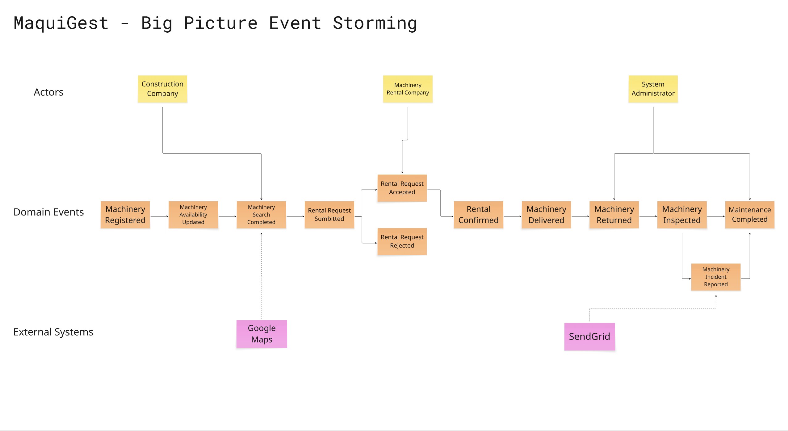

## 2.5. Ubiquitous Language

En esta sección se presenta el glosario de términos y conceptos utilizados en el dominio del negocio de RentBuild, con el objetivo de establecer un lenguaje común, sin ambigüedades, entre todos los miembros del equipo y stakeholders del proyecto. Mantener un Ubiquitous Language actualizado permite que la comunicación entre las áreas de negocio y desarrollo sea clara y consistente a lo largo de todo el ciclo de vida del producto. Eric Evans, en su libro *Domain-Driven Design: Tackling Complexity in the Heart of Software*, establece que el Ubiquitous Language debe modelarse dentro de un Bounded Context, donde los términos y conceptos del dominio del negocio son identificados y no deben presentar ambigüedad.

| Término | Definición |
| :--- | :--- |
| Equipo | Maquinaria o herramienta perteneciente al inventario de una empresa de alquiler, disponible para ser rentada por un periodo determinado (ej. andamios, mezcladoras, plataformas elevadoras, generadores). |
| Empresa de Alquiler | Empresa propietaria del equipo, responsable de administrar su inventario, disponibilidad, reservaciones y mantenimiento dentro de la plataforma. |
| Empresa Constructora | Empresa que busca y solicita el alquiler de equipos para el desarrollo de sus proyectos de construcción. |
| Inventario | Conjunto de equipos registrados por una empresa de alquiler, junto con sus características, estado y ubicación. |
| Disponibilidad | Estado que indica si un equipo puede ser reservado o alquilado en una fecha determinada, sin superposición con otra reservación o alquiler activo. |
| Reservación | Solicitud realizada por una empresa constructora para apartar un equipo durante un periodo específico, antes de confirmarse como un alquiler formal. |
| Contrato de Alquiler | Documento que formaliza las condiciones del alquiler de un equipo, incluyendo tarifas, plazos, responsabilidades y condiciones de devolución. |
| Entrega | Proceso mediante el cual el equipo alquilado es trasladado o puesto a disposición de la empresa constructora en el lugar acordado. |
| Devolución | Proceso mediante el cual el equipo alquilado es devuelto a la empresa de alquiler al finalizar el periodo de alquiler. |
| Mantenimiento | Conjunto de actividades de inspección, reparación o servicio preventivo realizadas sobre un equipo para garantizar su correcto funcionamiento y disponibilidad. |
| Incidencia | Registro de un daño, falla o problema detectado en un equipo, ya sea durante su uso, entrega o devolución. |
| Estado del Equipo | Condición actual de un equipo dentro del inventario: disponible, alquilado o en mantenimiento. |
| Período de Alquiler | Rango de fechas durante el cual un equipo se encuentra reservado o alquilado por una empresa constructora. |
| Tarifa | Costo asociado al alquiler de un equipo, generalmente calculado por día, semana o periodo acordado. |
| Operador de Alquiler | Colaborador de una empresa de alquiler responsable de gestionar las reservaciones, contratos, entregas, devoluciones e incidencias del equipo. |
| Jefe de Obra | Responsable dentro de una empresa constructora encargado de identificar, solicitar y coordinar el alquiler de equipo necesario para su proyecto. |
| Perfil de Proveedor | Información pública de una empresa de alquiler visible para las empresas constructoras, incluyendo su historial de cumplimiento y equipo disponible. |

# Capítulo III: Requirements Specification

## 3.1. User Stories

<table>
<tr>
<th>Epic / Story ID</th>
<th>Título</th>
<th>Descripción</th>
<th>Criterios de Aceptación</th>
<th>Relacionado con</th>
</tr>

<tr>
<td>EP01</td>
<td>Gestión de usuarios y acceso</td>
<td>Epic orientado al registro, autenticación y gestión básica de las cuentas de los usuarios de RentBuild.</td>
<td>-</td>
<td>-</td>
</tr>

<tr>
<td>US01</td>
<td>Registro de usuario</td>
<td>Como usuario, quiero registrarme en RentBuild para acceder a las funcionalidades de la plataforma.</td>
<td>
Given que el usuario accede al formulario de registro 
When ingresa sus datos correctamente 
Then el sistema crea su cuenta 
And muestra un mensaje de confirmación
</td>
<td>EP01</td>
</tr>

<tr>
<td>US02</td>
<td>Inicio de sesión</td>
<td>Como usuario registrado, quiero iniciar sesión para acceder a las funcionalidades correspondientes a mi cuenta.</td>
<td>
Given que el usuario posee una cuenta registrada 
When ingresa credenciales válidas 
Then el sistema permite el acceso a la plataforma
</td>
<td>EP01</td>
</tr>

<tr>
<td>US03</td>
<td>Gestionar perfil</td>
<td>Como usuario, quiero consultar y actualizar mis datos personales y de contacto para mantener mi información actualizada.</td>
<td>
Given que el usuario ha iniciado sesión 
When modifica sus datos de perfil 
Then el sistema guarda la información actualizada 
And muestra los nuevos datos
</td>
<td>EP01</td>
</tr>

<tr>
<td>US04</td>
<td>Recuperar contraseña</td>
<td>Como usuario, quiero recuperar mi contraseña para volver a acceder a mi cuenta.</td>
<td>
Given que el usuario solicita recuperación 
When ingresa su correo 
Then el sistema envía instrucciones de recuperación
</td>
<td>EP01</td>
</tr>

<tr>
<td>US05</td>
<td>Cerrar sesión</td>
<td>Como usuario, quiero cerrar sesión para proteger mi cuenta.</td>
<td>
Given que el usuario está autenticado 
When selecciona cerrar sesión 
Then el sistema finaliza su sesión
</td>
<td>EP01</td>
</tr>

<tr>
<td>EP02</td>
<td>Gestión de maquinaria</td>
<td>Epic orientado al registro, organización y consulta del inventario de maquinaria disponible para alquiler.</td>
<td>-</td>
<td>-</td>
</tr>

<tr>
<td>US06</td>
<td>Registrar maquinaria</td>
<td>Como empresa de alquiler, quiero registrar mis máquinas y equipos para mantener organizado mi inventario.</td>
<td>
Given que el usuario tiene permisos para gestionar maquinaria 
When registra los datos de un equipo 
Then el sistema almacena la maquinaria en el inventario 
And muestra el equipo registrado
</td>
<td>EP02</td>
</tr>

<tr>
<td>US07</td>
<td>Consultar maquinaria</td>
<td>Como empresa de alquiler, quiero consultar las máquinas registradas para conocer la información de mis equipos.</td>
<td>
Given que existen equipos registrados 
When el usuario consulta el inventario 
Then el sistema muestra la lista de maquinaria 
And muestra información relevante de cada equipo
</td>
<td>EP02</td>
</tr>

<tr>
<td>US08</td>
<td>Actualizar información de maquinaria</td>
<td>Como empresa de alquiler, quiero actualizar la información de mis equipos para mantener el inventario actualizado.</td>
<td>
Given que existe una maquinaria registrada 
When el usuario modifica sus datos 
Then el sistema guarda la información actualizada
</td>
<td>EP02</td>
</tr>

<tr>
<td>US09</td>
<td>Consultar disponibilidad de maquinaria</td>
<td>Como empresa de alquiler, quiero conocer la disponibilidad de cada equipo para evitar conflictos al gestionar nuevos alquileres.</td>
<td>
Given que existen equipos registrados 
When el usuario consulta su disponibilidad 
Then el sistema muestra si cada equipo está disponible, reservado o alquilado
</td>
<td>EP02</td>
</tr>

<tr>
<td>US10</td>
<td>Consultar estado de maquinaria</td>
<td>Como empresa de alquiler, quiero conocer el estado de mis equipos para evitar alquilar maquinaria que no se encuentra en condiciones de uso.</td>
<td>
Given que existe una maquinaria registrada 
When el usuario consulta su información 
Then el sistema muestra su estado actual 
And permite identificar si está disponible para alquiler
</td>
<td>EP02</td>
</tr>

<tr>
<td>EP03</td>
<td>Búsqueda y solicitud de alquiler</td>
<td>Epic orientado a permitir que las pequeñas empresas constructoras encuentren maquinaria y gestionen solicitudes de alquiler.</td>
<td>-</td>
<td>-</td>
</tr>

<tr>
<td>US11</td>
<td>Buscar maquinaria</td>
<td>Como empresa constructora, quiero buscar maquinaria según mis necesidades para encontrar equipos adecuados para mi proyecto.</td>
<td>
Given que el usuario accede al catálogo de maquinaria 
When busca o filtra equipos 
Then el sistema muestra las maquinarias que coinciden con sus necesidades
</td>
<td>EP03</td>
</tr>

<tr>
<td>US12</td>
<td>Consultar información de maquinaria</td>
<td>Como empresa constructora, quiero consultar las características de una maquinaria para determinar si es adecuada para mi proyecto.</td>
<td>
Given que el usuario visualiza una maquinaria 
When selecciona el equipo 
Then el sistema muestra sus características, estado y condiciones de alquiler
</td>
<td>EP03</td>
</tr>

<tr>
<td>US13</td>
<td>Consultar disponibilidad para un periodo</td>
<td>Como empresa constructora, quiero consultar la disponibilidad de una maquinaria para un periodo determinado antes de solicitar el alquiler.</td>
<td>
Given que el usuario selecciona una maquinaria y un periodo 
When consulta su disponibilidad 
Then el sistema indica si el equipo puede ser alquilado durante dicho periodo
</td>
<td>EP03</td>
</tr>

<tr>
<td>US14</td>
<td>Solicitar alquiler de maquinaria</td>
<td>Como empresa constructora, quiero solicitar el alquiler de una maquinaria para utilizarla en mi proyecto.</td>
<td>
Given que la maquinaria está disponible 
When el usuario registra una solicitud de alquiler 
Then el sistema registra la solicitud 
And muestra su estado
</td>
<td>EP03</td>
</tr>

<tr>
<td>EP04</td>
<td>Planes y suscripciones</td>
<td>Epic orientado a la gestión de planes.</td>
<td>-</td>
<td>-</td>
</tr>

<tr>
<td>US15</td>
<td>Visualizar planes disponibles</td>
<td>Como usuario, quiero ver los planes para elegir uno.</td>
<td>
Given que el usuario accede a la sección de planes 
When visualiza opciones 
Then el sistema muestra los planes con sus características y precios
</td>
<td>EP04</td>
</tr>

<tr>
<td>US16</td>
<td>Suscribirse a un plan</td>
<td>Como usuario, quiero suscribirme a un plan para acceder a funciones premium.</td>
<td>
Given que el usuario selecciona un plan 
When confirma la suscripción 
Then el sistema registra el plan
</td>
<td>EP04</td>
</tr>

<tr>
<td>US17</td>
<td>Cambiar de plan</td>
<td>Como usuario, quiero cambiar de plan según mis necesidades.</td>
<td>
Given que el usuario tiene un plan activo 
When selecciona otro 
Then el sistema actualiza la suscripción
</td>
<td>EP04</td>
</tr>

<tr>
<td>EP05</td>
<td>Gestión de reservas y alquileres</td>
<td>Epic orientado a la administración de reservas y al seguimiento del ciclo de alquiler de los equipos.</td>
<td>-</td>
<td>-</td>
</tr>

<tr>
<td>US18</td>
<td>Gestionar solicitudes de alquiler</td>
<td>Como empresa de alquiler, quiero revisar las solicitudes recibidas para decidir cuáles atender y mantener control sobre mis alquileres.</td>
<td>
Given que existen solicitudes de alquiler 
When el usuario consulta las solicitudes 
Then el sistema muestra la información de cada solicitud 
And permite identificar su estado
</td>
<td>EP05</td>
</tr>

<tr>
<td>US19</td>
<td>Confirmar o rechazar una solicitud</td>
<td>Como empresa de alquiler, quiero aceptar o rechazar solicitudes de alquiler para controlar la disponibilidad de mis equipos.</td>
<td>
Given que existe una solicitud pendiente 
When el usuario selecciona aceptar o rechazar 
Then el sistema actualiza el estado de la solicitud 
And muestra el nuevo estado
</td>
<td>EP05</td>
</tr>

<tr>
<td>US20</td>
<td>Consultar alquileres activos</td>
<td>Como empresa de alquiler, quiero consultar mis alquileres activos para conocer qué equipos están actualmente alquilados.</td>
<td>
Given que existen alquileres activos 
When el usuario consulta sus alquileres 
Then el sistema muestra los equipos alquilados 
And muestra información del periodo correspondiente
</td>
<td>EP05</td>
</tr>

<tr>
<td>US21</td>
<td>Consultar estado de una solicitud de alquiler</td>
<td>Como empresa constructora, quiero consultar el estado de mi solicitud para saber si mi alquiler fue aceptado, rechazado o aún está pendiente.</td>
<td>
Given que el usuario ha realizado una solicitud 
When consulta sus solicitudes 
Then el sistema muestra el estado actualizado de cada una
</td>
<td>EP05</td>
</tr>

<tr>
<td>US22</td>
<td>Gestionar entregas y devoluciones</td>
<td>Como empresa de alquiler, quiero registrar las entregas y devoluciones de maquinaria para mantener trazabilidad sobre los equipos alquilados.</td>
<td>
Given que existe un alquiler confirmado 
When se registra la entrega o devolución 
Then el sistema actualiza el estado del alquiler 
And registra la operación realizada
</td>
<td>EP05</td>
</tr>

<tr>
<td>EP06</td>
<td>Gestión de mantenimiento e incidencias</td>
<td>Epic orientado al seguimiento del estado operativo de la maquinaria y a la gestión de mantenimientos e incidencias.</td>
<td>-</td>
<td>-</td>
</tr>

<tr>
<td>US23</td>
<td>Registrar mantenimiento</td>
<td>Como empresa de alquiler, quiero registrar mantenimientos realizados a una maquinaria para mantener un historial de su estado operativo.</td>
<td>
Given que existe una maquinaria registrada 
When el usuario registra un mantenimiento 
Then el sistema almacena la información 
And la relaciona con el equipo correspondiente
</td>
<td>EP06</td>
</tr>

<tr>
<td>US24</td>
<td>Programar mantenimiento</td>
<td>Como empresa de alquiler, quiero programar mantenimientos para evitar que los equipos sean utilizados cuando requieren atención.</td>
<td>
Given que una maquinaria requiere mantenimiento 
When el usuario registra una fecha de mantenimiento 
Then el sistema guarda la programación 
And permite consultar el mantenimiento pendiente
</td>
<td>EP06</td>
</tr>

<tr>
<td>US25</td>
<td>Registrar incidencia de maquinaria</td>
<td>Como empresa de alquiler, quiero registrar incidencias de mis equipos para llevar un control de problemas y reparaciones.</td>
<td>
Given que una maquinaria presenta una incidencia 
When el usuario registra el problema 
Then el sistema almacena la incidencia 
And la relaciona con la maquinaria correspondiente
</td>
<td>EP06</td>
</tr>

<tr>
<td>US26</td>
<td>Consultar historial de maquinaria</td>
<td>Como empresa de alquiler, quiero consultar el historial de una maquinaria para conocer sus alquileres, incidencias y mantenimientos.</td>
<td>
Given que existe una maquinaria registrada 
When el usuario consulta su historial 
Then el sistema muestra las operaciones asociadas al equipo
</td>
<td>EP06</td>
</tr>

<tr>
<td>EP07</td>
<td>Información y contratación del servicio</td>
<td>Epic orientado a brindar información sobre RentBuild y facilitar el contacto de potenciales clientes con la plataforma.</td>
<td>-</td>
<td>-</td>
</tr>

<tr>
<td>US27</td>
<td>Consultar información de RentBuild</td>
<td>Como visitante, quiero conocer las funcionalidades y beneficios de RentBuild para determinar si la solución se adapta a las necesidades de mi empresa.</td>
<td>
Given que el visitante accede al Landing Page 
When revisa la información del producto 
Then el sistema muestra sus principales funcionalidades y beneficios
</td>
<td>EP07</td>
</tr>

<tr>
<td>US28</td>
<td>Solicitar demostración</td>
<td>Como potencial cliente, quiero solicitar una demostración de RentBuild para conocer cómo funciona antes de utilizar el servicio.</td>
<td>
Given que el visitante desea conocer la plataforma 
When completa y envía el formulario de demostración 
Then el sistema registra la solicitud 
And muestra un mensaje de confirmación
</td>
<td>EP07</td>
</tr>

<tr>
<td>US29</td>
<td>Contactar con RentBuild</td>
<td>Como potencial cliente, quiero contactar con el equipo de RentBuild para realizar consultas sobre el servicio.</td>
<td>
Given que el visitante accede a la sección de contacto 
When completa y envía sus datos y consulta 
Then el sistema registra la solicitud de contacto
</td>
<td>EP07</td>
</tr>

<tr>
<td>EP08</td>
<td>Landing Page de RentBuild</td>
<td>Epic orientado a presentar la propuesta de valor de RentBuild y facilitar la navegación de los potenciales clientes hacia las funcionalidades y acciones principales de la plataforma.</td>
<td>-</td>
<td>-</td>
</tr>

<tr>
<td>US30</td>
<td>Visualizar propuesta de valor</td>
<td>Como visitante, quiero identificar la propuesta de valor de RentBuild para comprender cómo puede ayudar a mi empresa a gestionar el alquiler de maquinaria.</td>
<td>
Given que el visitante accede al Landing Page 
When visualiza la sección principal 
Then el sistema muestra la propuesta de valor de RentBuild 
And presenta sus principales beneficios para la gestión de alquileres
</td>
<td>EP08</td>
</tr>

<tr>
<td>US31</td>
<td>Explorar funcionalidades principales</td>
<td>Como potencial cliente, quiero conocer las principales funcionalidades de RentBuild para identificar cuáles pueden ayudarme a gestionar mis operaciones de alquiler de maquinaria.</td>
<td>
Given que el visitante se encuentra en el Landing Page 
When revisa la sección de funcionalidades 
Then el sistema muestra las principales funcionalidades de RentBuild 
And presenta una descripción breve de cada funcionalidad
</td>
<td>EP08</td>
</tr>

<tr>
<td>US32</td>
<td>Identificar la solución para mi empresa</td>
<td>Como visitante, quiero identificar cómo RentBuild puede ayudar según mi tipo de empresa para conocer las funcionalidades relevantes para mis necesidades.</td>
<td>
Given que el visitante accede a la sección orientada a clientes 
When selecciona o visualiza su tipo de empresa 
Then el sistema presenta los beneficios relevantes para empresas de alquiler o empresas constructoras
</td>
<td>EP08</td>
</tr>

<tr>
<td>US33</td>
<td>Acceder a la Web Application</td>
<td>Como visitante, quiero acceder a la Web Application desde el Landing Page para utilizar las funcionalidades de RentBuild.</td>
<td>
Given que el visitante se encuentra en el Landing Page 
When selecciona el CTA para acceder a la plataforma 
Then el sistema redirige al visitante hacia la Web Application
</td>
<td>EP08</td>
</tr>

<tr>
<td>US34</td>
<td>Consultar el Landing Page en diferentes dispositivos</td>
<td>Como visitante, quiero visualizar correctamente el Landing Page desde diferentes dispositivos para conocer RentBuild sin importar el dispositivo que utilice.</td>
<td>
Given que el visitante accede al Landing Page desde un dispositivo 
When navega por sus diferentes secciones 
Then el sistema adapta correctamente el contenido a la resolución de pantalla 
And permite utilizar las funcionalidades de navegación sin pérdida de información
</td>
<td>EP08</td>
</tr>

<tr>
<td>US35</td>
<td>Cambiar el idioma del Landing Page</td>
<td>Como visitante, quiero cambiar el idioma del Landing Page para consultar la información de RentBuild en el idioma de mi preferencia.</td>
<td>
Given que el visitante accede al Landing Page 
When selecciona un idioma disponible 
Then el sistema muestra el contenido del Landing Page en el idioma seleccionado 
And mantiene la estructura y funcionalidad de la página
</td>
<td>EP08</td>
</tr>

</table>

## 3.2. Impact Mapping

## 3.3. Product Backlog

El Product Backlog de RentBuild contiene las historias de usuario identificadas para el desarrollo de la solución. Estas se presentan en orden correlativo según su identificador, desde US01 hasta US35.

| # Orden | User Story ID | Título | Descripción | Story Points |
| :---: | :---: | :--- | :--- | :---: |
| 1 | US01 | Registro de usuario | Como usuario, quiero registrarme en RentBuild para poder acceder a las funcionalidades de la plataforma. | 5 |
| 2 | US02 | Inicio de sesión | Como usuario, quiero iniciar sesión para acceder de forma segura a mi cuenta. | 3 |
| 3 | US03 | Gestionar perfil | Como usuario, quiero gestionar mi perfil para mantener actualizada mi información. | 3 |
| 4 | US04 | Cerrar sesión | Como usuario, quiero cerrar sesión para proteger el acceso a mi cuenta. | 1 |
| 5 | US05 | Recuperar contraseña | Como usuario, quiero recuperar mi contraseña para volver a acceder a mi cuenta en caso de olvidarla. | 3 |
| 6 | US06 | Registrar maquinaria | Como empresa de alquiler, quiero registrar maquinaria para mantener mi inventario disponible en RentBuild. | 5 |
| 7 | US07 | Consultar maquinaria | Como empresa de alquiler, quiero consultar mi maquinaria para conocer los equipos registrados. | 3 |
| 8 | US08 | Actualizar información de maquinaria | Como empresa de alquiler, quiero actualizar la información de mi maquinaria para mantener sus datos actualizados. | 3 |
| 9 | US09 | Consultar disponibilidad de maquinaria | Como empresa de alquiler, quiero consultar la disponibilidad de mi maquinaria para conocer qué equipos están disponibles. | 5 |
| 10 | US10 | Consultar estado de maquinaria | Como empresa de alquiler, quiero consultar el estado de mi maquinaria para conocer su condición actual. | 3 |
| 11 | US11 | Buscar maquinaria | Como empresa constructora, quiero buscar maquinaria para encontrar equipos que se ajusten a mis necesidades. | 5 |
| 12 | US12 | Consultar información de maquinaria | Como empresa constructora, quiero consultar la información de una maquinaria para conocer sus características antes de solicitar un alquiler. | 3 |
| 13 | US13 | Consultar disponibilidad para un periodo | Como empresa constructora, quiero consultar la disponibilidad de una maquinaria para un periodo determinado para saber si puedo alquilarla. | 5 |
| 14 | US14 | Solicitar alquiler de maquinaria | Como empresa constructora, quiero solicitar el alquiler de una maquinaria para utilizarla en mi proyecto. | 5 |
| 15 | US15 | Consultar planes | Como usuario, quiero consultar los planes disponibles para conocer las opciones que ofrece RentBuild. | 3 |
| 16 | US16 | Seleccionar plan | Como usuario, quiero seleccionar un plan para elegir la opción que se adapte a mis necesidades. | 3 |
| 17 | US17 | Gestionar suscripción | Como usuario, quiero gestionar mi suscripción para administrar el plan seleccionado. | 5 |
| 18 | US18 | Gestionar solicitudes de alquiler | Como empresa de alquiler, quiero gestionar las solicitudes de alquiler para administrar las solicitudes recibidas. | 5 |
| 19 | US19 | Confirmar o rechazar una solicitud | Como empresa de alquiler, quiero confirmar o rechazar una solicitud para determinar si el alquiler puede realizarse. | 3 |
| 20 | US20 | Consultar alquileres activos | Como empresa de alquiler, quiero consultar los alquileres activos para conocer las operaciones que se encuentran en curso. | 3 |
| 21 | US21 | Consultar estado de una solicitud de alquiler | Como empresa constructora, quiero consultar el estado de mi solicitud de alquiler para conocer su situación actual. | 3 |
| 22 | US22 | Gestionar entregas y devoluciones | Como empresa de alquiler, quiero gestionar las entregas y devoluciones para controlar el movimiento de la maquinaria. | 5 |
| 23 | US23 | Registrar mantenimiento | Como empresa de alquiler, quiero registrar mantenimientos para mantener un historial de las intervenciones realizadas a cada maquinaria. | 5 |
| 24 | US24 | Programar mantenimiento | Como empresa de alquiler, quiero programar mantenimientos para organizar las próximas intervenciones de la maquinaria. | 3 |
| 25 | US25 | Registrar incidencia de maquinaria | Como empresa de alquiler, quiero registrar incidencias para mantener un registro de los problemas ocurridos con la maquinaria. | 3 |
| 26 | US26 | Consultar historial de maquinaria | Como empresa de alquiler, quiero consultar el historial de una maquinaria para conocer sus mantenimientos e incidencias anteriores. | 5 |
| 27 | US27 | Consultar información de RentBuild | Como visitante, quiero consultar información de RentBuild para conocer la solución y su propuesta de valor. | 2 |
| 28 | US28 | Solicitar demostración | Como visitante, quiero solicitar una demostración para conocer cómo funciona RentBuild. | 2 |
| 29 | US29 | Contactar con RentBuild | Como visitante, quiero contactar con RentBuild para realizar consultas sobre la solución. | 2 |
| 30 | US30 | Visualizar propuesta de valor | Como visitante, quiero visualizar la propuesta de valor de RentBuild para comprender cómo puede ayudar a mi empresa. | 2 |
| 31 | US31 | Explorar funcionalidades principales | Como visitante, quiero explorar las funcionalidades principales para conocer qué puedo realizar con RentBuild. | 3 |
| 32 | US32 | Identificar la solución para mi empresa | Como visitante, quiero identificar si RentBuild se adapta a mi tipo de empresa para determinar si la solución responde a mis necesidades. | 3 |
| 33 | US33 | Acceder a la Web Application | Como visitante, quiero acceder a la Web Application desde la Landing Page para utilizar las funcionalidades de RentBuild. | 2 |
| 34 | US34 | Utilizar la plataforma desde dispositivos de diferentes tamaños | Como usuario, quiero utilizar RentBuild desde diferentes tamaños de pantalla para acceder a la plataforma de manera adecuada. | 5 |
| 35 | US35 | Utilizar la plataforma en diferentes idiomas | Como usuario, quiero utilizar RentBuild en diferentes idiomas para comprender y utilizar la plataforma. | 5 |

# Capítulo IV: Product Design

## 4.1. Style Guidelines

Las **Style Guidelines** de RentBuild establecen las decisiones visuales y de interacción que deben mantenerse de forma consistente en la Landing Page y en la Web Application. Estas pautas funcionan como referencia común para el equipo al momento de diseñar e implementar interfaces, assets y componentes, evitando variaciones innecesarias entre productos y dispositivos.

La propuesta toma como base la identidad ya implementada en la Landing Page de RentBuild y la extiende a la Web Application. Además, se adoptan principios de **Material Design** para la jerarquía, los estados, el feedback visual y la consistencia de los componentes. En la futura implementación de la Web Application, estos criterios se alinean con el uso de **Angular Material**.

### 4.1.1. General Style Guidelines

#### Tone of Voice

El tono de comunicación de RentBuild se define como **serio, formal, respetuoso y sereno**. La plataforma se dirige principalmente a empresas que necesitan controlar operaciones de alquiler y a pequeñas empresas constructoras que requieren maquinaria para sus proyectos, por lo que la comunicación debe transmitir control, claridad y confianza.

- **Serio:** se priorizan mensajes útiles y orientados a la operación del negocio.
- **Formal:** se emplean expresiones claras y profesionales, evitando lenguaje ambiguo o excesivamente coloquial.
- **Respetuoso:** los mensajes de ayuda, error y validación orientan al usuario sin atribuirle culpa.
- **Sereno:** incluso en estados de mantenimiento, retraso o incidencia, la interfaz informa la situación y la acción disponible sin recurrir a mensajes alarmistas.

#### Branding

El isotipo de RentBuild se construye a partir de una representación simplificada y abstracta de una maquinaria de construcción, principalmente inspirada en la estructura de una excavadora. Esta elección busca establecer una relación visual inmediata con el sector en el que se especializa la plataforma: el alquiler de maquinaria y equipos para construcción. Asimismo, la forma del isotipo integra de manera sutil la inicial “R” de RentBuild, reforzando la identidad propia de la marca. 

#### Typography

La identidad tipográfica de **RentBuild** se basa principalmente en la familia **Inter**, utilizada como tipografía general de la Landing Page debido a su alta legibilidad en interfaces digitales y su adecuada adaptación a elementos como textos descriptivos, tarjetas, formularios, botones y componentes de navegación. Adicionalmente, la implementación incorpora **Rubik** como tipografía de apoyo para determinados elementos de mayor carácter visual o editorial, mientras que **Poppins** se utiliza en elementos específicos de la interfaz, como el selector de idioma. Esta combinación permite mantener una jerarquía visual clara y una presentación consistente en las distintas secciones de la Landing Page.

Se establece la siguiente jerarquía tipográfica como referencia:

| Nivel              | Referencia de uso                                                                  | Familia tipográfica | Peso sugerido |
| ------------------ | ---------------------------------------------------------------------------------- | ------------------- | ------------: |
| H1 / Hero          | Mensaje principal de la Landing Page y textos de mayor impacto visual              | Inter / Rubik       |       700–800 |
| H2 / Section Title | Títulos principales de secciones como Features, Benefits, About, Pricing y Contact | Inter               |           700 |
| H3 / Card Title    | Títulos de funcionalidades, beneficios, planes y elementos destacados              | Inter               |       600–700 |
| Body               | Descripciones, contenido informativo, formularios y textos generales               | Inter               |           400 |
| Caption / Helper   | Textos secundarios, estados, etiquetas, metadatos y mensajes de apoyo              | Inter               |       400–500 |
| Button Label       | Call to Action (CTA), botones de navegación y acciones de la interfaz              | Inter               |           600 |
| Language Selector  | Opciones y controles relacionados con la selección de idioma                       | Poppins             |       500–600 |

#### Colors

La paleta de colores de **RentBuild** se basa en los tokens definidos en `css/variables.css` de la Landing Page. La identidad visual combina un **naranja cálido** como color principal para llamadas a la acción y elementos destacados, junto con tonos **azul oscuro** para títulos, navegación y elementos asociados a la marca. Asimismo, se emplean colores neutros para fondos, textos secundarios, bordes y superficies, permitiendo mantener un adecuado nivel de contraste y una jerarquía visual consistente.

| Token             | Hex       | Aplicación                                                                                                       |
| ----------------- | --------- | ---------------------------------------------------------------------------------------------------------------- |
| Primary           | `#F59E0B` | Color principal de la interfaz, utilizado en CTA, elementos destacados y acentos visuales                        |
| Primary Dark      | `#B86D00` | Variante oscura del color principal, utilizada en estados interactivos como hover y elementos de mayor contraste |
| Navy / Brand Blue | `#1E3A5F` | Branding, títulos, navegación y elementos principales de identidad visual                                        |
| Text / Ink        | `#1E293B` | Texto principal, encabezados y contenido que requiere alto contraste                                             |
| Blue              | `#2563EB` | Enlaces, estados de enfoque y acciones secundarias                                                               |
| Mint              | `#54BD95` | Indicadores positivos, estados de disponibilidad y elementos complementarios                                     |
| Background        | `#F8FAFC` | Fondo general de la Landing Page y secciones de contenido                                                        |
| Surface           | `#FFFFFF` | Cards, formularios, paneles y superficies elevadas                                                               |
| Text Muted        | `#737984` | Descripciones, textos secundarios, metadatos y contenido auxiliar                                                |
| Footer            | `#64748B` | Texto secundario y contenido complementario del footer                                                           |
| Border            | `#E2E8F0` | Bordes, divisores, contornos de inputs y separación entre componentes                                            |

En la Web Application se utilizan además colores semánticos para estados de operación: verde para disponibilidad o éxito, azul para estados confirmados, naranja para mantenimiento o atención requerida y rojo para error o acciones críticas.

#### Spacing

El sistema de espaciado de **RentBuild** utiliza una escala consistente definida mediante variables CSS. Los valores principales son `4 px`, `8 px`, `16 px`, `24 px`, `48 px` y `80 px`, empleados para controlar márgenes, paddings y separación entre los distintos elementos y secciones de la Landing Page. Esta progresión permite mantener una distribución visual uniforme y establecer una jerarquía clara entre contenidos relacionados.

Para los bordes redondeados se establecen como valores principales `8 px`, `16 px` y `24 px`, correspondientes a los tokens `--radius-sm`, `--radius-md` y `--radius-lg`. Adicionalmente, algunos componentes utilizan radios específicos como `10 px`, `20 px`, `30 px` o `999 px`, este último empleado principalmente en elementos con forma de pill, badges y controles completamente redondeados.

El contenido principal de la Landing Page se encuentra limitado mediante un contenedor con un ancho máximo de **1180 px** (`--container-max`). Este contenedor adapta automáticamente su ancho en pantallas más pequeñas mediante márgenes laterales responsivos, mientras que las distintas secciones utilizan espacios verticales amplios para mantener una adecuada separación visual.

Las cards, formularios y paneles emplean sombras suaves, utilizando como referencia el token `--shadow-card`, definido como `0 3px 8px rgb(12 36 66 / 8%)`. Estas sombras permiten diferenciar las superficies y generar profundidad sin producir una apariencia visual excesivamente cargada.

  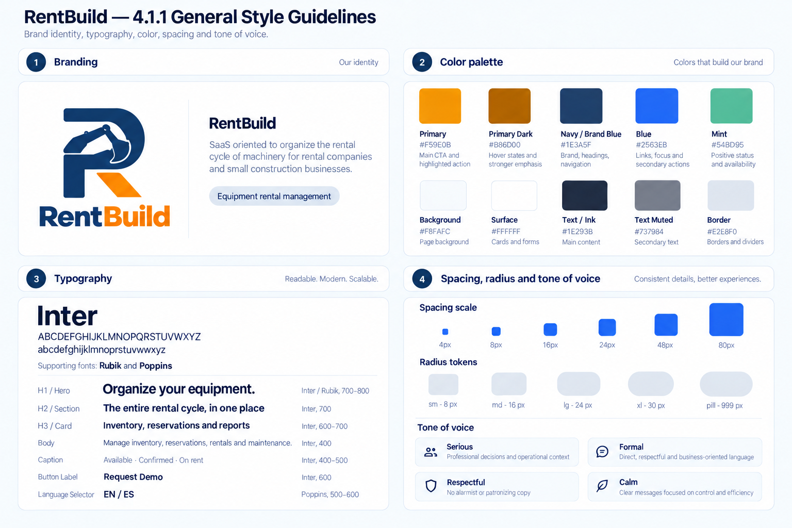

### 4.1.2. Web Style Guidelines

Las **Web Style Guidelines** trasladan la identidad visual de **RentBuild** a interfaces web responsive, manteniendo coherencia entre la **Landing Page** y la **Web Application**. La Landing Page utiliza una navegación horizontal y una organización principalmente secuencial del contenido, mientras que la Web Application se estructura mediante una sidebar persistente, módulos funcionales, cards, formularios, filtros, tablas y listas operativas.

La guía busca mantener consistencia en el uso de colores, tipografías, espaciado, jerarquías visuales, componentes interactivos y estados de interfaz, permitiendo que ambas experiencias formen parte de un mismo sistema visual.

#### Material Design and Components

El lenguaje visual de **RentBuild** toma principios de **Material Design** como referencia para la jerarquía, separación de superficies, consistencia de acciones, feedback visual y estados de interacción. Estos principios se adaptan a la identidad propia de RentBuild mediante sus tokens de color, tipografía, espaciado, bordes y radios.

Para la **Web Application**, los componentes se diseñan con una estructura compatible con patrones de interfaces basadas en componentes, pudiendo posteriormente implementarse con tecnologías como **PrimeVue** sin perder la identidad visual definida para RentBuild.

Los componentes principales son:

| Componente | Criterio de diseño |
|---|---|
| Primary CTA | Acción principal de alta visibilidad; utiliza principalmente el color `Primary` (`#F59E0B`) y texto de alto contraste |
| Secondary Button | Acción complementaria presentada mediante borde, fondo blanco o superficie neutra |
| Input / Select / Textarea | Label visible, borde consistente, espaciado uniforme y estados diferenciados de focus, error y disabled |
| Search Bar | Búsqueda directa por nombre o categoría, complementada con filtros cuando corresponde |
| Status Badge | Etiqueta breve acompañada de color para representar disponibilidad, alquiler, mantenimiento, aprobación, rechazo u otros estados |
| Data Card | Agrupa información relevante en superficies blancas con bordes suaves y jerarquía clara |
| Catalog Card | Presenta maquinaria mediante categoría, nombre, estado, disponibilidad, tarifa y acceso a detalle |
| Data Table | Organiza información operativa como inventario, solicitudes, alquileres, mantenimiento e historial |
| Form Card | Contenedor utilizado para procesos como registro de maquinaria o mantenimiento |
| Sidebar | Navegación principal persistente de la Web Application, con estado activo diferenciado mediante fondo claro y color naranja |
| Header | Navegación principal de la Landing Page, con acceso a las principales secciones del contenido |
| Filter Control | Selectores y controles utilizados para reducir resultados por categoría, estado, maquinaria u otros criterios |
| User Profile Block | Área que muestra información básica del usuario y acceso a la acción de cerrar sesión |

#### Responsive Web Design

La Landing Page de **RentBuild** aplica un diseño responsivo que adapta progresivamente la distribución, navegación, tipografía y tamaño de los componentes según el ancho disponible. La implementación utiliza principalmente los breakpoints de `1120 px`, `1023 px`, `767 px` y `480 px`.

- **Desktop Web Browser:** se mantiene la distribución completa de las secciones, con navegación horizontal, composiciones de varias columnas y un ancho máximo de contenido controlado mediante el contenedor principal.
- **Tablet / Small Laptop:** a partir de `1023 px`, la navegación horizontal se transforma en un menú desplegable mediante un botón tipo hamburguesa. También se reducen espacios, tamaños tipográficos y separación entre cards para aprovechar mejor el área disponible.
- **Mobile Web Browser:** a partir de `767 px`, las principales secciones pasan progresivamente a una distribución de una columna. Elementos como Hero, About, Contact y Pricing reorganizan su contenido verticalmente, mientras que las cards y recursos visuales ajustan su ancho al espacio disponible. Por debajo de `480 px` se realizan ajustes adicionales en navegación, cards, footer y elementos visuales para pantallas pequeñas.

#### Interaction States

Los elementos interactivos de **RentBuild**, como botones, enlaces, controles del menú, selector de idioma, acordeones y campos de formulario, deben ofrecer una respuesta visual clara ante la interacción del usuario. Se consideran los estados **default, hover, focus, disabled, success y error**, aplicándolos según corresponda al tipo de componente.

La Landing Page actual incorpora cambios visuales en estado `hover` para botones y enlaces, además de un estado de foco accesible mediante `:focus-visible`. Este último utiliza un `outline` de `3 px` en el color Navy de la marca y un `outline-offset` de `5 px`, permitiendo identificar claramente el elemento seleccionado mediante navegación por teclado.

Los formularios también contemplan retroalimentación para estados de **success** y **error**, comunicando al usuario el resultado de acciones como el envío de información.

#### Internationalization and Accessibility

**RentBuild** contempla **English (`en`)** como idioma predeterminado y **Spanish (`es`)** como idioma alternativo. La implementación actual utiliza archivos de traducción independientes (`en.json` y `es.json`) y un selector `EN / ES` que permite cambiar el idioma de la interfaz. La preferencia seleccionada se conserva mediante `localStorage` utilizando la clave `rentbuild-language`.

En materia de accesibilidad, RentBuild incorpora estructura semántica, textos alternativos para recursos visuales, navegación mediante teclado, enlace de salto al contenido principal y atributos ARIA como `aria-label`, `aria-expanded`, `aria-controls`, `aria-current` y `aria-live` cuando corresponde. Asimismo, se proporciona un foco visual claramente identificable y se respeta la preferencia del usuario `prefers-reduced-motion`, desactivando animaciones y transiciones cuando el sistema solicita una reducción de movimiento.

## 4.2. Information Architecture

Para el desarrollo de **RentBuild**, la Arquitectura de la Información se plantea considerando las necesidades de los usuarios, la naturaleza de las tareas que realizan y la estructura del contenido disponible tanto en la **Landing Page** como en la **Web Application**. Esta organización permite presentar la información de manera clara, facilitar el acceso a las funcionalidades principales y reducir la complejidad durante la navegación e interacción con la plataforma.

### 4.2.1. Organization Systems

En la **Landing Page**, la información se organiza principalmente de manera **jerárquica y secuencial**. El visitante inicia su recorrido con la propuesta de valor presentada en el **Hero** y continúa progresivamente por las secciones que explican el funcionamiento, las características y los beneficios de RentBuild. Posteriormente, puede conocer con mayor detalle el producto, revisar información sobre la solución, consultar los planes disponibles y finalmente acceder a las opciones de contacto.

El recorrido principal de la Landing Page sigue aproximadamente la siguiente secuencia:

**Home / Hero → How It Works → Features → Benefits → Product Showcase → About RentBuild → Pricing → Contact**

Esta estructura permite acompañar al visitante desde el descubrimiento inicial de RentBuild hasta la evaluación de sus funcionalidades y planes, finalizando con una posible acción de contacto o conversión.

En la **Web Application**, la información se organiza principalmente **por tópicos y tareas**, utilizando una barra lateral persistente que permite acceder directamente a las principales funcionalidades del sistema. 

- **Perfil:** permite visualizar la información correspondiente a la cuenta del usuario.
- **Inventario:** presenta la maquinaria registrada junto con información como categoría, estado y unidades disponibles.
- **Registrar maquinaria:** permite incorporar nuevos equipos al inventario mediante un formulario.
- **Solicitudes:** permite consultar las solicitudes de alquiler realizadas y su respectivo estado.
- **Alquileres activos:** muestra los alquileres que se encuentran actualmente en curso, incluyendo información sobre periodo, tarifa y costo estimado.
- **Mantenimiento:** permite registrar mantenimientos o incidencias relacionadas con la maquinaria y consultar su historial.
- **Historial:** centraliza los eventos relacionados con cada equipo, como solicitudes, aprobaciones, rechazos, incidencias y mantenimientos.
- **Catálogo:** permite explorar la maquinaria disponible mediante cards, búsqueda y filtros por categoría y estado.

Además de la organización por tópicos, RentBuild incorpora una organización **secuencial** asociada al ciclo operativo de la maquinaria. Las diferentes funcionalidades se relacionan siguiendo un flujo general como el siguiente:

**registro o consulta de maquinaria → solicitud de alquiler → aprobación o rechazo → alquiler activo → mantenimiento o incidencia → historial → actualización de disponibilidad**

Esta combinación entre organización temática y secuencial permite que el usuario pueda acceder directamente a una funcionalidad específica desde la navegación principal y, al mismo tiempo, comprender la relación existente entre las distintas etapas del ciclo de alquiler y gestión de maquinaria.

### 4.2.2. Labeling Systems

El sistema de etiquetado de **RentBuild** utiliza términos breves, descriptivos y relacionados directamente con las tareas del dominio de alquiler y gestión de maquinaria. Las etiquetas buscan mantener consistencia entre la **Landing Page** y la **Web Application**, evitando términos ambiguos y facilitando que el usuario pueda anticipar el contenido o acción asociada a cada elemento.

La plataforma contempla internacionalización mediante **English (`en`)** y **Spanish (`es`)**, manteniendo equivalencias para los principales elementos de navegación, contenido y estados de la interfaz.

| Contexto | Etiqueta principal | Asociación esperada |
|---|---|---|
| Landing Page | `Home` | Propuesta de valor principal de RentBuild |
| Landing Page | `How it works` | Explicación general del funcionamiento y ciclo operativo |
| Landing Page | `Features` | Funcionalidades principales para la gestión de maquinaria |
| Landing Page | `Benefits` | Beneficios obtenidos mediante el uso de RentBuild |
| Landing Page | `Product Demo` | Presentación visual del funcionamiento del producto |
| Landing Page | `About` | Información sobre RentBuild y su propósito |
| Landing Page | `Plans` | Planes Basic, Pro y Premium |
| Landing Page | `Contact us` | Comunicación y contacto con el equipo de RentBuild |
| Web Application | `Profile / Perfil` | Información de la cuenta del usuario |
| Web Application | `Inventory / Inventario` | Maquinaria registrada, categoría, estado y unidades |
| Web Application | `Register machinery / Registrar maquinaria` | Registro de nuevos equipos |
| Web Application | `Requests / Solicitudes` | Solicitudes de alquiler y su estado |
| Web Application | `Active rentals / Alquileres activos` | Alquileres actualmente vigentes |
| Web Application | `Maintenance / Mantenimiento` | Registro y consulta de mantenimientos e incidencias |
| Web Application | `History / Historial` | Eventos y actividades asociados a la maquinaria |
| Web Application | `Catalog / Catálogo` | Exploración y consulta de la maquinaria disponible |

Los estados también utilizan etiquetas breves acompañadas por indicadores visuales. Para la maquinaria se utilizan estados como `Available / Disponible`, `Rented / Alquilado`, `Reserved / Reservado` y `Maintenance / Mantenimiento`. Para las solicitudes se emplean `Pending / Pendiente`, `Approved / Aprobada` y `Rejected / Rechazada`, mientras que los alquileres activos pueden mostrar estados como `In progress / En curso`.

El color funciona como apoyo visual para reconocer rápidamente estos estados, pero el significado no depende exclusivamente de él, ya que cada badge mantiene una etiqueta textual.

### 4.2.3. SEO Tags and Meta Tags

Los **SEO Tags y Meta Tags** permiten identificar y describir correctamente la Landing Page de RentBuild para navegadores, motores de búsqueda y dispositivos. 

| Producto | Tag | Valor |
|---|---|---|
| Landing Page | `title` | `RentBuild — Equipment rental, under control` |
| Landing Page | `description` | `RentBuild connects equipment, reservations, rentals, deliveries, returns, and maintenance in one platform. Built by DataFlux.` |
| Landing Page | `keywords` | `equipment rental, construction machinery, machinery management, rental management software, equipment availability, maintenance management, RentBuild` |
| Landing Page | `author` | `DataFlux` |
| Landing Page | `theme-color` | `#1E3A5F` |
| Landing Page | `charset` | `UTF-8` |
| Landing Page | `viewport` | `width=device-width, initial-scale=1.0` |
| Landing Page | `lang` | `en`, actualizado dinámicamente a `es` cuando corresponde |
| Web Application | `title` | `RentBuild | Equipment rental workspace` |
| Web Application | `description` | `Manage machinery inventory, rental requests, active rentals, maintenance and equipment history with RentBuild.` |
| Web Application | `keywords` | `equipment inventory, machinery rental, rental requests, active rentals, maintenance, equipment history, machinery catalog, RentBuild` |
| Web Application | `author` | `DataFlux` |

### 4.2.4. Searching Systems

El sistema de búsqueda de **RentBuild** se concentra en las áreas de la Web Application donde el volumen de maquinaria o registros puede dificultar la localización directa de información. En la Landing Page no se requiere un motor de búsqueda interno, debido a que el contenido se encuentra organizado en secciones accesibles mediante navegación y enlaces contextuales.

En la Web Application se combinan mecanismos de **búsqueda directa**, **filtrado** y **exploración visual**.

| Área | Búsqueda / filtros | Presentación de resultados |
|---|---|---|
| Landing Page | Navegación mediante secciones y enlaces internos | Desplazamiento hacia la sección correspondiente |
| Catálogo | Búsqueda por nombre o categoría | Cards de maquinaria |
| Catálogo | Filtro por categoría | Cards que coinciden con la categoría seleccionada |
| Catálogo | Filtro por estado | Cards según disponibilidad o estado de la maquinaria |
| Historial | Filtro por maquinaria | Tabla con eventos, fechas y detalles asociados |
| Inventario | Consulta directa de maquinaria registrada | Tabla con equipo, categoría, estado y unidades |
| Solicitudes | Consulta de solicitudes registradas | Tabla con maquinaria, fechas de alquiler y estado |
| Alquileres activos | Consulta de alquileres actualmente vigentes | Tabla con maquinaria, periodo, tarifa, costo y estado |
| Mantenimiento | Selección de maquinaria y tipo de registro | Formulario e historial de mantenimientos e incidencias |

El **Catálogo de maquinaria** constituye el principal sistema de búsqueda exploratoria. El usuario dispone de una barra con el placeholder `Search by name or category… / Buscar por nombre o categoría…`, acompañada por filtros de categoría y estado. Los resultados se presentan mediante cards que muestran información esencial como categoría, nombre del equipo, estado, disponibilidad, tarifa y acceso a detalles.

Por otra parte, el módulo **Historial** permite filtrar los eventos según una maquinaria determinada, facilitando la consulta de solicitudes, mantenimientos, incidencias y otros acontecimientos relacionados con un equipo.

El criterio general consiste en utilizar **búsqueda directa** cuando el usuario conoce el nombre o categoría de la maquinaria y **filtros** cuando necesita reducir progresivamente el conjunto de resultados.

### 4.2.5. Navigation Systems

**RentBuild** emplea diferentes niveles de navegación para permitir que el usuario acceda a las principales funcionalidades sin perder el contexto dentro de la plataforma.

| Tipo de navegación | Aplicación en RentBuild |
|---|---|
| Global | Header de la Landing Page y sidebar persistente de la Web Application |
| Local | Contenido y controles propios de módulos como Inventario, Mantenimiento, Historial y Catálogo |
| Contextual | Acciones como `View details / Ver detalle`, registro de maquinaria y consulta de información específica |
| Utility | Selector `EN / ES`, información del usuario y `Log out / Cerrar sesión` |
| Quick actions | `Register machinery / Registrar maquinaria`, `Save record / Guardar registro` y `View details / Ver detalle` |
| Responsive | Menú desplegable en la Landing Page y adaptación de la navegación para pantallas de menor tamaño |

En la **Landing Page**, la navegación global permite acceder a las principales áreas informativas de RentBuild. El logo funciona como acceso a `Home`, mientras que la navegación dirige al usuario hacia secciones como `How it works`, `Features`, `Plans`, `Our Team` y `Contact us`. Otras secciones, como Benefits, Product Demo y About, forman parte del recorrido secuencial del contenido.

## 4.3. Landing Page UI Design

El diseño de la Landing Page de RentBuild busca comunicar de manera clara la propuesta de valor de la plataforma y presentar sus principales funcionalidades relacionadas con la gestión de equipos y operaciones de alquiler.

### 4.3.1. Landing Page Wireframe

### Nav y Hero

La sección inicial del wireframe presenta el logotipo de RentBuild, el menú de navegación y el mensaje principal de la plataforma. El contenido se divide en dos áreas: a la izquierda se muestra la propuesta de valor y los botones de acción, mientras que a la derecha se reserva espacio para elementos visuales relacionados con la gestión de equipos.

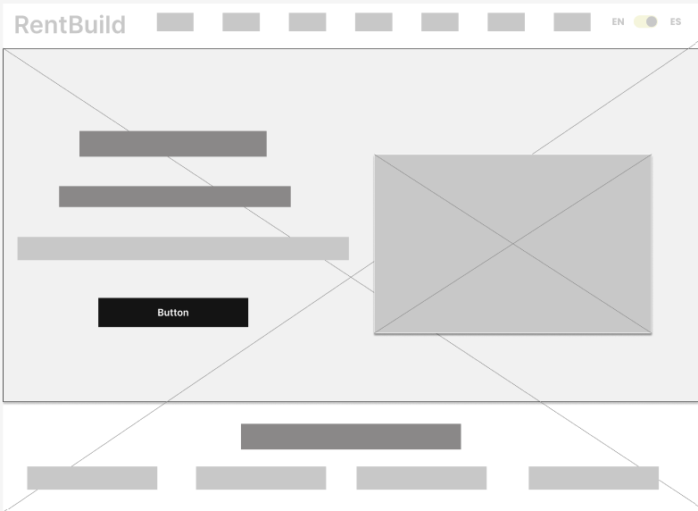

### Operational Management

Esta sección muestra las principales actividades que pueden gestionarse dentro de RentBuild. Se presentan bloques relacionados con la disponibilidad de equipos, las reservas y el mantenimiento. La distribución permite mostrar de forma sencilla cómo la plataforma centraliza diferentes procesos relacionados con el alquiler de maquinaria.

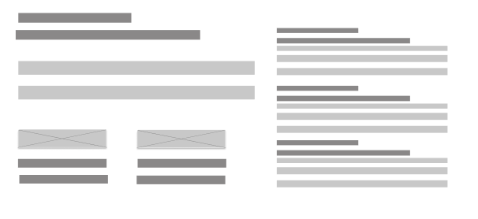

### Key Features

La sección de funciones principales está dividida entre un espacio para video y cuatro bloques informativos. Estos representan la gestión y disponibilidad de equipos, reservas y alquileres, mantenimiento e incidencias, y reportes operativos. La estructura permite presentar las funciones principales de RentBuild de manera clara y ordenada.

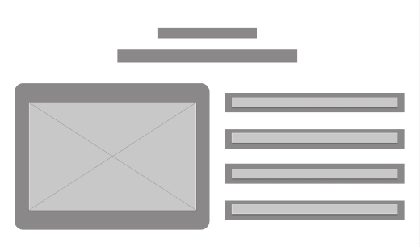

### RentBuild Platform Overview

Esta sección explica con mayor detalle la finalidad de RentBuild y su funcionamiento general. Se combina un bloque de información con un espacio destinado a un video demostrativo. El contenido destaca la gestión de equipos, el seguimiento del ciclo de alquiler y el control del mantenimiento.

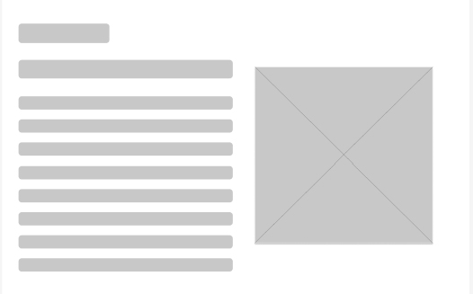

### Benefits

La sección de beneficios presenta las principales ventajas que obtiene el usuario al utilizar RentBuild. Entre ellas se encuentran un mejor control de la disponibilidad de maquinaria, organización de reservas, seguimiento de alquileres y gestión del mantenimiento. La información se presenta de manera sencilla y acompañada de elementos visuales.

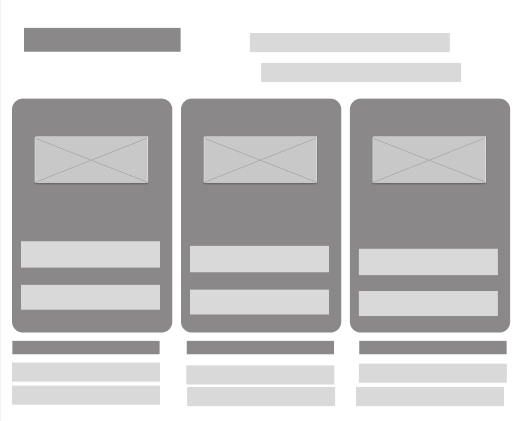

### Pricing

La sección de precios presenta tres alternativas de suscripción: Basic, Pro y Premium. Cada plan muestra diferentes características y niveles de acceso a las funciones de RentBuild. También se incluye un selector entre modalidad mensual y anual.

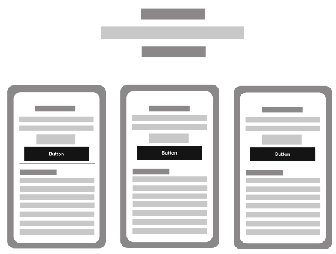

### Our Team

La sección Our Team presenta a los integrantes responsables del desarrollo del proyecto. Cada miembro aparece dentro de una tarjeta que contiene su fotografía, nombre, carrera o función y una breve descripción. La distribución se organiza en dos filas para mantener una presentación ordenada.

### Footer

El Footer representa la última sección de la Landing Page y concentra los enlaces secundarios de navegación. Incluye accesos relacionados con el producto, soporte, información de la empresa, contacto, términos y políticas de privacidad.

### 4.3.2. Landing Page Mock-up

El mock-up de la Landing Page de **RentBuild** representa la versión visual de alta fidelidad del diseño definido previamente en el wireframe. En esta etapa se incorporan la paleta de colores, tipografía, imágenes, tarjetas, sombras, botones y elementos gráficos que conforman la identidad visual final de la plataforma.

### Nav y Hero

El mock-up del Hero aplica la identidad visual definitiva de RentBuild mediante colores, tipografía, botones y elementos gráficos. El mensaje principal ocupa una posición destacada y se acompaña de llamadas a la acción como registro y demostración. A la derecha se muestran elementos relacionados con equipos y disponibilidad.

### Operational Management

En la versión de alta fidelidad, esta sección utiliza iconos, colores y una organización visual uniforme para representar disponibilidad, reservas y mantenimiento. Cada función se presenta mediante títulos y textos breves que permiten una lectura rápida. El uso de fondos claros y espacios amplios evita la saturación de información.

### Key Features

La sección presenta un reproductor de video acompañado de cuatro tarjetas que representan las funciones principales de RentBuild. Las tarjetas utilizan bordes redondeados, sombras suaves y títulos claramente diferenciados. Se muestran funciones de gestión de equipos, alquileres, mantenimiento y reportes.

### RentBuild Platform Overview

El mock-up combina un bloque descriptivo con un video de mayor tamaño para explicar cómo funciona RentBuild. Los textos destacan la gestión de equipos, el seguimiento del ciclo de alquiler y el mantenimiento de maquinaria. La organización en dos columnas permite distribuir correctamente la información.

### Benefits

La sección de beneficios utiliza textos breves y elementos gráficos para destacar las ventajas principales de RentBuild. Se muestran aspectos relacionados con el control de maquinaria, reservas, devoluciones y mantenimiento. La jerarquía entre títulos y descripciones permite identificar rápidamente cada beneficio.

### Pricing

El mock-up presenta tres tarjetas correspondientes a los planes Basic, Pro y Premium. El plan Premium se destaca visualmente mediante el uso del color naranja, mientras que los demás mantienen tonos más claros. Cada tarjeta muestra sus principales funcionalidades y un botón de acción.

### Our Team

La sección utiliza tarjetas con fotografías circulares de cada integrante, acompañadas de su nombre, rol y una breve descripción. Los elementos se organizan en filas y mantienen espacios suficientes para mejorar la lectura. Los colores y estilos de las tarjetas siguen la identidad visual de RentBuild.

### Footer

El Footer del mock-up utiliza un fondo oscuro para diferenciar claramente el final de la página. Los enlaces están distribuidos en columnas relacionadas con producto, soporte, empresa y otros recursos. Los textos claros generan un buen contraste con el fondo.

## 4.4. Web Applications UX/UI Design

### 4.4.1. Web Applications Wireframes

Los wireframes de las aplicaciones web de RentBuild delinean la estructura y organización de las pantallas principales, especificando la ubicación de los elementos de la interfaz de usuario y la navegación. Estos esquemas visuales sirven como una guía precisa para el diseño final, asegurando una experiencia de usuario fluida e intuitiva tanto para el segmento de empresas de alquiler como para el segmento de empresas constructoras. Los wireframes están enfocados en la funcionalidad y facilidad de uso, permitiendo que diseñadores y desarrolladores visualicen cómo los usuarios interactúan con la aplicación, optimizando la disposición de los elementos para crear una experiencia eficiente y accesible.

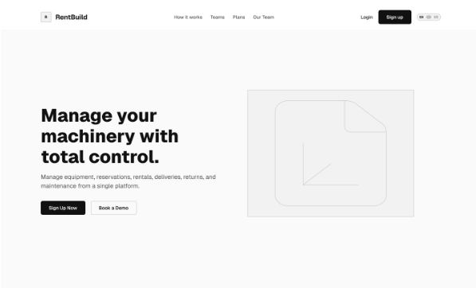

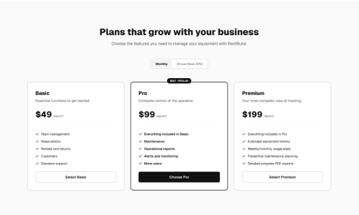

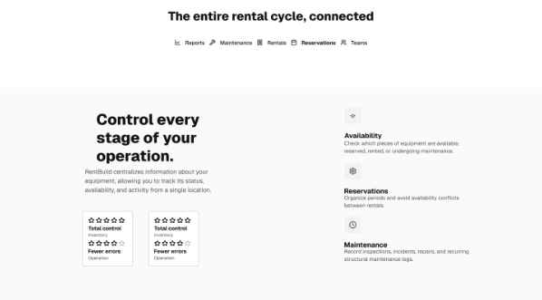

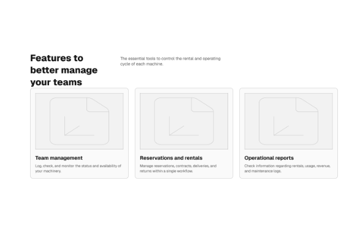

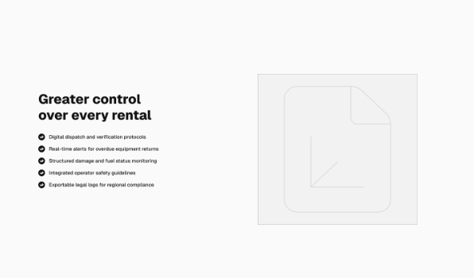

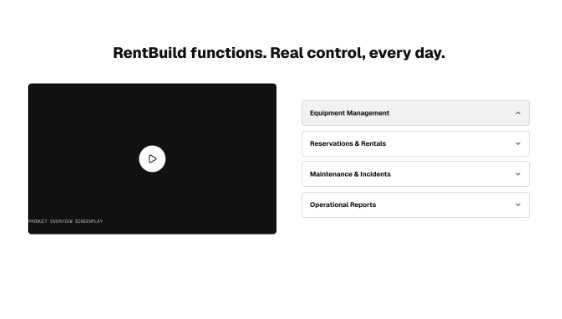

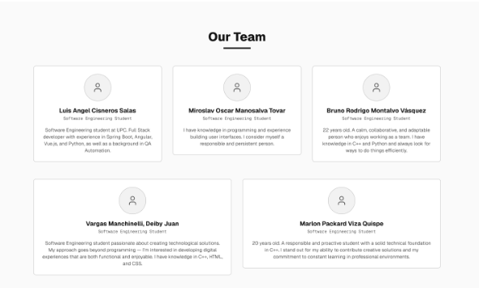

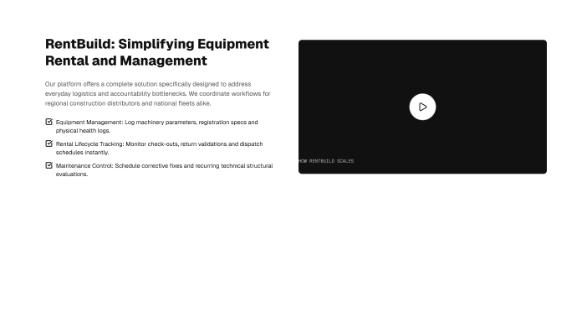

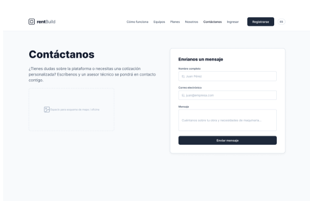

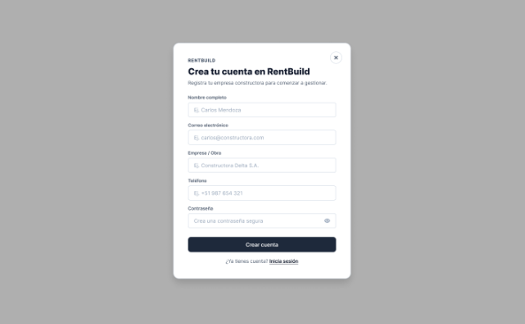

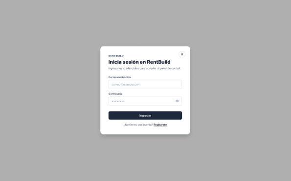

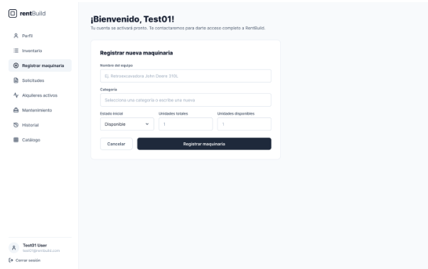

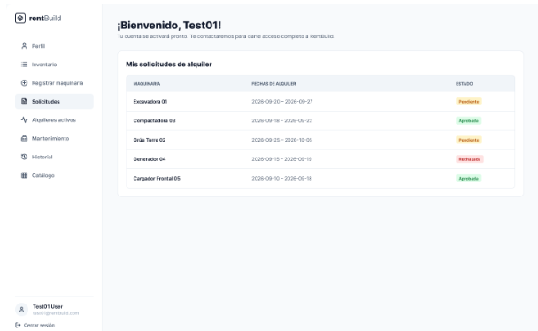

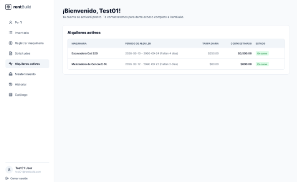

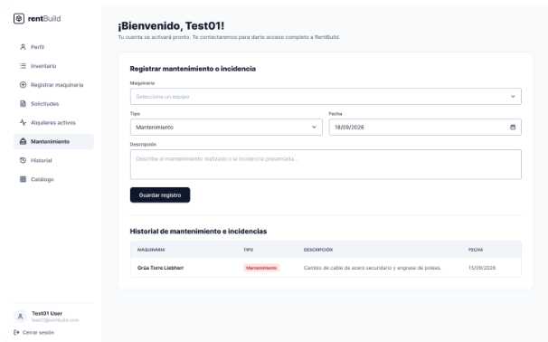

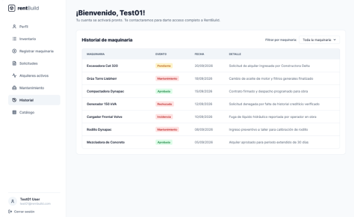

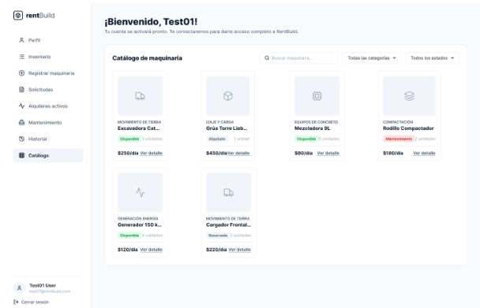

### 4.4.2. Web Applications Wireflow Diagrams

Los wireflow diagrams de la Web Application de RentBuildrepresentan la relación entre las principales pantallas del sistema y permiten visualizar el recorrido general de navegación que realiza el usuario dentro de la plataforma. A diferencia de los wireframes, que muestran la estructura individual de cada interfaz, el wireflow permite comprender cómo se conectan las distintas pantallas y cómo avanza la experiencia de uso en función de las acciones y decisiones realizadas por el usuario.

En el caso de RentBuild, se ha definido un wireflow general que abarca desde el proceso inicial de autenticación y registro hasta las principales funcionalidades destinadas a las empresas de alquiler de maquinaria. El diagrama permite observar de manera global cómo el usuario ingresa a la plataforma, selecciona el tipo de empresa correspondiente y posteriormente accede a los módulos necesarios para gestionar maquinaria, solicitudes, alquileres y actividades relacionadas con su operación.

El recorrido comienza en la pantalla de Login, desde la cual el usuario puede ingresar sus credenciales para acceder a RentBuild. En caso de no contar con una cuenta, puede dirigirse a la pantalla de Register para completar el proceso de creación de una nueva cuenta. Una vez realizado el registro correctamente, el flujo continúa hacia una decisión asociada al tipo de empresa del usuario.

En el wireflow desarrollado se representa la rama correspondiente a una **Rental Company**, es decir, una empresa dedicada al alquiler de maquinaria. Después de seleccionar este tipo de empresa, el usuario ingresa a la Web Application de RentBuild, donde dispone de una navegación lateral persistente que permite acceder a los principales módulos del sistema. Como parte del flujo inicial también se contempla la opción de **Register machinery**, mediante la cual se puede incorporar nueva maquinaria al inventario de la empresa.

A partir de esta vista principal, el recorrido de la empresa de alquiler contempla los siguientes módulos:

- **Inventory:** permite consultar la maquinaria registrada, su categoría, estado y cantidad de unidades disponibles.
- **Requests:** permite revisar las solicitudes de alquiler y conocer el estado de cada una de ellas.
- **Active rentals:** presenta los alquileres actualmente vigentes, incluyendo el período de alquiler, tarifa, costo estimado y estado.
- **Maintenance:** permite registrar actividades de mantenimiento o incidencias asociadas a la maquinaria, además de consultar registros anteriores.
- **History:** centraliza los eventos relacionados con cada maquinaria, como solicitudes, aprobaciones, rechazos, mantenimientos e incidencias.
- **Catalog:** permite explorar la maquinaria mediante un catálogo visual, utilizando búsqueda y filtros para localizar equipos según su categoría o estado.

Estos módulos se encuentran relacionados mediante la navegación lateral de RentBuild, permitiendo al usuario desplazarse entre las diferentes funcionalidades sin perder el contexto de la aplicación. De esta manera, el wireflow refleja el recorrido operativo asociado a la gestión de maquinaria y alquileres dentro de una empresa proveedora de equipos.

Finalmente, el diagrama incorpora una salida general mediante la acción Sign Out, que representa el cierre de sesión y finaliza el recorrido del usuario dentro de la Web Application.

En conjunto, el wireflow permite validar que las pantallas diseñadas se encuentran conectadas de manera coherente y que la navegación responde al flujo funcional planteado para las empresas de alquiler de maquinaria, desde el acceso inicial a RentBuild hasta la administración de inventario, solicitudes, alquileres, mantenimiento, historial y catálogo.

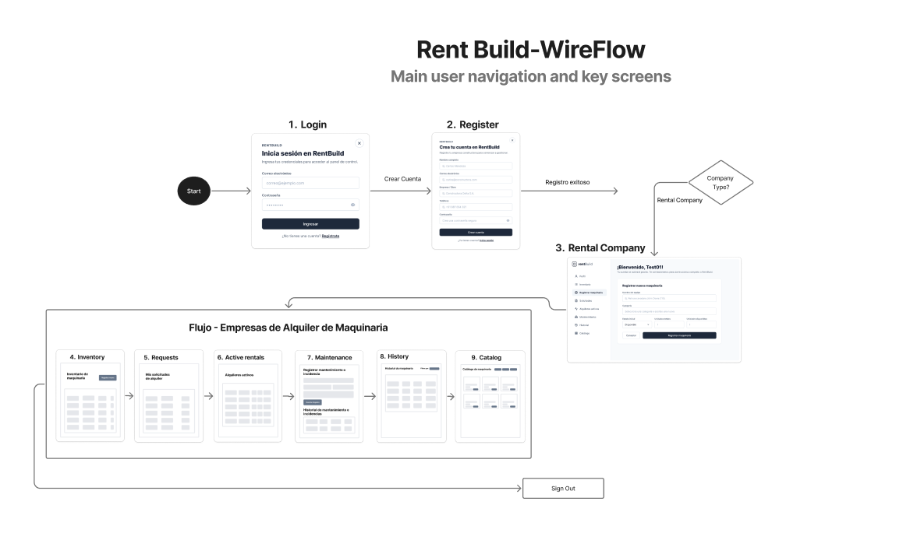

### 4.4.3. Web Applications Mock-ups

Los mock-ups de la Web Application de RentBuild representan la propuesta visual de alta fidelidad de las interfaces definidas mediante los wireframes. Estas vistas incorporan los elementos establecidos en el Design System de RentBuild, como la tipografía Inter, los colores corporativos, la iconografía, los botones, cards, formularios, etiquetas de estado y componentes de navegación.

La propuesta utiliza azul oscuro para la identidad y navegación principal, naranja para destacar las acciones prioritarias, azul para enlaces y acciones secundarias, y fondos claros para mantener una interfaz ordenada y legible. Los componentes mantienen una jerarquía visual consistente y comunican los estados mediante etiquetas textuales, evitando depender únicamente del color.

Las variantes Desktop Web Browser y Mobile Web Browser conservan la misma arquitectura de información y los mismos objetivos de tarea, adaptando únicamente la distribución y densidad de los componentes al espacio disponible.

#### 1. Login

**Propósito:** Presentar una interfaz que permita que los usuarios registrados accedan de forma segura a RentBuild mediante sus credenciales.

**Elementos clave:**
- Logotipo de RentBuild y selector de idioma.
- Campo de correo electrónico y campo de contraseña.
- Acción principal para iniciar sesión.
- Enlace para recuperar la contraseña.
- Enlace para crear una nueva cuenta.

**Desktop Web Browser**

  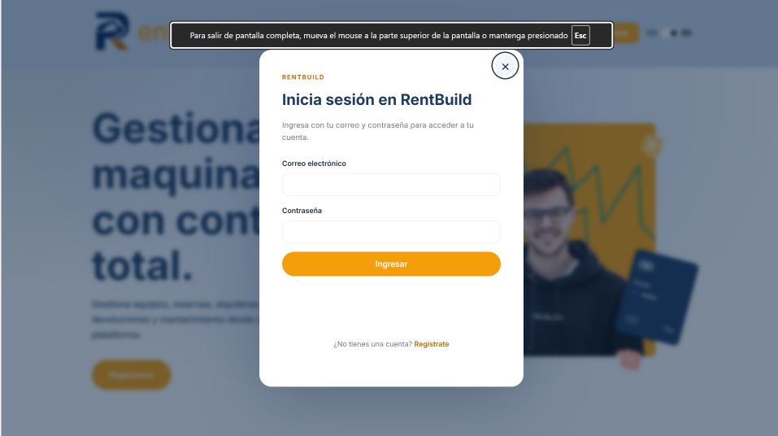

#### 2. Registro de usuario

**Propósito:** Permitir la creación de una cuenta y recopilar la información necesaria para identificar al usuario y su organización dentro de RentBuild.

**Elementos clave:**
- Datos personales del usuario.
- Correo electrónico y contraseña.
- Información básica de la empresa.
- Selección del tipo de organización.
- Acción para crear la cuenta.
- Enlace para volver al inicio de sesión.

**Desktop Web Browser**

  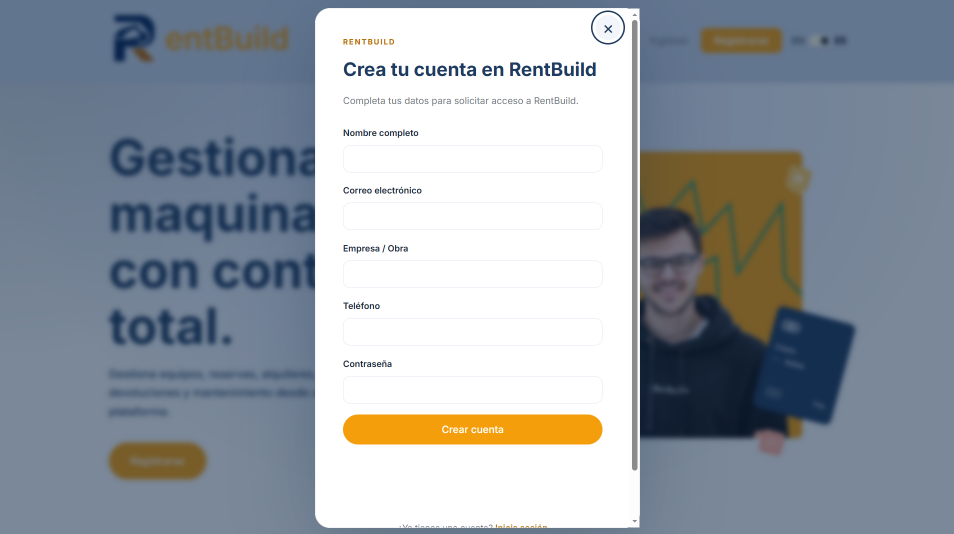

#### 3. Perfil

**Propósito:** Permitir al usuario consultar y gestionar la información asociada a su perfil y organización dentro de RentBuild.

**Elementos clave:**
- Información personal del usuario.
- Información de la empresa u organización.
- Datos de contacto.
- Opciones para editar la información.
- Configuración de la cuenta.

**Desktop Web Browser**

  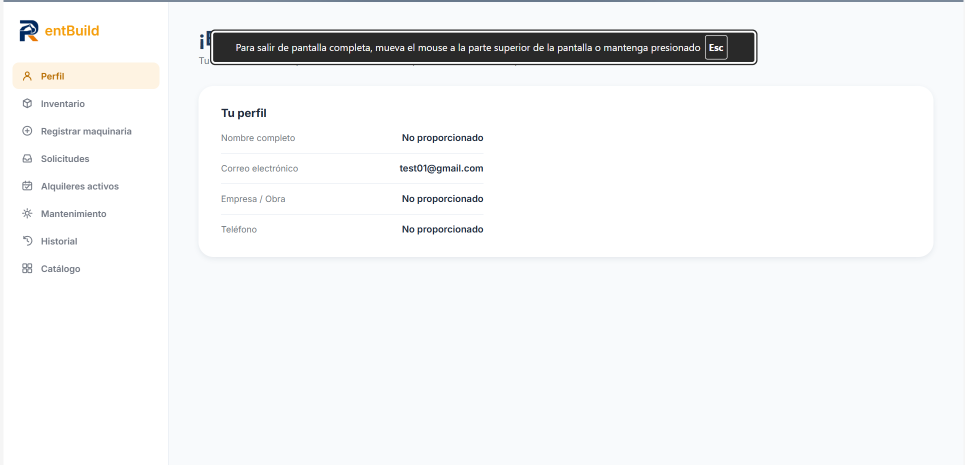

#### 4. Inventario

**Propósito:** Permitir la gestión y consulta de la maquinaria disponible dentro de RentBuild.

**Elementos clave:**
- Listado de maquinaria registrada.
- Estado y disponibilidad de cada maquinaria.
- Información básica de los equipos.
- Filtros y opciones de búsqueda.
- Acciones para consultar y gestionar maquinaria.

**Desktop Web Browser**

  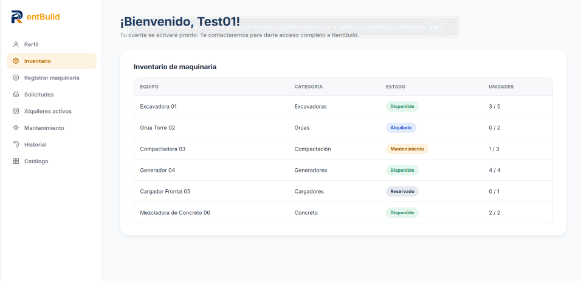

#### 5. Registrar maquinaria

**Propósito:** Permitir el registro de nuevas máquinas y equipos dentro del inventario de RentBuild.

**Elementos clave:**
- Datos generales de la maquinaria.
- Marca, modelo y categoría.
- Características técnicas.
- Información sobre disponibilidad.
- Carga de imágenes o documentación.
- Acción para registrar la maquinaria.

**Desktop Web Browser**

  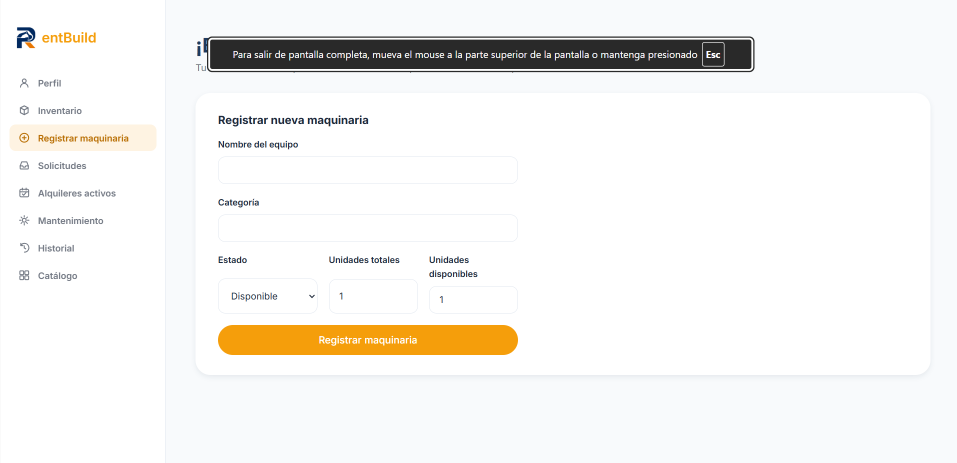

#### 6. Solicitudes

**Propósito:** Permitir la gestión y seguimiento de las solicitudes de alquiler realizadas dentro de RentBuild.

**Elementos clave:**
- Listado de solicitudes.
- Estado de cada solicitud.
- Información del solicitante.
- Maquinaria solicitada.
- Fechas de alquiler.
- Acciones para aceptar, rechazar o consultar una solicitud.

**Desktop Web Browser**

  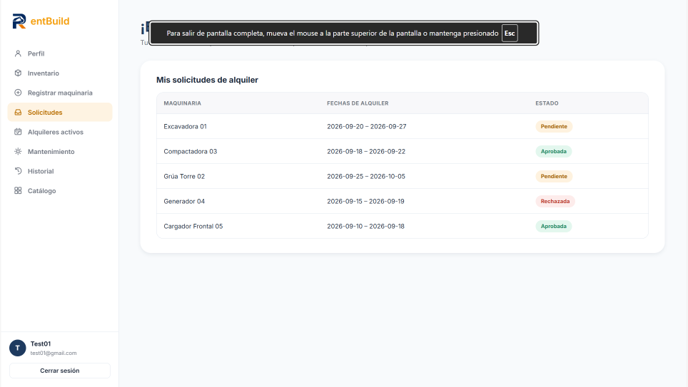

#### 7. Alquileres activos

**Propósito:** Permitir visualizar y gestionar los alquileres que se encuentran actualmente activos.

**Elementos clave:**
- Listado de alquileres activos.
- Información de la maquinaria alquilada.
- Datos del cliente o empresa.
- Fecha de inicio y fecha de finalización.
- Estado del alquiler.
- Acciones de seguimiento y gestión.

**Desktop Web Browser**

  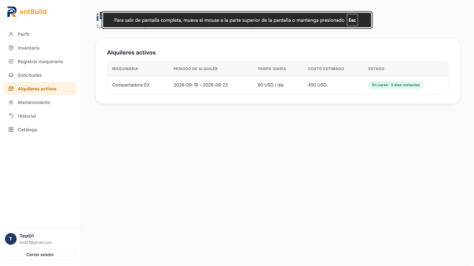

#### 8. Mantenimiento

**Propósito:** Facilitar la gestión de las actividades de mantenimiento realizadas sobre la maquinaria registrada.

**Elementos clave:**
- Listado de equipos en mantenimiento.
- Estado de mantenimiento.
- Tipo de mantenimiento.
- Fechas programadas y realizadas.
- Registro de observaciones.
- Acciones para gestionar el mantenimiento.

**Desktop Web Browser**

  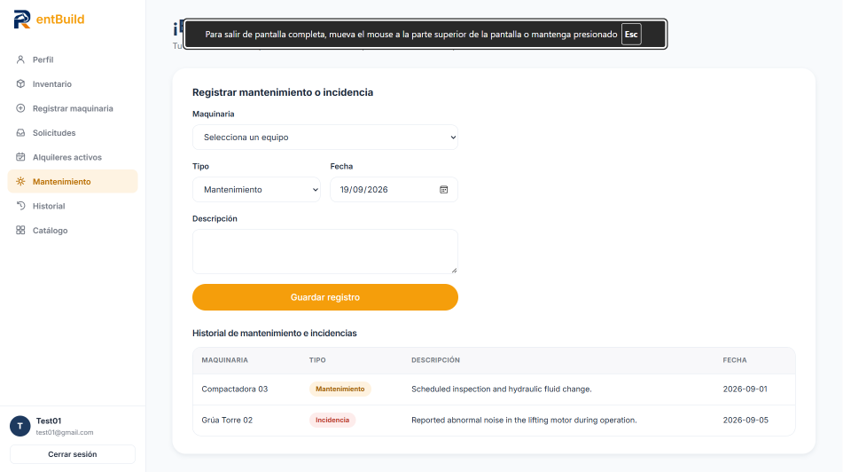

#### 9. Historial

**Propósito:** Permitir consultar el historial de operaciones y actividades relacionadas con la maquinaria y los alquileres.

**Elementos clave:**
- Historial de alquileres.
- Historial de mantenimientos.
- Registro de movimientos de maquinaria.
- Fechas y estados de las operaciones.
- Filtros para facilitar la consulta.

**Desktop Web Browser**

  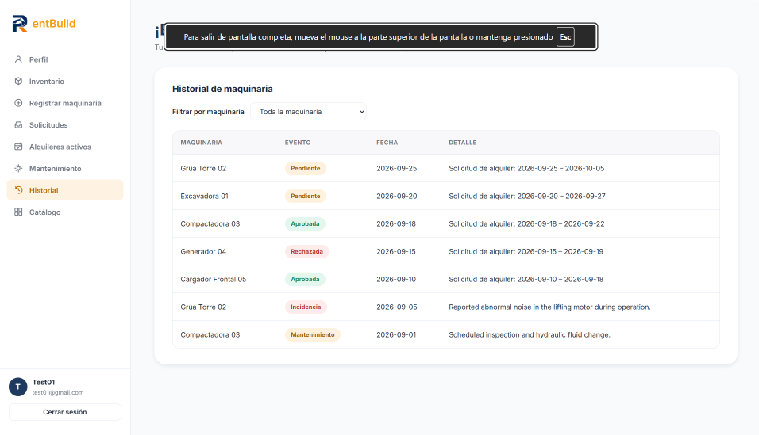

#### 10. Catálogo

**Propósito:** Presentar las maquinarias disponibles para alquiler, permitiendo a los usuarios consultar sus características y disponibilidad.

**Elementos clave:**
- Listado de maquinaria disponible.
- Imágenes de los equipos.
- Nombre, categoría y características principales.
- Información de disponibilidad.
- Filtros y búsqueda.
- Acción para consultar o solicitar el alquiler de una maquinaria.

**Desktop Web Browser**

  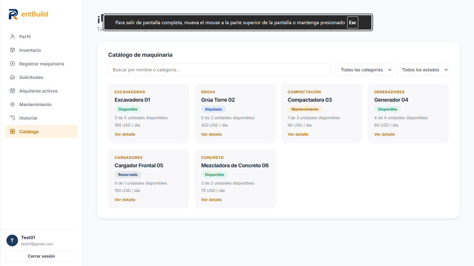

### 4.4.4. Web Applications User Flow Diagrams

#### Flujo de la empresa de alquiler de maquinaria

Después de iniciar sesión correctamente y ser reconocido como usuario perteneciente a una empresa de alquiler de maquinaria, el usuario accede al **Rental Company Dashboard** de RentBuild. Desde este entorno puede desplazarse entre las principales funcionalidades de la aplicación mediante la navegación lateral.

Las secciones disponibles para este segmento son las siguientes:

- **Perfil:** permite consultar y gestionar la información relacionada con el usuario y su cuenta dentro de RentBuild.

- **Inventario:** permite consultar la maquinaria registrada por la empresa y revisar la información disponible de los equipos que forman parte de su inventario.

- **Registrar maquinaria:** permite incorporar nuevos equipos al inventario de la empresa mediante el registro de la información correspondiente. En el User Flow Diagram esta actividad forma parte del proceso de gestión del inventario.

- **Solicitudes:** permite revisar las solicitudes de alquiler recibidas y consultar sus principales detalles. A partir de esta información, la empresa puede aprobar o rechazar una solicitud de acuerdo con sus condiciones y disponibilidad.

- **Alquileres activos:** permite consultar los alquileres que actualmente se encuentran en curso y realizar seguimiento de las operaciones activas relacionadas con la maquinaria alquilada.

- **Mantenimiento:** permite revisar las máquinas que se encuentran en mantenimiento, consultar reportes relacionados con averías o incidencias y programar fechas para las actividades de mantenimiento correspondientes.

- **Historial:** permite consultar los eventos asociados a cada maquinaria a lo largo del tiempo, incluyendo mantenimientos, reparaciones y reservas realizadas previamente.

- **Catálogo:** permite visualizar información detallada de la maquinaria registrada y localizar equipos utilizando criterios de búsqueda como nombre, categoría o condición.

Dentro del recorrido de la empresa de alquiler, uno de los principales puntos de decisión se presenta en la sección **Solicitudes**. Después de revisar los detalles de una solicitud recibida, el usuario puede aprobarla o rechazarla. Esta decisión determina la continuidad del proceso de alquiler y permite a la empresa mantener control sobre las solicitudes recibidas.

Las diferentes funcionalidades se encuentran conectadas con el Dashboard de la empresa de alquiler, permitiendo que el usuario pueda desplazarse entre los procesos de gestión de maquinaria, solicitudes, alquileres activos, mantenimiento, historial y catálogo de acuerdo con las tareas que necesite realizar.

Finalmente, una vez terminadas sus actividades dentro de RentBuild, el usuario puede ejecutar la acción **Sign Out**, mediante la cual se cierra la sesión activa y finaliza su recorrido dentro de la Web Application.

**Key elements:**

- Acceso a la plataforma RentBuild.
- Visualización de la pantalla de Login.
- Verificación de la existencia de una cuenta.
- Ingreso y validación de credenciales.
- Manejo de credenciales incorrectas mediante un mensaje de error.
- Registro de nuevos usuarios y empresas.
- Confirmación del registro y retorno al Login.
- Identificación del tipo de empresa.
- Acceso al Rental Company Dashboard.
- Gestión del perfil del usuario.
- Consulta del inventario de maquinaria.
- Registro de nueva maquinaria.
- Revisión, aprobación o rechazo de solicitudes de alquiler.
- Seguimiento de alquileres activos.
- Gestión del mantenimiento de maquinaria.
- Consulta de reportes de averías e incidencias.
- Programación de actividades de mantenimiento.
- Consulta del historial de cada maquinaria.
- Consulta y búsqueda de equipos mediante el catálogo.
- Cierre de sesión mediante la acción Sign Out.

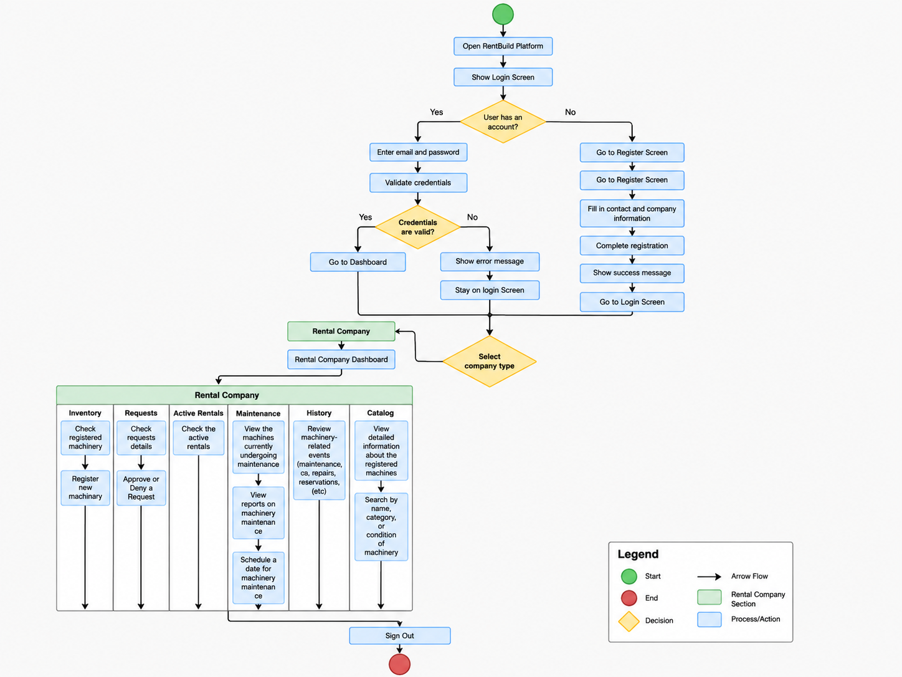

## 4.5. Web Applications Prototyping

Este apartado presenta el prototipo funcional de RentBuild, desarrollado a partir de los wireframes y mock-ups definidos previamente y publicado en Vercel. En él se puede recorrer el flujo principal de la plataforma, desde el inicio de sesión hasta la gestión de inventario, solicitudes de alquiler, mantenimiento y catálogo, de modo que el equipo y los usuarios puedan probar la navegación y validar la propuesta de interfaz. Prototipo: https://dataflux-landing-page.vercel.app/

## 4.6. Domain-Driven Software Architecture

Esta sección describe cómo se estructura RentBuild desde el enfoque Domain-Driven Design. Primero se presenta el Design-Level Event Storming, con el que se delimitan los Bounded Contexts del dominio; luego se detallan los diagramas de contexto, contenedores y componentes del modelo C4, que explican qué piezas conforman el sistema y cómo se comunican entre sí para dar soporte al ciclo completo de alquiler de maquinaria.

### 4.6.1. Design-Level Event Storming

El Design-Level Event Storming permitió profundizar en los procesos identificados durante el Big Picture Event Storming, detallando los eventos, comandos, actores y reglas principales involucrados en el dominio de RentBuild. Este análisis facilita la identificación de los límites y responsabilidades de los diferentes componentes del sistema.

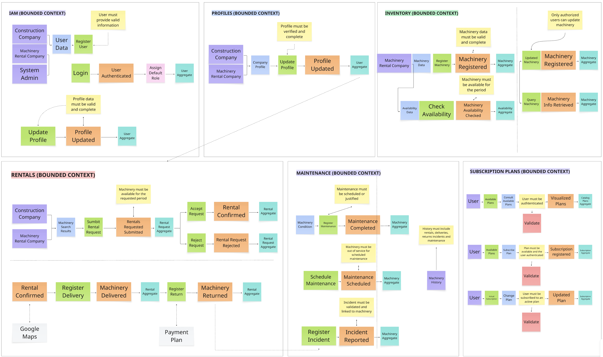

### 4.6.2. Software Architecture Context Diagram

El Software Architecture Context Diagram presenta a **RentBuild** como un único sistema de software y muestra su interacción con los principales usuarios y servicios externos. En este nivel del C4 Model no se representan todavía los componentes internos, containers, bounded contexts ni tecnologías de implementación, ya que el objetivo es delimitar el alcance funcional de la solución y reconocer las dependencias externas con las que se comunica.

Los principales actores que interactúan con RentBuild son:

- **Rental Operator:** representa al usuario perteneciente a una empresa de alquiler de maquinaria. Utiliza RentBuild para administrar equipos, solicitudes de alquiler, reservas, entregas, devoluciones, incidencias y actividades de mantenimiento.
- **Construction Manager:** representa al usuario perteneciente a una empresa constructora. Utiliza la plataforma para buscar maquinaria, revisar disponibilidad, realizar solicitudes de alquiler y efectuar el seguimiento de sus reservas y alquileres activos.
- **System Administrator:** representa al responsable de administrar el acceso a la plataforma, supervisar su operación y atender casos excepcionales que requieran intervención administrativa.

RentBuild también mantiene comunicación con servicios externos necesarios para determinadas capacidades del producto:

- **Google Maps Platform:** proporciona servicios de geolocalización y mapas utilizados para apoyar la localización de maquinaria y la coordinación de entregas y devoluciones.
- **Stripe:** procesa los pagos asociados a los planes de suscripción de RentBuild.
- **SendGrid:** proporciona servicios de correo transaccional para comunicaciones relacionadas con cuentas, reservas, alquileres, suscripciones y otras notificaciones del sistema.

  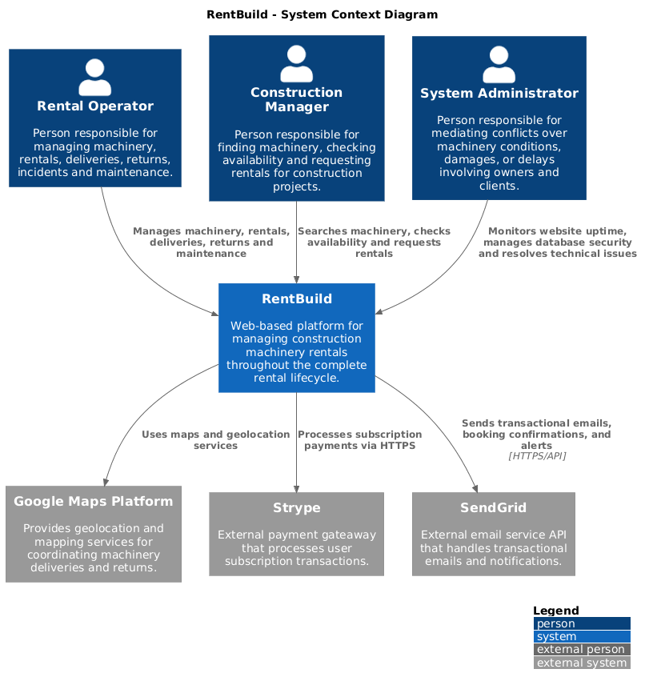

### 4.6.3. Software Architecture Container Diagrams

The Software Architecture Container Diagram presents the main containers that compose the RentBuild platform and the technologies used to implement them.

RentBuild is composed of a public **Landing Page**, a **Single Page Application**, a **RESTful API**, and a **MySQL Database**. The Landing Page provides public information about the platform, while the Single Page Application allows authenticated users to interact with the main business capabilities. The RESTful API exposes the application services and manages access to persistent data.

Additionally, the RESTful API communicates with external services such as **Google Maps Platform** for geolocation capabilities, **Stripe** for subscription payment processing, and **SendGrid** for transactional email delivery.

  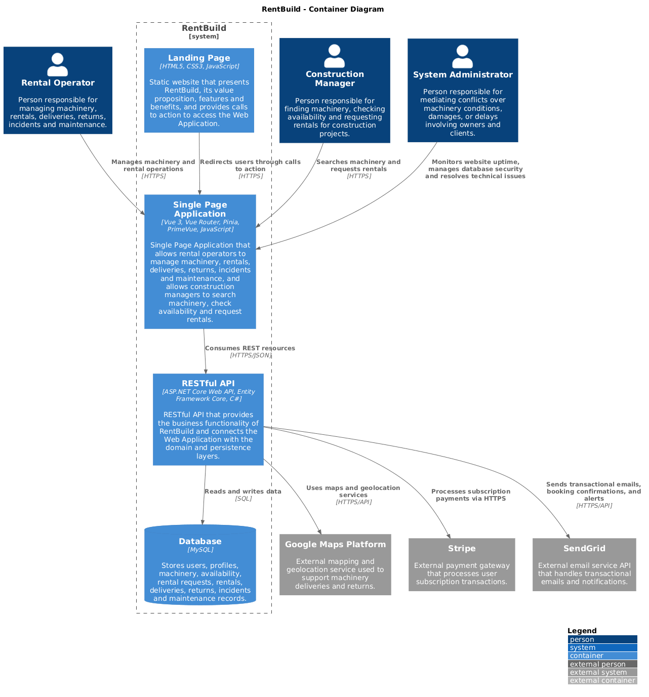

### 4.6.4. Software Architecture Components Diagrams

Los diagramas de componentes de arquitectura de software presentan una vista detallada de la organización interna de los principales contenedores frontend y backend que conforman RentBuild.

A nivel de frontend, la Single Page Application desarrollada con Vue se organiza alrededor de los bounded contexts definidos para la solución: IAM, Profiles, Inventory, Rentals, Maintenance y Subscriptions. Adicionalmente, Shared Frontend concentra componentes, modelos y capacidades técnicas transversales reutilizables por los diferentes contextos de la aplicación. Una vista general de componentes muestra cómo estos elementos se integran dentro de la aplicación frontend, mientras que los diagramas individuales permiten observar su organización interna mediante las capas Presentation, Application, Domain e Infrastructure, según corresponda.

Además, para cada bounded context del frontend se presenta una vista detallada basada en las capas DDD Presentation, Application, Domain e Infrastructure. Estas vistas permiten identificar los componentes internos, sus responsabilidades, tecnologías y relaciones. Complementariamente, se mantiene una vista específica de la Presentation Layer, donde se muestran con mayor detalle los componentes Vue responsables de las páginas, formularios, vistas y elementos de interfaz correspondientes.

A nivel de backend, la RESTful API desarrollada con C# y ASP.NET Core mantiene la misma organización basada en bounded contexts. Una vista general presenta los contextos contenidos dentro de la aplicación backend, mientras que los diagramas individuales descomponen cada bounded context en las capas Interfaces, Application, Domain e Infrastructure siguiendo principios de Domain-Driven Design.

A continuación, se presentan las diferentes vistas de componentes que conforman la arquitectura de RentBuild.

#### Frontend General Components Diagram

El Frontend General Components Diagram presenta la organización general de la Single Page Application de RentBuild. El frontend está implementado con Vue y PrimeVue y se estructura alrededor de los bounded contexts definidos para el dominio del negocio.

Los mecanismos de layout y routing de la aplicación permiten coordinar la navegación hacia IAM, Profiles, Inventory, Rentals, Maintenance y Subscriptions. Asimismo, Shared Frontend proporciona capacidades reutilizables de interfaz y servicios transversales, mientras que la infraestructura del frontend permite la comunicación con la RentBuild Backend API.

  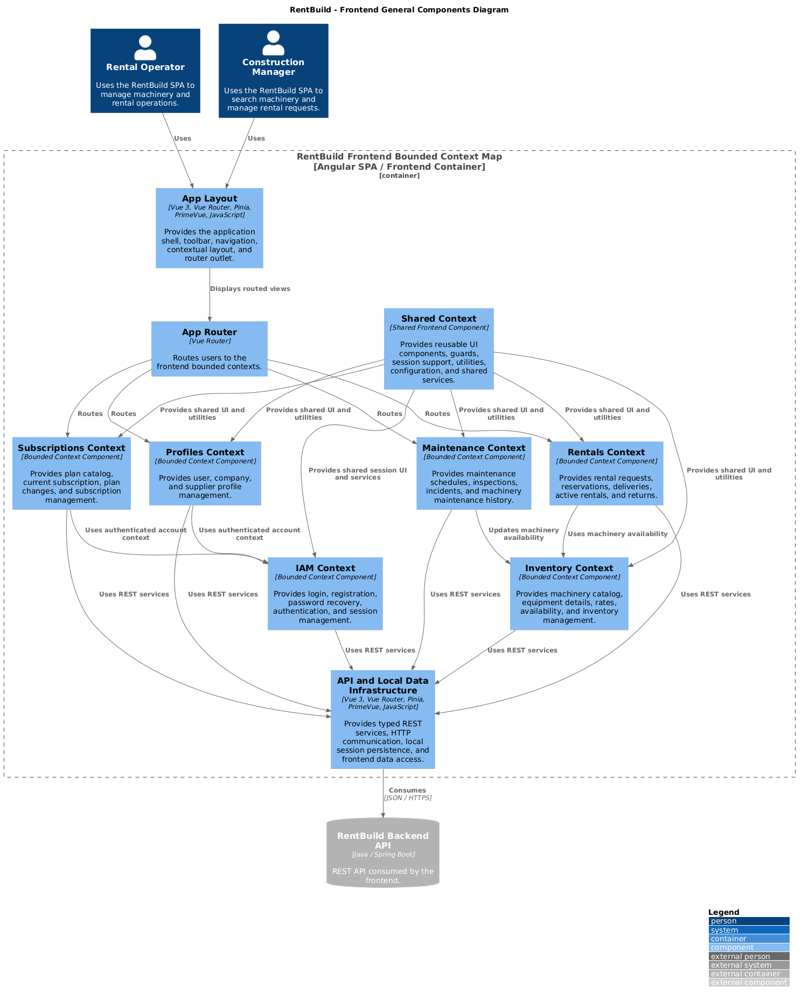

#### IAM Frontend Components Diagram

El bounded context IAM del frontend es responsable de las funcionalidades relacionadas con autenticación, registro, recuperación de contraseña, gestión de sesión y acceso a la cuenta.

La Presentation Layer administra las vistas y las interacciones relacionadas con la autenticación. La Application Layer coordina los flujos de autenticación y el estado de sesión. La Domain Layer contiene los modelos y reglas del frontend asociados con autenticación, mientras que la Infrastructure Layer proporciona la comunicación con los servicios de autenticación del backend y mecanismos técnicos como la persistencia de sesión.

IAM también proporciona información de la cuenta autenticada a otros contextos del frontend y utiliza las capacidades compartidas proporcionadas por Shared Frontend.

  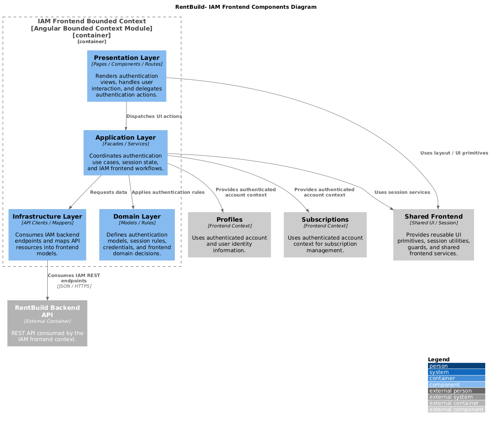

#### IAM Frontend Detailed Component Diagram

El IAM Frontend Detailed Component Diagram presenta una vista más completa de la organización interna del bounded context IAM, integrando las capas Presentation, Application, Domain e Infrastructure y mostrando las relaciones existentes entre sus componentes.

La Presentation Layer está conformada por `LoginComponent`, `RegisterComponent` y `RecoverPasswordComponent`, responsables de las principales interacciones relacionadas con autenticación, registro y recuperación de contraseña.

La Application Layer coordina los casos de uso y el estado asociado con los procesos de autenticación y gestión de sesión. La Domain Layer concentra los modelos y reglas vinculados con credenciales, sesión y conceptos propios del contexto IAM. Por su parte, la Infrastructure Layer permite consumir los servicios REST expuestos por la RentBuild Backend API y transformar los recursos recibidos en modelos utilizados por el frontend.

Este nivel de detalle permite observar cómo los componentes de presentación delegan las operaciones a la capa de aplicación, cómo esta coordina el acceso a infraestructura y dominio, y cómo la infraestructura establece la comunicación con los servicios backend.

  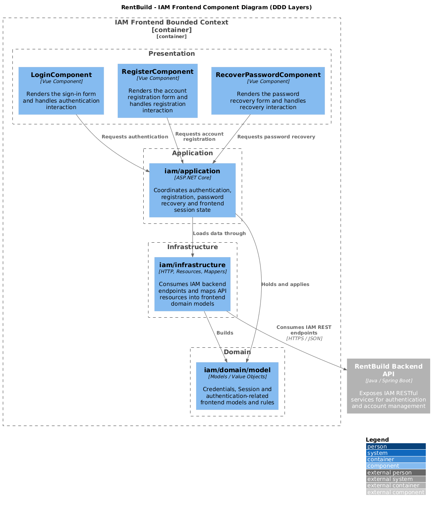

#### Profiles Frontend Components Diagram

El bounded context Profiles del frontend administra la información relacionada con los perfiles de usuarios, empresas y proveedores.

La Presentation Layer contiene las vistas y formularios asociados con los perfiles. La Application Layer coordina las consultas y operaciones de actualización, mientras que la Domain Layer contiene los modelos y reglas correspondientes. La Infrastructure Layer se encarga de la comunicación con los endpoints de Profiles disponibles en el backend.

Este bounded context también utiliza la información de la cuenta autenticada proporcionada por IAM y las capacidades comunes proporcionadas por Shared Frontend.

  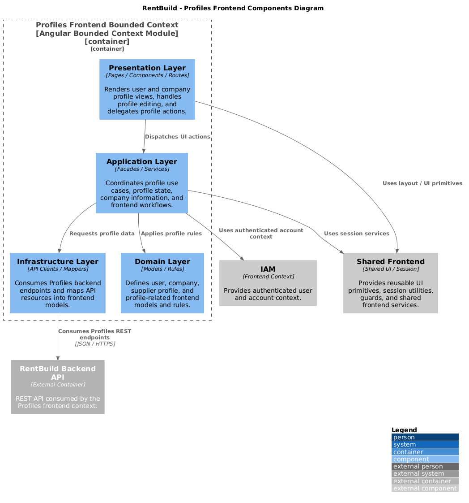

#### Profiles Frontend Detailed Component Diagram

El Profiles Frontend Detailed Component Diagram presenta una vista más completa de la organización interna del bounded context Profiles, integrando las capas Presentation, Application, Domain e Infrastructure y mostrando las relaciones entre sus componentes.

La Presentation Layer está conformada por `ProfileComponent`, `EditProfileComponent` y `CompanyProfileComponent`, responsables de visualizar y actualizar la información correspondiente a los perfiles de usuarios y empresas.

La Application Layer coordina las consultas, actualizaciones y el estado relacionado con la gestión de perfiles. La Domain Layer concentra los modelos y reglas asociados con usuarios, empresas y perfiles. Por su parte, la Infrastructure Layer permite consumir los servicios REST expuestos por la RentBuild Backend API y transformar los recursos recibidos en modelos utilizados por el frontend.

Este nivel de detalle permite observar cómo los componentes de presentación delegan las operaciones a la capa de aplicación, cómo esta coordina el acceso al dominio y a la infraestructura, y cómo la infraestructura establece la comunicación con los servicios backend relacionados con Profiles.

  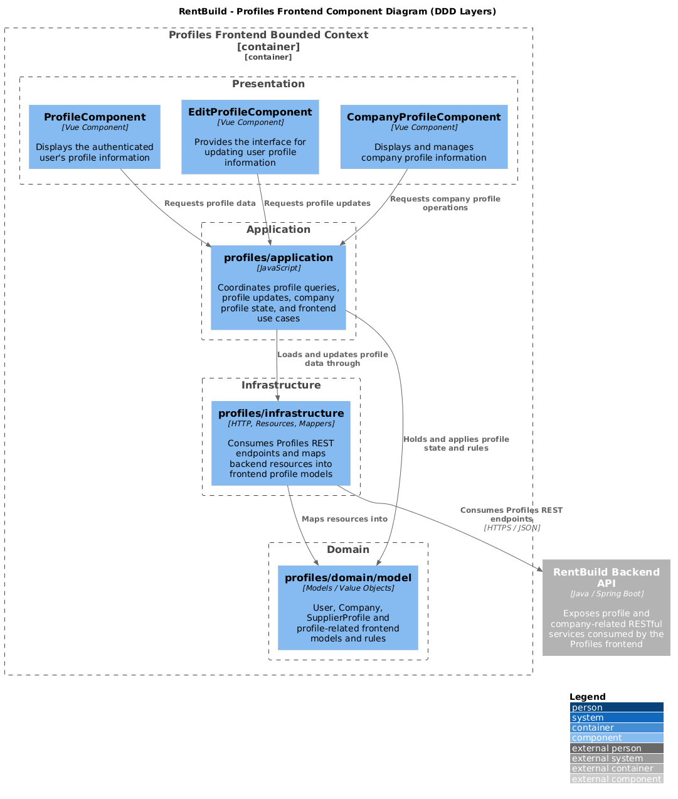

#### Inventory Frontend Components Diagram

El bounded context Inventory del frontend administra el catálogo de maquinaria, los detalles de los equipos, sus categorías, tarifas, estado operativo y disponibilidad.

Su Application Layer coordina los flujos relacionados con la gestión y consulta del inventario, comunicándose con las capas Domain e Infrastructure. Inventory también proporciona información sobre maquinaria y disponibilidad requerida por Rentals y coordina con Maintenance los cambios relacionados con el estado de los equipos.

  

#### Inventory Frontend Detailed Component Diagram

El Inventory Frontend Detailed Component Diagram presenta una vista más completa de la organización interna del bounded context Inventory, integrando las capas Presentation, Application, Domain e Infrastructure y mostrando las relaciones entre sus componentes.

La Presentation Layer está conformada por `EquipmentListComponent`, `EquipmentDetailComponent`, `EquipmentFormComponent`, `EquipmentSearchComponent`, `EquipmentFilterComponent` y `AvailabilityBadgeComponent`. Estos componentes soportan las principales interacciones relacionadas con consulta, detalle, registro, edición, búsqueda, filtrado y visualización de disponibilidad de maquinaria.

La Application Layer coordina los casos de uso y el estado asociado con la gestión del inventario. La Domain Layer concentra los modelos y reglas relacionados con equipos, categorías, tarifas, disponibilidad y estado operativo. Por su parte, la Infrastructure Layer permite consumir los servicios REST expuestos por la RentBuild Backend API y transformar los recursos recibidos en modelos utilizados por el frontend.

Este nivel de detalle permite observar cómo los componentes de presentación delegan las operaciones a la capa de aplicación, cómo esta coordina el acceso al dominio y a la infraestructura, y cómo la infraestructura establece la comunicación con los servicios backend correspondientes al contexto Inventory.

  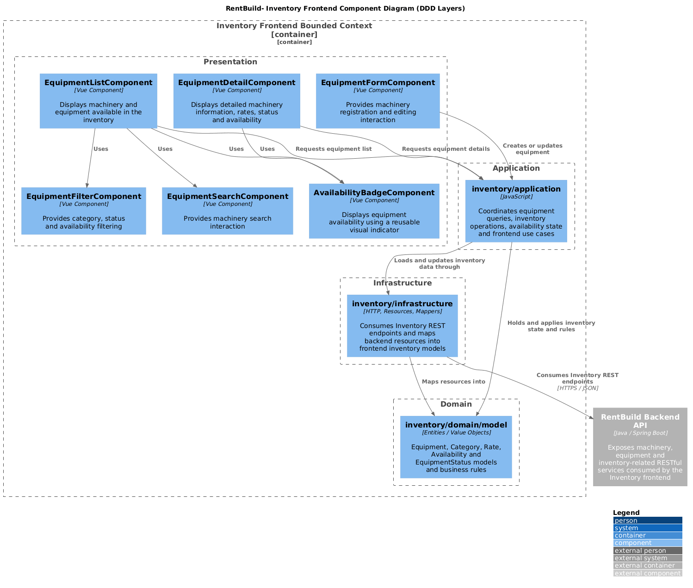

#### Rentals Frontend Components Diagram

El bounded context Rentals del frontend soporta la interacción correspondiente al ciclo de alquiler, incluyendo solicitudes de alquiler, reservas, entregas, alquileres activos y devoluciones.

Este contexto utiliza la información de los equipos y su disponibilidad proporcionada por Inventory, así como la información de empresas y participantes administrada por Profiles. Su Infrastructure Layer se encarga de la comunicación con los endpoints de Rentals expuestos por el backend.

  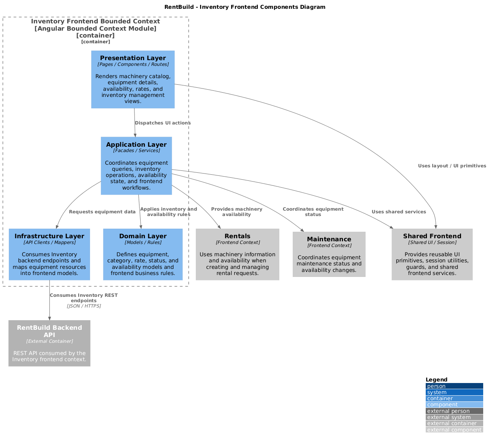

#### Rentals Frontend Detailed Component Diagram

El Rentals Frontend Detailed Component Diagram presenta una vista más completa de la organización interna del bounded context Rentals, integrando las capas Presentation, Application, Domain e Infrastructure y mostrando las relaciones entre sus componentes.

La Presentation Layer está conformada por `RentalRequestsComponent`, `RentalRequestDetailComponent`, `ReservationsComponent`, `ActiveRentalsComponent`, `DeliveryFormComponent` y `ReturnFormComponent`. Estos componentes soportan las principales interacciones relacionadas con solicitudes de alquiler, consulta de detalles, reservas, alquileres activos, entregas y devoluciones de maquinaria.

La Application Layer coordina los casos de uso y el estado asociados con el ciclo de alquiler. La Domain Layer concentra los modelos y reglas relacionados con solicitudes de alquiler, reservas, contratos de alquiler, entregas y devoluciones. Por su parte, la Infrastructure Layer permite consumir los servicios REST expuestos por la RentBuild Backend API y transformar los recursos recibidos en modelos utilizados por el frontend.

Este nivel de detalle permite observar cómo los componentes de presentación delegan las operaciones a la capa de aplicación, cómo esta coordina el acceso al dominio y a la infraestructura, y cómo la infraestructura establece la comunicación con los servicios backend correspondientes al contexto Rentals.

  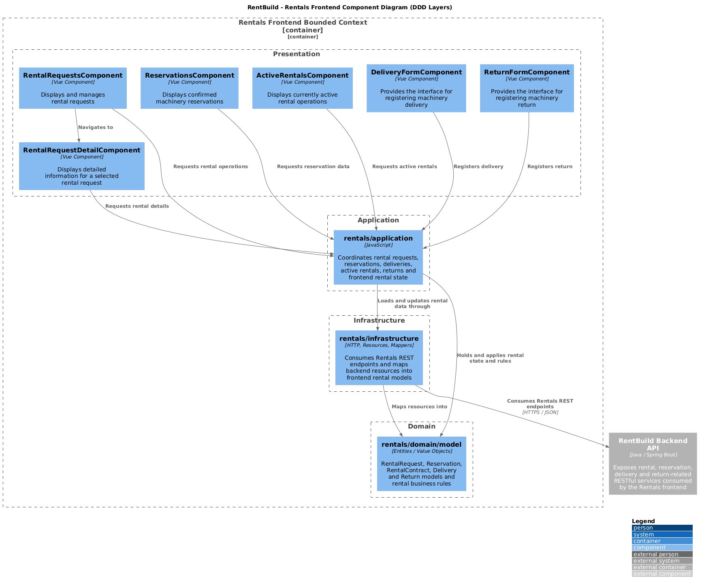

#### Maintenance Frontend Components Diagram

El bounded context Maintenance del frontend administra las programaciones de mantenimiento, inspecciones, incidencias, registros de mantenimiento e historial de mantenimiento de la maquinaria.

Este contexto colabora con Inventory para reflejar cambios en el estado y disponibilidad de los equipos, y con Rentals cuando una incidencia o actividad de mantenimiento afecta a una maquinaria asociada con un alquiler activo.

  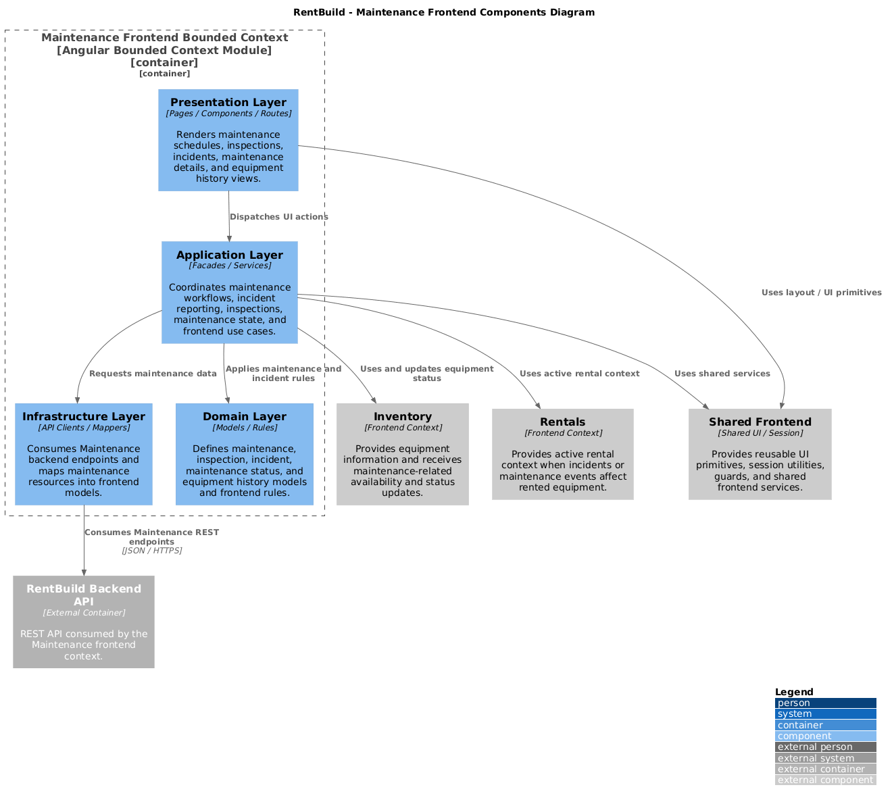

#### Maintenance Frontend Detailed Component Diagram

El Maintenance Frontend Detailed Component Diagram presenta una vista más completa de la organización interna del bounded context Maintenance, integrando las capas Presentation, Application, Domain e Infrastructure y mostrando las relaciones entre sus componentes.

La Presentation Layer está conformada por `MaintenanceListComponent`, `MaintenanceDetailComponent`, `IncidentFormComponent` e `InspectionComponent`. Estos componentes soportan las principales interacciones relacionadas con la consulta de mantenimientos, visualización de detalles, registro de incidencias y gestión de inspecciones de maquinaria.

La Application Layer coordina los casos de uso y el estado asociados con las operaciones de mantenimiento. La Domain Layer concentra los modelos y reglas relacionados con mantenimientos, inspecciones, incidencias, estados de mantenimiento e historial de los equipos. Por su parte, la Infrastructure Layer permite consumir los servicios REST expuestos por la RentBuild Backend API y transformar los recursos recibidos en modelos utilizados por el frontend.

Este nivel de detalle permite observar cómo los componentes de presentación delegan las operaciones a la capa de aplicación, cómo esta coordina el acceso al dominio y a la infraestructura, y cómo la infraestructura establece la comunicación con los servicios backend correspondientes al contexto Maintenance.

  

#### Subscriptions Frontend Components Diagram

El bounded context Subscriptions del frontend administra los planes disponibles, la suscripción actual, el estado de la suscripción y los flujos relacionados con la gestión o cambio de plan.

Este contexto utiliza IAM para identificar la cuenta autenticada y Profiles para obtener la información de la empresa asociada con la suscripción. Su Infrastructure Layer se comunica con los servicios correspondientes de Subscriptions disponibles en el backend.

  

#### Subscriptions Frontend Detailed Component Diagram

El Subscriptions Frontend Detailed Component Diagram presenta una vista más completa de la organización interna del bounded context Subscriptions, integrando las capas Presentation, Application, Domain e Infrastructure y mostrando las relaciones entre sus componentes.

La Presentation Layer está conformada por `PlansComponent`, `CurrentSubscriptionComponent` y `ChangePlanComponent`. Estos componentes soportan las principales interacciones relacionadas con la consulta de planes disponibles, visualización de la suscripción actual y modificación del plan contratado.

La Application Layer coordina los casos de uso y el estado asociados con la gestión de suscripciones. La Domain Layer concentra los modelos y reglas relacionados con suscripciones, planes, períodos de facturación y estados de suscripción. Por su parte, la Infrastructure Layer permite consumir los servicios REST expuestos por la RentBuild Backend API y transformar los recursos recibidos en modelos utilizados por el frontend.

Este nivel de detalle permite observar cómo los componentes de presentación delegan las operaciones a la capa de aplicación, cómo esta coordina el acceso al dominio y a la infraestructura, y cómo la infraestructura establece la comunicación con los servicios backend correspondientes al contexto Subscriptions.

  

#### Shared Frontend Components Diagram

El Shared Frontend concentra capacidades transversales y reutilizables utilizadas por los diferentes bounded contexts de la Single Page Application de RentBuild.

La Presentation Layer contiene componentes comunes de interfaz como `LayoutComponent`, `NavigationComponent`, `LanguageSwitcherComponent` y `FooterComponent`. Estos elementos proporcionan la estructura visual compartida, la navegación principal, el cambio de idioma y contenido reutilizable entre las diferentes vistas de la aplicación.

La Domain Layer contiene value objects reutilizables que no pertenecen exclusivamente a un bounded context, como `Money` y `DateRange`, permitiendo representar valores comunes mediante objetos autovalidados.

Por su parte, la Infrastructure Layer proporciona mecanismos técnicos compartidos. `ApiClient` centraliza capacidades comunes para la comunicación HTTP con la RentBuild REST API, `AuthInterceptor` incorpora la información de autenticación requerida en las solicitudes salientes y `LocalStorageService` proporciona acceso reutilizable al almacenamiento local del navegador.

De esta manera, Shared Frontend evita duplicar capacidades técnicas y visuales comunes dentro de los bounded contexts y mantiene dichas responsabilidades separadas de los conceptos específicos del dominio.

  

#### Backend General Components Diagram

El Backend General Components Diagram presenta la organización general de la RentBuild API Application implementada con C# y ASP.NET Core.

El contenedor backend está organizado alrededor de seis bounded contexts de negocio: IAM, Profiles, Inventory, Rentals, Maintenance y Subscriptions. Adicionalmente, un componente Shared proporciona capacidades técnicas y transversales reutilizables por los diferentes contextos del backend.

La Single Page Application desarrollada con Vue aparece fuera del límite del backend debido a que actúa como cliente de los servicios REST expuestos por la aplicación. De igual manera, la base de datos MySQL se representa fuera del límite de componentes del backend como el contenedor encargado de la persistencia de la información.

  

#### IAM Backend Component Diagram

El bounded context IAM del backend administra la autenticación, autorización, credenciales, usuarios, roles y control de acceso.

La Interfaces Layer expone los endpoints REST relacionados con autenticación, registro y administración de cuentas. La Application Layer coordina los casos de uso correspondientes y delega las decisiones de negocio a la Domain Layer. Por su parte, la Infrastructure Layer proporciona los mecanismos de persistencia y adaptadores técnicos necesarios.

Las capacidades relacionadas con seguridad son proporcionadas mediante mecanismos como ASP.NET Core Identity, codificación de contraseñas y autenticación basada en tokens JWT. Además, este contexto puede comunicarse con el servicio externo de correo transaccional para soportar operaciones como recuperación de contraseña y notificaciones relacionadas con la cuenta.

  

#### Profiles Backend Component Diagram

El bounded context Profiles del backend administra la información correspondiente a usuarios, empresas, proveedores y clientes.

La Interfaces Layer expone los endpoints REST relacionados con perfiles. La Application Layer coordina operaciones de registro, actualización de perfiles, gestión de información empresarial y consultas.

La Domain Layer contiene los conceptos y reglas de negocio relacionados con los perfiles, mientras que la Infrastructure Layer proporciona las implementaciones de repositorios y mecanismos de persistencia. Profiles también colabora con IAM para identificar la cuenta autenticada asociada con cada perfil.

  

#### Inventory Backend Component Diagram

El bounded context Inventory del backend administra la maquinaria, categorías, tarifas, estado operativo y disponibilidad.

La Interfaces Layer expone los endpoints REST correspondientes a la gestión del inventario. La Application Layer coordina el registro y actualización de maquinaria, consultas de disponibilidad, gestión de tarifas y demás operaciones relacionadas con el inventario.

La Domain Layer contiene los conceptos y reglas de negocio asociados con los equipos, mientras que la Infrastructure Layer proporciona las implementaciones de persistencia mediante Entity Framework Core.

Rentals utiliza Inventory para validar la disponibilidad de la maquinaria, mientras que Maintenance interactúa con este contexto cuando las actividades de mantenimiento modifican el estado operativo o la disponibilidad de los equipos.

  

#### Rentals Backend Component Diagram

El bounded context Rentals del backend administra el ciclo completo de alquiler, incluyendo solicitudes, reservas, contratos, entregas, alquileres activos y devoluciones.

La Interfaces Layer expone las operaciones REST requeridas por el frontend. La Application Layer coordina los diferentes flujos del alquiler, mientras que la Domain Layer contiene los agregados, entidades, value objects y reglas de negocio correspondientes.

La Infrastructure Layer proporciona las implementaciones necesarias para la persistencia. Rentals colabora con Inventory para verificar la disponibilidad de la maquinaria y con Profiles para obtener la información de las empresas y participantes involucrados en las operaciones de alquiler.

  

#### Maintenance Backend Component Diagram

El bounded context Maintenance del backend administra las programaciones de mantenimiento, inspecciones, incidencias, registros de mantenimiento e historial de mantenimiento de la maquinaria.

La Interfaces Layer expone los endpoints REST relacionados con estas operaciones. La Application Layer coordina los casos de uso asociados con programación de mantenimiento, inspecciones, registro de incidencias y actualización de mantenimientos.

La Domain Layer contiene los conceptos y reglas de negocio relacionados con el mantenimiento, mientras que la Infrastructure Layer proporciona las implementaciones de repositorios y mecanismos de persistencia.

Maintenance colabora con Inventory para actualizar el estado y disponibilidad de la maquinaria y con Rentals cuando una actividad de mantenimiento o incidencia afecta a un equipo asociado con un alquiler activo.

  

#### Subscriptions Backend Component Diagram

El bounded context Subscriptions del backend administra los planes de suscripción, suscripciones activas, cambios de plan, estado de facturación y operaciones relacionadas con pagos.

La Interfaces Layer expone los endpoints REST necesarios para la gestión de suscripciones. La Application Layer coordina la selección de planes, activación de suscripciones, cambios de plan, estado de facturación y operaciones relacionadas con pagos.

La Domain Layer contiene los conceptos y reglas de negocio correspondientes a las suscripciones, mientras que la Infrastructure Layer proporciona los mecanismos de persistencia necesarios.

Este bounded context utiliza IAM para identificar la cuenta autenticada y Profiles para asociar la suscripción con la información de la empresa. Asimismo, un Payment Connector integra el contexto con Stripe para realizar el procesamiento de los pagos correspondientes a las suscripciones.

  

## 4.7. Software Object-Oriented Design

El diseño orientado a objetos detalla la implementación de cada bounded context identificado en la arquitectura. Cada diagrama sigue la misma estructura: entidades del dominio con sus atributos y comportamiento, value objects para conceptos sin identidad propia (periodos, tarifas, direcciones), enumeraciones para los estados del Ubiquitous Language, un repositorio por agregado y un servicio de aplicación que orquesta los casos de uso de las User Stories. Los nombres están en inglés según la convención de nomenclatura del proyecto y los tipos corresponden a C#, el lenguaje de los Web Services; las etiquetas de las relaciones van en español para facilitar la lectura.

### 4.7.1. Class Diagrams

#### Backend  Class Diagram


El diagrama general de clases del backend encapsula los Agregados principales (Aggregate Roots) de cada Bounded Context y define las fronteras de dominio. A fin de mantener el desacoplamiento dictado por la arquitectura DDD, la comunicación entre contextos se realiza estrictamente a través de referencias por identificadores primitivos (userId, equipmentId, planId, contractId), garantizando que cada contexto mantenga su persistencia y sus reglas de negocio aisladas.

#### Inventory

Equipment es el agregado principal: pertenece a una EquipmentCategory, compone una RentalRate (tarifa diaria y semanal) y mantiene su EquipmentStatus (disponible, alquilado, en mantenimiento). Los AvailabilityBlock con su DateRange permiten responder isAvailableFor(period) sin superposiciones, que es la regla que evita las dobles reservas descritas en la problemática. InventoryApplicationService cubre el registro, la actualización, la búsqueda para constructoras y el cambio de estado de la maquinaria.

#### Rentals


RentalRequest modela la reservación: nace en estado PENDING y, al aceptarse, genera un RentalContract. El contrato compone un DateRange y registra una Delivery y un EquipmentReturn. EquipmentReturn.requiresMaintenance() es el punto de integración donde una devolución reportada con daño dispara el flujo dentro del contexto Maintenance. RentalApplicationService orquesta el ciclo completo de alquiler mediante los cuatro repositorios de infraestructura.

#### Maintenance

MaintenanceRecord distingue mantenimientos preventivos y correctivos con su ciclo de estados. Incident registra daños o fallas operativas con su nivel de severidad y puede originar formalmente un MaintenanceRecord. MaintenanceApplicationService orquesta el flujo de atención técnica y actualiza el estado de disponibilidad del equipo en comunicación con el contexto Inventory.

#### Subscription


SubscriptionPlan define los términos de precios, beneficios y ciclo de facturación de la plataforma. UserSubscription vincula una cuenta de usuario con su plan activo mediante el value object DateRange y controla los estados de renovación o cancelación automática. SubscriptionApplicationService se integra con la pasarela externa de pagos para gestionar el flujo comercial de las membresías.

#### IAM


User es la entidad central, con role (empresa de alquiler o constructora) y status. Credentials es un value object que encapsula la validación de correo y contraseña, y SessionToken representa el token de acceso vigente. AuthenticationService orquesta el registro, el inicio y el cierre de sesión a través de UserRepository.

#### Profiles

CompanyProfile guarda los datos de la empresa y compone un value object Address con coordenadas geográficas, que alimenta la integración con mapas. ProviderProfile extiende el perfil de una empresa de alquiler con su reputación pública —alquileres completados y tasa de cumplimiento—, respondiendo al término "Perfil de Proveedor" del Ubiquitous Language.

## 4.8. Database Design

El modelo de datos traduce las entidades de cada bounded context a tablas relacionales, conservando la separación por contexto: cada grupo de tablas pertenece a un único contexto y las referencias entre contextos se resuelven por identificador (equipment_id, company_profile_id, contract_id), nunca por tablas compartidas. Los value objects se aplanan en columnas de la entidad que los contiene (Address dentro de company_profiles, RentalRate dentro de equipments, RentalPeriod como start_date/end_date). Los estados se almacenan como cadenas cortas que corresponden a las enumeraciones del diseño de clases. El DBMS es MySQL, gestionado desde la API mediante Entity Framework Core y sus migraciones. Las columnas marcadas con viñeta (•) o asterisco son obligatorias.
### 4.8.1. Database Diagrams


Relaciones principales:

- users 1—0..1 company_profiles: cada usuario tiene a lo sumo un perfil de empresa; company_profiles 1—0..1 provider_profiles: solo las empresas de alquiler tienen perfil público de proveedor.
- company_profiles 1—N equipments: una empresa de alquiler posee muchos equipos; equipment_categories 1—N equipments.
- equipments 1—N availability_blocks: bloqueos de disponibilidad por periodo.
- rental_requests referencia al equipo, a la constructora y al proveedor; rental_requests 1—0..1 rental_contracts: una solicitud aceptada genera exactamente un contrato.
- rental_contracts 1—0..1 deliveries y 1—0..1 equipment_returns: un contrato tiene una entrega y una devolución.
- equipments 1—N maintenance_records y 1—N incidents; incidents 0..1—0..1 maintenance_records: una incidencia puede originar un mantenimiento correctivo; incidents puede referenciar el contrato durante el cual ocurrió.

Restricciones destacadas: users.email, company_profiles.ruc y equipments.serial_number son únicos; rental_contracts.request_id, deliveries.contract_id y equipment_returns.contract_id son únicos para garantizar la relación uno a uno.

---

# Capítulo V: Product Implementation, Validation & Deployment

## 5.1. Software Configuration Management

### 5.1.1. Software Development Environment Configuration

**Project Management**

Para la administración del proyecto RentBuild se recurrió al uso de herramientas de comunicación, planificación y control de versiones. Se creó una organización en GitHub para centralizar la gestión del código fuente y su versionado. En cuanto a la planificación y asignación de tareas del equipo, se utilizó Trello mediante tableros personalizados para cada Sprint. Para la comunicación interna y coordinación de reuniones, se utilizó WhatsApp.

- Organización del trabajo: GitHub
- Planificación y asignación de tareas: Trello
- Comunicación: WhatsApp

Enlaces:

- GitHub: https://github.com/
- Trello: https://trello.com/
- WhatsApp: https://www.whatsapp.com/

**Requirement Management**

Para esta fase, el equipo utilizó Trello como herramienta visual para gestionar y priorizar los requisitos y tareas del proyecto mediante tableros organizados por Sprint. Se utilizó UXPressia para desarrollar los User Personas, Empathy Maps, Journey Maps e Impact Maps correspondientes a los dos segmentos objetivo de RentBuild: empresas de alquiler de maquinaria y pequeñas empresas constructoras.

Enlaces:

- Trello: https://trello.com/
- UXPressia: https://uxpressia.com/

**Product UX/UI Design**

En el diseño de la experiencia e interfaz de usuario, el equipo utilizó Figma para la creación de Wireframes, Mock-ups y Prototipos interactivos del Landing Page y de la Web Application, lo que permitió validar la propuesta visual y de interacción antes de la implementación.

Enlaces:

- Figma: https://www.figma.com/

**Software Development**

Para el desarrollo de la primera versión del Landing Page de RentBuild se utilizaron los lenguajes HTML, CSS y JavaScript en Visual Studio Code.

Enlaces:

- Visual Studio Code: https://code.visualstudio.com/

**Software Documentation**

Para el control de versiones y la colaboración en el desarrollo del informe, se utilizó GitHub siguiendo la estrategia de trabajo GitFlow, mediante el uso de ramas específicas para cada funcionalidad o corrección, lo que facilitó el trabajo colaborativo del equipo. Todo el contenido del proyecto fue centralizado en un repositorio dentro de una organización creada en GitHub. Para la documentación técnica se optó por archivos en formato Markdown, debido a su simplicidad, legibilidad y compatibilidad con GitHub.

Enlaces:

- GitHub: https://github.com/upc-pre-202620-1asi0730-8093-dataflux/dataflux-project-report

**Software Deployment**

Para el despliegue de la primera versión del Landing Page de RentBuild se utilizó Vercel.

Enlaces:

- Vercel: https://dataflux-landing-page.vercel.app/

### 5.1.2. Source Code Management

Para el control de versiones del código fuente de RentBuild, el equipo utiliza Git como sistema de versionado, gestionado a través de GitHub como plataforma de alojamiento. Se ha creado una organización pública en GitHub que centraliza los repositorios correspondientes a cada producto de la solución. Para esta primera entrega (AV1), el repositorio activo corresponde al Landing Page; los repositorios de Web Services (RESTful API) y Frontend Web Applications se incorporarán en las siguientes entregas conforme avance el desarrollo del proyecto.

**Repositorio del proyecto (AV1):**

| Producto | Repositorio |
| :--- | :--- |
| Informe del Proyecto | upc-pre-202620-1asi0730-8093-dataflux/dataflux-landing-page |
| Landing Page | https://dataflux-landing-page.vercel.app/ |

**Workflow de control de versiones: GitFlow**

El equipo aplica GitFlow como estrategia de ramificación, complementando la rama principal (`main`) y la rama de desarrollo (`develop`) con ramas específicas según el tipo de trabajo:

- **Feature branches**: se crean a partir de `develop` para el desarrollo de nuevas funcionalidades. Convención de nombres: `feature/nombre-de-la-funcionalidad` (ej. `feature/landing-hero-section`, `feature/landing-footer`).
- **Release branches**: se crean a partir de `develop` cuando el conjunto de features está listo para una nueva versión. Convención de nombres: `release/vX.Y.Z` (ej. `release/v1.0.0`).
- **Hotfix branches**: se crean a partir de `main` para corregir errores críticos detectados en producción. Convención de nombres: `hotfix/nombre-del-fix` (ej. `hotfix/fix-broken-navbar-link`).

**Semantic Versioning**

Las versiones (Releases) del Landing Page se nombran siguiendo Semantic Versioning 2.0.0, bajo el formato `MAJOR.MINOR.PATCH`:

- **MAJOR**: cambios incompatibles con versiones anteriores.
- **MINOR**: nuevas funcionalidades compatibles con versiones anteriores.
- **PATCH**: correcciones de errores compatibles con versiones anteriores.

Ejemplo: la primera versión desplegada del Landing Page se etiqueta como `v1.0.0`.

**Conventional Commits**

Todos los mensajes de commit siguen la convención de Conventional Commits, con el formato `tipo: descripción breve`, utilizando prefijos como:

- `feat`: para nuevas funcionalidades (ej. `feat: add landing page hero section`)
- `fix`: para corrección de errores (ej. `fix: correct broken footer link`)
- `docs`: para cambios en documentación (ej. `docs: update README with setup instructions`)
- `style`: para cambios de formato que no afectan la lógica
- `refactor`: para reestructuración de código sin cambiar su comportamiento

Esta convención permite mantener un historial de cambios claro y trazable para todo el equipo, incluso en esta etapa inicial del proyecto.

### 5.1.3. Source Code Style Guide & Conventions

El equipo adoptará nomenclatura en inglés para todas las variables, funciones, clases y archivos del proyecto, con el objetivo de mantener flexibilidad, escalabilidad y coherencia en el desarrollo de RentBuild.

**HTML / CSS**

Se sigue el Google HTML/CSS Style Guide. Las clases CSS estarán en `kebab-case`. Se utilizarán etiquetas semánticas e identificadores claros y descriptivos para accesibilidad y mantenimiento. Se usaron diferentes etiquetas para conformar la estructura del Landing Page del producto:

- `header`: Define todo el contenido introductorio de la página, incluyendo el logo de RentBuild y el menú de navegación principal.
- `nav`: Define la sección de la página dedicada a la navegación.
- `main`: Define el contenido principal de la página, agrupando las secciones informativas del Landing Page.
- `section`: Delimita cada bloque temático de la página.
- `div`: Permite la separación de diferentes objetos dentro de la página, lo que nos permitió aplicar hojas de estilo específicas para cada parte de los componentes visuales.
- `img`: Permite la inserción de imágenes en la página web. Todas las imágenes incluyen el atributo `alt` como parte de las prácticas de Accessibility (a11y).
- `ul` / `li`: La etiqueta `ul` define una lista desordenada, usada principalmente para el menú de navegación y la lista de beneficios de la plataforma; `li` define cada elemento dentro de dichas listas.
- `a`: Se usó para definir hipervínculos que trasladan a los usuarios entre las diferentes secciones de la página, así como los Call-to-Action que redirigen al registro/login en la Web Application.
- `p`: Define los párrafos de texto, separándolos del resto del contenido.
- `button`: Declara un botón interactivo que permite al usuario realizar una acción específica.
- `footer`: Define el contenido final de la página, incluyendo enlaces a Términos y Condiciones, Privacy Policy y datos de contacto.
- `h1` - `h4`: Definen los diferentes títulos y subtítulos de la página, siendo `h1` el mayor nivel y `h4` el más bajo.

**JavaScript**

Se sigue el Google JavaScript Style Guide y las MDN JavaScript guidelines. Se utiliza `camelCase` para variables y funciones, `const` y `let` en lugar de `var`, y punto y coma obligatorio al final de cada sentencia. Los nombres de archivo siguen `kebab-case`.

### 5.1.4. Software Deployment Configuration

Para el despliegue del Landing Page de RentBuild se utilizó Vercel, importando el repositorio `dataflux-landing-page` de la organización de GitHub del equipo desde la rama `main`. La configuración del proyecto utiliza el preset de aplicación Vite y el directorio raíz `./`.


Una vez importado el proyecto, Vercel genera el Production Deployment, el cual queda en estado *Ready* y accesible públicamente en el dominio `dataflux-landing-page.vercel.app`. El despliegue toma como fuente la rama `main`, por lo que cada actualización de esta rama se refleja en producción.


## 5.2. Landing Page, Services & Applications Implementation

### 5.2.1. Sprint 1

#### 5.2.1.1. Sprint Planning 1

| | |
| :--- | :--- |
| **Sprint #** | Sprint 1 |
| **Sprint Planning Background** | |
| Date | 2026-09-17 |
| Time | 10:00 PM |
| Location | Vía Discord |
| Prepared By | Luis Angel Cisneros Salas |
| Attendees | Cisneros Salas, Luis Angel Viza Quispe, Marlon Packard Manosalva Tovar, Miroslav Oscar Montalvo Vásquez, Bruno Rodrigo Vargas Manchinelli, Deiby Juan |
| Sprint 1 Review Summary | Durante el Sprint 1, el equipo completó exitosamente el desarrollo de la primera versión del Landing Page de RentBuild utilizando HTML, CSS y JavaScript, tomando como base los Wireframes y Mock-ups diseñados previamente en Figma. Asimismo, se avanzó con las pantallas iniciales de la Web Application correspondientes a la gestión de usuarios (Registro, Login, Perfil), gestión de maquinaria (Inventario, Registro, Detalle, Estado/Disponibilidad), solicitudes de alquiler (Bandeja de solicitudes, Mis solicitudes, Alquileres activos), mantenimiento e incidencias (Registro, Historial), y el Catálogo/búsqueda de maquinaria. El Landing Page se desplegó en un entorno de producción mediante Vercel, permitiendo su acceso público, y todas las tareas planificadas en el Sprint Backlog fueron completadas dentro del tiempo estimado. |
| Sprint 1 Retrospective Summary | En esta sección tuvimos varios aciertos, ya que la división de tareas entre diseño (Figma), desarrollo del Landing Page (HTML/CSS/JS) y desarrollo de las pantallas de la Web Application permitió avanzar en paralelo sin bloqueos. Sin embargo, nos quedamos con dos pendientes específicos: la definición temprana de la herramienta de despliegue y la integración de la lógica de negocio en algunas pantallas de la Web Application, lo cual puso a prueba nuestra capacidad de resolución de problemas sobre la marcha. |
| **Sprint Goal & User Stories** | |
| Sprint 1 Goal | Desarrollar e implementar la primera versión funcional del Landing Page de RentBuild, incluyendo su estructura y diseño visual basado en los prototipos definidos en Figma, así como las pantallas iniciales de la Web Application correspondientes a la gestión de usuarios, maquinaria, solicitudes de alquiler, mantenimiento/incidencias y catálogo de búsqueda, asegurando su despliegue en un entorno de producción accesible públicamente. |
| Sprint 1 Velocity | 59 |
| Sum of Story Points | 59 story points |

#### 5.2.1.2. Aspect Leaders and Collaborators

En esta sección se presenta el Leadership-and-Collaboration Matrix (LACX) elaborado por el equipo para el Sprint 1, el cual identifica al líder y a los colaboradores responsables de cada aspecto dentro del alcance definido para este sprint.

| Team Member (Last, First) | GitHub Username | Diseño visual y maquetación (Landing Page) | Desarrollo Web Application | Despliegue (Vercel) |
| :--- | :--- | :---: | :---: | :---: |
| Cisneros Salas, Luis Angel | LuisCS03 | C | L | C |
| Viza Quispe, Marlon Packard | V8Z5 | L | C | C |
| Manosalva Tovar, Miroslav Oscar | Miroa123 | C | C | L |
| Montalvo Vásquez, Bruno Rodrigo | TartaroZ | C | C | C |
| Vargas Manchinelli, Deiby Juan | poluxbinPe | C | C | C |

#### 5.2.1.3. Sprint Backlog 1

El propósito central de este Sprint fue construir la primera versión del Landing Page de RentBuild y avanzar en paralelo con las pantallas iniciales de la Web Application, cubriendo la gestión de usuarios, maquinaria, solicitudes de alquiler y mantenimiento/incidencias. El trabajo se organizó a partir de las User Stories asociadas a los Epics comprendidos en este Sprint (EP01, EP02, EP03, EP04, EP05 y EP06). Como herramienta de seguimiento y control de tareas, el equipo optó por Trello.


**Trello:** https://trello.com/invite/b/6aacc6b9cc0413f772436a35/ATTI72782e0013e72d3ec63864ccbd335c7099570315/dataflux

| User Story ID | User Story Title | Work-Item ID | Work-Item Title | Description | Assigned To | Status (To do / In Process / To Review / Done) |
| :--- | :--- | :--- | :--- | :--- | :--- | :--- |
| US-01 | Registro | UT-01 | Crear estructura HTML | Maquetar el formulario de registro de usuario | Luis Cisneros | Done |
| US-01 | Registro | UT-02 | Añadir estilos CSS | Aplicar estilos según el diseño de Figma | Luis Cisneros | Done |
| US-01 | Registro | UT-03 | Añadir validaciones JS | Validar campos y mostrar mensaje de confirmación | Luis Cisneros | Done |
| US-02 | Login | UT-04 | Crear estructura HTML | Maquetar formulario de inicio de sesión | Marlon Viza | Done |
| US-02 | Login | UT-05 | Añadir estilos CSS | Aplicar estilos según diseño aprobado | Marlon Viza | Done |
| US-02 | Login | UT-06 | Añadir lógica JS | Validar credenciales y manejo de errores | Marlon Viza | Done |
| US-03 | Perfil de usuario | UT-07 | Crear estructura HTML | Maquetar sección de datos personales | Deiby Vargas | To Do |
| US-03 | Perfil de usuario | UT-08 | Añadir estilos CSS | Aplicar estilos según diseño | Deiby Vargas | To Do |
| US-04 | Registrar nueva maquinaria | UT-09 | Crear formulario de registro | Maquetar campos del equipo (nombre, tipo, estado) | Miroslav Manosalva | Done |
| US-04 | Registrar nueva maquinaria | UT-10 | Añadir validaciones JS | Validar datos ingresados del equipo | Miroslav Manosalva | Done |
| US-05 | Inventario de maquinaria | UT-11 | Crear vista de lista | Maquetar tabla/lista de maquinaria registrada | Bruno Montalvo | Done |
| US-05 | Inventario de maquinaria | UT-12 | Añadir estilos CSS | Aplicar estilos responsivos a la lista | Bruno Montalvo | Done |
| US-07/08 | Detalle + estado/disponibilidad | UT-13 | Crear vista de detalle | Maquetar sección con info, estado y disponibilidad | Luis Cisneros | In Progress |
| US-07/08 | Detalle + estado/disponibilidad | UT-14 | Añadir lógica JS | Mostrar estado dinámico (disponible/reservado/alquilado) | Luis Cisneros | In Progress |
| US-09 | Catálogo/búsqueda | UT-15 | Crear buscador | Maquetar barra de búsqueda y filtros | Marlon Viza | Done |
| US-09 | Catálogo/búsqueda | UT-16 | Añadir lógica JS | Filtrar resultados según criterios | Marlon Viza | Done |
| US-13/14 | Bandeja de solicitudes | UT-17 | Añadir acciones JS | Maquetar lista de solicitudes recibidas | Miroslav Manosalva | In Progress |
| US-15 | Alquileres activos | UT-18 | Crear vista de alquileres | Maquetar lista de equipos alquilados vigentes | Miroslav Manosalva | In Progress |
| US-16 | Mis solicitudes | UT-19 | Crear vista de solo lectura | Maquetar estado de solicitudes del cliente | Bruno Montalvo | To Do |
| US-18/20 | Registrar mantenimiento/incidencia | UT-20 | Crear formulario | Maquetar registro de mantenimiento e incidencias | Deiby Vargas | To Do |
| US-18/20 | Registrar mantenimiento/incidencia | UT-21 | Añadir validaciones JS | Validar tipo y fecha del registro | Luis Cisneros | In Progress |
| US-21 | Historial de maquinaria | UT-22 | Crear vista de historial | Maquetar historial de alquileres/incidencias/mantenimientos | Luis Cisneros | In Progress |
| US-21 | Historial de maquinaria | UT-23 | Añadir estilos CSS | Aplicar estilos a la línea de tiempo del historial | Marlon Viza | Done |

#### 5.2.1.4. Development Evidence for Sprint Review

En este primer Sprint, el equipo desarrolló tanto la primera versión del Landing Page como las pantallas iniciales de la Web Application, distribuyendo las tareas según lo definido en el Sprint Backlog. Cada integrante contribuyó con distintas funcionalidades a lo largo del sprint. A continuación, se presenta la tabla con los commits realizados durante este periodo.

| Repository | Branch | Commit Id | Commit Message | Commit Message Body | Commited on (Date) |
| :--- | :--- | :--- | :--- | :--- | :--- |
| RentBuild/Landing-Page | feature/app-features | a4682cd | feat(team): add profile photos for Bruno, Deiby and Miroslav | add profile photos for Bruno, Deiby and Miroslav | 18/09/2026 |
| RentBuild/Landing-Page | feature/app-features | bd3e866 | feat(catalog): add machinery search and filter screen | add machinery search and filter screen | 16/09/2026 |
| RentBuild/Landing-Page | feature/app-features | 8649b7c | feat(inventory): add machinery history screen | add machinery history screen | 16/09/2026 |
| RentBuild/Landing-Page | feature/app-features | c220f22 | feat(maintenance): add register maintenance and incident form | add register maintenance and incident form | 16/09/2026 |
| RentBuild/Landing-Page | feature/app-features | 18b2785 | feat(rentals): add active rentals screen | add active rentals screen | 16/09/2026 |
| RentBuild/Landing-Page | feature/app-features | a0b3479 | feat(requests): add my rental requests screen for construction companies | add my rental requests screen for construction companies | 16/09/2026 |
| RentBuild/Landing-Page | feature/app-features | eb60cf5 | feat(inventory): add machinery detail screen with status and availability | add machinery detail screen with status and availability | 16/09/2026 |
| RentBuild/Landing-Page | feature/app-features | 0a4dc7d | feat(inventory): add register new machinery form | add register new machinery form | 16/09/2026 |
| RentBuild/Landing-Page | feature/app-features | fe84942 | feat(inventory): display machinery list with status and availability | display machinery list with status and availability | 16/09/2026 |
| RentBuild/Landing-Page | feature/app-features | 4c44274 | feat(profile): add user profile screen | add user profile screen | 16/09/2026 |
| RentBuild/Landing-Page | feature/app-features | 8c6ff60 | feat(dashboard): implement user home screen | implement user home screen | 16/09/2026 |
| RentBuild/Landing-Page | feature/app-features | 17e01c2 | feat(auth): implement user registration form | implement user registration form | 16/09/2026 |
| RentBuild/Landing-Page | feature/app-features | 8a81a87 | feat(auth): add login modal for RentBuild | add login modal for RentBuild | 16/09/2026 |
| RentBuild/Landing-Page | feature/app-features | dcb16bb | feat(team): add profile photo for Luis Angel Cisneros Salas | add profile photo for Luis Angel Cisneros Salas | 16/09/2026 |

#### 5.2.1.5. Execution Evidence for Sprint Review

Como equipo, lo que logramos en este primer Sprint fue la exitosa implementación de nuestra Landing Page y su posterior despliegue gracias a la herramienta GitHub Pages. A continuación, presentaremos lo logrado a través de imágenes mostrando las principales vistas.

**Landing Page**

Sección principal (Hero):


Sección "Todo el ciclo de alquiler, conectado":


Sección "Funciones para gestionar mejor tus equipos":


Sección "Mayor control sobre cada alquiler":


Sección "Funciones RentBuild":


Sección "Nuestro equipo":


Sección "RentBuild: Simplificando el alquiler y la gestión de equipos":


Sección "Planes que crecen con tu negocio":


Sección "Contáctanos":


**Web Application**

Inicio de sesión:


Registro de cuenta:


Perfil de usuario:


Inventario de maquinaria:


Registro de nueva maquinaria:


Mis solicitudes de alquiler:


Alquileres activos:


Registro de mantenimiento o incidencia:


Historial de maquinaria:


Catálogo de maquinaria:


#### 5.2.1.6. Services Documentation Evidence for Sprint Review

Dado que el alcance del Sprint 1 se centró en el desarrollo de la primera versión del Landing Page, no se contempló en este sprint la implementación de Web Services. Por consiguiente, no se cuenta aún con endpoints documentados. La documentación de servicios mediante OpenAPI Specification se incorporará a partir de los sprints correspondientes al desarrollo del RESTful API.

#### 5.2.1.7. Software Deployment Evidence for Sprint Review

En esta sección se resumen las actividades realizadas por el equipo en relación con el despliegue de RentBuild durante el Sprint 1. Estas actividades incluyeron la creación de cuentas en el proveedor de hosting vercel, la configuración de los recursos necesarios y el despliegue de la primera versión del Landing Page. A continuación, se presentan capturas de pantalla que evidencian los pasos realizados durante este proceso.

**1.** Ingresando a la cuenta le damos click a *Add New* para añadir un proyecto.


**2.** Le damos click en *Project* para generar un proyecto.


**3.** Le damos click en el proyecto que deseamos importar.


**4.** Nos aparecerá el siguiente recuadro para poder hacer el deploy.


**5.** Finalmente ya tenemos nuestra Landing Page desplegada.


#### 5.2.1.8. Team Collaboration Insights during Sprint

En esta sección se explica cómo se desarrollaron las actividades de implementación del Landing Page durante el Sprint 1, evidenciando la participación colaborativa de todos los integrantes del equipo. A continuación, se presentan capturas de los analíticos de colaboración y commits en GitHub correspondientes al repositorio del proyecto, en los que se refleja el aporte individual de cada miembro del equipo.

# Conclusiones

## Conclusiones y recomendaciones

**Problema y segmentos.** El análisis del sector (Clements, 2025, indica que el 67 % de las empresas de alquiler opera con sistemas parcialmente integrados que requieren transferencia manual de información) y el User Task Matrix apuntan en la misma dirección. En ambos segmentos, las tareas de mayor frecuencia e importancia son verificar la disponibilidad de los equipos y dar seguimiento a las fechas de devolución. Ambos dependen además del teléfono y de WhatsApp. Esto respalda el Problem Statement y la necesidad de una solución digital centralizada.

1. **Diferenciación.** El análisis competitivo frente a Booqable, Rentman y Odoo Rental mostró un espacio para una plataforma más especializada y simple. RentBuild se enfoca en maquinaria para construcción y en el ciclo completo (reserva, alquiler, entrega, devolución, inspección y mantenimiento), sin la complejidad de plataformas de mayor escala.
2. **Producto del Sprint 1.** El equipo alcanzó el Sprint Goal. Se desarrolló la primera versión del Landing Page con HTML, CSS y JavaScript, a partir de los wireframes y mock-ups de Figma, y se desplegó en Vercel con acceso público. También se implementaron las pantallas iniciales de la Web Application: usuarios (registro, login y perfil), inventario de maquinaria, catálogo y búsqueda, solicitudes de alquiler y mantenimiento e incidencias. Las 23 tareas planificadas del Sprint Backlog se completaron dentro del sprint, con los 59 story points comprometidos, lo que cumple el alcance planificado para esta entrega.
3. **Trabajo en equipo y liderazgo compartido.** El equipo estableció una meta común mediante el Sprint Goal y planificó las tareas con responsables por aspecto en la matriz LACX, donde el liderazgo se repartió entre los integrantes (diseño y maquetación, desarrollo de la Web Application y despliegue). Esta división permitió avanzar en paralelo sin bloqueos. Las ramas de GitFlow, los Conventional Commits y el tablero de Trello dieron trazabilidad al trabajo y permiten que cualquier integrante continúe las tareas de otro.
4. **Mejora continua.** En la retrospectiva el equipo identificó una oportunidad de mejora: la herramienta de despliegue debió definirse antes. La integración de la lógica de negocio en algunas pantallas fue el mayor reto del sprint y se resolvió sobre la marcha. Estos aprendizajes, junto con la retroalimentación del docente, se incorporarán en las siguientes versiones de los artefactos.

**Recomendaciones**

1. Para TB1, desplegar la primera versión de la Web Application e iniciar el RESTful API con ASP.NET Core y su documentación en OpenAPI, como pide el enunciado.
2. Organizar el RESTful API por los Bounded Contexts del Design-Level EventStorming y aplicar los principios de RESTful en las URLs y los verbos HTTP.
3. Incluir pruebas unitarias y de integración o aceptación en el repositorio de Web Services.
4. Priorizar en el Sprint 2 las funcionalidades que aún no existen: reservas con verificación de conflictos de disponibilidad, contratos y pagos, y suscripciones con los tres niveles de plan definidos en los assumptions.
5. Implementar alertas de fechas de devolución y un dashboard operativo con disponibilidad, alquileres activos y mantenimientos. Son las tareas de mayor frecuencia e importancia del User Task Matrix.
6. Usar como servicio externo de terceros un canal de notificaciones (WhatsApp o correo electrónico), ya que ambos segmentos dependen de esos medios. Así se cumple el requisito del enunciado con una integración que aporta valor real.
7. Aplicar inglés como idioma por defecto en la interfaz y la documentación, con soporte para es_419 y atributos ARIA. Publicar además los términos y condiciones y la protección de privacidad en el footer del Landing Page y de la Web Application.
8. Verificar que los call-to-action de cada segmento en el Landing Page redirijan a la vista correspondiente de la Web Application, con un estilo visual consistente entre ambos.

# Video About-The-Team

# Bibliografía

Brandolini, A. (2013). *Introducing EventStorming*. Leanpub.

Clements, K. (2025, January 25). *The 2025 state of rental technology report*. Quipli. https://www.quipli.com/resources/2025-state-of-rental-report/

Cohn, M. (2004). *User stories applied: For agile software development*. Addison-Wesley.

Cohn, M. (2005). *Agile estimating and planning*. Prentice Hall.

Cooper, A., Reimann, R., Cronin, D., & Noessel, C. (2014). *About face: The essentials of interaction design* (4th ed.). Wiley.

Evans, E. (2003). *Domain-driven design: Tackling complexity in the heart of software*. Addison-Wesley.

Garrett, J. J. (2011). *The elements of user experience: User-centered design for the web and beyond* (2nd ed.). New Riders.

Gothelf, J., & Seiden, J. (2016). *Lean UX: Designing great products with agile teams* (2nd ed.). O'Reilly Media.

Gray, D., Brown, S., & Macanufo, J. (2010). *Gamestorming: A playbook for innovators, rulebreakers, and changemakers*. O'Reilly Media.

Newman, S. (2021). *Building microservices: Designing fine-grained systems* (2nd ed.). O'Reilly Media.

Ries, E. (2011). *The lean startup: How today's entrepreneurs use continuous innovation to create radically successful businesses*. Crown Business.

Schwaber, K., & Sutherland, J. (2020). *The Scrum guide: The definitive guide to Scrum*. Scrum.org. https://scrumguides.org/

# Anexos

**Web Applications Mock-ups:** https://www.figma.com/design/OIBiedVSqvMmmqYcjx14Ec/Sin-t%C3%ADtulo?node-id=0-1&t=qrleaHn5r7IHGSxf-1

**Lean UX Canvas:** https://www.figma.com/board/OcVqiqyfAERGRZHmmTNKMI/Sin-t%C3%ADtulo?node-id=0-1&t=bgNbwgpxLyQB1bi2-1

**Trello:** https://trello.com/invite/b/6aacc6b9cc0413f772436a35/ATTI72782e0013e72d3ec63864ccbd335c7099570315/dataflux

**Miro:** https://miro.com/welcomeonboard/bXFFSkpkdTBCYnBvUTdtSEJJT242NnpTQ0pTTTA4dWdleTJ2QTN0YmZRcUsrRmR4RjZ2ODBvb0JsdzJMZXVlbjljK1RPWFBpNjBPWHFZSWhhNkQwQ1hNczRUelBUWlJSenZCcml6aERpZG1RTFZ5WDZZUk42cjZPVXQ2RVUyR1ZBS2NFMDFkcUNFSnM0d3FEN050ekl3PT0hdjE=?share_link_id=904943457433

**Web Applications WireFlow:** https://www.figma.com/board/x7IvCSgobEyo1SbH3PRnqg/Rent-Build-WireFlow?t=TBFB1usHt4A4XCnH-1

**Segmento Objetivo 1:** https://app.creately.com/d/QwlCIfA0o0k/edit

**Segmento Objetivo 2:** https://app.creately.com/d/DyKHPyVwNtd/edit

**Class Diagrams:** PlantUML://www.plantuml.com/plantuml/png/XLBThjCm3BxFKqIz0g4ZmHkSewsWNI0X9Xx0IxrYaTZ5SIOnnBj3fgvhrOrpqzhnz_D5yNCsK2ifklo3U025v4E4d5_Cb0x5S1U4ztH6_zwvoyItFmiDudyxxzzHLxyiwQ1Ogm26lIX1RJ0RT58h0wKZR0d6YM9FsHJqpTlQ3kKGAO2sl063ABsCvogzGWBz36p8b0ZPwkpFDSjNpAWd22Gy3tJ4y1rsJ85aQZyIBqC5uIDf0fqBliH_jukeAxMMJR67gT_YIMAfnajLggvLSt7F6tfkjX4s1PCjthCDmXrL2kR9zHCoAjJ3cyeNw6NEIy8cbm9DEfcuDqQR1iKCzsqLpi9x2GHnnTW8PzCIJ1HUvNpB1PGUB8hA1RbEqdne_DEJRnBmh-QwQ-wU_n8vsmGtEZz6U3SA_mSnRqPO_Kr1tLJDfkiNTGzkLb_DFIDt9SM_

**Database Diagrams:** PlantUML://www.plantuml.com/plantuml/png/fPH1hjiW48Rtd09bMSaNgA8egswwwGsiAKoSKO5n0KVAYz_T7maESMpBIlGs5lppo_FzUCm-HF2niqQ4V-HQy62b8OVntA9a7uyi1Bf8yImt-B-ZbiD6Gf33Mbw4b3yaQVbJaejok_tpUxTBMbMbXsFxrsCgXUZ9DKbH4B5XJp0MCJ5e7Yk9YGvGQu9irQZ8WhbwRUinG0qc0HZqzQZrhslhpmTlCg8_WI9scAcVb7Ns0weZrEGecQy42Roe1t95cjCFPpCZUy0hTidSgSWU5cnTwC0JhqMxnnzobUrBeT15ZmrCKsayiUbItBLmuoDS0rISca3aKBxK3NGkhmCdlwRykGf40MxGeOTdu5VceeLccEBRQft09c9-6a6BaJNFSDvZ64PXSZmpTPtDmmUxEh0YC8LdiSjuudBqvT8t-msJcplapVjtXEV9osU7qlTLnPTo1udbB8DjyjEBWhLSlhzqkJhUPa_VZ_y-KTQbEX_vgOalUH357ftkhFa2

**Figma:** https://www.figma.com/design/OIBiedVSqvMmmqYcjx14Ec/Sin-t%C3%ADtulo?node-id=0-1&t=DNCxdsFf6vB1SXbX-1
