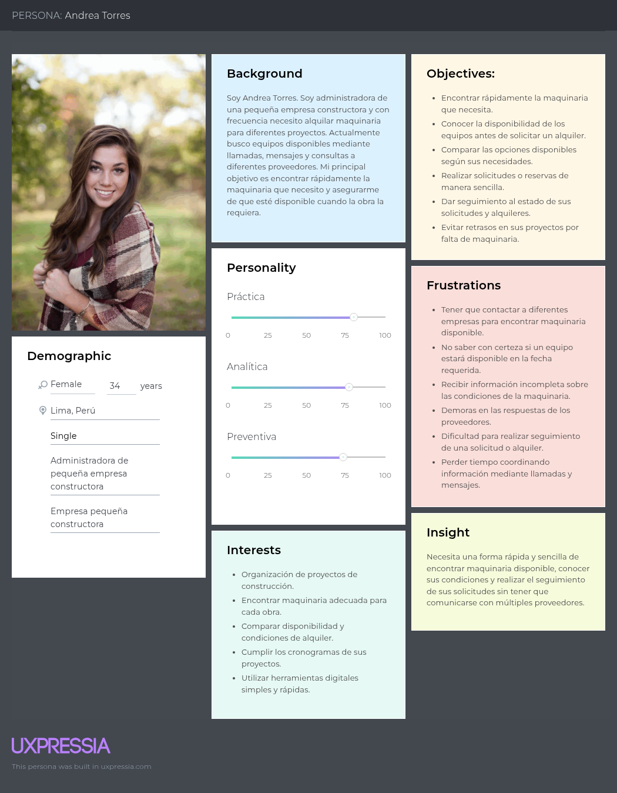
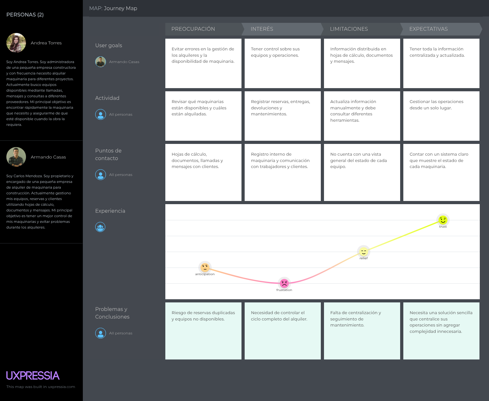
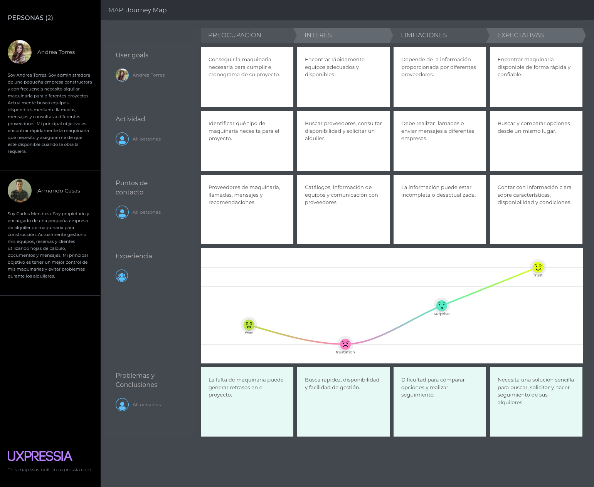
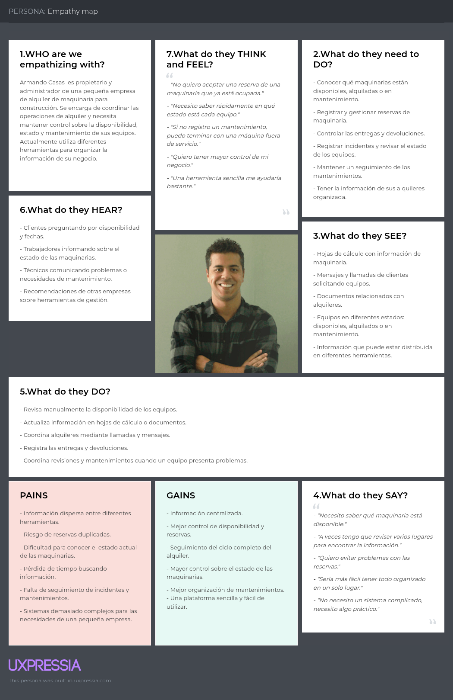
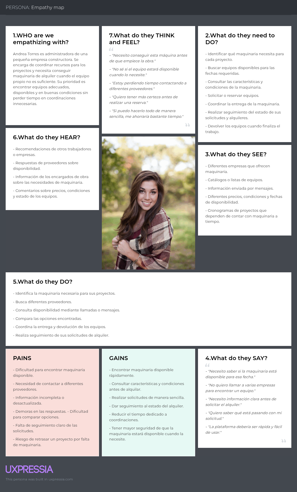

# RentBuild

  

  
Universidad Peruana de Ciencias Aplicadas

  
Facultad de Ingeniería

  
Carrera de Ingeniería de Software

  
Ciclo académico 2026-20
 

  
<b>1ASI0730</b>

  
<b>Aplicaciones Web</b>

  
NRC

  
<b>8093</b>

  
<b>Informe de Trabajo Final</b>

  
Docente

  
<b>Bautista Ubillús, Efraín Ricardo</b>

  
Startup

  
<b>DataFlux</b>
 
  
Producto

  
<b>RentBuild</b>

  <h3>Integrantes</h3>

  <table>
    <thead>
      <tr>
        <th>Código</th>
        <th>Apellidos y Nombres</th>
      </tr>
    </thead>
    <tbody>
      <tr>
        <td>U20211B198</td>
        <td>Cisneros Salas, Luis Angel</td>
      </tr>
      <tr>
        <td>U202410211</td>
        <td>Manosalva Tovar, Miroslav Oscar</td>
      </tr>
      <tr>
        <td>U202111529</td>
        <td>Montalvo Vásquez, Bruno Rodrigo</td>
      </tr>
      <tr>
        <td>U20211F962</td>
        <td>Vargas Manchinelli, Deiby Juan</td>
      </tr>
      <tr>
        <td>U2023228489</td>
        <td>Viza Quispe, Marlon Packard</td>
      </tr>
    </tbody>
  </table>
   

  
<b>Septiembre, 2026</b>

## Registro de Versiones del Informe

| Versión | Fecha |  Autor   |                                                  Descripción de modificación                                                   |
| :-----: |:-----:|:--------:| :----------------------------------------------------------------------------------------------------------------------------: |
|   AV1   |       |  Todos   | Se agregó la primera versión del informe, incluyendo carátula, registro de versiones, perfiles del equipo, análisis inicial del problema, artefactos de UX, arquitectura preliminar y evidencias del Sprint 1. |

## Project Report Collaboration Insights

A continuación, se presenta el repositorio utilizado para la elaboración colaborativa del informe del proyecto RentBuild.

#### Link del repositorio del Reporte:

- https://github.com/upc-pre-202620-1asi0730-8093-dataflux/dataflux-project-report.git

### Entrega AV1:

#### Participación por integrante:

##### Commits en el Project Report:

# Contenido

## Índice

- [Registro de Versiones del Informe](#registro-de-versiones-del-informe)
- [Project Report Collaboration Insights](#project-report-collaboration-insights)
- [Contenido](#contenido)
- [Student Outcome](#student-outcome)
- [Capítulo I: Introducción](#capítulo-i-introducción)
    - [1.1. Startup Profile](#11-startup-profile)
        - [1.1.1. Descripción de la Startup](#111-descripción-de-la-startup)
        - [1.1.2. Perfiles de integrantes del equipo](#112-perfiles-de-integrantes-del-equipo)
    - [1.2. Solution Profile](#12-solution-profile)
        - [1.2.1. Antecedentes y problemática](#121-antecedentes-y-problemática)
        - [1.2.2. Lean UX Process](#122-lean-ux-process)
            - [1.2.2.1. Lean UX Problem Statements](#1221-lean-ux-problem-statements)
            - [1.2.2.2. Lean UX Assumptions](#1222-lean-ux-assumptions)
            - [1.2.2.3. Lean UX Hypothesis Statements](#1223-lean-ux-hypothesis-statements)
            - [1.2.2.4. Lean UX Canvas](#1224-lean-ux-canvas)
    - [1.3. Segmentos objetivo](#13-segmentos-objetivo)
- [Capítulo II: Requirements Elicitation & Analysis](#capítulo-ii-requirements-elicitation--analysis)
    - [2.1. Competidores](#21-competidores)
        - [2.1.1. Análisis competitivo](#211-análisis-competitivo)
        - [2.1.2. Estrategias y tácticas frente a competidores](#212-estrategias-y-tácticas-frente-a-competidores)
    - [2.2. Entrevistas](#22-entrevistas)
        - [2.2.1. Diseño de entrevistas](#221-diseño-de-entrevistas)
        - [2.2.2. Registro de entrevistas](#222-registro-de-entrevistas)
        - [2.2.3. Análisis de entrevistas](#223-análisis-de-entrevistas)
    - [2.3. Needfinding](#23-needfinding)
        - [2.3.1. User Personas](#231-user-personas)
        - [2.3.2. User Task Matrix](#232-user-task-matrix)
        - [2.3.3. User Journey Mapping](#233-user-journey-mapping)
        - [2.3.4. Empathy Mapping](#234-empathy-mapping)
    - [2.4. Big Picture Event Storming](#24-big-picture-event-storming)
    - [2.5. Ubiquitous Language](#25-ubiquitous-language)
- [Capítulo III: Requirements Specification](#capítulo-iii-requirements-specification)
    - [3.1. User Stories](#31-user-stories)
    - [3.2. Impact Mapping](#32-impact-mapping)
    - [3.3. Product Backlog](#33-product-backlog)
- [Capítulo IV: Product Design](#capítulo-iv-product-design)
    - [4.1. Style Guidelines](#41-style-guidelines)
        - [4.1.1. General Style Guidelines](#411-general-style-guidelines)
        - [4.1.2. Web Style Guidelines](#412-web-style-guidelines)
    - [4.2. Information Architecture](#42-information-architecture)
        - [4.2.1. Organization Systems](#421-organization-systems)
        - [4.2.2. Labeling Systems](#422-labeling-systems)
        - [4.2.3. SEO Tags and Meta Tags](#423-seo-tags-and-meta-tags)
        - [4.2.4. Searching Systems](#424-searching-systems)
        - [4.2.5. Navigation Systems](#425-navigation-systems)
    - [4.3. Landing Page UI Design](#43-landing-page-ui-design)
        - [4.3.1. Landing Page Wireframe](#431-landing-page-wireframe)
        - [4.3.2. Landing Page Mock-up](#432-landing-page-mock-up)
    - [4.4. Web Applications UX/UI Design](#44-web-applications-uxui-design)
        - [4.4.1. Web Applications Wireframes](#441-web-applications-wireframes)
        - [4.4.2. Web Applications Wireflow Diagrams](#442-web-applications-wireflow-diagrams)
        - [4.4.3. Web Applications Mock-ups](#443-web-applications-mock-ups)
        - [4.4.4. Web Applications User Flow Diagrams](#444-web-applications-user-flow-diagrams)
    - [4.5. Web Applications Prototyping](#45-web-applications-prototyping)
    - [4.6. Domain-Driven Software Architecture](#46-domain-driven-software-architecture)
        - [4.6.1. Design-Level Event Storming](#461-design-level-event-storming)
        - [4.6.2. Software Architecture Context Diagram](#462-software-architecture-context-diagram)
        - [4.6.3. Software Architecture Container Diagrams](#463-software-architecture-container-diagrams)
        - [4.6.4. Software Architecture Components Diagrams](#464-software-architecture-components-diagrams)
    - [4.7. Software Object-Oriented Design](#47-software-object-oriented-design)
        - [4.7.1. Class Diagrams](#471-class-diagrams)
    - [4.8. Database Design](#48-database-design)
        - [4.8.1. Database Diagrams](#481-database-diagrams)
- [Capítulo V: Product Implementation, Validation & Deployment](#capítulo-v-product-implementation-validation--deployment)
    - [5.1. Software Configuration Management](#51-software-configuration-management)
        - [5.1.1. Software Development Environment Configuration](#511-software-development-environment-configuration)
        - [5.1.2. Source Code Management](#512-source-code-management)
        - [5.1.3. Source Code Style Guide & Conventions](#513-source-code-style-guide--conventions)
        - [5.1.4. Software Deployment Configuration](#514-software-deployment-configuration)
    - [5.2. Landing Page, Services & Applications Implementation](#52-landing-page-services--applications-implementation)
        - [5.2.1. Sprint 1](#521-sprint-1)
            - [5.2.1.1. Sprint Planning 1](#5211-sprint-planning-1)
            - [5.2.1.2. Aspect Leaders and Collaborators](#5212-aspect-leaders-and-collaborators)
            - [5.2.1.3. Sprint Backlog 1](#5213-sprint-backlog-1)
            - [5.2.1.4. Development Evidence for Sprint Review](#5214-development-evidence-for-sprint-review)
            - [5.2.1.5. Execution Evidence for Sprint Review](#5215-execution-evidence-for-sprint-review)
            - [5.2.1.6. Services Documentation Evidence for Sprint Review](#5216-services-documentation-evidence-for-sprint-review)
            - [5.2.1.7. Software Deployment Evidence for Sprint Review](#5217-software-deployment-evidence-for-sprint-review)
            - [5.2.1.8. Team Collaboration Insights during Sprint](#5218-team-collaboration-insights-during-sprint)
- [Conclusiones](#conclusiones)
    - [Conclusiones y recomendaciones](#conclusiones-y-recomendaciones)
- [Bibliografía](#bibliografía)
- [Anexos](#anexos)

## Student Outcome

El curso contribuye al cumplimiento del Student Outcome ABET:  
**ABET - EAC - Student Outcome 5**

**Criterio:** *La capacidad de funcionar efectivamente en un equipo cuyos miembros
juntos proporcionan liderazgo, crean un entorno de colaboración e inclusivo,
establecen objetivos, planifican tareas y cumplen objetivos.*

En el siguiente cuadro se describe las acciones realizadas y enunciados de conclusiones por parte del grupo, que permiten sustentar el haber alcanzado el logro del ABET - EAC - Student Outcome 5.

| Criterio específico                                                                                 | Acciones realizadas                                                                                                                                                                                            | Conclusiones |
|:----------------------------------------------------------------------------------------------------|:---------------------------------------------------------------------------------------------------------------------------------------------------------------------------------------------------------------|:-------------|
| **Trabaja en equipo para proporcionar liderazgo en forma conjunta.**                                | **Cisneros Salas, Luis Angel** **AV1:**  **Manosalva Tovar, Miroslav Oscar** **AV1:**  **Montalvo Vásquez, Bruno Rodrigo** **AV1:**  **Vargas Manchinelli, Deiby Juan** **AV1:**  **Viza Quispe, Marlon Packard** **AV1:** | **AV1:**     |
| **Crea un entorno colaborativo e inclusivo, establece metas, planifica tareas y cumple objetivos.** | **Cisneros Salas, Luis Angel** **AV1:**  **Manosalva Tovar, Miroslav Oscar** **AV1:**  **Montalvo Vásquez, Bruno Rodrigo** **AV1:**  **Vargas Manchinelli, Deiby Juan** **AV1:**  **Viza Quispe, Marlon Packard** **AV1:** | **AV1:**     |

# Capítulo I: Introducción

## 1.1. Startup Profile

### 1.1.1. Descripción de la Startup

DataFlux es una startup orientada al desarrollo de soluciones digitales accesibles que permitan organizar y optimizar los procesos de pequeñas y medianas empresas. Su propuesta se enfoca en resolver problemas operativos mediante herramientas especializadas, sencillas de utilizar y adaptadas a las necesidades de sus usuarios.

Como parte de esta iniciativa, DataFlux desarrolla RentBuild, una plataforma SaaS dirigida principalmente a pequeñas y medianas empresas dedicadas al alquiler de maquinaria y equipos para obras de construcción de pequeña escala. Estas empresas suelen gestionar sus operaciones mediante hojas de cálculo, llamadas, mensajes y sistemas independientes, lo cual dificulta el control de sus equipos y aumenta la posibilidad de cometer errores.

RentBuild centralizará la gestión del inventario, disponibilidad, reservas, contratos, pagos, entregas, devoluciones, incidencias y mantenimiento de los equipos. De esta manera, permitirá realizar el seguimiento de la maquinaria durante todo su ciclo de alquiler y facilitará la interacción con las personas que necesitan alquilar equipos para sus proyectos personales relacionados con la construcción.

#### Misión

Nuestra misión es facilitar la gestión integral de las pequeñas y medianas empresas dedicadas al alquiler de maquinaria y equipos para construcción mediante una plataforma digital sencilla, accesible y confiable. Buscamos centralizar sus operaciones, reducir errores relacionados con la disponibilidad y las reservas, mejorar el control del estado de los equipos y brindar una mejor experiencia tanto a las empresas como a las personas que alquilan maquinaria.

#### Visión

Nuestra visión es convertirnos en una startup referente en el Perú en soluciones digitales para la gestión del alquiler de maquinaria de construcción, contribuyendo a que las pequeñas y medianas empresas profesionalicen sus operaciones y brinden servicios más eficientes, organizados y confiables.

#### Valores

Nuestros valores principales son los siguientes:

* **Innovación:** Aplicamos tecnología para mejorar y simplificar los procesos tradicionales del alquiler de maquinaria.
* **Simplicidad:** Diseñamos soluciones comprensibles y accesibles para empresas con diferentes niveles de experiencia tecnológica.
* **Responsabilidad:** Promovemos una gestión adecuada de los equipos, la información y las operaciones de alquiler.
* **Colaboración:** Valoramos el trabajo en equipo y la comunicación con las empresas y personas que utilizarán RentBuild.
* **Calidad:** Buscamos ofrecer una plataforma confiable, organizada y orientada a las necesidades reales de sus usuarios.

### 1.1.2. Perfiles de integrantes del equipo

|   Código   | Nombre completo del integrante  | Descripción de la carrera                                          |                               Fotografía                                | Conocimientos y habilidades                                                                                                                                                                                                                                                                                                                                                                                                                                                                                                                                                                                                                                                                                                                                                                                                                                                                                                                                                                                                   |
|:----------:|:--------------------------------| :----------------------------------------------------------------- |:----------------------------------------------------------------------------:|:------------------------------------------------------------------------------------------------------------------------------------------------------------------------------------------------------------------------------------------------------------------------------------------------------------------------------------------------------------------------------------------------------------------------------------------------------------------------------------------------------------------------------------------------------------------------------------------------------------------------------------------------------------------------------------------------------------------------------------------------------------------------------------------------------------------------------------------------------------------------------------------------------------------------------------------------------------------------------------------------------------------------------|
| U20211B198 | Cisneros Salas, Luis            | Ingeniería de Software - Universidad Peruana de Ciencias Aplicadas |          | Soy estudiante de Ingeniería de Software interesado en crear soluciones digitales que simplifiquen procesos y resuelvan problemas reales. Actualmente fortalezco mis conocimientos en C#, y cuento con experiencia en C++, Java, JavaScript, HTML y CSS. Me interesa especialmente el desarrollo frontend, las bases de datos y las aplicaciones web. Soy una persona organizada, responsable, de rápido aprendizaje y con facilidad para trabajar en equipo. Busco esta oportunidad para adquirir experiencia y seguir creciendo profesionalmente.                                                                                                                                                                                                                                                                                                                                                                                                                                                                           |
| U202410211 | Manosalva Tovar, Miroslav       | Ingeniería de Software - Universidad Peruana de Ciencias Aplicadas |  | Soy Miroslav Manosalva Tovar, estudiante de Ingeniería de Software. Tengo conocimientos en el área de programación y experiencia en la elaboración de interfaces de usuario (UI), que puedo aportar al desarrollo de RentBuild. Mi experiencia trabajando con interfaces me permite contribuir a la presentación de la información y a la organización visual de las funcionalidades de la plataforma. Me considero una persona responsable y persistente: procuro cumplir con las actividades que asumo y mantener el esfuerzo cuando encuentro dificultades. En este proyecto, busco aplicar mis conocimientos de programación y diseño de interfaces, seguir fortaleciendo mi formación y contribuir al desarrollo de una solución útil para sus usuarios.                                                                                                                                                                                                                                                                 |
| U202111529 | Montalvo Vasquez, Bruno Rodrigo | Ingeniería de Software - Universidad Peruana de Ciencias Aplicadas |       | Soy Bruno Rodrigo Montalvo Vasquez, estudiante de la carrera de Ingeniería de Software. Me encuentro interesado y motivado por aprender nuevos temas relacionados con mi carrera. Asimismo, estoy abierto a trabajar con profesionales de mi área académica para mejorar mis conocimientos, adquirir experiencia y fortalecer mis habilidades de trabajo en equipo.                                                                                                                                                                                                                                                                                                                                                                                                                                                                                                                                                                                                                                                           |
| U20211F962 | Vargas Manchinelli, Deiby Juan  | Ingeniería de Software - Universidad Peruana de Ciencias Aplicadas |        | Estudio Ingeniería de Software y me apasiona usar la tecnología para convertir problemas en soluciones prácticas. Actualmente estoy aprendiendo y fortaleciendo mis conocimientos en C#, además de tener experiencia con C++, Java, JavaScript, HTML y CSS. Me interesa el frontend, las bases de datos y el desarrollo web. Soy organizado, aprendo rápido y disfruto trabajar en equipo. Mi objetivo es ganar experiencia, aprender y seguir creciendo en el mundo del software.                                                                                                                                                                                                                                                                                                                                                                                                                                                                                                                                            |
| U202322849 | Viza Quispe, Marlon Packard     | Ingeniería de Software - Universidad Peruana de Ciencias Aplicadas |         | Soy estudiante de Ingeniería de Software con interés en el desarrollo web, frontend y bases de datos. Tengo experiencia con C++, Java, JavaScript, HTML y CSS, y actualmente estoy fortaleciendo mis conocimientos en C#. Me motiva crear soluciones útiles y eficientes, aprender constantemente y enfrentar nuevos desafíos. Me considero una persona organizada, creativa y con buena capacidad para trabajar en equipo.                                                                                                                                                                                                                                                                                                                                                                                                                                                                                                                                                                                                   |

## 1.2. Solution Profile

### 1.2.1. Antecedentes y problemática

**What (¿Qué?)**
- ¿Cuál es el problema? 
Las pequeñas y medianas empresas dedicadas al alquiler de maquinaria y equipos para construcción tienen dificultades para gestionar de manera centralizada sus equipos, disponibilidad, reservas, contratos, pagos, entregas, devoluciones y mantenimiento. 

- ¿Cuál es la relación con la persona en cuestión?
Actualmente, muchas de estas actividades pueden gestionarse mediante herramientas dispersas como hojas de cálculo, mensajes, llamadas telefónicas y registros manuales. Esto puede generar errores en las reservas, desconocimiento del estado de los equipos, dificultades para controlar las fechas de devolución y poca visibilidad sobre el mantenimiento de la maquinaria. 

**Why (¿Por qué?)**

El objetivo es simplificar y centralizar la gestión del alquiler de maquinaria, permitiendo que las empresas tengan mayor control sobre sus equipos y operaciones.
RentBuild busca reducir errores relacionados con la disponibilidad y las reservas, facilitar el seguimiento del estado de cada equipo y mejorar la gestión de los procesos de alquiler, devolución y mantenimiento.
Para las empresas constructoras, el objetivo es facilitar la búsqueda y gestión de maquinaria disponible para sus proyectos.

**When (¿Cuándo?)**

- ¿Cuándo sucede el problema?
El problema surge principalmente cuando una empresa debe realizar tareas como registrar o consultar la disponibilidad de un equipo, gestionar varias reservas simultáneamente, coordinar entregas y devoluciones, entre otros. La dificultad aumenta a medida que crece la cantidad de equipos, clientes y alquileres.

- ¿Cuándo utiliza el cliente el producto?
Las empresas de alquiler utilizarían RentBuild durante todo el ciclo del alquiler, desde el registro y disponibilidad del equipo hasta su reserva, entrega, devolución, inspección y mantenimiento. Las empresas constructoras utilizarían la plataforma principalmente cuando necesitan buscar, solicitar, reservar y realizar seguimiento de maquinaria para un proyecto.

**Where (¿Dónde?)**
- ¿Dónde está el cliente cuando utiliza el producto?
El cliente puede utilizar RentBuild desde: La oficina de la empresa de alquiler, el almacén o patio donde se encuentran los equipos, una obra o proyecto de construcción y desde un dispositivo móvil durante una entrega o devolución.

- ¿A dónde se dirige?
Las empresas de alquiler gestionan equipos que pueden desplazarse entre su almacén, las instalaciones del cliente y diferentes proyectos de construcción. Las empresas constructoras utilizan los equipos principalmente en sus obras y proyectos de construcción.

- ¿Dónde surge el problema?
El problema puede surgir tanto en la oficina administrativa como durante las operaciones en campo. Por ejemplo, puede producirse un conflicto cuando un equipo aparece como disponible en un registro, pero realmente está alquilado, se encuentra en mantenimiento o está asignado a otra obra.

**Who (¿Quienes?)**
- ¿Quiénes están involucrados?
Las empresas de alquiler de maquinaria (propietarios, administradores, operadores de alquiler) y las pequeñas empresas constructoras. 

- ¿A quiénes les sucede el problema?
Principalmente a los propietarios, administradores y operadores de pequeñas y medianas empresas de alquiler de maquinaria, especialmente cuando manejan varios equipos y alquileres simultáneamente. También afecta a las empresas constructoras cuando necesitan conseguir maquinaria disponible dentro de un periodo determinado.

- ¿Quién utiliza el producto?
Los principales usuarios de RentBuild serían por una parte usuarios internos como administradores, operadores, personal de logística y personal de mantenimiento. Mientras que por otra parte, usuarios externos como las empresas constructoras, encargados de proyectos y personal responsable de alquilar maquinaria. 

- ¿Cuál es la causa del problema?
Uso de herramientas no integradas, registros manuales o duplicados, información distribuida entre diferentes personas y canales, falta de actualización de la disponibilidad de los equipos, dificultad para realizar seguimiento del ciclo de vida de la maquinaria y 
falta de una solución especializada y adaptada a pequeñas empresas del sector.

**How (¿Cómo?)**
- ¿En qué condiciones nuestros clientes usan el producto?
RentBuild será utilizado principalmente en contextos donde los usuarios necesitan consultar o actualizar información rápidamente: Registrar un nuevo equipo, consultar disponibilidad, crear una reserva, registrar una alquiler, gestionar una entrega, entre otros. 

- ¿Cómo nos conocieron nuestros compradores?
Los clientes podrán conocer RentBuild mediante redes sociales, publicidad digital dirigida al sector construcción, recomendaciones entre empresas o contacto directo con empresas de alquiler.

- ¿Cómo prefieren nuestros consumidores acceder a nuestro producto?
Al tratarse de un producto SaaS, los usuarios podrán acceder mediante una plataforma web, utilizando sus credenciales desde cualquier dispositivo con conexión a Internet. 

- ¿Qué llevó a la persona a esa situación?
El crecimiento de la cantidad de equipos, clientes y alquileres hace que la gestión manual o mediante herramientas independientes sea cada vez más difícil. Cuando aumenta el volumen de operaciones, mantener actualizada la información sobre disponibilidad, reservas, entregas, devoluciones y mantenimiento se vuelve más complejo y aumenta el riesgo de errores.

**How much (¿Cuánto?)**

Según Clements (2025), el 67 % de las empresas de alquiler de equipos encuestadas opera con sistemas parcialmente integrados que requieren transferencia manual de información, lo que evidencia la existencia de dificultades para centralizar y conectar los procesos de gestión dentro de este sector.
En ese contexto, DataFlux busca abordar esta problemática mediante RentBuild, una plataforma SaaS especializada en la gestión del alquiler de maquinaria y equipos para construcción, que permite centralizar en un solo lugar procesos como el control de inventario, disponibilidad, reservas, contratos, pagos, entregas, devoluciones y mantenimiento.

#### Objetivos

**Corto plazo**

* Identificar y validar las necesidades principales de las empresas de alquiler y de las personas que solicitan maquinaria.
* Diseñar una experiencia digital comprensible para los dos segmentos objetivo.
* Implementar y desplegar la primera versión del Landing Page de RentBuild.
* Definir las funcionalidades iniciales relacionadas con inventario, disponibilidad, reservas y alquileres.

**Mediano plazo**

* Implementar progresivamente la gestión de contratos, pagos, entregas, devoluciones, incidencias y mantenimiento.
* Integrar la Web Application con el RESTful API desarrollado por el equipo.
* Incorporar un servicio externo que complemente las funcionalidades de la plataforma.
* Mejorar el producto a partir de las entrevistas y validaciones realizadas con los segmentos objetivo.

**Largo plazo**

* Conseguir una adopción recurrente de RentBuild por parte de pequeñas y medianas empresas del sector.
* Reducir los errores relacionados con reservas, disponibilidad y seguimiento de equipos.
* Incorporar nuevas herramientas de análisis y seguimiento de las operaciones.
* Posicionar RentBuild como una solución especializada para la gestión del alquiler de maquinaria de construcción.

#### Restricciones

* RentBuild debe desarrollarse como una solución web distribuida compuesta por un Landing Page, una Web Application y un RESTful API propio.
* La lógica del lado servidor debe desarrollarse con Java y tecnologías open-source, conforme a los lineamientos del curso.
* La plataforma debe integrar al menos un servicio externo de terceros.
* La interfaz debe adaptarse a las dimensiones de computadoras, tabletas y dispositivos móviles.
* La experiencia visual y funcional debe ser consistente entre el Landing Page y la Web Application.
* Los call-to-action del Landing Page deben dirigir a las vistas correspondientes de la Web Application.
* El funcionamiento de la plataforma dependerá de una conexión a Internet para consultar y actualizar la información.
* El alcance de la primera versión debe priorizar las funcionalidades principales que puedan desarrollarse dentro del ciclo académico.
* El código y la documentación deben gestionarse en repositorios públicos de la organización de GitHub de DataFlux.
* El equipo debe aplicar GitFlow y Conventional Commits durante la evolución del proyecto.

### 1.2.2. Lean UX Process

#### 1.2.2.1. Lean UX Problem Statements

La situación actual del sector de alquiler de maquinaria y equipos para pequeñas construcciones se ha centrado principalmente en empresas que gestionan sus operaciones mediante herramientas dispersas como hojas de cálculo, llamadas, mensajes y sistemas independientes, dificultando el control de la disponibilidad, reservas, contratos, entregas, devoluciones y mantenimiento de sus equipos.

Lo que los productos y servicios existentes no logran abordar completamente es la necesidad de las pequeñas empresas de contar con una solución especializada, sencilla y accesible, que les permita gestionar de manera integral el ciclo de vida de su maquinaria sin enfrentarse a la complejidad de plataformas orientadas a operaciones de mayor escala.

Nuestro producto abordará esta brecha mediante una plataforma SaaS especializada en pequeñas empresas de alquiler de maquinaria para construcción, que centralizará en un único lugar la gestión de inventario, disponibilidad, reservas, contratos, pagos, entregas, devoluciones, incidencias y mantenimiento, permitiendo realizar un seguimiento del equipo durante todo su ciclo de alquiler.

Nuestro enfoque inicial será pequeñas y medianas empresas dedicadas al alquiler de maquinaria y equipos utilizados en proyectos de construcción de pequeña escala, que necesitan profesionalizar y organizar sus operaciones sin incorporar herramientas excesivamente complejas.

Sabremos que hemos tenido éxito cuando veamos una adopción recurrente de la plataforma por parte de estas empresas, una reducción de errores relacionados con reservas y disponibilidad, un mayor control sobre el estado de los equipos y un incremento en el uso de funcionalidades como gestión de alquileres y mantenimiento

#### 1.2.2.2. Lean UX Assumptions

**Business Assumptions:**
* Creemos que las pequeñas y medianas empresas de alquiler de equipo necesitan una solución digital especializada para gestionar sus operaciones de alquiler.

* Creemos que las pequeñas empresas de construcción están dispuestas a utilizar una plataforma digital para buscar, reservar y gestionar el alquiler de equipo de construcción.

* Creemos que las empresas de alquiler de equipo están dispuestas a pagar una suscripción mensual de SaaS por una plataforma que centralice y simplifique sus operaciones de alquiler.

* Creemos que un modelo de suscripción de tres niveles puede adaptarse a las diferentes necesidades operativas y niveles de crecimiento de las pequeñas y medianas empresas de alquiler de equipo.

**Business Outcome Assumptions:**

* Creemos que RentBuild logrará un número cada vez mayor de empresas de alquiler que paguen por el servicio gracias a la adopción de su plataforma SaaS.

* Creemos que RentBuild  logrará una alta tasa de retención de clientes al brindar valor continuo a las empresas de alquiler de equipos.

* Creemos que RentBuild aumentará la adopción de planes de suscripción de mayor nivel a medida que las empresas de alquiler amplíen su inventario y sus necesidades operativas.

* Creemos que la participación de las empresas de construcción aumentará el número de transacciones de alquiler gestionadas a través de la plataforma.

**User Assumptions:**

* Creemos que los propietarios y administradores de pequeñas y medianas empresas de alquiler de equipos son usuarios clave que necesitan supervisar el inventario, los alquileres, los ingresos y el mantenimiento de los equipos.

* Creemos que los operadores de alquiler son responsables de gestionar las reservaciones, los contratos, las entregas de equipo, las devoluciones y los incidentes.

* Creemos que los gerentes de compras o los jefes de obra en pequeñas empresas constructoras son responsables de buscar y alquilar el equipo necesario para sus proyectos.

* Creemos que las empresas constructoras necesitan conocer la disponibilidad del equipo, las condiciones de alquiler y las fechas de devolución al gestionar sus proyectos.

**User Outcome and Benefit Assumptions:**

* Creemos que los administradores de las empresas de alquiler desean conocer rápidamente el estado, la ubicación y la disponibilidad de cada equipo para poder tomar mejores decisiones operativas.

* Creemos que los operadores de alquiler desean gestionar de manera eficiente las reservaciones, entregas y devoluciones para reducir los errores operativos y ahorrar tiempo.

* Creemos que los administradores de empresas de alquiler desean monitorear el estado de los equipos y el historial de mantenimiento para maximizar la disponibilidad y la vida útil de los mismos.

* Creemos que los gerentes de construcción desean encontrar rápidamente equipos adecuados y disponibles para obtener a tiempo los recursos necesarios para sus proyectos.

* Creemos que las empresas constructoras desean contar con información clara sobre las condiciones de alquiler, los costos y las fechas de devolución para planificar mejor los recursos y gastos de sus proyectos.

**Feature Assumptions:**

* Creemos que las empresas de alquiler necesitan un módulo de administración de inventario para registrar el equipo, sus características, ubicación, estado y disponibilidad.

* Creemos que las empresas de alquiler necesitan un sistema de reservaciones que verifique automáticamente la disponibilidad de los equipos y evite que se superpongan las reservaciones.

* Creemos que las empresas de alquiler necesitan un módulo integrado de gestión de alquileres para administrar contratos, tarifas, pagos, entregas y devoluciones.

* Creemos que las empresas de alquiler necesitan un módulo de gestión de mantenimiento para registrar inspecciones, incidentes, reparaciones, costos y mantenimiento programado.

* Creemos que las empresas constructoras necesitan una interfaz de búsqueda y alquiler de equipos para encontrar la maquinaria adecuada, verificar la disponibilidad y solicitar alquileres de acuerdo con los requisitos de sus proyectos.

* Creemos que las empresas constructoras necesitan una interfaz de seguimiento de alquileres para monitorear sus alquileres activos, los períodos de alquiler, los costos y las fechas de devolución

#### 1.2.2.3. Lean UX Hypothesis Statements

* Creemos que lograremos una mayor retención de clientes si los administradores de las empresas de alquiler pueden conocer rápidamente el estado, la ubicación y la disponibilidad de su equipo mediante un módulo centralizado de gestión de inventario.

* Creemos que lograremos una mayor satisfacción y retención de los clientes si las empresas de alquiler pueden gestionar de manera eficiente las reservaciones y evitar conflictos de disponibilidad mediante un sistema automatizado de gestión de reservaciones.

* Creemos que aumentaremos el número de transacciones de alquiler completadas si los operadores de alquiler pueden gestionar los contratos, los pagos, las entregas y las devoluciones en un solo lugar mediante un módulo integrado de gestión de alquileres.

* Creemos que podremos aumentar la utilización de los equipos y reducir el tiempo de inactividad operativa si los administradores de las empresas de alquiler pueden monitorear de manera proactiva el estado y las necesidades de mantenimiento de sus equipos mediante un módulo de gestión de mantenimiento.

* Creemos que aumentaremos el número de transacciones de alquiler gestionadas a través de RentBuild si los gerentes de construcción pueden encontrar rápidamente el equipo adecuado y disponible para sus proyectos mediante una interfaz de búsqueda y alquiler de equipo.

* Creemos que lograremos aumentar la retención de usuarios entre las empresas de construcción si los gerentes de obra pueden monitorear fácilmente sus alquileres activos, los costos y las fechas de devolución mediante una interfaz de seguimiento de alquileres.

#### 1.2.2.4. Lean UX Canvas

## 1.3. Segmentos objetivo

**Segmento #1: Pequeñas y medianas empresas de alquiler de maquinaria**

Empresas dedicadas al alquiler de maquinaria y equipos utilizados principalmente en construcción, remodelación, movimiento de tierras y obras civiles. 

* Aspectos demográficos:
  - Edades: aproximadamente 30–55 años. 
  - Ubicación: principalmente zonas urbanas donde existe concentración de actividad empresarial y construcción.
* Aspectos psicográficos:
  - Comportamiento tecnológico: utiliza computadora y smartphone para gestionar el negocio; suele utilizar WhatsApp, Excel, correo electrónico y sistemas administrativos básicos.
  - Motivación: reducir pérdidas, mantener los equipos disponibles y tener mayor control sobre el negocio.

**Segmento #2: Pequeñas empresas constructoras**

Pequeñas empresas constructoras y contratistas que necesitan alquilar maquinaria para ejecutar proyectos de construcción de pequeña y mediana escala. 

* Aspectos demográficos:
  - Edades: aproximadamente 28–50 años. 
  - Ubicación: zonas urbanas y áreas con actividad constructiva. 
* Aspectos psicográficos:
  - Comportamiento: Prefieren procesos de solicitud simples y rápidos.
  - Motivación: reducir costos y evitar retrasos en sus proyectos.

# Capítulo II: Requirements Elicitation & Analysis

## 2.1. Competidores

### 2.1.1. Análisis competitivo

### 2.1.2. Estrategias y tácticas frente a competidores

## 2.2. Entrevistas

### 2.2.1. Diseño de entrevistas

**Segmento 1: Pequeñas y medianas empresas de alquiler de maquinaria**

**Objetivo:** Conocer cómo gestionan actualmente sus máquinas y alquileres, qué problemas enfrentan y qué tan útil podría resultarles una solución como RentBuild.

**Contexto**

1. ¿A qué se dedica actualmente su empresa y qué tipo de maquinaria suelen alquilar?

2. ¿Quién se encarga normalmente de gestionar los alquileres y las máquinas?

**Situación actual**

3. Cuando un cliente quiere alquilar una máquina, ¿cómo realizan normalmente todo el proceso?

4. ¿Cómo saben qué máquinas están disponibles, alquiladas o fuera de servicio?

5. ¿Qué herramientas utilizan actualmente para llevar el control de sus máquinas y alquileres?

**Problemas**

6. ¿Cuál es la principal dificultad que tienen al gestionar sus alquileres?

7. ¿Alguna vez han tenido problemas porque una máquina fue reservada para más de un cliente o no estaba disponible cuando debía estarlo?

8. ¿Qué ocurre cuando una máquina es devuelta con algún daño o presenta una falla?

9. ¿Cómo controlan actualmente los mantenimientos y cuándo una máquina puede volver a alquilarse?

10. ¿Qué parte del proceso de alquiler les toma más tiempo o les genera más problemas?

**Opinión sobre RentBuild**

> *"Estamos desarrollando RentBuild, una plataforma pensada para pequeñas y medianas empresas de alquiler de maquinaria. La idea es permitir gestionar las máquinas y alquileres desde un solo lugar, desde la reserva hasta la devolución y mantenimiento, de una manera sencilla."*

11. ¿Qué le parece esta idea? ¿Cree que podría ser útil para su empresa? ¿Por qué?

12. Si pudiera mejorar una sola parte de la gestión de sus alquileres, ¿cuál sería?

**Segmento 2: Pequeñas empresas constructoras**

**Objetivo:** Conocer cómo buscan y alquilan maquinaria actualmente, qué dificultades encuentran y qué tan útil podría resultarles RentBuild.

**Contexto**

1. ¿A qué tipo de proyectos de construcción o remodelación se dedica su empresa?

2. ¿Con qué frecuencia necesitan alquilar maquinaria o equipos?

**Situación actual**

3. Cuando necesitan una máquina para un proyecto, ¿cómo buscan actualmente dónde alquilarla?

4. ¿Cómo averiguan si una máquina está disponible para las fechas que necesitan?

5. ¿Qué información necesitan conocer antes de decidir alquilar una máquina?

**Problemas**

6. ¿Cuál es la principal dificultad que encuentran cuando necesitan conseguir maquinaria?

7. ¿Alguna vez han necesitado una máquina y no pudieron conseguirla cuando la necesitaban? ¿Qué ocurrió?

8. ¿Han tenido problemas con la entrega, el uso o la devolución de una máquina alquilada?

9. ¿Qué parte del proceso de conseguir y alquilar maquinaria les toma más tiempo?

10. ¿Qué cambiarían de la forma en que actualmente buscan o alquilan maquinaria?

**Opinión sobre RentBuild**

> *"Estamos desarrollando RentBuild, una plataforma pensada para facilitar el alquiler de maquinaria. La idea es que las empresas puedan buscar equipos, consultar información y disponibilidad y gestionar sus alquileres desde un solo lugar, de una manera sencilla."*

11. ¿Qué le parece esta idea? ¿Cree que podría ser útil para su empresa? ¿Por qué?

12. Si pudiera encontrar toda la información de una máquina en un solo lugar, ¿qué información sería indispensable para usted?

### 2.2.2. Registro de entrevistas

### 2.2.3. Análisis de entrevistas

## 2.3. Needfinding

### 2.3.1. User Personas

El user persona se construyó a partir de patrones encontrados en las entrevistas

**Segmento objetivo 1: Pequeñas y medianas empresas de alquiler de maquinaria**

**Segmento Objetivo 2: Pequeñas empresas constructoras**

### 2.3.2. User Task Matrix

| TASK | Armando Casas (Empresa de alquiler) Frecuencia | Armando Casas (Empresa de alquiler) Importancia | Andrea Torres (Empresa constructora) Frecuencia | Andrea Torres (Empresa constructora) Importancia |
| :---- | :---: | :---: | :---: | :---: |
| **Consultar el inventario de maquinaria** | **Often** | **High** | **Sometimes** | **Medium** |
| **Consultar la disponibilidad de una maquinaria** | **Often** | **High** | **Often** | **High** |
| **Registrar o actualizar información de maquinaria** | **Often** | **High** | **Rarely** | **Low** |
| **Gestionar reservas y solicitudes de alquiler** | **Often** | **High** | **Often** | **High** |
| **Coordinar la entrega de maquinaria** | **Often** | **High** | **Often** | **High** |
| **Registrar la devolución de maquinaria** | **Often** | **High** | **Sometimes** | **Medium** |
| **Verificar el estado de la maquinaria después de un alquiler** | **Often** | **High** | **Sometimes** | **Medium** |
| **Registrar incidentes o daños en una maquinaria** | **Sometimes** | **High** | **Sometimes** | **High** |
| **Consultar el historial de mantenimiento de una maquinaria** | **Often** | **High** | **Rarely** | **Medium** |
| **Programar o registrar mantenimientos** | **Sometimes** | **High** | **Rarely** | **Low** |
| **Buscar maquinaria según las necesidades de un proyecto** | **Rarely** | **Low** | **Often** | **High** |
| **Consultar características y condiciones de una maquinaria** | **Sometimes** | **Medium** | **Often** | **High** |
| **Realizar seguimiento del estado de una solicitud o alquiler** | **Often** | **High** | **Often** | **High** |

### 2.3.3. User Journey Mapping

**2. User Journey Map para el segundo segmento**

### 2.3.4. Empathy Mapping

**1. Empathy Map para el primer segmento**

**2. Empathy Map para el segundo segmento**

## 2.4. Big Picture Event Storming

## 2.5. Ubiquitous Language

# Capítulo III: Requirements Specification

## 3.1. User Stories

<table>
<tr>
<th>Epic / Story ID</th>
<th>Título</th>
<th>Descripción</th>
<th>Criterios de Aceptación</th>
<th>Relacionado con</th>
</tr>

<tr>
<td>EP01</td>
<td>Gestión de usuarios y acceso</td>
<td>Epic orientado al registro, autenticación y gestión básica de las cuentas de los usuarios de RentBuild.</td>
<td>-</td>
<td>-</td>
</tr>

<tr>
<td>US01</td>
<td>Registro de usuario</td>
<td>Como usuario, quiero registrarme en RentBuild para acceder a las funcionalidades de la plataforma.</td>
<td>
Given que el usuario accede al formulario de registro 
When ingresa sus datos correctamente 
Then el sistema crea su cuenta 
And muestra un mensaje de confirmación
</td>
<td>EP01</td>
</tr>

<tr>
<td>US02</td>
<td>Inicio de sesión</td>
<td>Como usuario registrado, quiero iniciar sesión para acceder a las funcionalidades correspondientes a mi cuenta.</td>
<td>
Given que el usuario posee una cuenta registrada 
When ingresa credenciales válidas 
Then el sistema permite el acceso a la plataforma
</td>
<td>EP01</td>
</tr>

<tr>
<td>US03</td>
<td>Gestionar perfil</td>
<td>Como usuario, quiero consultar y actualizar mis datos personales y de contacto para mantener mi información actualizada.</td>
<td>
Given que el usuario ha iniciado sesión 
When modifica sus datos de perfil 
Then el sistema guarda la información actualizada 
And muestra los nuevos datos
</td>
<td>EP01</td>
</tr>

<tr>
<td>EP02</td>
<td>Gestión de maquinaria</td>
<td>Epic orientado al registro, organización y consulta del inventario de maquinaria disponible para alquiler.</td>
<td>-</td>
<td>-</td>
</tr>

<tr>
<td>US04</td>
<td>Registrar maquinaria</td>
<td>Como empresa de alquiler, quiero registrar mis máquinas y equipos para mantener organizado mi inventario.</td>
<td>
Given que el usuario tiene permisos para gestionar maquinaria 
When registra los datos de un equipo 
Then el sistema almacena la maquinaria en el inventario 
And muestra el equipo registrado
</td>
<td>EP02</td>
</tr>

<tr>
<td>US05</td>
<td>Consultar maquinaria</td>
<td>Como empresa de alquiler, quiero consultar las máquinas registradas para conocer la información de mis equipos.</td>
<td>
Given que existen equipos registrados 
When el usuario consulta el inventario 
Then el sistema muestra la lista de maquinaria 
And muestra información relevante de cada equipo
</td>
<td>EP02</td>
</tr>

<tr>
<td>US06</td>
<td>Actualizar información de maquinaria</td>
<td>Como empresa de alquiler, quiero actualizar la información de mis equipos para mantener el inventario actualizado.</td>
<td>
Given que existe una maquinaria registrada 
When el usuario modifica sus datos 
Then el sistema guarda la información actualizada
</td>
<td>EP02</td>
</tr>

<tr>
<td>US07</td>
<td>Consultar disponibilidad de maquinaria</td>
<td>Como empresa de alquiler, quiero conocer la disponibilidad de cada equipo para evitar conflictos al gestionar nuevos alquileres.</td>
<td>
Given que existen equipos registrados 
When el usuario consulta su disponibilidad 
Then el sistema muestra si cada equipo está disponible, reservado o alquilado
</td>
<td>EP02</td>
</tr>

<tr>
<td>US08</td>
<td>Consultar estado de maquinaria</td>
<td>Como empresa de alquiler, quiero conocer el estado de mis equipos para evitar alquilar maquinaria que no se encuentra en condiciones de uso.</td>
<td>
Given que existe una maquinaria registrada 
When el usuario consulta su información 
Then el sistema muestra su estado actual 
And permite identificar si está disponible para alquiler
</td>
<td>EP02</td>
</tr>

<tr>
<td>EP03</td>
<td>Búsqueda y solicitud de alquiler</td>
<td>Epic orientado a permitir que las pequeñas empresas constructoras encuentren maquinaria y gestionen solicitudes de alquiler.</td>
<td>-</td>
<td>-</td>
</tr>

<tr>
<td>US09</td>
<td>Buscar maquinaria</td>
<td>Como empresa constructora, quiero buscar maquinaria según mis necesidades para encontrar equipos adecuados para mi proyecto.</td>
<td>
Given que el usuario accede al catálogo de maquinaria 
When busca o filtra equipos 
Then el sistema muestra las maquinarias que coinciden con sus necesidades
</td>
<td>EP03</td>
</tr>

<tr>
<td>US10</td>
<td>Consultar información de maquinaria</td>
<td>Como empresa constructora, quiero consultar las características de una maquinaria para determinar si es adecuada para mi proyecto.</td>
<td>
Given que el usuario visualiza una maquinaria 
When selecciona el equipo 
Then el sistema muestra sus características, estado y condiciones de alquiler
</td>
<td>EP03</td>
</tr>

<tr>
<td>US11</td>
<td>Consultar disponibilidad para un periodo</td>
<td>Como empresa constructora, quiero consultar la disponibilidad de una maquinaria para un periodo determinado antes de solicitar el alquiler.</td>
<td>
Given que el usuario selecciona una maquinaria y un periodo 
When consulta su disponibilidad 
Then el sistema indica si el equipo puede ser alquilado durante dicho periodo
</td>
<td>EP03</td>
</tr>

<tr>
<td>US12</td>
<td>Solicitar alquiler de maquinaria</td>
<td>Como empresa constructora, quiero solicitar el alquiler de una maquinaria para utilizarla en mi proyecto.</td>
<td>
Given que la maquinaria está disponible 
When el usuario registra una solicitud de alquiler 
Then el sistema registra la solicitud 
And muestra su estado
</td>
<td>EP03</td>
</tr>

<tr>
<td>EP04</td>
<td>Gestión de reservas y alquileres</td>
<td>Epic orientado a la administración de reservas y al seguimiento del ciclo de alquiler de los equipos.</td>
<td>-</td>
<td>-</td>
</tr>

<tr>
<td>US13</td>
<td>Gestionar solicitudes de alquiler</td>
<td>Como empresa de alquiler, quiero revisar las solicitudes recibidas para decidir cuáles atender y mantener control sobre mis alquileres.</td>
<td>
Given que existen solicitudes de alquiler 
When el usuario consulta las solicitudes 
Then el sistema muestra la información de cada solicitud 
And permite identificar su estado
</td>
<td>EP04</td>
</tr>

<tr>
<td>US14</td>
<td>Confirmar o rechazar una solicitud</td>
<td>Como empresa de alquiler, quiero aceptar o rechazar solicitudes de alquiler para controlar la disponibilidad de mis equipos.</td>
<td>
Given que existe una solicitud pendiente 
When el usuario selecciona aceptar o rechazar 
Then el sistema actualiza el estado de la solicitud 
And muestra el nuevo estado
</td>
<td>EP04</td>
</tr>

<tr>
<td>US15</td>
<td>Consultar alquileres activos</td>
<td>Como empresa de alquiler, quiero consultar mis alquileres activos para conocer qué equipos están actualmente alquilados.</td>
<td>
Given que existen alquileres activos 
When el usuario consulta sus alquileres 
Then el sistema muestra los equipos alquilados 
And muestra información del periodo correspondiente
</td>
<td>EP04</td>
</tr>

<tr>
<td>US16</td>
<td>Consultar estado de una solicitud de alquiler</td>
<td>Como empresa constructora, quiero consultar el estado de mi solicitud para saber si mi alquiler fue aceptado, rechazado o aún está pendiente.</td>
<td>
Given que el usuario ha realizado una solicitud 
When consulta sus solicitudes 
Then el sistema muestra el estado actualizado de cada una
</td>
<td>EP04</td>
</tr>

<tr>
<td>US17</td>
<td>Gestionar entregas y devoluciones</td>
<td>Como empresa de alquiler, quiero registrar las entregas y devoluciones de maquinaria para mantener trazabilidad sobre los equipos alquilados.</td>
<td>
Given que existe un alquiler confirmado 
When se registra la entrega o devolución 
Then el sistema actualiza el estado del alquiler 
And registra la operación realizada
</td>
<td>EP04</td>
</tr>

<tr>
<td>EP05</td>
<td>Gestión de mantenimiento e incidencias</td>
<td>Epic orientado al seguimiento del estado operativo de la maquinaria y a la gestión de mantenimientos e incidencias.</td>
<td>-</td>
<td>-</td>
</tr>

<tr>
<td>US18</td>
<td>Registrar mantenimiento</td>
<td>Como empresa de alquiler, quiero registrar mantenimientos realizados a una maquinaria para mantener un historial de su estado operativo.</td>
<td>
Given que existe una maquinaria registrada 
When el usuario registra un mantenimiento 
Then el sistema almacena la información 
And la relaciona con el equipo correspondiente
</td>
<td>EP05</td>
</tr>

<tr>
<td>US19</td>
<td>Programar mantenimiento</td>
<td>Como empresa de alquiler, quiero programar mantenimientos para evitar que los equipos sean utilizados cuando requieren atención.</td>
<td>
Given que una maquinaria requiere mantenimiento 
When el usuario registra una fecha de mantenimiento 
Then el sistema guarda la programación 
And permite consultar el mantenimiento pendiente
</td>
<td>EP05</td>
</tr>

<tr>
<td>US20</td>
<td>Registrar incidencia de maquinaria</td>
<td>Como empresa de alquiler, quiero registrar incidencias de mis equipos para llevar un control de problemas y reparaciones.</td>
<td>
Given que una maquinaria presenta una incidencia 
When el usuario registra el problema 
Then el sistema almacena la incidencia 
And la relaciona con la maquinaria correspondiente
</td>
<td>EP05</td>
</tr>

<tr>
<td>US21</td>
<td>Consultar historial de maquinaria</td>
<td>Como empresa de alquiler, quiero consultar el historial de una maquinaria para conocer sus alquileres, incidencias y mantenimientos.</td>
<td>
Given que existe una maquinaria registrada 
When el usuario consulta su historial 
Then el sistema muestra las operaciones asociadas al equipo
</td>
<td>EP05</td>
</tr>

<tr>
<td>EP06</td>
<td>Información y contratación del servicio</td>
<td>Epic orientado a brindar información sobre RentBuild y facilitar el contacto de potenciales clientes con la plataforma.</td>
<td>-</td>
<td>-</td>
</tr>

<tr>
<td>US22</td>
<td>Consultar información de RentBuild</td>
<td>Como visitante, quiero conocer las funcionalidades y beneficios de RentBuild para determinar si la solución se adapta a las necesidades de mi empresa.</td>
<td>
Given que el visitante accede al Landing Page 
When revisa la información del producto 
Then el sistema muestra sus principales funcionalidades y beneficios
</td>
<td>EP06</td>
</tr>

<tr>
<td>US23</td>
<td>Solicitar demostración</td>
<td>Como potencial cliente, quiero solicitar una demostración de RentBuild para conocer cómo funciona antes de utilizar el servicio.</td>
<td>
Given que el visitante desea conocer la plataforma 
When completa y envía el formulario de demostración 
Then el sistema registra la solicitud 
And muestra un mensaje de confirmación
</td>
<td>EP06</td>
</tr>

<tr>
<td>US24</td>
<td>Contactar con RentBuild</td>
<td>Como potencial cliente, quiero contactar con el equipo de RentBuild para realizar consultas sobre el servicio.</td>
<td>
Given que el visitante accede a la sección de contacto 
When completa y envía sus datos y consulta 
Then el sistema registra la solicitud de contacto
</td>
<td>EP06</td>
</tr>

</table>

## 3.2. Impact Mapping

## 3.3. Product Backlog

# Capítulo IV: Product Design

## 4.1. Style Guidelines

### 4.1.1. General Style Guidelines

### 4.1.2. Web Style Guidelines

## 4.2. Information Architecture

### 4.2.1. Organization Systems

### 4.2.2. Labeling Systems

### 4.2.3. SEO Tags and Meta Tags

### 4.2.4. Searching Systems

### 4.2.5. Navigation Systems

## 4.3. Landing Page UI Design

### 4.3.1. Landing Page Wireframe

### 4.3.2. Landing Page Mock-up

## 4.4. Web Applications UX/UI Design

### 4.4.1. Web Applications Wireframes

### 4.4.2. Web Applications Wireflow Diagrams

### 4.4.3. Web Applications Mock-ups

### 4.4.4. Web Applications User Flow Diagrams

## 4.5. Web Applications Prototyping

## 4.6. Domain-Driven Software Architecture

### 4.6.1. Design-Level Event Storming

### 4.6.2. Software Architecture Context Diagram

### 4.6.3. Software Architecture Container Diagrams

### 4.6.4. Software Architecture Components Diagrams

## 4.7. Software Object-Oriented Design

### 4.7.1. Class Diagrams

## 4.8. Database Design

### 4.8.1. Database Diagrams

# Capítulo V: Product Implementation, Validation & Deployment

## 5.1. Software Configuration Management

### 5.1.1. Software Development Environment Configuration

### 5.1.2. Source Code Management

### 5.1.3. Source Code Style Guide & Conventions

### 5.1.4. Software Deployment Configuration

## 5.2. Landing Page, Services & Applications Implementation

### 5.2.1. Sprint 1

#### 5.2.1.1. Sprint Planning 1

#### 5.2.1.2. Aspect Leaders and Collaborators

#### 5.2.1.3. Sprint Backlog 1

#### 5.2.1.4. Development Evidence for Sprint Review

#### 5.2.1.5. Execution Evidence for Sprint Review

#### 5.2.1.6. Services Documentation Evidence for Sprint Review

#### 5.2.1.7. Software Deployment Evidence for Sprint Review

#### 5.2.1.8. Team Collaboration Insights during Sprint

# Conclusiones

## Conclusiones y recomendaciones

# Bibliografía

# Anexos