# RentBuild

  

  
Universidad Peruana de Ciencias Aplicadas

  
Facultad de Ingeniería

  
Carrera de Ingeniería de Software

  
Ciclo académico 2026-20
 

  
<b>1ASI0730</b>

  
<b>Aplicaciones Web</b>

  
NRC

  
<b>8093</b>

  
<b>Informe de Trabajo Final</b>

  
Docente

  
<b>Bautista Ubillús, Efraín Ricardo</b>

  
Startup

  
<b>DataFlux</b>
 
  
Producto

  
<b>RentBuild</b>

  <h3>Integrantes</h3>

  <table>
    <thead>
      <tr>
        <th>Código</th>
        <th>Apellidos y Nombres</th>
      </tr>
    </thead>
    <tbody>
      <tr>
        <td>U20211B198</td>
        <td>Cisneros Salas, Luis Angel</td>
      </tr>
      <tr>
        <td>U202410211</td>
        <td>Manosalva Tovar, Miroslav Oscar</td>
      </tr>
      <tr>
        <td>U202111529</td>
        <td>Montalvo Vásquez, Bruno Rodrigo</td>
      </tr>
      <tr>
        <td>U20211F962</td>
        <td>Vargas Manchinelli, Deiby Juan</td>
      </tr>
      <tr>
        <td>U2023228489</td>
        <td>Viza Quispe, Marlon Packard</td>
      </tr>
    </tbody>
  </table>
   

  
<b>Septiembre, 2026</b>

## Registro de Versiones del Informe

| Versión | Fecha |  Autor   |                                                  Descripción de modificación                                                   |
| :-----: |:-----:|:--------:| :----------------------------------------------------------------------------------------------------------------------------: |
|   AV1   |       |  Todos   | Se agregó la primera versión del informe, incluyendo carátula, registro de versiones, perfiles del equipo, análisis inicial del problema, artefactos de UX, arquitectura preliminar y evidencias del Sprint 1. |

## Project Report Collaboration Insights

A continuación, se presenta el repositorio utilizado para la elaboración colaborativa del informe del proyecto RentBuild.

#### Link del repositorio del Reporte:

- https://github.com/upc-pre-202620-1asi0730-8093-dataflux/dataflux-project-report.git

### Entrega AV1:

#### Participación por integrante:

##### Commits en el Project Report:

# Contenido

## Índice

- [Registro de Versiones del Informe](#registro-de-versiones-del-informe)
- [Project Report Collaboration Insights](#project-report-collaboration-insights)
- [Contenido](#contenido)
- [Student Outcome](#student-outcome)
- [Capítulo I: Introducción](#capítulo-i-introducción)
    - [1.1. Startup Profile](#11-startup-profile)
        - [1.1.1. Descripción de la Startup](#111-descripción-de-la-startup)
        - [1.1.2. Perfiles de integrantes del equipo](#112-perfiles-de-integrantes-del-equipo)
    - [1.2. Solution Profile](#12-solution-profile)
        - [1.2.1. Antecedentes y problemática](#121-antecedentes-y-problemática)
        - [1.2.2. Lean UX Process](#122-lean-ux-process)
            - [1.2.2.1. Lean UX Problem Statements](#1221-lean-ux-problem-statements)
            - [1.2.2.2. Lean UX Assumptions](#1222-lean-ux-assumptions)
            - [1.2.2.3. Lean UX Hypothesis Statements](#1223-lean-ux-hypothesis-statements)
            - [1.2.2.4. Lean UX Canvas](#1224-lean-ux-canvas)
    - [1.3. Segmentos objetivo](#13-segmentos-objetivo)
- [Capítulo II: Requirements Elicitation & Analysis](#capítulo-ii-requirements-elicitation--analysis)
    - [2.1. Competidores](#21-competidores)
        - [2.1.1. Análisis competitivo](#211-análisis-competitivo)
        - [2.1.2. Estrategias y tácticas frente a competidores](#212-estrategias-y-tácticas-frente-a-competidores)
    - [2.2. Entrevistas](#22-entrevistas)
        - [2.2.1. Diseño de entrevistas](#221-diseño-de-entrevistas)
        - [2.2.2. Registro de entrevistas](#222-registro-de-entrevistas)
        - [2.2.3. Análisis de entrevistas](#223-análisis-de-entrevistas)
    - [2.3. Needfinding](#23-needfinding)
        - [2.3.1. User Personas](#231-user-personas)
        - [2.3.2. User Task Matrix](#232-user-task-matrix)
        - [2.3.3. User Journey Mapping](#233-user-journey-mapping)
        - [2.3.4. Empathy Mapping](#234-empathy-mapping)
    - [2.4. Big Picture Event Storming](#24-big-picture-event-storming)
    - [2.5. Ubiquitous Language](#25-ubiquitous-language)
- [Capítulo III: Requirements Specification](#capítulo-iii-requirements-specification)
    - [3.1. User Stories](#31-user-stories)
    - [3.2. Impact Mapping](#32-impact-mapping)
    - [3.3. Product Backlog](#33-product-backlog)
- [Capítulo IV: Product Design](#capítulo-iv-product-design)
    - [4.1. Style Guidelines](#41-style-guidelines)
        - [4.1.1. General Style Guidelines](#411-general-style-guidelines)
        - [4.1.2. Web Style Guidelines](#412-web-style-guidelines)
    - [4.2. Information Architecture](#42-information-architecture)
        - [4.2.1. Organization Systems](#421-organization-systems)
        - [4.2.2. Labeling Systems](#422-labeling-systems)
        - [4.2.3. SEO Tags and Meta Tags](#423-seo-tags-and-meta-tags)
        - [4.2.4. Searching Systems](#424-searching-systems)
        - [4.2.5. Navigation Systems](#425-navigation-systems)
    - [4.3. Landing Page UI Design](#43-landing-page-ui-design)
        - [4.3.1. Landing Page Wireframe](#431-landing-page-wireframe)
        - [4.3.2. Landing Page Mock-up](#432-landing-page-mock-up)
    - [4.4. Web Applications UX/UI Design](#44-web-applications-uxui-design)
        - [4.4.1. Web Applications Wireframes](#441-web-applications-wireframes)
        - [4.4.2. Web Applications Wireflow Diagrams](#442-web-applications-wireflow-diagrams)
        - [4.4.3. Web Applications Mock-ups](#443-web-applications-mock-ups)
        - [4.4.4. Web Applications User Flow Diagrams](#444-web-applications-user-flow-diagrams)
    - [4.5. Web Applications Prototyping](#45-web-applications-prototyping)
    - [4.6. Domain-Driven Software Architecture](#46-domain-driven-software-architecture)
        - [4.6.1. Design-Level Event Storming](#461-design-level-event-storming)
        - [4.6.2. Software Architecture Context Diagram](#462-software-architecture-context-diagram)
        - [4.6.3. Software Architecture Container Diagrams](#463-software-architecture-container-diagrams)
        - [4.6.4. Software Architecture Components Diagrams](#464-software-architecture-components-diagrams)
    - [4.7. Software Object-Oriented Design](#47-software-object-oriented-design)
        - [4.7.1. Class Diagrams](#471-class-diagrams)
    - [4.8. Database Design](#48-database-design)
        - [4.8.1. Database Diagrams](#481-database-diagrams)
- [Capítulo V: Product Implementation, Validation & Deployment](#capítulo-v-product-implementation-validation--deployment)
    - [5.1. Software Configuration Management](#51-software-configuration-management)
        - [5.1.1. Software Development Environment Configuration](#511-software-development-environment-configuration)
        - [5.1.2. Source Code Management](#512-source-code-management)
        - [5.1.3. Source Code Style Guide & Conventions](#513-source-code-style-guide--conventions)
        - [5.1.4. Software Deployment Configuration](#514-software-deployment-configuration)
    - [5.2. Landing Page, Services & Applications Implementation](#52-landing-page-services--applications-implementation)
        - [5.2.1. Sprint 1](#521-sprint-1)
            - [5.2.1.1. Sprint Planning 1](#5211-sprint-planning-1)
            - [5.2.1.2. Aspect Leaders and Collaborators](#5212-aspect-leaders-and-collaborators)
            - [5.2.1.3. Sprint Backlog 1](#5213-sprint-backlog-1)
            - [5.2.1.4. Development Evidence for Sprint Review](#5214-development-evidence-for-sprint-review)
            - [5.2.1.5. Execution Evidence for Sprint Review](#5215-execution-evidence-for-sprint-review)
            - [5.2.1.6. Services Documentation Evidence for Sprint Review](#5216-services-documentation-evidence-for-sprint-review)
            - [5.2.1.7. Software Deployment Evidence for Sprint Review](#5217-software-deployment-evidence-for-sprint-review)
            - [5.2.1.8. Team Collaboration Insights during Sprint](#5218-team-collaboration-insights-during-sprint)
- [Conclusiones](#conclusiones)
    - [Conclusiones y recomendaciones](#conclusiones-y-recomendaciones)
- [Bibliografía](#bibliografía)
- [Anexos](#anexos)

## Student Outcome

El curso contribuye al cumplimiento del Student Outcome ABET:  
**ABET - EAC - Student Outcome 5**

**Criterio:** *La capacidad de funcionar efectivamente en un equipo cuyos miembros
juntos proporcionan liderazgo, crean un entorno de colaboración e inclusivo,
establecen objetivos, planifican tareas y cumplen objetivos.*

En el siguiente cuadro se describe las acciones realizadas y enunciados de conclusiones por parte del grupo, que permiten sustentar el haber alcanzado el logro del ABET - EAC - Student Outcome 5.

| Criterio específico                                                                                 | Acciones realizadas                                                                                                                                                                                            | Conclusiones |
|:----------------------------------------------------------------------------------------------------|:---------------------------------------------------------------------------------------------------------------------------------------------------------------------------------------------------------------|:-------------|
| **Trabaja en equipo para proporcionar liderazgo en forma conjunta.**                                | **Cisneros Salas, Luis Angel** **AV1:**  **Manosalva Tovar, Miroslav Oscar** **AV1:**  **Montalvo Vásquez, Bruno Rodrigo** **AV1:**  **Vargas Manchinelli, Deiby Juan** **AV1:**  **Viza Quispe, Marlon Packard** **AV1:** | **AV1:**     |
| **Crea un entorno colaborativo e inclusivo, establece metas, planifica tareas y cumple objetivos.** | **Cisneros Salas, Luis Angel** **AV1:**  **Manosalva Tovar, Miroslav Oscar** **AV1:**  **Montalvo Vásquez, Bruno Rodrigo** **AV1:**  **Vargas Manchinelli, Deiby Juan** **AV1:**  **Viza Quispe, Marlon Packard** **AV1:** | **AV1:**     |

# Capítulo I: Introducción

## 1.1. Startup Profile

### 1.1.1. Descripción de la Startup

### 1.1.2. Perfiles de integrantes del equipo

|   Código   | Nombre completo del integrante  | Descripción de la carrera                                          |                               Fotografía                                | Conocimientos y habilidades                                                                                                                                                                                                                                                                                                                                                                                                                                                                                                                                                                                                                                                                                                                                                                                                                                                                                                                                                                                                   |
|:----------:|:--------------------------------| :----------------------------------------------------------------- |:----------------------------------------------------------------------------:|:------------------------------------------------------------------------------------------------------------------------------------------------------------------------------------------------------------------------------------------------------------------------------------------------------------------------------------------------------------------------------------------------------------------------------------------------------------------------------------------------------------------------------------------------------------------------------------------------------------------------------------------------------------------------------------------------------------------------------------------------------------------------------------------------------------------------------------------------------------------------------------------------------------------------------------------------------------------------------------------------------------------------------|
| U20211B198 | Cisneros Salas, Luis            | Ingeniería de Software - Universidad Peruana de Ciencias Aplicadas |          | Soy estudiante de Ingeniería de Software interesado en crear soluciones digitales que simplifiquen procesos y resuelvan problemas reales. Actualmente fortalezco mis conocimientos en C#, y cuento con experiencia en C++, Java, JavaScript, HTML y CSS. Me interesa especialmente el desarrollo frontend, las bases de datos y las aplicaciones web. Soy una persona organizada, responsable, de rápido aprendizaje y con facilidad para trabajar en equipo. Busco esta oportunidad para adquirir experiencia y seguir creciendo profesionalmente.                                                                                                                                                                                                                                                                                                                                                                                                                                                                           |
| U202410211 | Manosalva Tovar, Miroslav       | Ingeniería de Software - Universidad Peruana de Ciencias Aplicadas |  | Soy Miroslav Manosalva Tovar, estudiante de Ingeniería de Software. Tengo conocimientos en el área de programación y experiencia en la elaboración de interfaces de usuario (UI), que puedo aportar al desarrollo de RentBuild. Mi experiencia trabajando con interfaces me permite contribuir a la presentación de la información y a la organización visual de las funcionalidades de la plataforma. Me considero una persona responsable y persistente: procuro cumplir con las actividades que asumo y mantener el esfuerzo cuando encuentro dificultades. En este proyecto, busco aplicar mis conocimientos de programación y diseño de interfaces, seguir fortaleciendo mi formación y contribuir al desarrollo de una solución útil para sus usuarios.                                                                                                                                                                                                                                                                 |
| U202111529 | Montalvo Vasquez, Bruno Rodrigo | Ingeniería de Software - Universidad Peruana de Ciencias Aplicadas |       | Soy Bruno Rodrigo Montalvo Vasquez, estudiante de la carrera de Ingeniería de Software. Me encuentro interesado y motivado por aprender nuevos temas relacionados con mi carrera. Asimismo, estoy abierto a trabajar con profesionales de mi área académica para mejorar mis conocimientos, adquirir experiencia y fortalecer mis habilidades de trabajo en equipo.                                                                                                                                                                                                                                                                                                                                                                                                                                                                                                                                                                                                                                                           |
| U20211F962 | Vargas Manchinelli, Deiby Juan  | Ingeniería de Software - Universidad Peruana de Ciencias Aplicadas |        | Estudio Ingeniería de Software y me apasiona usar la tecnología para convertir problemas en soluciones prácticas. Actualmente estoy aprendiendo y fortaleciendo mis conocimientos en C#, además de tener experiencia con C++, Java, JavaScript, HTML y CSS. Me interesa el frontend, las bases de datos y el desarrollo web. Soy organizado, aprendo rápido y disfruto trabajar en equipo. Mi objetivo es ganar experiencia, aprender y seguir creciendo en el mundo del software.                                                                                                                                                                                                                                                                                                                                                                                                                                                                                                                                            |
| U202322849 | Viza Quispe, Marlon Packard     | Ingeniería de Software - Universidad Peruana de Ciencias Aplicadas |         | Soy estudiante de Ingeniería de Software con interés en el desarrollo web, frontend y bases de datos. Tengo experiencia con C++, Java, JavaScript, HTML y CSS, y actualmente estoy fortaleciendo mis conocimientos en C#. Me motiva crear soluciones útiles y eficientes, aprender constantemente y enfrentar nuevos desafíos. Me considero una persona organizada, creativa y con buena capacidad para trabajar en equipo.                                                                                                                                                                                                                                                                                                                                                                                                                                                                                                                                                                                                   |

## 1.2. Solution Profile

### 1.2.1. Antecedentes y problemática

### 1.2.2. Lean UX Process

#### 1.2.2.1. Lean UX Problem Statements

#### 1.2.2.2. Lean UX Assumptions

#### 1.2.2.3. Lean UX Hypothesis Statements

#### 1.2.2.4. Lean UX Canvas

## 1.3. Segmentos objetivo

# Capítulo II: Requirements Elicitation & Analysis

## 2.1. Competidores

### 2.1.1. Análisis competitivo

### 2.1.2. Estrategias y tácticas frente a competidores

## 2.2. Entrevistas

### 2.2.1. Diseño de entrevistas

**Segmento 1: Pequeñas y medianas empresas de alquiler de maquinaria**

**Objetivo:** Conocer cómo gestionan actualmente sus máquinas y alquileres, qué problemas enfrentan y qué tan útil podría resultarles una solución como RentBuild.

**Contexto**

1. ¿A qué se dedica actualmente su empresa y qué tipo de maquinaria suelen alquilar?

2. ¿Quién se encarga normalmente de gestionar los alquileres y las máquinas?

**Situación actual**

3. Cuando un cliente quiere alquilar una máquina, ¿cómo realizan normalmente todo el proceso?

4. ¿Cómo saben qué máquinas están disponibles, alquiladas o fuera de servicio?

5. ¿Qué herramientas utilizan actualmente para llevar el control de sus máquinas y alquileres?

**Problemas**

6. ¿Cuál es la principal dificultad que tienen al gestionar sus alquileres?

7. ¿Alguna vez han tenido problemas porque una máquina fue reservada para más de un cliente o no estaba disponible cuando debía estarlo?

8. ¿Qué ocurre cuando una máquina es devuelta con algún daño o presenta una falla?

9. ¿Cómo controlan actualmente los mantenimientos y cuándo una máquina puede volver a alquilarse?

10. ¿Qué parte del proceso de alquiler les toma más tiempo o les genera más problemas?

**Opinión sobre RentBuild**

> *"Estamos desarrollando RentBuild, una plataforma pensada para pequeñas y medianas empresas de alquiler de maquinaria. La idea es permitir gestionar las máquinas y alquileres desde un solo lugar, desde la reserva hasta la devolución y mantenimiento, de una manera sencilla."*

11. ¿Qué le parece esta idea? ¿Cree que podría ser útil para su empresa? ¿Por qué?

12. Si pudiera mejorar una sola parte de la gestión de sus alquileres, ¿cuál sería?

**Segmento 2: Pequeñas empresas constructoras**

**Objetivo:** Conocer cómo buscan y alquilan maquinaria actualmente, qué dificultades encuentran y qué tan útil podría resultarles RentBuild.

**Contexto**

1. ¿A qué tipo de proyectos de construcción o remodelación se dedica su empresa?

2. ¿Con qué frecuencia necesitan alquilar maquinaria o equipos?

**Situación actual**

3. Cuando necesitan una máquina para un proyecto, ¿cómo buscan actualmente dónde alquilarla?

4. ¿Cómo averiguan si una máquina está disponible para las fechas que necesitan?

5. ¿Qué información necesitan conocer antes de decidir alquilar una máquina?

**Problemas**

6. ¿Cuál es la principal dificultad que encuentran cuando necesitan conseguir maquinaria?

7. ¿Alguna vez han necesitado una máquina y no pudieron conseguirla cuando la necesitaban? ¿Qué ocurrió?

8. ¿Han tenido problemas con la entrega, el uso o la devolución de una máquina alquilada?

9. ¿Qué parte del proceso de conseguir y alquilar maquinaria les toma más tiempo?

10. ¿Qué cambiarían de la forma en que actualmente buscan o alquilan maquinaria?

**Opinión sobre RentBuild**

> *"Estamos desarrollando RentBuild, una plataforma pensada para facilitar el alquiler de maquinaria. La idea es que las empresas puedan buscar equipos, consultar información y disponibilidad y gestionar sus alquileres desde un solo lugar, de una manera sencilla."*

11. ¿Qué le parece esta idea? ¿Cree que podría ser útil para su empresa? ¿Por qué?

12. Si pudiera encontrar toda la información de una máquina en un solo lugar, ¿qué información sería indispensable para usted?

### 2.2.2. Registro de entrevistas

### 2.2.3. Análisis de entrevistas

## 2.3. Needfinding

### 2.3.1. User Personas

El user persona se construyó a partir de patrones encontrados en las entrevistas

**Segmento objetivo 1: Pequeñas y medianas empresas de alquiler de maquinaria**

**Segmento Objetivo 2: Pequeñas empresas constructoras**

### 2.3.2. User Task Matrix

| TASK | Armando Casas (Empresa de alquiler) Frecuencia | Armando Casas (Empresa de alquiler) Importancia | Andrea Torres (Empresa constructora) Frecuencia | Andrea Torres (Empresa constructora) Importancia |
| :---- | :---: | :---: | :---: | :---: |
| **Consultar el inventario de maquinaria** | **Often** | **High** | **Sometimes** | **Medium** |
| **Consultar la disponibilidad de una maquinaria** | **Often** | **High** | **Often** | **High** |
| **Registrar o actualizar información de maquinaria** | **Often** | **High** | **Rarely** | **Low** |
| **Gestionar reservas y solicitudes de alquiler** | **Often** | **High** | **Often** | **High** |
| **Coordinar la entrega de maquinaria** | **Often** | **High** | **Often** | **High** |
| **Registrar la devolución de maquinaria** | **Often** | **High** | **Sometimes** | **Medium** |
| **Verificar el estado de la maquinaria después de un alquiler** | **Often** | **High** | **Sometimes** | **Medium** |
| **Registrar incidentes o daños en una maquinaria** | **Sometimes** | **High** | **Sometimes** | **High** |
| **Consultar el historial de mantenimiento de una maquinaria** | **Often** | **High** | **Rarely** | **Medium** |
| **Programar o registrar mantenimientos** | **Sometimes** | **High** | **Rarely** | **Low** |
| **Buscar maquinaria según las necesidades de un proyecto** | **Rarely** | **Low** | **Often** | **High** |
| **Consultar características y condiciones de una maquinaria** | **Sometimes** | **Medium** | **Often** | **High** |
| **Realizar seguimiento del estado de una solicitud o alquiler** | **Often** | **High** | **Often** | **High** |

### 2.3.3. User Journey Mapping

**2. User Journey Map para el segundo segmento**

### 2.3.4. Empathy Mapping

**1. Empathy Map para el primer segmento**

**2. Empathy Map para el segundo segmento**

## 2.4. Big Picture Event Storming

## 2.5. Ubiquitous Language

# Capítulo III: Requirements Specification

## 3.1. User Stories

<table>
<tr>
<th>Epic / Story ID</th>
<th>Título</th>
<th>Descripción</th>
<th>Criterios de Aceptación</th>
<th>Relacionado con</th>
</tr>

<tr>
<td>EP01</td>
<td>Gestión de usuarios y acceso</td>
<td>Epic orientado al registro, autenticación y gestión básica de las cuentas de los usuarios de RentBuild.</td>
<td>-</td>
<td>-</td>
</tr>

<tr>
<td>US01</td>
<td>Registro de usuario</td>
<td>Como usuario, quiero registrarme en RentBuild para acceder a las funcionalidades de la plataforma.</td>
<td>
Given que el usuario accede al formulario de registro 
When ingresa sus datos correctamente 
Then el sistema crea su cuenta 
And muestra un mensaje de confirmación
</td>
<td>EP01</td>
</tr>

<tr>
<td>US02</td>
<td>Inicio de sesión</td>
<td>Como usuario registrado, quiero iniciar sesión para acceder a las funcionalidades correspondientes a mi cuenta.</td>
<td>
Given que el usuario posee una cuenta registrada 
When ingresa credenciales válidas 
Then el sistema permite el acceso a la plataforma
</td>
<td>EP01</td>
</tr>

<tr>
<td>US03</td>
<td>Gestionar perfil</td>
<td>Como usuario, quiero consultar y actualizar mis datos personales y de contacto para mantener mi información actualizada.</td>
<td>
Given que el usuario ha iniciado sesión 
When modifica sus datos de perfil 
Then el sistema guarda la información actualizada 
And muestra los nuevos datos
</td>
<td>EP01</td>
</tr>

<tr>
<td>EP02</td>
<td>Gestión de maquinaria</td>
<td>Epic orientado al registro, organización y consulta del inventario de maquinaria disponible para alquiler.</td>
<td>-</td>
<td>-</td>
</tr>

<tr>
<td>US04</td>
<td>Registrar maquinaria</td>
<td>Como empresa de alquiler, quiero registrar mis máquinas y equipos para mantener organizado mi inventario.</td>
<td>
Given que el usuario tiene permisos para gestionar maquinaria 
When registra los datos de un equipo 
Then el sistema almacena la maquinaria en el inventario 
And muestra el equipo registrado
</td>
<td>EP02</td>
</tr>

<tr>
<td>US05</td>
<td>Consultar maquinaria</td>
<td>Como empresa de alquiler, quiero consultar las máquinas registradas para conocer la información de mis equipos.</td>
<td>
Given que existen equipos registrados 
When el usuario consulta el inventario 
Then el sistema muestra la lista de maquinaria 
And muestra información relevante de cada equipo
</td>
<td>EP02</td>
</tr>

<tr>
<td>US06</td>
<td>Actualizar información de maquinaria</td>
<td>Como empresa de alquiler, quiero actualizar la información de mis equipos para mantener el inventario actualizado.</td>
<td>
Given que existe una maquinaria registrada 
When el usuario modifica sus datos 
Then el sistema guarda la información actualizada
</td>
<td>EP02</td>
</tr>

<tr>
<td>US07</td>
<td>Consultar disponibilidad de maquinaria</td>
<td>Como empresa de alquiler, quiero conocer la disponibilidad de cada equipo para evitar conflictos al gestionar nuevos alquileres.</td>
<td>
Given que existen equipos registrados 
When el usuario consulta su disponibilidad 
Then el sistema muestra si cada equipo está disponible, reservado o alquilado
</td>
<td>EP02</td>
</tr>

<tr>
<td>US08</td>
<td>Consultar estado de maquinaria</td>
<td>Como empresa de alquiler, quiero conocer el estado de mis equipos para evitar alquilar maquinaria que no se encuentra en condiciones de uso.</td>
<td>
Given que existe una maquinaria registrada 
When el usuario consulta su información 
Then el sistema muestra su estado actual 
And permite identificar si está disponible para alquiler
</td>
<td>EP02</td>
</tr>

<tr>
<td>EP03</td>
<td>Búsqueda y solicitud de alquiler</td>
<td>Epic orientado a permitir que las pequeñas empresas constructoras encuentren maquinaria y gestionen solicitudes de alquiler.</td>
<td>-</td>
<td>-</td>
</tr>

<tr>
<td>US09</td>
<td>Buscar maquinaria</td>
<td>Como empresa constructora, quiero buscar maquinaria según mis necesidades para encontrar equipos adecuados para mi proyecto.</td>
<td>
Given que el usuario accede al catálogo de maquinaria 
When busca o filtra equipos 
Then el sistema muestra las maquinarias que coinciden con sus necesidades
</td>
<td>EP03</td>
</tr>

<tr>
<td>US10</td>
<td>Consultar información de maquinaria</td>
<td>Como empresa constructora, quiero consultar las características de una maquinaria para determinar si es adecuada para mi proyecto.</td>
<td>
Given que el usuario visualiza una maquinaria 
When selecciona el equipo 
Then el sistema muestra sus características, estado y condiciones de alquiler
</td>
<td>EP03</td>
</tr>

<tr>
<td>US11</td>
<td>Consultar disponibilidad para un periodo</td>
<td>Como empresa constructora, quiero consultar la disponibilidad de una maquinaria para un periodo determinado antes de solicitar el alquiler.</td>
<td>
Given que el usuario selecciona una maquinaria y un periodo 
When consulta su disponibilidad 
Then el sistema indica si el equipo puede ser alquilado durante dicho periodo
</td>
<td>EP03</td>
</tr>

<tr>
<td>US12</td>
<td>Solicitar alquiler de maquinaria</td>
<td>Como empresa constructora, quiero solicitar el alquiler de una maquinaria para utilizarla en mi proyecto.</td>
<td>
Given que la maquinaria está disponible 
When el usuario registra una solicitud de alquiler 
Then el sistema registra la solicitud 
And muestra su estado
</td>
<td>EP03</td>
</tr>

<tr>
<td>EP04</td>
<td>Gestión de reservas y alquileres</td>
<td>Epic orientado a la administración de reservas y al seguimiento del ciclo de alquiler de los equipos.</td>
<td>-</td>
<td>-</td>
</tr>

<tr>
<td>US13</td>
<td>Gestionar solicitudes de alquiler</td>
<td>Como empresa de alquiler, quiero revisar las solicitudes recibidas para decidir cuáles atender y mantener control sobre mis alquileres.</td>
<td>
Given que existen solicitudes de alquiler 
When el usuario consulta las solicitudes 
Then el sistema muestra la información de cada solicitud 
And permite identificar su estado
</td>
<td>EP04</td>
</tr>

<tr>
<td>US14</td>
<td>Confirmar o rechazar una solicitud</td>
<td>Como empresa de alquiler, quiero aceptar o rechazar solicitudes de alquiler para controlar la disponibilidad de mis equipos.</td>
<td>
Given que existe una solicitud pendiente 
When el usuario selecciona aceptar o rechazar 
Then el sistema actualiza el estado de la solicitud 
And muestra el nuevo estado
</td>
<td>EP04</td>
</tr>

<tr>
<td>US15</td>
<td>Consultar alquileres activos</td>
<td>Como empresa de alquiler, quiero consultar mis alquileres activos para conocer qué equipos están actualmente alquilados.</td>
<td>
Given que existen alquileres activos 
When el usuario consulta sus alquileres 
Then el sistema muestra los equipos alquilados 
And muestra información del periodo correspondiente
</td>
<td>EP04</td>
</tr>

<tr>
<td>US16</td>
<td>Consultar estado de una solicitud de alquiler</td>
<td>Como empresa constructora, quiero consultar el estado de mi solicitud para saber si mi alquiler fue aceptado, rechazado o aún está pendiente.</td>
<td>
Given que el usuario ha realizado una solicitud 
When consulta sus solicitudes 
Then el sistema muestra el estado actualizado de cada una
</td>
<td>EP04</td>
</tr>

<tr>
<td>US17</td>
<td>Gestionar entregas y devoluciones</td>
<td>Como empresa de alquiler, quiero registrar las entregas y devoluciones de maquinaria para mantener trazabilidad sobre los equipos alquilados.</td>
<td>
Given que existe un alquiler confirmado 
When se registra la entrega o devolución 
Then el sistema actualiza el estado del alquiler 
And registra la operación realizada
</td>
<td>EP04</td>
</tr>

<tr>
<td>EP05</td>
<td>Gestión de mantenimiento e incidencias</td>
<td>Epic orientado al seguimiento del estado operativo de la maquinaria y a la gestión de mantenimientos e incidencias.</td>
<td>-</td>
<td>-</td>
</tr>

<tr>
<td>US18</td>
<td>Registrar mantenimiento</td>
<td>Como empresa de alquiler, quiero registrar mantenimientos realizados a una maquinaria para mantener un historial de su estado operativo.</td>
<td>
Given que existe una maquinaria registrada 
When el usuario registra un mantenimiento 
Then el sistema almacena la información 
And la relaciona con el equipo correspondiente
</td>
<td>EP05</td>
</tr>

<tr>
<td>US19</td>
<td>Programar mantenimiento</td>
<td>Como empresa de alquiler, quiero programar mantenimientos para evitar que los equipos sean utilizados cuando requieren atención.</td>
<td>
Given que una maquinaria requiere mantenimiento 
When el usuario registra una fecha de mantenimiento 
Then el sistema guarda la programación 
And permite consultar el mantenimiento pendiente
</td>
<td>EP05</td>
</tr>

<tr>
<td>US20</td>
<td>Registrar incidencia de maquinaria</td>
<td>Como empresa de alquiler, quiero registrar incidencias de mis equipos para llevar un control de problemas y reparaciones.</td>
<td>
Given que una maquinaria presenta una incidencia 
When el usuario registra el problema 
Then el sistema almacena la incidencia 
And la relaciona con la maquinaria correspondiente
</td>
<td>EP05</td>
</tr>

<tr>
<td>US21</td>
<td>Consultar historial de maquinaria</td>
<td>Como empresa de alquiler, quiero consultar el historial de una maquinaria para conocer sus alquileres, incidencias y mantenimientos.</td>
<td>
Given que existe una maquinaria registrada 
When el usuario consulta su historial 
Then el sistema muestra las operaciones asociadas al equipo
</td>
<td>EP05</td>
</tr>

<tr>
<td>EP06</td>
<td>Información y contratación del servicio</td>
<td>Epic orientado a brindar información sobre RentBuild y facilitar el contacto de potenciales clientes con la plataforma.</td>
<td>-</td>
<td>-</td>
</tr>

<tr>
<td>US22</td>
<td>Consultar información de RentBuild</td>
<td>Como visitante, quiero conocer las funcionalidades y beneficios de RentBuild para determinar si la solución se adapta a las necesidades de mi empresa.</td>
<td>
Given que el visitante accede al Landing Page 
When revisa la información del producto 
Then el sistema muestra sus principales funcionalidades y beneficios
</td>
<td>EP06</td>
</tr>

<tr>
<td>US23</td>
<td>Solicitar demostración</td>
<td>Como potencial cliente, quiero solicitar una demostración de RentBuild para conocer cómo funciona antes de utilizar el servicio.</td>
<td>
Given que el visitante desea conocer la plataforma 
When completa y envía el formulario de demostración 
Then el sistema registra la solicitud 
And muestra un mensaje de confirmación
</td>
<td>EP06</td>
</tr>

<tr>
<td>US24</td>
<td>Contactar con RentBuild</td>
<td>Como potencial cliente, quiero contactar con el equipo de RentBuild para realizar consultas sobre el servicio.</td>
<td>
Given que el visitante accede a la sección de contacto 
When completa y envía sus datos y consulta 
Then el sistema registra la solicitud de contacto
</td>
<td>EP06</td>
</tr>

</table>

## 3.2. Impact Mapping

## 3.3. Product Backlog

# Capítulo IV: Product Design

## 4.1. Style Guidelines

### 4.1.1. General Style Guidelines

### 4.1.2. Web Style Guidelines

## 4.2. Information Architecture

### 4.2.1. Organization Systems

### 4.2.2. Labeling Systems

### 4.2.3. SEO Tags and Meta Tags

### 4.2.4. Searching Systems

### 4.2.5. Navigation Systems

## 4.3. Landing Page UI Design

### 4.3.1. Landing Page Wireframe

### 4.3.2. Landing Page Mock-up

## 4.4. Web Applications UX/UI Design

### 4.4.1. Web Applications Wireframes

### 4.4.2. Web Applications Wireflow Diagrams

### 4.4.3. Web Applications Mock-ups

### 4.4.4. Web Applications User Flow Diagrams

## 4.5. Web Applications Prototyping

## 4.6. Domain-Driven Software Architecture

### 4.6.1. Design-Level Event Storming

### 4.6.2. Software Architecture Context Diagram

### 4.6.3. Software Architecture Container Diagrams

### 4.6.4. Software Architecture Components Diagrams

## 4.7. Software Object-Oriented Design

El diseño orientado a objetos detalla la implementación de cada bounded context identificado en la arquitectura. Cada diagrama sigue la misma estructura: entidades del dominio con sus atributos y comportamiento, value objects para conceptos sin identidad propia (periodos, tarifas, direcciones), enumeraciones para los estados del Ubiquitous Language, un repositorio por agregado y un servicio de aplicación que orquesta los casos de uso de las User Stories. Los nombres están en inglés según la convención de nomenclatura del proyecto y los tipos corresponden a C#, el lenguaje de los Web Services; las etiquetas de las relaciones van en español para facilitar la lectura.

#### 4.7.1. Class Diagrams

## Inventory

### A. Domain Layer

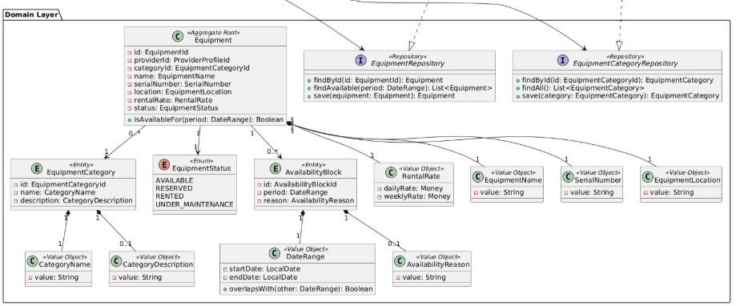

**Explicación del Proceso:**

La capa de dominio contiene el agregado raíz `Equipment`, el cual encapsula la lógica de negocio relacionada con la maquinaria. `Equipment` se relaciona con `EquipmentCategory` para su clasificación, utiliza el Value Object `RentalRate` para definir los costos de alquiler y gestiona bloques de indisponibilidad mediante `AvailabilityBlock` y `DateRange`.

**Conexión de la Capa:**

Las entidades del dominio definen los contratos de persistencia `EquipmentRepository` y `EquipmentCategoryRepository`. Estos contratos permiten mantener la lógica de negocio independiente de las tecnologías utilizadas en el backend desarrollado con Node.js, aplicando el principio de Inversión de Dependencias (DIP).

### B. Application Layer

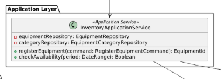

**Explicación del Proceso:**

Contiene `InventoryApplicationService`, responsable de coordinar los casos de uso como el registro de maquinaria mediante `RegisterEquipmentCommand` y la verificación de disponibilidad de equipos para las empresas constructoras.

**Conexión de la Capa:**

`InventoryApplicationService` recibe las solicitudes desde la capa de Interfaces e interactúa con el dominio mediante los contratos definidos en `EquipmentRepository` y `EquipmentCategoryRepository`.

### C. Infrastructure Layer

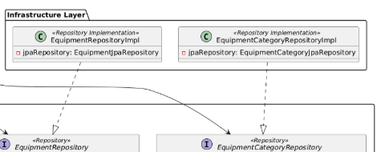

**Explicación del Proceso:**

Implementa los mecanismos de acceso y persistencia de datos mediante `EquipmentRepositoryImpl` y `EquipmentCategoryRepositoryImpl`, utilizando el entorno Node.js para gestionar la información almacenada en MySQL.

**Conexión de la Capa:**

Implementa los contratos de repositorio definidos en el dominio, permitiendo almacenar y recuperar información de la maquinaria y transformar los Value Objects en estructuras compatibles con la base de datos MySQL.

### D. Interfaces Layer

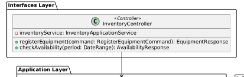

**Explicación del Proceso:**

A través de `InventoryController`, expone endpoints HTTP REST desarrollados en Node.js que reciben solicitudes JSON desde la aplicación web construida con Vue.js.

**Conexión de la Capa:**

Transforma las peticiones HTTP en objetos de entrada, como `RegisterEquipmentCommand`, y los envía a `InventoryApplicationService` para ejecutar los casos de uso correspondientes.

## Rentals

### A. Domain Layer

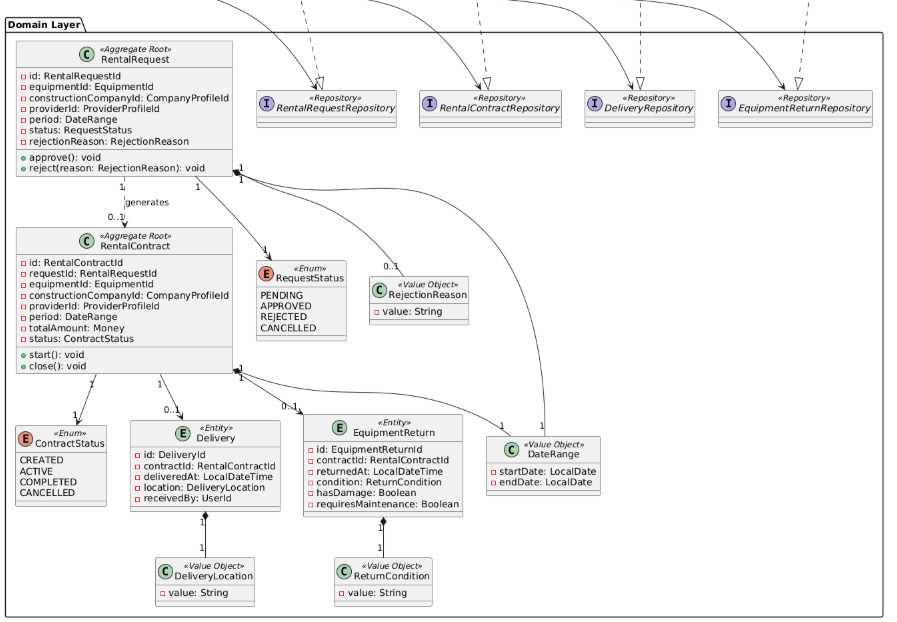

**Explicación del Proceso:**

La gestión de alquileres comienza con el agregado `RentalRequest`, inicialmente en estado `PENDING`. Cuando la solicitud es aprobada, se genera la entidad `RentalContract`, que administra la relación contractual y se vincula con `Delivery` y `EquipmentReturn` para registrar la entrega y devolución de la maquinaria.

**Conexión de la Capa:**

Define los contratos `RentalRequestRepository`, `RentalContractRepository`, `EquipmentReturnRepository` y `DeliveryRepository`, además del puerto de integración `InventoryAvailabilityPort`, encargado de validar la disponibilidad de maquinaria.

### B. Application Layer

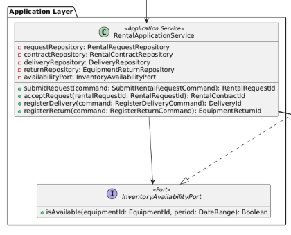

**Explicación del Proceso:**

`RentalApplicationService` coordina las operaciones relacionadas con los alquileres, incluyendo la aceptación de solicitudes mediante `acceptRequest`, el registro de entregas mediante `registerDelivery` y el procesamiento de devoluciones mediante `registerReturn`.

**Conexión de la Capa:**

Recibe las peticiones provenientes de la capa de Interfaces, utiliza los repositorios correspondientes y se comunica con el contexto de Inventory mediante el puerto de disponibilidad.

### C. Infrastructure Layer

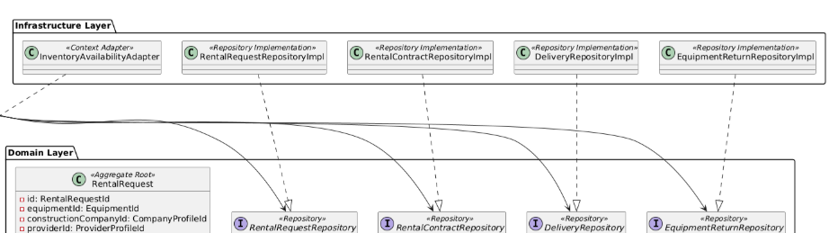

**Explicación del Proceso:**

Contiene las implementaciones concretas de los repositorios de alquiler y el adaptador `InventoryAvailabilityAdapter`, responsables de realizar operaciones de persistencia y facilitar la comunicación con el módulo de inventario.

**Conexión de la Capa:**

Implementa los contratos definidos en el dominio mediante los mecanismos de acceso a datos del backend Node.js, realizando consultas a MySQL para gestionar solicitudes, contratos, entregas y devoluciones de maquinaria.

### D. Interfaces Layer

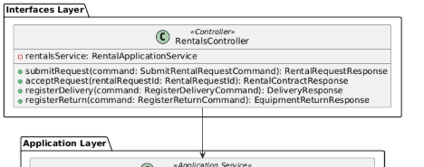

**Explicación del Proceso:**

`RentalsController` gestiona los endpoints HTTP REST que permiten a los usuarios de la aplicación Vue.js crear solicitudes de alquiler, consultar contratos y actualizar el estado de las operaciones.

**Conexión de la Capa:**

Recibe las peticiones HTTP, procesa los datos enviados en formato JSON e invoca los métodos expuestos por `RentalApplicationService`, devolviendo las respuestas mediante objetos DTO.

## Maintenance

### A. Domain Layer

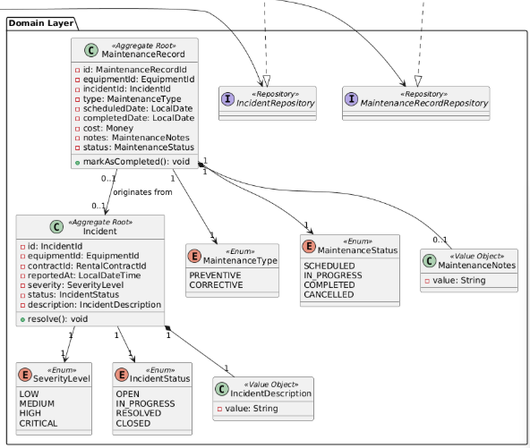

**Explicación del Proceso:**

Agrupa los agregados `Incident`, encargado de representar los reportes de fallas de maquinaria, y `MaintenanceRecord`, que registra las intervenciones de mantenimiento preventivo y correctivo.

**Conexión de la Capa:**

Un `Incident` no resuelto puede relacionarse con un `MaintenanceRecord`. Además, declara el puerto `EquipmentStatusPort` para comunicar al módulo de inventario los cambios de estado de los equipos que ingresan a mantenimiento.

### B. Application Layer

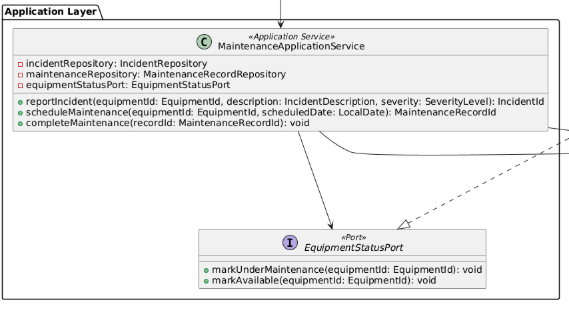

**Explicación del Proceso:**

`MaintenanceApplicationService` coordina los casos de uso relacionados con el reporte de averías mediante `reportIncident`, la programación de mantenimientos mediante `scheduleMaintenance` y la finalización de trabajos técnicos mediante `completeMaintenance`.

**Conexión de la Capa:**

Utiliza los repositorios del dominio para gestionar las operaciones de mantenimiento y se comunica mediante `EquipmentStatusPort` para actualizar el estado de la maquinaria a `UNDER_MAINTENANCE`.

### C. Infrastructure Layer

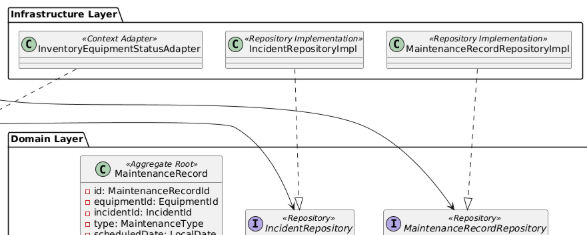

**Explicación del Proceso:**

Contiene `IncidentRepositoryImpl`, `MaintenanceRecordRepositoryImpl` y el adaptador `InventoryEquipmentStatusAdapter`, responsables de implementar la persistencia de incidentes y mantenimientos, así como la comunicación con el módulo de inventario mediante el backend Node.js.

**Conexión de la Capa:**

Implementa las operaciones de acceso a datos mediante Node.js y MySQL, permitiendo registrar incidentes, actualizar mantenimientos y comunicar los cambios de estado de la maquinaria.

### D. Interfaces Layer

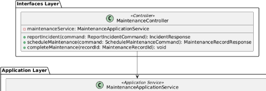

**Explicación del Proceso:**

`MaintenanceController` expone endpoints HTTP REST que permiten a los usuarios de la aplicación Vue.js registrar incidentes, consultar mantenimientos y actualizar los procesos de reparación de maquinaria.

**Conexión de la Capa:**

Recibe las solicitudes HTTP del cliente web, procesa los datos JSON y delega las operaciones correspondientes a `MaintenanceApplicationService`.

## Subscription

### A. Domain Layer

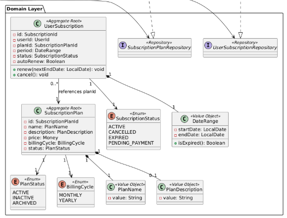

**Explicación del Proceso:**

Contiene la entidad `SubscriptionPlan`, encargada de definir los planes disponibles, y `UserSubscription`, que representa las suscripciones de los usuarios. Utiliza el Value Object `DateRange` para gestionar los períodos de vigencia, el enumerado `BillingCycle` para establecer la periodicidad de facturación y el atributo booleano `autoRenew` para controlar la renovación automática.

**Conexión de la Capa:**

Define los contratos `UserSubscriptionRepository`, `SubscriptionPlanRepository` y el puerto `PaymentConnector`, que permite integrar servicios externos de procesamiento de pagos sin depender directamente de su implementación.

### B. Application Layer

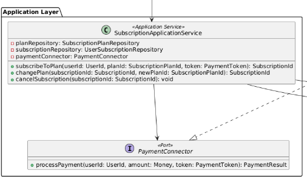

**Explicación del Proceso:**

`SubscriptionApplicationService` coordina los casos de uso relacionados con la selección de planes, administración de suscripciones y procesamiento de pagos recurrentes.

**Conexión de la Capa:**

Utiliza los repositorios del dominio para consultar y actualizar las suscripciones, y delega las operaciones de pago al puerto `PaymentConnector`.

### C. Infrastructure Layer

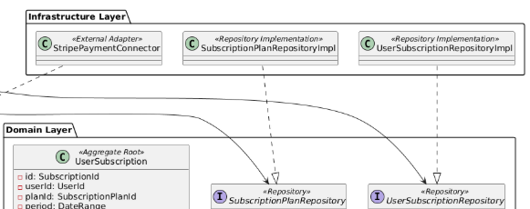

**Explicación del Proceso:**

Contiene las implementaciones de los repositorios de suscripciones y el adaptador `StripePaymentConnector`, que permite integrar el backend desarrollado con Node.js con los servicios externos de procesamiento de pagos de Stripe.

**Conexión de la Capa:**

Implementa los contratos del dominio para almacenar información de suscripciones en MySQL y gestionar la comunicación con la pasarela de pagos externa.

### D. Interfaces Layer

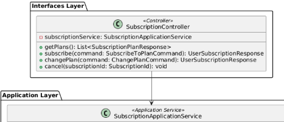

**Explicación del Proceso:**

`SubscriptionController` expone endpoints HTTP REST que permiten a los usuarios de la aplicación Vue.js seleccionar, modificar o cancelar sus planes de suscripción.

**Conexión de la Capa:**

Recibe las solicitudes JSON del cliente web y las dirige hacia `SubscriptionApplicationService`, encargado de ejecutar los casos de uso correspondientes.

## IAM

### A. Domain Layer

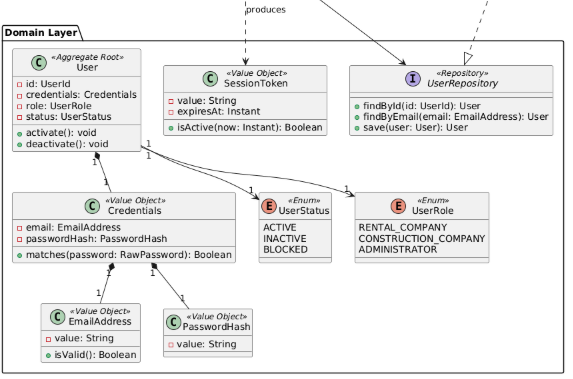

**Explicación del Proceso:**

Contiene la entidad raíz `User`, encargada de representar las cuentas de usuario. Incorpora el Value Object `Credentials`, que almacena el correo electrónico y el hash de la contraseña, y utiliza `UserRole` y `UserStatus` para gestionar los permisos y estados de las cuentas.

**Conexión de la Capa:**

Define el contrato `UserRepository`, que establece las operaciones necesarias para registrar, consultar y administrar cuentas de usuario, manteniendo la lógica del dominio independiente de las tecnologías de persistencia.

### B. Application Layer

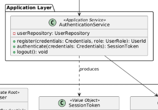

**Explicación del Proceso:**

`AuthenticationService` coordina los procesos de registro, inicio de sesión, validación de credenciales y generación de tokens de sesión mediante `SessionToken`.

**Conexión de la Capa:**

Utiliza `UserRepository` para consultar la información de los usuarios, validar las credenciales y ejecutar las operaciones relacionadas con la autenticación.

### C. Infrastructure Layer

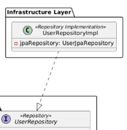

**Explicación del Proceso:**

`UserRepositoryImpl` implementa los mecanismos de persistencia de usuarios mediante el backend Node.js, utilizando MySQL para almacenar la información de las cuentas.

**Conexión de la Capa:**

Implementa el contrato `UserRepository` definido en el dominio y permite almacenar y recuperar los datos de los usuarios desde la base de datos.

### D. Interfaces Layer

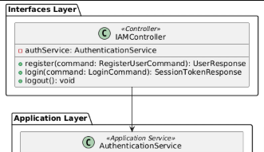

**Explicación del Proceso:**

`IAMController` gestiona los endpoints HTTP REST `/register`, `/login` y `/logout`, permitiendo que la aplicación Vue.js realice las operaciones de registro, autenticación y cierre de sesión.

**Conexión de la Capa:**

Recibe solicitudes JSON, transforma los datos de entrada en comandos como `RegisterUserCommand` y `LoginCommand`, y delega su procesamiento a `AuthenticationService`.

## Profiles

### A. Domain Layer

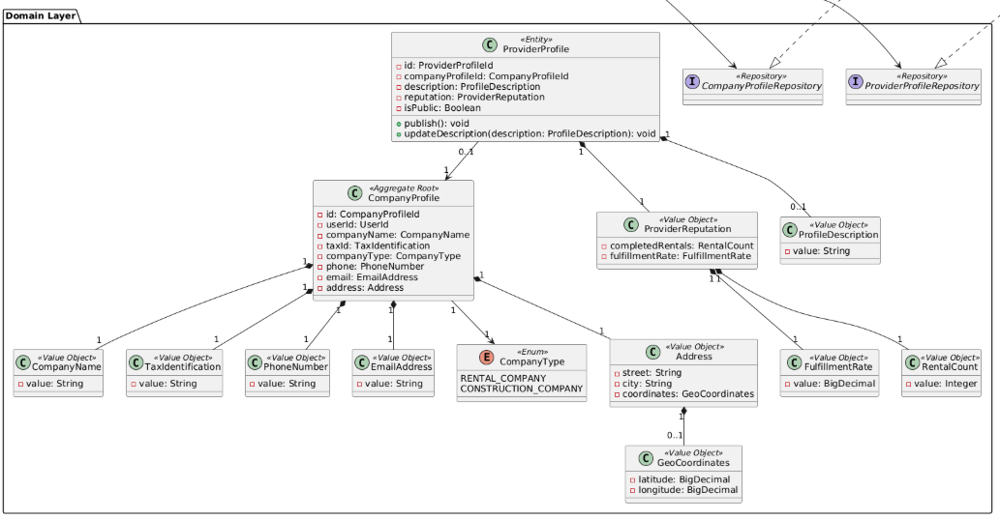

**Explicación del Proceso:**

Contiene `CompanyProfile`, entidad encargada de administrar la información de las organizaciones, que utiliza el Value Object `Address` junto con `GeoCoordinates` para representar su ubicación geográfica. `ProviderProfile` extiende las características del perfil empresarial para incluir información específica de los proveedores de maquinaria y métricas de reputación.

**Conexión de la Capa:**

Define los contratos `CompanyProfileRepository` y `ProviderProfileRepository`, además de las relaciones entre las entidades y los tipos de empresa representados mediante `CompanyType`.

### B. Application Layer

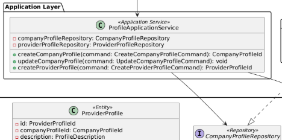

**Explicación del Proceso:**

`ProfileApplicationService` coordina los casos de uso relacionados con la creación, consulta y actualización de perfiles empresariales y de proveedores de maquinaria.

**Conexión de la Capa:**

Recibe los datos procesados por la capa de Interfaces y utiliza los repositorios del dominio para ejecutar las operaciones de administración de perfiles.

### C. Infrastructure Layer

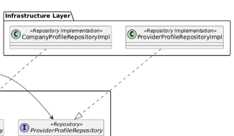

**Explicación del Proceso:**

Implementa los repositorios de perfiles empresariales y proveedores mediante los mecanismos de persistencia del backend Node.js, utilizando MySQL para almacenar y administrar la información.

**Conexión de la Capa:**

Implementa los contratos de repositorio definidos en el dominio y permite registrar, consultar y actualizar la información de las empresas y proveedores en la base de datos.

### D. Interfaces Layer

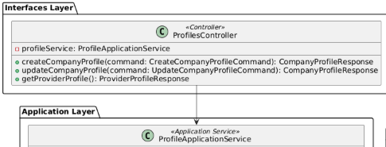

**Explicación del Proceso:**

`ProfilesController` expone endpoints HTTP REST que permiten a los usuarios de la aplicación Vue.js consultar, registrar y actualizar la información de sus perfiles empresariales.

**Conexión de la Capa:**

Recibe las solicitudes HTTP, transforma los datos JSON en objetos DTO o comandos y los envía a `ProfileApplicationService` para ejecutar los casos de uso correspondientes.

---

## 4.8. Database Design

### 4.8.1. Database Diagrams

# Capítulo V: Product Implementation, Validation & Deployment

## 5.1. Software Configuration Management

### 5.1.1. Software Development Environment Configuration

### 5.1.2. Source Code Management

### 5.1.3. Source Code Style Guide & Conventions

### 5.1.4. Software Deployment Configuration

## 5.2. Landing Page, Services & Applications Implementation

### 5.2.1. Sprint 1

#### 5.2.1.1. Sprint Planning 1

#### 5.2.1.2. Aspect Leaders and Collaborators

#### 5.2.1.3. Sprint Backlog 1

#### 5.2.1.4. Development Evidence for Sprint Review

#### 5.2.1.5. Execution Evidence for Sprint Review

#### 5.2.1.6. Services Documentation Evidence for Sprint Review

#### 5.2.1.7. Software Deployment Evidence for Sprint Review

#### 5.2.1.8. Team Collaboration Insights during Sprint

# Conclusiones

## Conclusiones y recomendaciones

# Bibliografía

# Anexos