# RentBuild

  

  
Universidad Peruana de Ciencias Aplicadas

  
Facultad de Ingeniería

  
Carrera de Ingeniería de Software

  
Ciclo académico 2026-20
 

  
<b>1ASI0730</b>

  
<b>Aplicaciones Web</b>

  
NRC

  
<b>8093</b>

  
<b>Informe de Trabajo Final</b>

  
Docente

  
<b>Bautista Ubillús, Efraín Ricardo</b>

  
Startup

  
<b>DataFlux</b>
 
  
Producto

  
<b>RentBuild</b>

  <h3>Integrantes</h3>

  <table>
    <thead>
      <tr>
        <th>Código</th>
        <th>Apellidos y Nombres</th>
      </tr>
    </thead>
    <tbody>
      <tr>
        <td>U20211B198</td>
        <td>Cisneros Salas, Luis Angel</td>
      </tr>
      <tr>
        <td>U202410211</td>
        <td>Manosalva Tovar, Miroslav Oscar</td>
      </tr>
      <tr>
        <td>U202111529</td>
        <td>Montalvo Vásquez, Bruno Rodrigo</td>
      </tr>
      <tr>
        <td>U20211F962</td>
        <td>Vargas Manchinelli, Deiby Juan</td>
      </tr>
      <tr>
        <td>U202322849</td>
        <td>Viza Quispe, Marlon Packard</td>
      </tr>
    </tbody>
  </table>
   

  
<b>Octubre, 2026</b>

## Registro de Versiones del Informe

| Versión | Fecha |  Autor   |                                                  Descripción de modificación                                                   |
| :-----: |:-----:|:--------:| :----------------------------------------------------------------------------------------------------------------------------: |
| 1.0 | 13/09/2026 | Cisneros Salas Luis Angel, Viza Quispe Marlon Packard, Manosalva Tovar Miroslav Oscar, Montalvo Vásquez Bruno Rodrigo, Vargas Manchinelli Deiby Juan | **Capítulo I: Introducción** &emsp;1.1. Startup Profile &emsp;&emsp;1.1.1. Descripción de la Startup &emsp;&emsp;1.1.2. Perfiles de integrantes del equipo &emsp;1.2. Solution Profile &emsp;&emsp;1.2.1. Antecedentes y problemática &emsp;&emsp;1.2.2. Lean UX Process &emsp;&emsp;&emsp;1.2.2.1. Lean UX Problem Statements &emsp;&emsp;&emsp;1.2.2.2. Lean UX Assumptions &emsp;&emsp;&emsp;1.2.2.3. Lean UX Hypothesis Statements &emsp;&emsp;&emsp;1.2.2.4. Lean UX Canvas &emsp;1.3. Segmentos objetivo **Capítulo II: Requirements Elicitation & Analysis** &emsp;2.1. Competidores &emsp;&emsp;2.1.1. Análisis competitivo &emsp;&emsp;2.1.2. Estrategias y tácticas frente a competidores &emsp;2.2. Entrevistas &emsp;&emsp;2.2.1. Diseño de entrevistas &emsp;&emsp;2.2.2. Registro de entrevistas &emsp;&emsp;2.2.3. Análisis de entrevistas &emsp;2.3. Needfinding &emsp;&emsp;2.3.1. User Personas &emsp;&emsp;2.3.2. User Task Matrix &emsp;&emsp;2.3.3. User Journey Mapping &emsp;&emsp;2.3.4. Empathy Mapping &emsp;2.4. Big Picture EventStorming &emsp;2.5. Ubiquitous Language **Capítulo III: Requirements Specification** &emsp;3.1. User Stories &emsp;3.2. Impact Mapping &emsp;3.3. Product Backlog **Capítulo IV: Product Design** &emsp;4.1. Style Guidelines &emsp;&emsp;4.1.1. General Style Guidelines &emsp;&emsp;4.1.2. Web Style Guidelines &emsp;4.2. Information Architecture &emsp;&emsp;4.2.1. Organization Systems &emsp;&emsp;4.2.2. Labeling Systems &emsp;&emsp;4.2.3. SEO Tags and Meta Tags &emsp;&emsp;4.2.4. Searching Systems &emsp;&emsp;4.2.5. Navigation Systems &emsp;4.3. Landing Page UI Design &emsp;&emsp;4.3.1. Landing Page Wireframe &emsp;&emsp;4.3.2. Landing Page Mock-up &emsp;4.4. Web Applications UX/UI Design &emsp;&emsp;4.4.1. Web Applications Wireframes &emsp;&emsp;4.4.2. Web Applications Wireflow Diagrams &emsp;&emsp;4.4.3. Web Applications Mock-ups &emsp;&emsp;4.4.4. Web Applications User Flow Diagrams &emsp;4.5. Web Applications Prototyping &emsp;4.6. Domain-Driven Software Architecture &emsp;&emsp;4.6.1. Design-Level EventStorming &emsp;&emsp;4.6.2. Software Architecture Context Diagram &emsp;&emsp;4.6.3. Software Architecture Container Diagrams &emsp;&emsp;4.6.4. Software Architecture Components Diagrams &emsp;4.7. Software Object-Oriented Design &emsp;&emsp;4.7.1. Class Diagrams &emsp;4.8. Database Design &emsp;&emsp;4.8.1. Database Diagrams **Capítulo V: Product Implementation, Validation & Deployment** &emsp;5.1. Software Configuration Management &emsp;&emsp;5.1.1. Software Development Environment Configuration &emsp;&emsp;5.1.2. Source Code Management &emsp;&emsp;5.1.3. Source Code Style Guide & Conventions &emsp;&emsp;5.1.4. Software Deployment Configuration &emsp;5.2. Landing Page, Services & Applications Implementation &emsp;&emsp;&emsp;5.2.1.1. Sprint Planning 1 &emsp;&emsp;&emsp;5.2.1.2. Aspect Leaders and Collaborators &emsp;&emsp;&emsp;5.2.1.3. Sprint Backlog 1 &emsp;&emsp;&emsp;5.2.1.4. Development Evidence for Sprint Review &emsp;&emsp;&emsp;5.2.1.5. Execution Evidence for Sprint Review &emsp;&emsp;&emsp;5.2.1.6. Services Documentation Evidence for Sprint Review &emsp;&emsp;&emsp;5.2.1.7. Software Deployment Evidence for Sprint Review &emsp;&emsp;&emsp;5.2.1.8. Team Collaboration Insights during Sprint |
| 1.1 | 07/10/2026 | Cisneros Salas Luis Angel, Viza Quispe Marlon Packard, Manosalva Tovar Miroslav Oscar, Montalvo Vásquez Bruno Rodrigo, Vargas Manchinelli Deiby Juan | **Capítulo V: Product Implementation, Validation & Deployment** &emsp;5.2. Landing Page, Services & Applications Implementation &emsp;&emsp;5.2.2. Sprint 2 &emsp;&emsp;&emsp;5.2.2.1. Sprint Planning 2 &emsp;&emsp;&emsp;5.2.2.2. Aspect Leaders and Collaborators &emsp;&emsp;&emsp;5.2.2.3. Sprint Backlog 2 &emsp;&emsp;&emsp;5.2.2.4. Development Evidence for Sprint Review &emsp;&emsp;&emsp;5.2.2.5. Execution Evidence for Sprint Review &emsp;&emsp;&emsp;5.2.2.6. Services Documentation Evidence for Sprint Review &emsp;&emsp;&emsp;5.2.2.7. Software Deployment Evidence for Sprint Review &emsp;&emsp;&emsp;5.2.2.8. Team Collaboration Insights during Sprint |
| 1.2 | 08/10/2026 | Equipo DataFlux — revisión pendiente | Recuperación de las secciones acumulativas del informe para TB1, conservación de los nuevos diagramas de clases y de la matriz de personas corregida, y revisión de referencias locales. Sprint 2 permanece como borrador hasta incorporar evidencia verificable. |

## Project Report Collaboration Insights

A continuación, se presenta el repositorio utilizado para la elaboración colaborativa del informe del proyecto RentBuild.

#### Link del repositorio del Reporte:

- https://github.com/upc-pre-202620-1asi0730-8093-dataflux/dataflux-project-report.git

| Entrega | Semana | Descripción |
| :--- | :---: | :--- |
| AV1 – Sprint Review | 4 | **Cisneros Salas Luis Angel:** En este Sprint 1 realicé el Needfinding del proyecto (User Personas, User Task Matrix, Big Picture EventStorming y Ubiquitous Language), la definición de los sistemas de búsqueda y navegación de la Información Architecture, el diseño UX/UI de la Web Application (Wireframes y Wireflow Diagrams), la configuración del entorno de desarrollo, y la documentación completa del Sprint 1 (Sprint Planning, matriz de liderazgo y colaboración, Sprint Backlog, evidencia de desarrollo, ejecución, servicios y despliegue). **Viza Quispe Marlon Packard:** En este Sprint 1 realicé el análisis competitivo del proyecto RentBuild, incluyendo la comparación de competidores, sus fortalezas, debilidades y estrategias de diferenciación. Asimismo, desarrollé el diseño UX/UI de la Landing Page mediante Wireframes y Mock-ups, definiendo su estructura visual y distribución de contenidos. Finalmente, participé en la implementación del código de la Landing Page, trasladando los diseños realizados a una interfaz web funcional y responsive.  **Manosalva Tovar Miroslav Oscar:** En este Sprint 1 elaboré el Solution Profile, el Lean UX Process y los Target Segments del proyecto RentBuild, definiendo el problema y los segmentos a los que se dirige la solución. Asimismo, desarrollé las Style Guidelines, la Information Architecture, y los Web Applications User Flow Diagrams y Wireflow Diagrams, estableciendo la base visual y de navegación de la plataforma. Finalmente, participé en la implementación de la Web Application, desarrollando las pantallas de registro de maquinaria, bandeja de solicitudes y alquileres activos. **Montalvo Vásquez Bruno Rodrigo:** **Vargas Manchinelli Deiby Juan:** En este Sprint 1 elaboré el Startup Profile y participé en el Solution Profile, describiendo a la startup y la propuesta de valor de RentBuild. Asimismo, definí las Style Guidelines del proyecto, estableciendo los lineamientos visuales para el diseño de la Landing Page y la Web Application. Finalmente, desarrollé los diagramas de arquitectura de software (contexto, contenedores y componentes) y los diagramas de clases y de base de datos. |
| TB1 – Stage Review | 7 | |
| AV2 – Sprint Review | 12 | |
| TB2 – Release Review | 15 | |

### Entrega AV1:

#### Participación por integrante:

##### Commits en el Project Report:

# Contenido

## Índice

- [Registro de Versiones del Informe](#registro-de-versiones-del-informe)
- [Project Report Collaboration Insights](#project-report-collaboration-insights)
- [Contenido](#contenido)
- [Student Outcome](#student-outcome)
- [Capítulo I: Introducción](#capítulo-i-introducción)
    - [1.1. Startup Profile](#11-startup-profile)
        - [1.1.1. Descripción de la Startup](#111-descripción-de-la-startup)
        - [1.1.2. Perfiles de integrantes del equipo](#112-perfiles-de-integrantes-del-equipo)
    - [1.2. Solution Profile](#12-solution-profile)
        - [1.2.1. Antecedentes y problemática](#121-antecedentes-y-problemática)
        - [1.2.2. Lean UX Process](#122-lean-ux-process)
            - [1.2.2.1. Lean UX Problem Statements](#1221-lean-ux-problem-statements)
            - [1.2.2.2. Lean UX Assumptions](#1222-lean-ux-assumptions)
            - [1.2.2.3. Lean UX Hypothesis Statements](#1223-lean-ux-hypothesis-statements)
            - [1.2.2.4. Lean UX Canvas](#1224-lean-ux-canvas)
    - [1.3. Segmentos objetivo](#13-segmentos-objetivo)
- [Capítulo II: Requirements Elicitation & Analysis](#capítulo-ii-requirements-elicitation--analysis)
    - [2.1. Competidores](#21-competidores)
        - [2.1.1. Análisis competitivo](#211-análisis-competitivo)
        - [2.1.2. Estrategias y tácticas frente a competidores](#212-estrategias-y-tácticas-frente-a-competidores)
    - [2.2. Entrevistas](#22-entrevistas)
        - [2.2.1. Diseño de entrevistas](#221-diseño-de-entrevistas)
        - [2.2.2. Registro de entrevistas](#222-registro-de-entrevistas)
        - [2.2.3. Análisis de entrevistas](#223-análisis-de-entrevistas)
    - [2.3. Needfinding](#23-needfinding)
        - [2.3.1. User Personas](#231-user-personas)
        - [2.3.2. User Task Matrix](#232-user-task-matrix)
        - [2.3.3. User Journey Mapping](#233-user-journey-mapping)
        - [2.3.4. Empathy Mapping](#234-empathy-mapping)
    - [2.4. Big Picture Event Storming](#24-big-picture-event-storming)
    - [2.5. Ubiquitous Language](#25-ubiquitous-language)
- [Capítulo III: Requirements Specification](#capítulo-iii-requirements-specification)
    - [3.1. User Stories](#31-user-stories)
    - [3.2. Impact Mapping](#32-impact-mapping)
    - [3.3. Product Backlog](#33-product-backlog)
- [Capítulo IV: Product Design](#capítulo-iv-product-design)
    - [4.1. Style Guidelines](#41-style-guidelines)
        - [4.1.1. General Style Guidelines](#411-general-style-guidelines)
        - [4.1.2. Web Style Guidelines](#412-web-style-guidelines)
    - [4.2. Information Architecture](#42-information-architecture)
        - [4.2.1. Organization Systems](#421-organization-systems)
        - [4.2.2. Labeling Systems](#422-labeling-systems)
        - [4.2.3. SEO Tags and Meta Tags](#423-seo-tags-and-meta-tags)
        - [4.2.4. Searching Systems](#424-searching-systems)
        - [4.2.5. Navigation Systems](#425-navigation-systems)
    - [4.3. Landing Page UI Design](#43-landing-page-ui-design)
        - [4.3.1. Landing Page Wireframe](#431-landing-page-wireframe)
        - [4.3.2. Landing Page Mock-up](#432-landing-page-mock-up)
    - [4.4. Web Applications UX/UI Design](#44-web-applications-uxui-design)
        - [4.4.1. Web Applications Wireframes](#441-web-applications-wireframes)
        - [4.4.2. Web Applications Wireflow Diagrams](#442-web-applications-wireflow-diagrams)
        - [4.4.3. Web Applications Mock-ups](#443-web-applications-mock-ups)
        - [4.4.4. Web Applications User Flow Diagrams](#444-web-applications-user-flow-diagrams)
    - [4.5. Web Applications Prototyping](#45-web-applications-prototyping)
    - [4.6. Domain-Driven Software Architecture](#46-domain-driven-software-architecture)
        - [4.6.1. Design-Level Event Storming](#461-design-level-event-storming)
        - [4.6.2. Software Architecture Context Diagram](#462-software-architecture-context-diagram)
        - [4.6.3. Software Architecture Container Diagrams](#463-software-architecture-container-diagrams)
        - [4.6.4. Software Architecture Components Diagrams](#464-software-architecture-components-diagrams)
    - [4.7. Software Object-Oriented Design](#47-software-object-oriented-design)
        - [4.7.1. Class Diagrams](#471-class-diagrams)
    - [4.8. Database Design](#48-database-design)
        - [4.8.1. Database Diagrams](#481-database-diagrams)
- [Capítulo V: Product Implementation, Validation & Deployment](#capítulo-v-product-implementation-validation--deployment)
    - [5.1. Software Configuration Management](#51-software-configuration-management)
        - [5.1.1. Software Development Environment Configuration](#511-software-development-environment-configuration)
        - [5.1.2. Source Code Management](#512-source-code-management)
        - [5.1.3. Source Code Style Guide & Conventions](#513-source-code-style-guide--conventions)
        - [5.1.4. Software Deployment Configuration](#514-software-deployment-configuration)
    - [5.2. Landing Page, Services & Applications Implementation](#52-landing-page-services--applications-implementation)
        - [5.2.1. Sprint 1](#521-sprint-1)
            - [5.2.1.1. Sprint Planning 1](#5211-sprint-planning-1)
            - [5.2.1.2. Aspect Leaders and Collaborators](#5212-aspect-leaders-and-collaborators)
            - [5.2.1.3. Sprint Backlog 1](#5213-sprint-backlog-1)
            - [5.2.1.4. Development Evidence for Sprint Review](#5214-development-evidence-for-sprint-review)
            - [5.2.1.5. Execution Evidence for Sprint Review](#5215-execution-evidence-for-sprint-review)
            - [5.2.1.6. Services Documentation Evidence for Sprint Review](#5216-services-documentation-evidence-for-sprint-review)
            - [5.2.1.7. Software Deployment Evidence for Sprint Review](#5217-software-deployment-evidence-for-sprint-review)
            - [5.2.1.8. Team Collaboration Insights during Sprint](#5218-team-collaboration-insights-during-sprint)
        - [5.2.2. Sprint 2](#522-sprint-2)
            - [5.2.2.1. Sprint Planning 2](#5221-sprint-planning-2)
            - [5.2.2.2. Aspect Leaders and Collaborators](#5222-aspect-leaders-and-collaborators)
            - [5.2.2.3. Sprint Backlog 2](#5223-sprint-backlog-2)
            - [5.2.2.4. Development Evidence for Sprint Review](#5224-development-evidence-for-sprint-review)
            - [5.2.2.5. Execution Evidence for Sprint Review](#5225-execution-evidence-for-sprint-review)
            - [5.2.2.6. Services Documentation Evidence for Sprint Review](#5226-services-documentation-evidence-for-sprint-review)
            - [5.2.2.7. Software Deployment Evidence for Sprint Review](#5227-software-deployment-evidence-for-sprint-review)
            - [5.2.2.8. Team Collaboration Insights during Sprint](#5228-team-collaboration-insights-during-sprint)
- [Conclusiones](#conclusiones)
    - [Conclusiones y recomendaciones](#conclusiones-y-recomendaciones)
- [Video About-The-Team](#video-about-the-team)
- [Bibliografía](#bibliografía)
- [Anexos](#anexos)

## Student Outcome

El curso contribuye al cumplimiento del Student Outcome ABET:  
**ABET - EAC - Student Outcome 5**

**Criterio:** *La capacidad de funcionar efectivamente en un equipo cuyos miembros
juntos proporcionan liderazgo, crean un entorno de colaboración e inclusivo,
establecen objetivos, planifican tareas y cumplen objetivos.*

En el siguiente cuadro se describe las acciones realizadas y enunciados de conclusiones por parte del grupo, que permiten sustentar el haber alcanzado el logro del ABET - EAC - Student Outcome 5.

| Criterio específico | Acciones realizadas | Conclusiones |
|:---|:---|:---|
| **Trabaja en equipo para proporcionar liderazgo en forma conjunta.** | **Cisneros Salas, Luis Angel** **AV1:** Lideró la documentación y coordinación del Sprint 1, incluyendo el Sprint Planning, la definición de objetivos y la elaboración de la matriz de Leadership-and-Collaboration (LACX), asignando líderes y colaboradores por cada aspecto del sprint entre los integrantes del equipo. Organizó el Sprint Backlog en Trello, desglosando las User Stories del equipo en Work-Items con estimaciones y asignaciones claras para cada miembro. Coordinó y documentó la evidencia de desarrollo, ejecución y despliegue del Sprint 1, consolidando el trabajo individual del equipo en un reporte conjunto. Definió y distribuyó los User Goals, Task Flows y Wireflow Diagrams de la Web Application, estableciendo la base de diseño que el resto del equipo siguió para el desarrollo de las pantallas.  **Manosalva Tovar, Miroslav Oscar** **AV1:** Durante el desarrollo del proyecto RentBuild, participé activamente en la elaboración de diferentes componentes relacionados con la experiencia de usuario y la documentación de la solución, entre ellos el Lean UX Process, Target Segments, Style Guidelines, Information Architecture, Web Applications User Flow y Web Applications WireFlow. Estas actividades requirieron coordinación con los demás integrantes del equipo para mantener coherencia entre la propuesta de valor, las necesidades de los usuarios, el diseño de las interfaces y la documentación general del proyecto. El trabajo colaborativo se gestionó mediante una organización en GitHub, utilizando repositorios independientes para la documentación de la solución y para el desarrollo de la Landing Page. Cada integrante trabajó sobre ramas específicas de acuerdo con las tareas asignadas y posteriormente realizó Pull Requests hacia la rama develop. Este procedimiento permitió que los cambios fueran revisados por otros miembros antes de ser integrados, promoviendo una responsabilidad compartida sobre la calidad del proyecto. Asimismo, participé en la revisión, corrección y actualización de diferentes elementos del trabajo, contribuyendo a mantener la continuidad entre las actividades realizadas por los distintos miembros y facilitando la integración de los entregables del equipo.  **Montalvo Vásquez, Bruno Rodrigo** **AV1:** Durante el desarrollo de la primera entrega de RentBuild, participé activamente en el trabajo colaborativo del equipo mediante la realización de actividades relacionadas con la identificación de necesidades de los usuarios y la definición inicial de la solución. Participé en el diseño y realización de entrevistas, así como en el registro y análisis de la información obtenida durante el proceso de Needfinding. A partir de estos resultados, contribuí en la elaboración del Impact Mapping, las User Stories y el Product Backlog, permitiendo organizar las necesidades identificadas y relacionarlas con los objetivos y funcionalidades iniciales de RentBuild. Asimismo, participé en la elaboración de los diagramas de clase y diagramas de datos, y colaboré en el desarrollo del diagramado C4 junto con otros integrantes del equipo. Estas actividades requirieron coordinación con los demás miembros para mantener coherencia entre las necesidades identificadas, los requisitos definidos y la representación de la solución.  **Vargas Manchinelli, Deiby Juan** **AV1:** Durante el desarrollo de la primera entrega de RentBuild, participé en la elaboración del diagramado C4 de la solución, coordinando este trabajo con los demás integrantes para representar de manera coherente la arquitectura propuesta y sus principales componentes. Asimismo, participé en la estructura y despliegue de la Landing Page, contribuyendo a integrar el trabajo de desarrollo con los demás artefactos definidos para el proyecto. Estas actividades requirieron coordinación con el equipo para mantener consistencia entre la arquitectura, la estructura de la solución y los avances de implementación.  **Viza Quispe, Marlon Packard** **AV1:** Durante el desarrollo del Sprint 1 de RentBuild, participé activamente en la elaboración del análisis competitivo, identificando las fortalezas, debilidades y estrategias de diferenciación frente a otras plataformas. Asimismo, asumí la responsabilidad del diseño UX/UI de la Landing Page mediante la elaboración de Wireframes y Mock-ups, definiendo su estructura visual y organización de contenidos. Posteriormente, participé en la implementación del código de la Landing Page, trasladando los diseños a una interfaz web funcional y responsive. Estas actividades requirieron coordinación con los demás integrantes del equipo para mantener la coherencia entre la propuesta de valor, el diseño y el desarrollo del producto, contribuyendo al cumplimiento de los objetivos establecidos para el Sprint 1. | **AV1:** Como equipo, concluimos que el liderazgo compartido permitió distribuir las responsabilidades de acuerdo con las actividades asignadas a cada integrante y avanzar de manera paralela en los diferentes artefactos de la primera entrega. La participación en actividades de investigación, definición de requisitos, diseño, arquitectura y desarrollo permitió integrar los distintos aportes en una primera versión de RentBuild. La coordinación entre los integrantes permitió relacionar los resultados del Needfinding con las User Stories, el Product Backlog, los diagramas de arquitectura y los primeros avances de la Landing Page, estableciendo una base para continuar el desarrollo en las siguientes entregas. |
| **Crea un entorno colaborativo e inclusivo, establece metas, planifica tareas y cumple objetivos.** | **Cisneros Salas, Luis Angel** **AV1:** Estableció las metas del Sprint 1 al definir el Sprint Goal y coordinar con el equipo el alcance de las User Stories a cubrir, articulando la meta común del equipo antes de iniciar el desarrollo. Planificó las tareas del sprint mediante el desglose del Sprint Backlog en Trello, distribuyendo el trabajo entre los integrantes según sus fortalezas y disponibilidad. Fomentó un entorno colaborativo al coordinar la comunicación del equipo mediante WhatsApp y Trello, facilitando que cada integrante conociera el avance y los pendientes del resto. Dio seguimiento al cumplimiento de los objetivos planteados, verificando que las tareas asignadas se completaran dentro del tiempo estimado del sprint.  **Manosalva Tovar, Miroslav Oscar** **AV1:** Durante el proyecto mantuve una participación activa y colaborativa, considerando las observaciones y aportes realizados por los demás integrantes antes de incorporar cambios a los entregables. La división del trabajo mediante ramas de Git permitió establecer responsabilidades específicas y desarrollar las tareas de forma organizada, mientras que el uso de Pull Requests proporcionó un espacio para revisar los cambios, realizar observaciones y proponer mejoras antes de integrarlos a la versión principal del proyecto. Ante observaciones o inconsistencias identificadas durante las revisiones, se analizaron los comentarios del equipo y se realizaron los ajustes necesarios buscando mantener la coherencia entre las distintas secciones del proyecto. Este flujo de trabajo permitió que los integrantes pudieran participar tanto en la elaboración como en la validación de los entregables. De esta manera, se promovió la cooperación y la integración del grupo mediante una metodología de trabajo en la que las contribuciones individuales eran revisadas y complementadas por otros miembros, permitiendo avanzar de forma coordinada hacia los objetivos establecidos para RentBuild.  **Montalvo Vásquez, Bruno Rodrigo** **AV1:** Participé en la planificación y desarrollo de las actividades asignadas para la primera entrega, coordinando con los integrantes del equipo la realización de entrevistas, el proceso de Needfinding y la definición de los requisitos iniciales de RentBuild. Los resultados obtenidos fueron utilizados como base para elaborar el Impact Mapping, las User Stories y el Product Backlog, contribuyendo a establecer y organizar las funcionalidades que formarían parte de la solución. Asimismo, participé en la elaboración de los diagramas de clase, diagramas de datos y diagramado C4, coordinando estos artefactos con el resto de la documentación del proyecto. El trabajo fue desarrollado de manera colaborativa, considerando los aportes y avances de los demás integrantes para mantener la coherencia entre las diferentes partes de la solución y cumplir con los objetivos establecidos para la AV1.  **Vargas Manchinelli, Deiby Juan** **AV1:** Participé en el cumplimiento de los objetivos de la primera entrega mediante el desarrollo de las actividades relacionadas con el diagramado C4 y la estructura y despliegue de la Landing Page. Coordiné con los integrantes responsables de otros artefactos para mantener coherencia entre la arquitectura planteada y la implementación realizada. Asimismo, participé en la revisión e integración de los avances de la Landing Page, contribuyendo a que las tareas asignadas se desarrollaran de acuerdo con los objetivos establecidos para la AV1.  **Viza Quispe, Marlon Packard** **AV1:** Durante el Sprint 1 de RentBuild, contribuí al cumplimiento de los objetivos del equipo mediante la planificación y ejecución de mis responsabilidades en el análisis competitivo, diseño UX/UI e implementación de la Landing Page. Mantuve una comunicación constante con mis compañeros para coordinar los avances, recibir observaciones y realizar los ajustes necesarios en los entregables. Asimismo, participé en la integración del diseño y desarrollo de la plataforma, procurando mantener la coherencia visual y funcional del producto. Esta colaboración permitió cumplir con las tareas asignadas dentro de los plazos establecidos y contribuir al logro de las metas del Sprint 1. | **AV1:** La definición del Sprint Goal, la organización de las tareas y la distribución de responsabilidades permitieron establecer una forma de trabajo coordinada durante esta primera entrega. El uso de herramientas de colaboración y control de versiones permitió organizar los aportes individuales e integrar progresivamente los diferentes artefactos del proyecto. Como resultado, el equipo logró avanzar en la identificación de necesidades, definición de requisitos, arquitectura, diseño y desarrollo de la Landing Page. Estos resultados corresponden al avance alcanzado durante la AV1 y servirán como base para continuar con la implementación y validación de RentBuild en las siguientes etapas del proyecto. |

# Capítulo I: Introducción

## 1.1. Startup Profile

### 1.1.1. Descripción de la Startup

DataFlux es una startup orientada al desarrollo de soluciones digitales accesibles que permitan organizar y optimizar los procesos de pequeñas y medianas empresas. Su propuesta se enfoca en resolver problemas operativos mediante herramientas especializadas, sencillas de utilizar y adaptadas a las necesidades de sus usuarios.

Como parte de esta iniciativa, DataFlux desarrolla **RentBuild**, una plataforma SaaS dirigida principalmente a pequeñas y medianas empresas dedicadas al alquiler de maquinaria y equipos para construcción, así como a pequeñas empresas constructoras que requieren estos equipos para el desarrollo de sus proyectos. Estas organizaciones suelen gestionar sus operaciones mediante hojas de cálculo, llamadas, mensajes y sistemas independientes, lo que dificulta el control de la disponibilidad de los equipos, el seguimiento de las operaciones y la coordinación entre las partes involucradas.

RentBuild centralizará la gestión del inventario, disponibilidad, reservas, alquileres, contratos, pagos, entregas, devoluciones, incidencias y mantenimiento de los equipos. De esta manera, permitirá realizar el seguimiento de la maquinaria durante todo su ciclo de alquiler y facilitará la interacción entre las empresas que ofrecen maquinaria y las pequeñas empresas constructoras que necesitan disponer de estos equipos para ejecutar sus proyectos.

#### Misión

Nuestra misión es facilitar la gestión integral de las pequeñas y medianas empresas dedicadas al alquiler de maquinaria y mejorar la interacción con las pequeñas empresas constructoras mediante una plataforma digital sencilla, accesible y confiable. Buscamos centralizar las operaciones relacionadas con el alquiler, reducir errores en la disponibilidad y las reservas, mejorar el control del estado de los equipos y ofrecer una experiencia más eficiente para todos los participantes del proceso.

#### Visión

Nuestra visión es convertirnos en una startup referente en el Perú en soluciones digitales para la gestión del alquiler de maquinaria y equipos de construcción, contribuyendo a que las pequeñas y medianas empresas profesionalicen sus operaciones y a que las pequeñas empresas constructoras accedan a procesos de alquiler más eficientes, organizados y confiables.

#### Valores

Nuestros valores principales son los siguientes:

- **Innovación:** Aplicamos tecnología para mejorar y simplificar los procesos tradicionales relacionados con el alquiler y la gestión de maquinaria.
- **Simplicidad:** Diseñamos soluciones comprensibles y accesibles para empresas con diferentes niveles de experiencia tecnológica.
- **Responsabilidad:** Promovemos una gestión adecuada de los equipos, la información y las operaciones realizadas mediante la plataforma.
- **Colaboración:** Valoramos el trabajo en equipo y la comunicación entre DataFlux, las empresas de alquiler y las empresas constructoras que utilizarán RentBuild.
- **Calidad:** Buscamos ofrecer una plataforma confiable, organizada y orientada a las necesidades reales de sus usuarios.

### 1.1.2. Perfiles de integrantes del equipo

|   Código   | Nombre completo del integrante  | Descripción de la carrera                                          |                               Fotografía                                | Conocimientos y habilidades                                                                                                                                                                                                                                                                                                                                                                                                                                                                                                                                                                                                                                                                                                                                                                                                                                                                                                                                                                                                   |
|:----------:|:--------------------------------| :----------------------------------------------------------------- |:----------------------------------------------------------------------------:|:------------------------------------------------------------------------------------------------------------------------------------------------------------------------------------------------------------------------------------------------------------------------------------------------------------------------------------------------------------------------------------------------------------------------------------------------------------------------------------------------------------------------------------------------------------------------------------------------------------------------------------------------------------------------------------------------------------------------------------------------------------------------------------------------------------------------------------------------------------------------------------------------------------------------------------------------------------------------------------------------------------------------------|
| U20211B198 | Cisneros Salas, Luis            | Ingeniería de Software - Universidad Peruana de Ciencias Aplicadas |          | Soy estudiante de Ingeniería de Software interesado en crear soluciones digitales que simplifiquen procesos y resuelvan problemas reales. Actualmente fortalezco mis conocimientos en C#, y cuento con experiencia en C++, Java, JavaScript, HTML y CSS. Me interesa especialmente el desarrollo frontend, las bases de datos y las aplicaciones web. Soy una persona organizada, responsable, de rápido aprendizaje y con facilidad para trabajar en equipo. Busco esta oportunidad para adquirir experiencia y seguir creciendo profesionalmente.                                                                                                                                                                                                                                                                                                                                                                                                                                                                           |
| U202410211 | Manosalva Tovar, Miroslav       | Ingeniería de Software - Universidad Peruana de Ciencias Aplicadas |  | Soy Miroslav Manosalva Tovar, estudiante de Ingeniería de Software. Tengo conocimientos en el área de programación y experiencia en la elaboración de interfaces de usuario (UI), que puedo aportar al desarrollo de RentBuild. Mi experiencia trabajando con interfaces me permite contribuir a la presentación de la información y a la organización visual de las funcionalidades de la plataforma. Me considero una persona responsable y persistente: procuro cumplir con las actividades que asumo y mantener el esfuerzo cuando encuentro dificultades. En este proyecto, busco aplicar mis conocimientos de programación y diseño de interfaces, seguir fortaleciendo mi formación y contribuir al desarrollo de una solución útil para sus usuarios.                                                                                                                                                                                                                                                                 |
| U202111529 | Montalvo Vasquez, Bruno Rodrigo | Ingeniería de Software - Universidad Peruana de Ciencias Aplicadas |       | Soy Bruno Rodrigo Montalvo Vasquez, estudiante de la carrera de Ingeniería de Software. Me encuentro interesado y motivado por aprender nuevos temas relacionados con mi carrera. Asimismo, estoy abierto a trabajar con profesionales de mi área académica para mejorar mis conocimientos, adquirir experiencia y fortalecer mis habilidades de trabajo en equipo.                                                                                                                                                                                                                                                                                                                                                                                                                                                                                                                                                                                                                                                           |
| U20211F962 | Vargas Manchinelli, Deiby Juan  | Ingeniería de Software - Universidad Peruana de Ciencias Aplicadas |        | Estudio Ingeniería de Software y me apasiona usar la tecnología para convertir problemas en soluciones prácticas. Actualmente estoy aprendiendo y fortaleciendo mis conocimientos en C#, además de tener experiencia con C++, Java, JavaScript, HTML y CSS. Me interesa el frontend, las bases de datos y el desarrollo web. Soy organizado, aprendo rápido y disfruto trabajar en equipo. Mi objetivo es ganar experiencia, aprender y seguir creciendo en el mundo del software.                                                                                                                                                                                                                                                                                                                                                                                                                                                                                                                                            |
| U202322849 | Viza Quispe, Marlon Packard     | Ingeniería de Software - Universidad Peruana de Ciencias Aplicadas |         | Soy estudiante de Ingeniería de Software con interés en el desarrollo web, frontend y bases de datos. Tengo experiencia con C++, Java, JavaScript, HTML y CSS, y actualmente estoy fortaleciendo mis conocimientos en C#. Me motiva crear soluciones útiles y eficientes, aprender constantemente y enfrentar nuevos desafíos. Me considero una persona organizada, creativa y con buena capacidad para trabajar en equipo.                                                                                                                                                                                                                                                                                                                                                                                                                                                                                                                                                                                                   |

## 1.2. Solution Profile

### 1.2.1. Antecedentes y problemática

**Who (¿Quiénes?)**

La problemática afecta principalmente a los propietarios, administradores y trabajadores de pequeñas y medianas empresas dedicadas al alquiler de maquinaria y equipos para construcción. También afecta a pequeñas empresas constructoras y contratistas que necesitan alquilar maquinaria para ejecutar proyectos de construcción de pequeña y mediana escala.

**What (¿Qué?)**

El problema que se investiga es la fragmentación de la información y la coordinación durante el ciclo de alquiler de maquinaria. La información relacionada con inventario, disponibilidad, reservas, contratos, pagos, entregas, devoluciones, incidencias y mantenimiento suele encontrarse distribuida entre diferentes herramientas y medios de comunicación.

Del lado de las empresas constructoras y contratistas, esta fragmentación también dificulta la búsqueda de equipos, la consulta de disponibilidad, el conocimiento de las condiciones de alquiler y el seguimiento de las solicitudes realizadas.

**Where (¿Dónde?)**

La problemática se presenta tanto en las operaciones internas de las pequeñas y medianas empresas de alquiler como en la interacción que mantienen con pequeñas empresas constructoras y contratistas.

Abarca la gestión administrativa y operativa del negocio de alquiler, así como los procesos mediante los cuales las empresas constructoras buscan, reservan, reciben, utilizan y devuelven la maquinaria necesaria para sus proyectos.

**When (¿Cuándo?)**

La problemática puede manifestarse durante cualquier etapa del ciclo de alquiler: cuando una empresa constructora consulta la disponibilidad de un equipo, solicita una reserva, acuerda las condiciones del alquiler, realiza un pago, recibe la maquinaria, comunica una incidencia o efectúa la devolución.

También puede presentarse internamente cuando la empresa de alquiler necesita verificar disponibilidad, preparar una entrega, actualizar el estado de un equipo, registrar una devolución o programar su mantenimiento.

**Why (¿Por qué?)**

La problemática ocurre porque muchas de las herramientas utilizadas actualmente no se encuentran integradas y requieren que la información sea registrada, actualizada o comprobada manualmente.

Además, algunas soluciones existentes están orientadas a empresas con operaciones de mayor escala y pueden resultar excesivamente complejas o poco accesibles para pequeñas y medianas empresas que necesitan gestionar sus procesos de alquiler de forma más sencilla.

Por otro lado, las pequeñas empresas constructoras y contratistas suelen depender de llamadas o aplicaciones de mensajería para conocer la disponibilidad y condiciones de los equipos, lo que dificulta contar con información centralizada durante la planificación de sus proyectos.

**How (¿Cómo?)**

Las empresas de alquiler revisan y actualizan manualmente hojas de cálculo, documentos, llamadas y conversaciones por mensajería para determinar el estado de sus equipos y alquileres.

De forma paralela, las empresas constructoras y contratistas deben comunicarse directamente con los proveedores para consultar qué maquinaria se encuentra disponible, conocer sus condiciones y realizar seguimiento a sus solicitudes.

Esta forma de trabajo puede producir información desactualizada, registros duplicados, conflictos de disponibilidad, dificultades de coordinación y pérdida de trazabilidad durante el proceso de alquiler.

**How Much (¿Cuánto impacta?)**

El impacto se refleja en el tiempo empleado para comprobar y actualizar información, los posibles conflictos de disponibilidad, los retrasos en las entregas y devoluciones, la inmovilización de equipos que requieren mantenimiento y la pérdida de oportunidades de alquiler.

Para las pequeñas empresas constructoras y contratistas, también puede generar retrasos en la obtención de maquinaria, dificultades para planificar recursos y una mayor dependencia de comunicaciones manuales con los proveedores.

Estas situaciones pueden afectar la eficiencia operativa y la coordinación entre proveedor y cliente. Las entrevistas documentadas recogen dificultades percibidas, pero no establecen una línea base de tiempo, costos o frecuencia de conflictos para el mercado. La cuantificación requiere registrar operaciones y contrastarlas durante un piloto; los umbrales de la sección 1.2.2.1 son metas hipotéticas y no resultados observados.

#### Objetivos

**Corto plazo**

* Identificar y validar las necesidades principales de las empresas de alquiler y de las personas que solicitan maquinaria.
* Diseñar una experiencia digital comprensible para los dos segmentos objetivo.
* Implementar y desplegar la primera versión del Landing Page de RentBuild.
* Definir las funcionalidades iniciales relacionadas con inventario, disponibilidad, reservas y alquileres.

**Mediano plazo**

* Implementar progresivamente la gestión de contratos, pagos, entregas, devoluciones, incidencias y mantenimiento.
* Integrar la Web Application con el RESTful API desarrollado por el equipo.
* Incorporar un servicio externo que complemente las funcionalidades de la plataforma.
* Mejorar el producto a partir de las entrevistas y validaciones realizadas con los segmentos objetivo.

**Largo plazo**

* Conseguir una adopción recurrente de RentBuild por parte de pequeñas y medianas empresas del sector.
* Reducir los errores relacionados con reservas, disponibilidad y seguimiento de equipos.
* Incorporar nuevas herramientas de análisis y seguimiento de las operaciones.
* Posicionar RentBuild como una solución especializada para la gestión del alquiler de maquinaria de construcción.

#### Restricciones

* RentBuild debe desarrollarse como una solución web distribuida compuesta por un Landing Page, una Web Application y un RESTful API propio.
* La lógica del lado servidor debe desarrollarse con C# sobre ASP.NET Core y tecnologías open-source, conforme a los lineamientos del curso.
* La plataforma debe integrar al menos un servicio externo de terceros.
* La interfaz debe adaptarse a las dimensiones de computadoras, tabletas y dispositivos móviles.
* La experiencia visual y funcional debe ser consistente entre el Landing Page y la Web Application.
* Los call-to-action del Landing Page deben dirigir a las vistas correspondientes de la Web Application.
* El funcionamiento de la plataforma dependerá de una conexión a Internet para consultar y actualizar la información.
* El alcance de la primera versión debe priorizar las funcionalidades principales que puedan desarrollarse dentro del ciclo académico.
* El código y la documentación deben gestionarse en repositorios públicos de la organización de GitHub de DataFlux.
* El equipo debe aplicar GitFlow y Conventional Commits durante la evolución del proyecto.

### 1.2.2. Lean UX Process

#### 1.2.2.1. Lean UX Problem Statements

Se formula un único Problem Statement para una **Brand new initiative**, incluyendo los dos segmentos. Su vínculo con 5W2H es: Who identifica a empresas de alquiler y constructoras; What/How describen información dispersa y coordinación manual; Where/When sitúan el problema en el ciclo de alquiler; Why plantea la necesidad de una alternativa integrada y adecuada a empresas pequeñas; How Much reconoce que aún no existe una línea base cuantitativa de impacto. Las metas siguientes son hipótesis de validación, no resultados de las entrevistas ni logros de TB1.

**Estado actual.** El dominio del alquiler de maquinaria de construcción comprende a pequeñas y medianas empresas proveedoras y pequeñas empresas constructoras o contratistas. En la operación descrita en 5W2H, inventario, disponibilidad, solicitudes, contratos, entregas, devoluciones e incidencias se coordinan mediante documentos, hojas de cálculo, llamadas y mensajería. Esta dispersión puede producir información desactualizada, conflictos de disponibilidad y dificultades para seguir un alquiler.

**Gap u oportunidad.** Partimos del supuesto de que estos segmentos necesitan gestionar y consultar el ciclo de alquiler de forma integrada, con menor complejidad que una solución generalista. El análisis competitivo y las entrevistas orientan esta propuesta; no demuestran todavía una participación de mercado, disposición de pago generalizada ni una reducción cuantificada de errores.

**Estrategia.** RentBuild buscará cubrir esta necesidad mediante una plataforma SaaS que centralice inventario y disponibilidad y conecte la búsqueda, solicitud, decisión del proveedor y seguimiento del alquiler. La evolución prevista incluye contratos, tarifas, planes, entregas, devoluciones, incidencias y mantenimiento. Se conservarán las restricciones del proyecto: landing HTML/CSS/JavaScript; frontend Vue/PrimeVue y Material Design; API propia ASP.NET Core/EF Core/C#; interfaz responsive y un servicio externo pertinente. La existencia de estos requisitos no acredita su implementación.

**Foco inicial.** Armando Casas representa a los responsables de empresas de alquiler que necesitan conocer y controlar sus equipos; Andrea Torres representa a quienes buscan maquinaria para una empresa constructora. El primer foco funcional es inventario, disponibilidad por periodo, solicitudes y seguimiento. Para TB1 se plantea la experiencia frontend y la nueva landing; los contratos técnicos de la API se planifican para AV2.

**Éxito observable propuesto.** Sabremos que la propuesta genera valor si, durante los **primeros seis meses desde el inicio de un piloto**, al menos **20 empresas de alquiler** usan RentBuild recurrentemente y al menos **10 empresas constructoras** completan una búsqueda, consulta de disponibilidad y solicitud. Se propone además registrar al menos **50 equipos** con datos de estado/disponibilidad, gestionar al menos **30 reservas o alquileres** y registrar **menos de 5 conflictos de disponibilidad o reservas duplicadas** en esa misma ventana. Las metas de 20/10 empresas concilian los objetivos del Impact Map; las metas operativas provienen del Problem Statement previo. Son umbrales propuestos para contrastar la hipótesis, no una predicción ni una cifra de adopción actual.

Para la medición, una empresa de alquiler cuenta como recurrente si registra un equipo y realiza una acción de disponibilidad, solicitud o alquiler en **dos semanas distintas**; una constructora cuenta una sola vez cuando completa el recorrido indicado. Se contabilizan empresas y operaciones únicas, excluyendo cuentas internas, datos semilla y repeticiones de demostración. La fuente prevista son registros de actividad y operaciones identificables, más una revisión de conflictos; estos instrumentos y una fecha de inicio del piloto están pendientes. No se afirma que exista hoy un piloto ni una línea base de reducción de tiempo/costos.

#### 1.2.2.2. Lean UX Assumptions

### Business Assumptions

- Creemos que las pequeñas y medianas empresas dedicadas al alquiler de maquinaria para construcción presentan dificultades para mantener actualizada y centralizada la información sobre inventario, disponibilidad, reservas, alquileres y mantenimiento cuando utilizan hojas de cálculo, documentos, llamadas y aplicaciones de mensajería.

- Creemos que estas empresas estarían dispuestas a reemplazar parte de sus procesos manuales por una plataforma web si esta les permite centralizar la información y reducir problemas relacionados con disponibilidad, seguimiento y duplicidad de registros.

- Creemos que las empresas de alquiler estarían dispuestas a pagar una suscripción mensual por **RentBuild** si perciben que la plataforma reduce el tiempo requerido para gestionar sus operaciones y facilita el control de sus equipos.

- Creemos que un modelo de suscripción con diferentes niveles puede adaptarse a empresas con distintos tamaños de inventario y necesidades operativas, siempre que cada plan ofrezca funcionalidades y capacidades diferenciadas.

- Creemos que existe una oportunidad para una solución especializada en pequeñas y medianas empresas frente a plataformas de alquiler orientadas a organizaciones con operaciones de mayor escala o complejidad.

### Business Outcome Assumptions

- **BO01.** Creemos que la centralización del inventario y del seguimiento puede favorecer que al menos 20 empresas de alquiler utilicen RentBuild recurrentemente en la ventana propuesta de seis meses.
- **BO02.** Creemos que la búsqueda y consulta de disponibilidad pueden favorecer que al menos 10 empresas constructoras completen una solicitud durante esa ventana.
- **BO03.** Creemos que la utilidad del inventario puede comprobarse mediante al menos 50 equipos registrados con estado y disponibilidad identificables.
- **BO04.** Creemos que la trazabilidad del proceso puede comprobarse mediante al menos 30 reservas o alquileres registrados, relacionando solicitud, decisión y operaciones posteriores.
- **BO05.** Creemos que comprobar disponibilidad antes de confirmar y bloquear equipos no aptos puede mantener los conflictos de disponibilidad o duplicidad por debajo de 5 durante la misma ventana. Sin una línea base previa no se presenta este umbral como una reducción demostrada.

### User Assumptions

- Creemos que los propietarios y administradores de pequeñas y medianas empresas de alquiler necesitan conocer el estado, ubicación, disponibilidad y condición de sus equipos para organizar sus operaciones.

- Creemos que los trabajadores responsables de gestionar los alquileres necesitan consultar y actualizar reservas, contratos, entregas, devoluciones e incidencias sin depender de información distribuida entre diferentes herramientas.

- Creemos que las pequeñas empresas constructoras y contratistas necesitan encontrar maquinaria disponible en función de los requerimientos y fechas de sus proyectos.

- Creemos que los responsables de gestionar el alquiler de maquinaria dentro de empresas constructoras necesitan conocer con anticipación la disponibilidad, características, costos y condiciones de los equipos antes de realizar una solicitud.

- Creemos que las empresas constructoras y contratistas necesitan realizar seguimiento a sus reservas y alquileres para coordinar adecuadamente la recepción, utilización y devolución de la maquinaria.

### User Outcome and Benefit Assumptions

- Creemos que los administradores de empresas de alquiler podrán tomar mejores decisiones operativas si pueden identificar rápidamente qué equipos están disponibles, reservados, alquilados o en mantenimiento.

- Creemos que los trabajadores responsables de las operaciones de alquiler podrán reducir errores y tiempo de coordinación si la información sobre reservas, entregas y devoluciones se mantiene actualizada en un único sistema.

- Creemos que disponer de un historial de incidencias y mantenimiento permitirá a las empresas identificar equipos que necesitan inspección o reparación antes de volver a ofrecerlos en alquiler.

- Creemos que las pequeñas empresas constructoras y contratistas podrán encontrar con mayor rapidez la maquinaria requerida si pueden consultar equipos mediante criterios como categoría, disponibilidad y características.

- Creemos que disponer de información clara sobre costos, condiciones y fechas de alquiler permitirá a las empresas constructoras planificar mejor los recursos y gastos asociados a sus proyectos.

- Creemos que la posibilidad de consultar el estado de una reserva o alquiler reducirá la dependencia de llamadas y mensajes para realizar seguimiento a las solicitudes.

### Feature Assumptions

- **FA01.** Creemos que un módulo de inventario que registre características, ubicación, condición y disponibilidad facilita conocer la situación de cada equipo.

- **FA02.** Creemos que la validación de disponibilidad antes de confirmar una solicitud ayuda a evitar asignaciones incompatibles del mismo equipo.

- **FA03.** Creemos que la gestión integrada de contratos, tarifas, pagos, entregas y devoluciones permite seguir el alquiler desde su confirmación hasta el retorno.

- **FA04.** Creemos que el historial y la programación de mantenimiento, inspecciones e incidencias permiten identificar y bloquear equipos que temporalmente no deben alquilarse.

- **FA05.** Creemos que la búsqueda por categoría y características, junto con la información de condiciones y costos, ayuda a encontrar maquinaria adecuada.

- **FA06.** Creemos que la consulta de disponibilidad para un periodo permite evaluar si el equipo puede usarse antes de enviar una solicitud.

- **FA07.** Creemos que el seguimiento de solicitudes y alquileres permite conocer estados, periodos, costos y fechas relevantes sin depender de llamadas.

#### 1.2.2.3. Lean UX Hypothesis Statements

Cada hipótesis utiliza el template **business outcome → users/personas → user outcome/benefit → feature**. Las siete hipótesis corresponden, una a una, a FA01–FA07. Las cifras se evalúan en la ventana propuesta de seis meses de 1.2.2.1; los criterios de interacción se especifican como comportamiento esperado, no como pruebas ya ejecutadas.

**H01 — FA01.** Creemos que lograremos **alcanzar 20 empresas de alquiler recurrentes y 50 equipos registrados** si **los administradores representados por Armando Casas** alcanzan el beneficio de **conocer el estado y la disponibilidad de su inventario** mediante **módulo centralizado de inventario**.

- **Criterio observable:** Un equipo registrado conserva sus datos y su estado al consultarse; las empresas y equipos únicos se cuentan según el criterio de 1.2.2.1.
- **Trazabilidad:** BO01/BO03; US06, US07, US08, US09, US10; TS01.

**H02 — FA02.** Creemos que lograremos **mantener los conflictos de disponibilidad y duplicidad por debajo de 5 en el piloto** si **los responsables de alquiler representados por Armando Casas** alcanzan el beneficio de **confirmar únicamente periodos compatibles con los compromisos existentes** mediante **validación de disponibilidad al decidir una solicitud**.

- **Criterio observable:** Una solicitud con un periodo incompatible no se confirma; cada intento y decisión debe poder revisarse sin duplicar la asignación.
- **Trazabilidad:** BO05; US13, US14, US18, US19; TS02, TS03.

**H03 — FA03.** Creemos que lograremos **registrar al menos 30 reservas o alquileres trazables** si **los responsables de operaciones representados por Armando Casas** alcanzan el beneficio de **seguir condiciones, entrega y devolución de una operación** mediante **gestión integrada del ciclo de alquiler**.

- **Criterio observable:** Una operación permite relacionar equipo, periodo, decisión, condiciones y entrega/devolución cuando ocurran; un retorno sin entrega previa no se acepta.
- **Trazabilidad:** BO04; US20, US22; TS04.

**H04 — FA04.** Creemos que lograremos **favorecer el uso recurrente de 20 empresas de alquiler sin confirmar equipos no aptos** si **los administradores representados por Armando Casas** alcanzan el beneficio de **identificar incidencias y mantenimientos que impiden ofrecer un equipo** mediante **historial y programación de mantenimiento e incidencias**.

- **Criterio observable:** Un equipo con mantenimiento que bloquee el periodo consultado no aparece disponible; la incidencia y su intervención quedan relacionadas con el equipo.
- **Trazabilidad:** BO01/BO05; US10, US23, US24, US25, US26; TS05.

**H05 — FA05.** Creemos que lograremos **alcanzar 10 empresas constructoras que completen el recorrido de solicitud** si **los responsables de obra representados por Andrea Torres** alcanzan el beneficio de **encontrar equipos y evaluar características, costos y condiciones** mediante **búsqueda y detalle de maquinaria**.

- **Criterio observable:** Los resultados satisfacen los filtros aplicados y el detalle corresponde al equipo elegido; se registra la continuidad hacia consulta y solicitud.
- **Trazabilidad:** BO02; US11, US12; TS02.

**H06 — FA06.** Creemos que lograremos **favorecer 10 empresas constructoras solicitantes evitando periodos no disponibles** si **los responsables de obra representados por Andrea Torres** alcanzan el beneficio de **conocer si pueden usar un equipo en las fechas requeridas** mediante **consulta de disponibilidad por periodo**.

- **Criterio observable:** Un rango inválido se rechaza y un rango bloqueado se informa como no disponible; solo un rango disponible permite continuar la solicitud.
- **Trazabilidad:** BO02/BO05; US13, US14; TS02, TS03.

**H07 — FA07.** Creemos que lograremos **sostener las 10 constructoras participantes y la trazabilidad de 30 operaciones** si **los responsables de obra representados por Andrea Torres** alcanzan el beneficio de **conocer la decisión y las fechas relevantes de sus solicitudes** mediante **seguimiento de solicitudes y alquileres**.

- **Criterio observable:** La constructora consulta sus propias solicitudes y ve el estado correspondiente a la última decisión; no obtiene operaciones de otra empresa.
- **Trazabilidad:** BO02/BO04; US21; TS03.

#### 1.2.2.4. Lean UX Canvas

El canvas sintetiza problema, segmentos, resultados, soluciones y experimentos. La numeración FA01–FA07/H01–H07 y las metas de 1.2.2.1 constituyen la especificación textual vigente; el export gráfico recuperado debe sincronizarse con ella. No se presenta el gráfico como una nueva validación.

## 1.3. Segmentos objetivo

**Segmento #1: Pequeñas y medianas empresas de alquiler de maquinaria**

Empresas dedicadas al alquiler de maquinaria y equipos utilizados principalmente en construcción, remodelación, movimiento de tierras y obras civiles.

* Aspectos demográficos:
  - Edades: aproximadamente 30–55 años.
  - Ubicación: principalmente zonas urbanas donde existe concentración de actividad empresarial y construcción.
* Aspectos psicográficos:
  - Comportamiento tecnológico: utiliza computadora y smartphone para gestionar el negocio; suele utilizar WhatsApp, Excel, correo electrónico y sistemas administrativos básicos.
  - Motivación: reducir pérdidas, mantener los equipos disponibles y tener mayor control sobre el negocio.

**Segmento #2: Pequeñas empresas constructoras**

Pequeñas empresas constructoras y contratistas que necesitan alquilar maquinaria para ejecutar proyectos de construcción de pequeña y mediana escala.

* Aspectos demográficos:
  - Edades: aproximadamente 28–50 años.
  - Ubicación: zonas urbanas y áreas con actividad constructiva.
* Aspectos psicográficos:
  - Comportamiento: Prefieren procesos de solicitud simples y rápidos.
  - Motivación: reducir costos y evitar retrasos en sus proyectos.

# Capítulo II: Requirements Elicitation & Analysis

## 2.1. Competidores

### 2.1.1. Análisis competitivo

<table style="text-align: center; width: 100%;">
  <tr>
    <th colspan="6">Competitive Analysis Landscape</th>
  </tr>

  <tr>
    <td colspan="2"><strong>¿Por qué llevar a cabo este análisis?</strong></td>
    <td colspan="4">
      Identificar oportunidades de diferenciación frente a soluciones existentes de alquiler de equipos y determinar cómo RentBuild puede ofrecer una solución más simple y especializada para PYMES del sector construcción.
    </td>
  </tr>

  <tr>
      <td colspan="2"><strong>Logotipos</strong></td>
      <td></td>
      <td></td>
      <td></td>
      <td></td>
  </tr>

  <tr>
    <td rowspan="2"><strong>Perfil</strong></td>
    <td><strong>Overview</strong></td>
    <td>RentBuild</td>
    <td>Booqable</td>
    <td>Rentman</td>
    <td>Odoo Rental</td>
  </tr>

  <tr>
    <td><strong>Ventaja Competitiva</strong></td>
    <td>Gestión del ciclo completo de la maquinaria, desde reserva y alquiler hasta devolución, inspección, mantenimiento y nueva disponibilidad.</td>
    <td>Facilidad para gestionar reservas, inventario y pedidos de alquiler desde una misma plataforma.</td>
    <td>Gestión avanzada de inventario, almacenes, disponibilidad, mantenimiento y trazabilidad de equipos.</td>
    <td>Integración con otros módulos como inventario, ventas, facturación y mantenimiento.</td>
  </tr>

  <tr>
    <td rowspan="2"><strong>Perfil de Marketing</strong></td>
    <td><strong>Mercado Objetivo</strong></td>
    <td>Pequeñas y medianas empresas de alquiler de maquinaria para construcción y pequeñas empresas constructoras.</td>
    <td>Empresas de alquiler de diferentes tamaños y sectores.</td>
    <td>Empresas de alquiler, eventos y organizaciones que administran grandes cantidades de equipos.</td>
    <td>Empresas de distintos sectores que necesitan integrar alquileres con otros procesos administrativos.</td>
  </tr>

  <tr>
    <td><strong>Estrategias de Marketing</strong></td>
    <td>Marketing B2B, publicidad digital dirigida al sector construcción, demostraciones, prueba inicial y contacto directo con empresas de alquiler.</td>
    <td>Promoción de digitalización del negocio de alquiler, reservas online y facilidad de administración.</td>
    <td>Promoción basada en eficiencia operativa, control de equipos y reducción de errores mediante automatización.</td>
    <td>Promoción mediante el ecosistema integrado de aplicaciones empresariales de Odoo.</td>
  </tr>

  <tr>
    <td rowspan="3"><strong>Perfil de Producto</strong></td>
    <td><strong>Productos y Servicios</strong></td>
    <td>Inventario, disponibilidad, reservas, contratos, pagos, entregas, devoluciones, incidencias, inspecciones y mantenimiento.</td>
    <td>Inventario, reservas, pedidos, contratos, facturación, pagos, recogidas y devoluciones.</td>
    <td>Inventario, planificación, almacenes, proyectos, códigos QR, reparaciones, mantenimiento y facturación.</td>
    <td>Reservas, alquileres, cotizaciones, facturación, recogidas y devoluciones, con integración a otros módulos.</td>
  </tr>

  <tr>
    <td><strong>Precios y Costos</strong></td>
    <td>Modelo SaaS con planes de suscripción escalables según las necesidades de las PYMES.</td>
    <td>Suscripción mensual o anual mediante diferentes planes.</td>
    <td>Suscripción según usuarios, módulos y funcionalidades utilizadas.</td>
    <td>Suscripción mediante planes y aplicaciones del ecosistema Odoo.</td>
  </tr>

  <tr>
    <td><strong>Canales de Distribución (Web y/o Móvil)</strong></td>
    <td>Plataforma web responsive accesible desde computadora, tablet o smartphone.</td>
    <td>Plataforma web y herramientas móviles para determinadas operaciones.</td>
    <td>Plataforma web y aplicación móvil.</td>
    <td>Plataforma web y aplicación móvil.</td>
  </tr>

  <tr>
    <td rowspan="4"><strong>Análisis SWOT</strong></td>
    <td><strong>Fortalezas</strong></td>
    <td>
      • Gestión integral del ciclo de alquiler. 
      • Control de disponibilidad y estado de equipos. 
      • Integración de alquiler y mantenimiento. 
      • Plataforma centralizada.
    </td>
    <td>
      • Gestión de inventario en tiempo real. 
      • Reservas y pagos online. 
      • Plataforma especializada en alquiler. 
      • Automatización de procesos.
    </td>
    <td>
      • Gestión avanzada de inventario. 
      • Seguimiento mediante QR. 
      • Control de múltiples almacenes. 
      • Gestión de reparaciones.
    </td>
    <td>
      • Amplio ecosistema ERP. 
      • Integración entre diferentes módulos. 
      • Alta capacidad de personalización. 
      • Gestión de alquiler y facturación.
    </td>
  </tr>

  <tr>
    <td><strong>Debilidades</strong></td>
    <td>
      • Marca nueva. 
      • Poco reconocimiento en el mercado. 
      • Menor cantidad de integraciones iniciales. 
      • Funcionalidades aún en crecimiento.
    </td>
    <td>
      • Solución general para diferentes tipos de alquiler. 
      • Algunas funciones dependen del plan contratado. 
      • Menor especialización en maquinaria. 
      • Dependencia de servicios en línea.
    </td>
    <td>
      • Mayor complejidad de uso. 
      • Curva de aprendizaje más alta. 
      • Funciones avanzadas pueden resultar innecesarias. 
      • Dependencia de módulos adicionales.
    </td>
    <td>
      • Configuración más compleja. 
      • Curva de aprendizaje elevada. 
      • Gran cantidad de módulos. 
      • Menor especialización en alquiler de maquinaria.
    </td>
  </tr>

  <tr>
    <td><strong>Oportunidades</strong></td>
    <td>
      • Incorporar nuevas automatizaciones. 
      • Integrar nuevas funcionalidades de mantenimiento. 
      • Ampliar integraciones con otros sistemas. 
      • Expandir la gestión hacia nuevos tipos de equipos.
    </td>
    <td>
      • Incorporar nuevas tecnologías de automatización. 
      • Expandir funcionalidades de gestión de activos. 
      • Mejorar integraciones externas. 
      • Ampliar servicios digitales de alquiler.
    </td>
    <td>
      • Fortalecer automatización del mantenimiento. 
      • Mejorar análisis de datos de equipos. 
      • Incorporar nuevas integraciones. 
      • Expandir funcionalidades de trazabilidad.
    </td>
    <td>
      • Ampliar su ecosistema de aplicaciones. 
      • Incorporar nuevas automatizaciones. 
      • Mejorar la integración entre módulos. 
      • Expandir funciones relacionadas con alquiler.
    </td>
  </tr>

  <tr>
    <td><strong>Amenazas</strong></td>
    <td>
      • Competidores internacionales consolidados. 
      • Aparición de nuevas plataformas especializadas. 
      • Evolución rápida de tecnologías de gestión. 
      • Competidores con mayor cantidad de integraciones.
    </td>
    <td>
      • Nuevas plataformas especializadas. 
      • Competidores con precios más bajos. 
      • Mayor competencia SaaS. 
      • Soluciones con mayor especialización.
    </td>
    <td>
      • Plataformas más simples. 
      • Nuevos competidores especializados. 
      • Alternativas con menores costos. 
      • Evolución tecnológica del sector.
    </td>
    <td>
      • Plataformas SaaS especializadas. 
      • Soluciones con implementación más rápida. 
      • Competidores con menor complejidad. 
      • Herramientas específicas para alquiler de equipos.
    </td>
  </tr>
</table>

### 2.1.2. Estrategias y tácticas frente a competidores

A partir del análisis competitivo, DataFlux aplicará estrategias para afrontar las fortalezas de sus competidores, aprovechar sus debilidades y responder a las oportunidades y amenazas del mercado.

#### Estrategia ofensiva: aprovechar la menor especialización de Booqable

Booqable posee una plataforma consolidada de alquiler, pero su enfoque es general para distintos tipos de equipos. RentBuild aprovechará esta menor especialización.

- **Gestión especializada:** integrar alquiler, devolución, incidencias y mantenimiento de maquinaria.
- **Control del equipo:** mantener actualizado el estado y disponibilidad de cada maquinaria.

#### Estrategia defensiva: responder a la gestión avanzada de Rentman

Rentman destaca por su gestión avanzada de inventario y equipos. RentBuild responderá con una plataforma más simple y enfocada.

- **Interfaz sencilla:** facilitar las operaciones principales con menos pasos.
- **Dashboard operativo:** visualizar rápidamente disponibilidad, alquileres y mantenimientos.

#### Estrategia competitiva: aprovechar la complejidad de Odoo Rental

Odoo Rental cuenta con un amplio ecosistema de módulos, pero su configuración puede resultar más compleja.

- **Enfoque específico:** concentrar las funciones necesarias para la gestión de alquiler de maquinaria.
- **Implementación simple:** reducir la dependencia de módulos y configuraciones adicionales.

#### Estrategia adaptativa: aprovechar oportunidades tecnológicas

RentBuild buscará fortalecer sus capacidades conforme evolucionen las necesidades del mercado.

- **Automatización:** incorporar alertas y seguimiento automático de equipos.
- **Integraciones:** añadir progresivamente servicios complementarios a la plataforma.

#### Estrategia defensiva frente a amenazas del mercado

La presencia de competidores consolidados y nuevas plataformas especializadas representa una amenaza para RentBuild.

- **Diferenciación:** reforzar la gestión integral del ciclo de alquiler como ventaja principal.
- **Mejora continua:** incorporar nuevas funcionalidades para mantener la competitividad de la plataforma.

## 2.2. Entrevistas

### 2.2.1. Diseño de entrevistas

**Segmento 1: Pequeñas y medianas empresas de alquiler de maquinaria**

**Objetivo:** Conocer cómo gestionan actualmente sus máquinas y alquileres, qué problemas enfrentan y qué tan útil podría resultarles una solución como RentBuild.

**Contexto**

1. ¿A qué se dedica actualmente su empresa y qué tipo de maquinaria suelen alquilar?

2. ¿Quién se encarga normalmente de gestionar los alquileres y las máquinas?

**Situación actual**

3. Cuando un cliente quiere alquilar una máquina, ¿cómo realizan normalmente todo el proceso?

4. ¿Cómo saben qué máquinas están disponibles, alquiladas o fuera de servicio?

5. ¿Qué herramientas utilizan actualmente para llevar el control de sus máquinas y alquileres?

**Problemas**

6. ¿Cuál es la principal dificultad que tienen al gestionar sus alquileres?

7. ¿Alguna vez han tenido problemas porque una máquina fue reservada para más de un cliente o no estaba disponible cuando debía estarlo?

8. ¿Qué ocurre cuando una máquina es devuelta con algún daño o presenta una falla?

9. ¿Cómo controlan actualmente los mantenimientos y cuándo una máquina puede volver a alquilarse?

10. ¿Qué parte del proceso de alquiler les toma más tiempo o les genera más problemas?

**Opinión sobre RentBuild**

> *"Estamos desarrollando RentBuild, una plataforma pensada para pequeñas y medianas empresas de alquiler de maquinaria. La idea es permitir gestionar las máquinas y alquileres desde un solo lugar, desde la reserva hasta la devolución y mantenimiento, de una manera sencilla."*

11. ¿Qué le parece esta idea? ¿Cree que podría ser útil para su empresa? ¿Por qué?

12. Si pudiera mejorar una sola parte de la gestión de sus alquileres, ¿cuál sería?

**Segmento 2: Pequeñas empresas constructoras**

**Objetivo:** Conocer cómo buscan y alquilan maquinaria actualmente, qué dificultades encuentran y qué tan útil podría resultarles RentBuild.

**Contexto**

1. ¿A qué tipo de proyectos de construcción o remodelación se dedica su empresa?

2. ¿Con qué frecuencia necesitan alquilar maquinaria o equipos?

**Situación actual**

3. Cuando necesitan una máquina para un proyecto, ¿cómo buscan actualmente dónde alquilarla?

4. ¿Cómo averiguan si una máquina está disponible para las fechas que necesitan?

5. ¿Qué información necesitan conocer antes de decidir alquilar una máquina?

**Problemas**

6. ¿Cuál es la principal dificultad que encuentran cuando necesitan conseguir maquinaria?

7. ¿Alguna vez han necesitado una máquina y no pudieron conseguirla cuando la necesitaban? ¿Qué ocurrió?

8. ¿Han tenido problemas con la entrega, el uso o la devolución de una máquina alquilada?

9. ¿Qué parte del proceso de conseguir y alquilar maquinaria les toma más tiempo?

10. ¿Qué cambiarían de la forma en que actualmente buscan o alquilan maquinaria?

**Opinión sobre RentBuild**

> *"Estamos desarrollando RentBuild, una plataforma pensada para facilitar el alquiler de maquinaria. La idea es que las empresas puedan buscar equipos, consultar información y disponibilidad y gestionar sus alquileres desde un solo lugar, de una manera sencilla."*

11. ¿Qué le parece esta idea? ¿Cree que podría ser útil para su empresa? ¿Por qué?

12. Si pudiera encontrar toda la información de una máquina en un solo lugar, ¿qué información sería indispensable para usted?

### 2.2.2. Registro de entrevistas

### Entrevista 1 — Pedro González

| Campo | Detalle |
|-------|---------|
| Nombres y apellidos | Pedro González |
| Edad | 27 años |
| Distrito | Villa El Salvador |
| Segmento objetivo | Primer segmento objetivo: Pequeñas y medianas empresas de alquiler de maquinaria |
| Fecha de entrevista | 18 setiembre 2026 |
| Duración | 02:48 |
| Timing en el video | 00:00 - 02:48 |
| URL del video | Pendiente: Ver video — confirmar archivo y enlace Microsoft Stream con permisos para el evaluador|

  

**Resumen:**
Pedro González se desempeña como contratista en el rubro de alquiler de maquinaria pesada (tractores, camiones y mezcladoras). Su gestión la realiza de forma manual y mediante correos electrónicos. Mantiene el control de la disponibilidad y el estado de sus equipos a través de documentación física y papeles, lo que dificulta el seguimiento constante y puede ocasionar el traspapeleo de registros importantes. Confirmó haber tenido inconvenientes debido a la falta de trazabilidad en las reservas. Cuando una maquinaria es devuelta con fallas o daños, aplican penalidades previamente pactadas. Para el control de salidas y mantenimientos, realizan una inspección previa con fotografías y escaneo preventivo antes de liberar la máquina. Identifica que la etapa más crítica y propensa a problemas es el registro de retorno de los equipos por mal uso o daños no reportados. Mostró gran interés en la propuesta de RentBuild, destacando que una solución web centralizada agilizaría considerablemente sus procesos y reduciría la dependencia de documentos físicos, siendo el módulo de registro de entrada y salida de equipos la función que más valoraría.

### Entrevista 2 — Carlos Rodríguez

| Campo | Detalle |
|-------|---------|
| Nombres y apellidos | Carlos Rodríguez |
| Edad | 51 años |
| Distrito | San Juan de Miraflores |
| Segmento objetivo | Primer segmento objetivo: Pequeñas y medianas empresas de alquiler de maquinaria |
| Fecha de entrevista | 18 setiembre 2026 |
| Duración | 04:34 |
| Timing en el video | 02:49 - 07:23 |
| URL del video | Pendiente: Ver video — confirmar archivo y enlace Microsoft Stream con permisos para el evaluador|

  

**Resumen:**
Carlos Rodríguez es técnico mecánico y también se dedica al alquiler de camiones de carga. Gestiona los alquileres y el control de las unidades de manera directa e informal junto a su esposa, utilizando únicamente un cuaderno de apuntes para registrar las fechas de retorno, mantenimiento y disponibilidad. Esta falta de un sistema centralizado les ha ocasionado problemas frecuentes como duplicidad de reservas, vehículos parados por falta de fluidez en la demanda y complicaciones cuando una unidad presenta fallas técnicas en ruta. Respecto a la propuesta del aplicativo, mostró una valoración positiva destacando que permitiría automatizar el proceso, evitar errores en los apuntes manuales y optimizar significativamente los tiempos de gestión de su negocio.

### Entrevista 3 — Carmen Losada Paredes

| Campo | Detalle |
|-------|---------|
| Nombres y apellidos | Carmen Losada Paredes |
| Edad | 51 años |
| Distrito | San Juan de Lurigancho |
| Segmento objetivo | Primer segmento objetivo: Pequeñas y medianas empresas de alquiler de maquinaria |
| Fecha de entrevista | 18 setiembre 2026 |
| Duración | 03:13 |
| Timing en el video | 07:24 - 10:38 |
| URL del video | Pendiente: Ver video — confirmar archivo y enlace Microsoft Stream con permisos para el evaluador|

  

**Resumen:**
Carmen Losada Paredes administra una pequeña empresa dedicada al alquiler de camiones concreteros (mixers). Gestiona el negocio de manera directa a través de redes sociales para la captación de clientes y utiliza una base de datos en Excel como única herramienta para controlar la disponibilidad de las unidades y los mantenimientos. La falta de una herramienta centralizada y automatizada le ha generado problemas de duplicidad de reservas, alquilando la misma máquina a dos clientes distintos en una misma fecha. Además, considera que el trámite administrativo actual es bastante pesado y tedioso. Respecto a la propuesta del aplicativo, mostró una recepción positiva, destacando que le permitiría agilizar los procesos de tramitación, evitar errores en las reservas y lograr una mayor rotación en el alquiler de sus equipos.

### Entrevista 4 — Yovani Meléndez Zuleta

| Campo | Detalle |
|-------|---------|
| Nombres y apellidos | Yovani Meléndez Zuleta |
| Edad | 49 años |
| Distrito | San Juan de Lurigancho |
| Segmento objetivo | Segundo segmento objetivo: Pequeñas empresas constructoras |
| Fecha de entrevista | 18 setiembre 2026 |
| Duración | 04:22 |
| Timing en el video | 10:39 - 14:59 |
| URL del video | Pendiente: Ver video — confirmar archivo y enlace Microsoft Stream con permisos para el evaluador|

  

**Resumen:**
Yovani Meléndez Zuleta es administrador de maquinaria en una empresa dedicada a la ejecución de obras públicas y privadas, principalmente enfocado en áreas verdes, parques y pistas. Requiere alquilar maquinaria con alta frecuencia y actualmente recurre a anuncios en internet, avisos publicitarios y coordinación directa telefónica para ubicar proveedores. Su principal problema radica en la pérdida de tiempo durante la búsqueda y la falta de disponibilidad oportuna de equipos en buen estado técnico. Destaca la recepción positiva hacia la propuesta de la plataforma, manifestando que centralizar la disponibilidad e información en un solo lugar les permitirá optimizar tiempos de gestión y agilizar la contratación de las máquinas para sus obras.

### Entrevista 5 — Sonia Gutiérrez

| Campo | Detalle |
|-------|---------|
| Nombres y apellidos | Sonia Gutiérrez |
| Edad | 41 años |
| Distrito | San Juan de Miraflores |
| Segmento objetivo | Segundo segmento objetivo: Pequeñas empresas constructoras |
| Fecha de entrevista | 18 setiembre 2026 |
| Duración | 03:33 |
| Timing en el video | 14:59 - 18:32 |
| URL del video | Pendiente: Ver video — confirmar archivo y enlace Microsoft Stream con permisos para el evaluador|

  

**Resumen:**
Sonia Gutiérrez trabaja en una empresa inmobiliaria ubicada en San Juan de Miraflores y requieren alquilar maquinaria o equipos de construcción aproximadamente cada 15 días. Actualmente, cuando necesitan equipos para sus proyectos u obras inmobiliarias, buscan proveedores navegando por internet y se comunican directamente con ellos para consultar precios y disponibilidad. Mencionó que han enfrentado problemas como la cancelación o falta de disponibilidad a última hora por parte de proveedores que ya habían confirmado el alquiler. Además, señala que el proceso actual de buscar y comparar proveedores uno por uno les consume bastante tiempo. Mostró una recepción muy positiva hacia la propuesta de la plataforma centralizada, destacando que les facilitaría encontrar en un solo lugar la oferta disponible, la capacidad/carga técnica de las máquinas y los precios, agilizando considerablemente su gestión.

### Entrevista 6 — Ana Rivera Quispe

| Campo | Detalle |
|-------|---------|
| Nombres y apellidos | Ana Rivera Quispe |
| Edad | 36 años |
| Distrito | Los Olivos |
| Segmento objetivo | Segundo segmento objetivo: Pequeñas empresas constructoras |
| Fecha de entrevista | 18 setiembre 2026 |
| Duración | 02:50 |
| Timing en el video | 18:33 - 21:22 |
| URL del video | Pendiente: Ver video — confirmar archivo y enlace Microsoft Stream con permisos para el evaluador|

  

**Resumen:**
Ana Rivera Quispe se dedica a la administración de pequeñas empresas dedicadas a la construcción de pequeños edificios, departamentos y casas. Requieren alquilar maquinaria con mucha frecuencia debido a la demanda de sus obras. Actualmente, buscan proveedores principalmente mediante redes sociales por ser un canal más rápido y confirman la disponibilidad conversando directamente con la persona encargada. La principal condición que evalúan antes de alquilar es que las máquinas se encuentren en buenas condiciones de operatividad. Señala que el mayor obstáculo y la parte que les toma más tiempo en todo el proceso es lograr comunicarse y conversar directamente con la persona indicada o el propietario de la máquina. Valora de forma positiva la propuesta del aplicativo centralizado, destacando que les permitiría encontrar los equipos adecuados de manera mucho más rápida.

### 2.2.3. Análisis de entrevistas

### Primera entrevista - Pedro González (Segmento 1)

La entrevista con Pedro González, contratista de una empresa de El Salvador dedicada al alquiler de maquinaria pesada, permitió conocer que actualmente gestionan sus alquileres principalmente mediante documentación y correos electrónicos. La empresa trabaja con maquinaria como tractores, camiones y mezcladoras.

Para controlar el estado de las máquinas antes de entregarlas, realizan una revisión mediante fotografías y escaneo. La entrevista permitió identificar la necesidad de contar con una plataforma centralizada que facilite la gestión de máquinas, reservas, devoluciones y mantenimiento.

#### Hallazgos importantes

* El proceso actual de gestión se basa principalmente en documentación y correos electrónicos, lo que puede dificultar tener una visión centralizada del estado y disponibilidad de las máquinas.
* La empresa necesita controlar qué maquinaria está disponible, alquilada o fuera de servicio para evitar problemas durante las reservas.
* Antes de entregar una máquina, realizan una revisión mediante fotografías y escaneo para comprobar que salga en buenas condiciones.
* Existe una necesidad de registrar y conservar evidencias del estado de cada equipo.
* También resulta importante controlar posibles daños o fallas durante la devolución y relacionarlos con el historial de cada máquina.
* La propuesta de una plataforma que centralice las reservas, disponibilidad, devolución y mantenimiento resulta pertinente para este tipo de empresas, especialmente para pequeñas y medianas empresas de alquiler de maquinaria.
* La entrevista quedó incompleta, ya que el entrevistado no llegó a responder las preguntas sobre cuál es la principal dificultad del proceso, qué parte genera más problemas, su valoración concreta de la plataforma y qué aspecto mejoraría prioritariamente.

### Segunda entrevista - Carlos Rodríguez (Segmento 1)

La entrevista con Carlos Rodríguez, de 51 años, técnico mecánico y dedicado al alquiler de camiones en San Juan de Miraflores, permitió conocer que actualmente administra junto con su esposa una flota de cinco camiones utilizando principalmente un cuaderno de apuntes. Los alquileres se coordinan mediante llamadas telefónicas y registran manualmente dónde se encuentra cada vehículo, quién lo tiene alquilado y cuándo debe regresar al taller.

Esta forma de gestión ha generado problemas de control, como reservas duplicadas cuando ambos coordinan con clientes diferentes. También presentan dificultades cuando los camiones sufren fallas durante los viajes, ya que deben realizar auxilios, reparaciones y mantenimientos antes de volver a alquilarlos.

El entrevistado consideró que el aplicativo propuesto sería muy útil porque permitiría centralizar y automatizar el control, reducir tiempos y mejorar la precisión de la información.

#### Hallazgos importantes

* **Gestión actual:** utilizan un cuaderno para registrar camiones, clientes, ubicaciones, alquileres y retornos.
* **Proceso de alquiler:** los clientes se comunican principalmente por teléfono con Carlos o su esposa.
* **Problema de disponibilidad:** han tenido reservas duplicadas porque ambos pueden comprometer el mismo camión con clientes diferentes.
* **Baja fluidez:** algunos camiones permanecen varios días sin alquilarse porque esperan llamadas de clientes.
* **Fallos y devoluciones:** cuando un camión presenta problemas, debe regresar al taller para revisión y reparación antes de volver a estar disponible.
* **Mantenimiento:** se realiza según los viajes y se registra manualmente en el cuaderno.
* **Mayor dificultad:** las fallas durante la ruta generan problemas y requieren realizar auxilios, lo que consume bastante tiempo.
* **Aceptación de la solución:** considera que el aplicativo permitiría tener un mejor control de todo el proceso, reemplazando los apuntes manuales por una gestión más práctica y automática.
* **Necesidad principal identificada:** centralizar la disponibilidad, reservas, mantenimiento, ubicación y estado de los camiones para evitar errores y ahorrar tiempo.

---

### Tercera entrevista - Sonia Gutiérrez (Segmento 2)

La entrevista muestra que una empresa inmobiliaria ubicada en San Juan de Miraflores necesita alquilar maquinaria aproximadamente cada 15 días para sus proyectos. Actualmente buscan proveedores por internet y deben comunicarse individualmente con cada uno para verificar la disponibilidad, el precio y las características de las máquinas.

Una de las principales dificultades es encontrar equipos adecuados según el tamaño, peso y capacidad de carga que requieren, además de asegurarse de que estén completamente operativos. También señalaron que el proceso de búsqueda consume tiempo porque deben revisar diferentes páginas y proveedores por separado.

La persona entrevistada consideró muy útil la plataforma propuesta, ya que permitiría encontrar en un solo lugar las máquinas disponibles, evitando buscar proveedor por proveedor.

#### Hallazgos importantes

* **Frecuencia de alquiler:** aproximadamente cada 15 días.
* **Búsqueda actual:** utilizan internet para encontrar proveedores y luego contactan directamente con ellos.
* **Información indispensable:** principalmente precio, capacidad de carga, peso que soporta y características de la maquinaria.
* **Principal dificultad:** encontrar una máquina con el tamaño y capacidad adecuados para proyectos inmobiliarios y que esté 100 % operativa.
* **Problema de disponibilidad:** han tenido ocasiones en las que necesitaban maquinaria, pero el proveedor ya tenía el equipo ocupado.
* **Mayor pérdida de tiempo:** revisar diferentes páginas y consultar a los proveedores uno por uno.
* **Necesidad identificada:** contar con una plataforma que reúna todas las maquinarias disponibles y sus proveedores en un solo lugar.
* **Validación de la idea:** la propuesta fue considerada muy buena y útil, principalmente porque reduciría el tiempo de búsqueda y facilitaría la comparación de opciones.
* **Funcionalidad clave:** mostrar claramente la disponibilidad y las especificaciones técnicas de cada máquina, especialmente su capacidad de carga.

---

### Cuarta entrevista - Giovanni Mena Zuleta (Segmento 2)

La entrevista con Giovanni Mena Zuleta, de 49 años, administrador de maquinaria y de subconstrucción en San Juan de Lurigancho, permitió identificar que su empresa trabaja principalmente en obras de áreas verdes, parques y pistas, por lo que necesita alquilar maquinaria con mucha frecuencia.

Actualmente buscan equipos mediante anuncios de internet y publicidad, y verifican la disponibilidad coordinando directamente con el encargado del alquiler. Una de sus principales dificultades es encontrar rápidamente proveedores y máquinas en buenas condiciones, ya que algunos equipos están en mal estado o ya fueron alquilados.

El proceso de búsqueda mediante publicidad les genera pérdida de tiempo. El entrevistado consideró útil la plataforma propuesta porque facilitaría encontrar maquinaria, ahorrar tiempo y mejorar la coordinación entre la empresa y los proveedores.

#### Hallazgos importantes

* **Frecuencia de alquiler:** necesitan maquinaria muy frecuentemente debido a sus actividades.
* **Tipo de proyectos:** áreas verdes, parques y pistas.
* **Búsqueda actual:** anuncios en internet y otros medios publicitarios.
* **Verificación de disponibilidad:** coordinan directamente con el encargado del alquiler.
* **Información importante:** que la maquinaria esté en buenas condiciones y operativa para el trabajo.
* **Principal dificultad:** localizar rápidamente al responsable del alquiler y encontrar equipos disponibles.
* **Problemas de disponibilidad:** algunas máquinas ya estaban alquiladas y otras no se encontraban en buenas condiciones.
* **Mayor pérdida de tiempo:** buscar mediante anuncios y publicidad en internet.
* **Necesidad identificada:** facilitar la búsqueda y el contacto con proveedores desde un solo lugar.
* **Validación de la plataforma:** considera que sería factible y útil, principalmente porque permitiría ahorrar tiempo durante el proceso de alquiler.
* **Funcionalidad clave:** facilitar la comunicación y coordinación entre el cliente y el proveedor.

---

### Quinta entrevista - Carmen Glosada (Segmento 1)

La entrevista con Carmen Glosada Paredes, de 51 años, administradora de una pequeña empresa de alquiler de camiones en San Juan de Lurigancho, permitió identificar que actualmente gestiona los alquileres mediante redes sociales y utiliza una base de datos en Excel para controlar la disponibilidad de sus unidades.

A pesar de contar con este registro, han tenido problemas de control, incluyendo casos en los que una misma maquinaria fue alquilada a dos clientes. Cuando una unidad es entregada, elaboran un documento que registra que se encuentra en buenas condiciones y establece una penalidad en caso de daños durante la devolución.

El mantenimiento y la disponibilidad también se controlan mediante Excel. La entrevistada señaló que el trámite del alquiler es una de las partes más tediosas del proceso y consideró que una plataforma centralizada sería útil porque podría facilitar la gestión y generar más oportunidades de alquiler.

#### Hallazgos importantes

* **Gestión actual:** la propietaria administra personalmente los alquileres.
* **Contacto con clientes:** los clientes llegan principalmente mediante redes sociales.
* **Control de disponibilidad:** utilizan una base de datos en Excel.
* **Problema crítico:** han ocurrido reservas duplicadas de una misma maquinaria para dos clientes.
* **Control de daños:** antes de entregar la maquinaria elaboran un documento que registra su buen estado y establece una penalidad por daños al devolverla.
* **Mantenimiento:** actualmente también se controla mediante la base de datos.
* **Principal dificultad:** el trámite y proceso del alquiler resulta tedioso.
* **Necesidad identificada:** centralizar y simplificar el proceso completo, desde la reserva hasta la devolución y mantenimiento.
* **Validación de la plataforma:** considera que sería útil porque podría facilitar la gestión y permitir más salidas de alquileres.

---

### Sexta entrevista - Ana Rivera (Segmento 1)

La entrevista con Ana Rivera Quispe, de 36 años, administradora de pequeñas empresas en Los Olivos, permitió identificar que su empresa se dedica a la construcción de pequeños edificios, departamentos y casas, por lo que requiere maquinaria con frecuencia.

Actualmente buscan equipos principalmente mediante redes sociales y verifican su disponibilidad comunicándose directamente con la persona encargada. La principal dificultad identificada es encontrar y contactar rápidamente a la persona indicada para gestionar el alquiler.

Hasta el momento no han tenido problemas con la disponibilidad, entrega, uso o devolución de las máquinas. La entrevistada considera que una plataforma centralizada sería útil porque permitiría encontrar más rápidamente la maquinaria adecuada y facilitar el contacto con el propietario.

#### Hallazgos importantes

* **Tipo de proyectos:** construcción de pequeños edificios, departamentos y casas.
* **Frecuencia de alquiler:** requieren maquinaria con bastante frecuencia.
* **Búsqueda actual:** utilizan principalmente redes sociales porque consideran que es más rápido.
* **Verificación de disponibilidad:** deben comunicarse directamente con la persona encargada.
* **Información importante:** que la maquinaria se encuentre en buenas condiciones.
* **Principal dificultad:** localizar y comunicarse con la persona indicada o propietaria de la máquina.
* **Problemas de disponibilidad:** hasta el momento no han tenido casos en los que no consiguieran una máquina cuando la necesitaban.
* **Entrega, uso y devolución:** tampoco han experimentado problemas hasta ahora.
* **Mayor pérdida de tiempo:** establecer comunicación con el propietario o responsable de la maquinaria.
* **Necesidad identificada:** facilitar la búsqueda y el contacto directo con los proveedores.
* **Validación de la plataforma:** considera que sería útil para encontrar más rápidamente las máquinas indicadas y centralizar la información.

#### Análisis general de entrevistas

Se entrevistaron **6 personas/empresas vinculadas al alquiler o uso de maquinaria**. Los principales hallazgos identificados fueron los siguientes:

### Gestión y búsqueda de maquinaria

El principal problema identificado corresponde a la **gestión y búsqueda de maquinaria**, ya que **5 de 6 entrevistados (83%)** mencionaron dificultades relacionadas con encontrar proveedores, contactar a la persona encargada, verificar disponibilidad o gestionar el alquiler.

Además, **4 de 6 entrevistados (67%)** utilizan herramientas manuales o poco centralizadas, como **cuadernos, Excel, documentación y llamadas**, mientras que **2 de 6 (33%)** dependen principalmente de **internet y redes sociales** para encontrar maquinaria.

### Disponibilidad y reservas

Un problema relevante para RentBuild es el **control de disponibilidad y reservas**. **2 de 6 entrevistados (33%)** reportaron directamente problemas relacionados con **reservas duplicadas o falta de disponibilidad**, incluyendo casos en los que una misma máquina fue comprometida con dos clientes.

Por otro lado, **4 de 6 entrevistados (67%)** señalaron como una necesidad importante poder conocer o verificar que la maquinaria se encuentre **disponible y en buenas condiciones** antes de realizar el alquiler.

### Mantenimiento y condición de la maquinaria

En relación con el mantenimiento y estado de las máquinas, **3 de 6 entrevistados (50%)** mencionaron explícitamente problemas o procesos relacionados con **fallas, reparaciones, mantenimiento o condiciones de la maquinaria**.

Entre los casos mencionados se encuentran devoluciones con fallas, mantenimientos periódicos y la necesidad de comprobar que el equipo se encuentre operativo antes de realizar un alquiler.

### Tiempo de búsqueda y coordinación

Respecto al proceso de búsqueda, **4 de 6 entrevistados (67%)** identificaron la **búsqueda, comunicación o coordinación con proveedores** como una actividad que consume tiempo.

Los entrevistados señalaron que deben buscar proveedor por proveedor, revisar anuncios, realizar llamadas o comunicarse directamente con los responsables para confirmar la disponibilidad de la maquinaria.

### Aceptación de una plataforma como RentBuild

Finalmente, **6 de 6 entrevistados (100%)** mostraron una **respuesta favorable hacia una plataforma como RentBuild**. Entre los principales beneficios mencionados se encuentran la posibilidad de **centralizar información, conocer la disponibilidad, reducir tiempos, mejorar el control y simplificar el proceso de alquiler**.

En conjunto, los resultados evidencian oportunidades de mejora principalmente en la **búsqueda y gestión de maquinaria, control de disponibilidad, coordinación con proveedores y seguimiento del estado de los equipos**.

## 2.3. Needfinding

### 2.3.1. User Personas

El user persona se construyó a partir de patrones encontrados en las entrevistas.

**Segmento objetivo 1: Pequeñas y medianas empresas de alquiler de maquinaria**

**Segmento Objetivo 2: Pequeñas empresas constructoras**

### 2.3.2. User Task Matrix

La matriz presenta las tareas de Armando Casas, representante de las empresas de alquiler, y Andrea Torres, representante de las empresas constructoras. Para cada persona se indica la frecuencia y la importancia de las tareas, independientemente de la existencia del software.

| TASK | Armando Casas (Empresa de alquiler) Frecuencia | Armando Casas (Empresa de alquiler) Importancia | Andrea Torres (Empresa constructora) Frecuencia | Andrea Torres (Empresa constructora) Importancia |
| :---- | :---: | :---: | :---: | :---: |
| **Consultar el inventario de maquinaria** | **Often** | **High** | **Sometimes** | **Medium** |
| **Consultar la disponibilidad de una maquinaria** | **Often** | **High** | **Often** | **High** |
| **Registrar o actualizar información de maquinaria** | **Often** | **High** | **Rarely** | **Low** |
| **Gestionar reservas y solicitudes de alquiler** | **Often** | **High** | **Often** | **High** |
| **Coordinar la entrega de maquinaria** | **Often** | **High** | **Often** | **High** |
| **Registrar la devolución de maquinaria** | **Often** | **High** | **Sometimes** | **Medium** |
| **Verificar el estado de la maquinaria después de un alquiler** | **Often** | **High** | **Sometimes** | **Medium** |
| **Registrar incidentes o daños en una maquinaria** | **Sometimes** | **High** | **Sometimes** | **High** |
| **Consultar el historial de mantenimiento de una maquinaria** | **Often** | **High** | **Rarely** | **Medium** |
| **Programar o registrar mantenimientos** | **Sometimes** | **High** | **Rarely** | **Low** |
| **Buscar maquinaria según las necesidades de un proyecto** | **Rarely** | **Low** | **Often** | **High** |
| **Consultar características y condiciones de una maquinaria** | **Sometimes** | **Medium** | **Often** | **High** |
| **Realizar seguimiento del estado de una solicitud o alquiler** | **Often** | **High** | **Often** | **High** |

Armando realiza con mayor frecuencia las tareas internas de inventario, registro de maquinaria y mantenimiento. Andrea se enfoca en la búsqueda de equipos y la consulta de características y condiciones de alquiler. Ambos consultan disponibilidad, gestionan solicitudes y coordinan entregas con frecuencia e importancia altas, por lo que esas actividades constituyen necesidades compartidas entre los segmentos.

### 2.3.3. User Journey Mapping

El User Journey Mapping permite representar de manera integral la experiencia de los principales usuarios de RentBuild a lo largo del proceso de alquiler de maquinaria y equipos para pequeñas construcciones. El recorrido end-to-end que se pretende ilustrar comprende las distintas etapas que atraviesan la Persona Alquiler y la Persona Constructora, desde la identificación de una necesidad y la búsqueda o gestión de un equipo, hasta la reservación, formalización del alquiler, entrega, utilización y posterior devolución de la maquinaria. A través de este recorrido se busca identificar las acciones, necesidades, expectativas y principales dificultades que experimentan ambos segmentos, con el propósito de reconocer oportunidades de mejora que puedan ser abordadas mediante las funcionalidades propuestas en RentBuild.

**1. User Journey Map - Pequeñas y medianas empresas de alquiler de maquinaria**

**2. User Journey Map para el segundo segmento**

### 2.3.4. Empathy Mapping

El Empathy Mapping permite profundizar en la comprensión de los principales segmentos de usuarios de RentBuild mediante la identificación de sus pensamientos, sentimientos, comportamientos, necesidades y dificultades. Para la elaboración de este artefacto se tomó como referencia la información definida previamente en las User Personas, analizando lo que cada usuario piensa y siente, dice y hace, observa y escucha dentro de su contexto. Asimismo, se identificaron sus principales frustraciones y los beneficios que esperan obtener durante el proceso de alquiler y gestión de maquinaria. Este análisis permite representar de forma estructurada la perspectiva de la Persona Alquiler y la Persona Constructora, facilitando la identificación de necesidades y oportunidades que pueden ser atendidas mediante la solución propuesta.

**1. Empathy Map - Pequeñas y medianas empresas de alquiler de maquinaria**

**2. Empathy Map - Pequeñas empresas constructoras**

## 2.4. Big Picture Event Storming

El Big Picture Event Storming permitió identificar y representar los principales eventos del dominio de RentBuild, mostrando de manera general el flujo del negocio desde el registro de la maquinaria hasta su devolución, inspección y mantenimiento.

La siguiente imagen presenta el resultado del Big Picture Event Storming realizado para el proyecto:

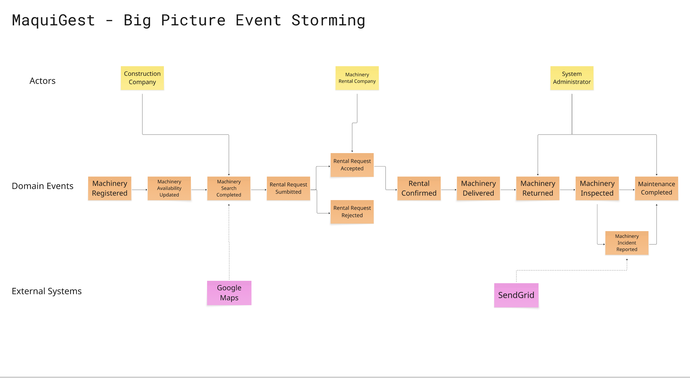

## 2.5. Ubiquitous Language

En esta sección se presenta el glosario de términos y conceptos utilizados en el dominio del negocio de RentBuild, con el objetivo de establecer un lenguaje común, sin ambigüedades, entre todos los miembros del equipo y stakeholders del proyecto. Mantener un Ubiquitous Language actualizado permite que la comunicación entre las áreas de negocio y desarrollo sea clara y consistente a lo largo de todo el ciclo de vida del producto. Eric Evans, en su libro *Domain-Driven Design: Tackling Complexity in the Heart of Software*, establece que el Ubiquitous Language debe modelarse dentro de un Bounded Context, donde los términos y conceptos del dominio del negocio son identificados y no deben presentar ambigüedad.

| Término | Definición |
| :--- | :--- |
| Equipo | Maquinaria o herramienta perteneciente al inventario de una empresa de alquiler, disponible para ser rentada por un periodo determinado (ej. andamios, mezcladoras, plataformas elevadoras, generadores). |
| Empresa de Alquiler | Empresa propietaria del equipo, responsable de administrar su inventario, disponibilidad, reservaciones y mantenimiento dentro de la plataforma. |
| Empresa Constructora | Empresa que busca y solicita el alquiler de equipos para el desarrollo de sus proyectos de construcción. |
| Inventario | Conjunto de equipos registrados por una empresa de alquiler, junto con sus características, estado y ubicación. |
| Disponibilidad | Estado que indica si un equipo puede ser reservado o alquilado en una fecha determinada, sin superposición con otra reservación o alquiler activo. |
| Reservación | Solicitud realizada por una empresa constructora para apartar un equipo durante un periodo específico, antes de confirmarse como un alquiler formal. |
| Contrato de Alquiler | Documento que formaliza las condiciones del alquiler de un equipo, incluyendo tarifas, plazos, responsabilidades y condiciones de devolución. |
| Entrega | Proceso mediante el cual el equipo alquilado es trasladado o puesto a disposición de la empresa constructora en el lugar acordado. |
| Devolución | Proceso mediante el cual el equipo alquilado es devuelto a la empresa de alquiler al finalizar el periodo de alquiler. |
| Mantenimiento | Conjunto de actividades de inspección, reparación o servicio preventivo realizadas sobre un equipo para garantizar su correcto funcionamiento y disponibilidad. |
| Incidencia | Registro de un daño, falla o problema detectado en un equipo, ya sea durante su uso, entrega o devolución. |
| Estado del Equipo | Condición actual de un equipo dentro del inventario: disponible, alquilado o en mantenimiento. |
| Período de Alquiler | Rango de fechas durante el cual un equipo se encuentra reservado o alquilado por una empresa constructora. |
| Tarifa | Costo asociado al alquiler de un equipo, generalmente calculado por día, semana o periodo acordado. |
| Operador de Alquiler | Colaborador de una empresa de alquiler responsable de gestionar las reservaciones, contratos, entregas, devoluciones e incidencias del equipo. |
| Jefe de Obra | Responsable dentro de una empresa constructora encargado de identificar, solicitar y coordinar el alquiler de equipo necesario para su proyecto. |
| Perfil de Proveedor | Información pública de una empresa de alquiler visible para las empresas constructoras, incluyendo su historial de cumplimiento y equipo disponible. |

# Capítulo III: Requirements Specification

## 3.1. User Stories

El catálogo mantiene **US01–US35** y sus significados; la prioridad se especifica en el Product Backlog, no en la numeración. US04 es recuperación de contraseña y US05 cierre de sesión. US34/US35 cubren la landing; el resto de productos también debe cumplir los requisitos generales de responsive/i18n del statement. Las historias describen comportamiento esperado y no acreditan implementación ni aceptación.

Las **TS01–TS09** utilizan el rol Developer y describen **contratos propuestos para AV2**, con ejemplos de request/response y errores. Las rutas y campos deben contrastarse con OpenAPI cuando se implemente el backend; no son evidencia de endpoints existentes. EP09 agrupa documentación y verificación técnica, sin introducir un nuevo bounded context. El control de acceso se exige antes de publicar recursos privados aunque las historias de autenticación se prioricen al final por valor de negocio.

<table>
<tr><th>Epic / Story ID</th><th>Título</th><th>Descripción</th><th>Criterios de Aceptación</th><th>Relacionado con (Epic ID)</th></tr>
<tr>
<td>EP01</td>
<td>Gestión de usuarios y acceso</td>
<td>Epic orientado al registro, autenticación y gestión básica de las cuentas de los usuarios de RentBuild.</td>
<td>—</td>
<td>—</td>
</tr>
<tr>
<td>US01</td>
<td>Registro de usuario</td>
<td>Como usuario, quiero registrarme en RentBuild para acceder a las funcionalidades de la plataforma.</td>
<td><strong>Scenario 1</strong> Given la persona proporciona datos requeridos válidos y un correo no registrado When la persona solicita crear su cuenta Then el sistema registra una única cuenta y comunica el resultado  <strong>Scenario 2</strong> Given los datos están incompletos o el correo ya pertenece a una cuenta When la persona solicita el registro Then el sistema comunica el impedimento y no crea una cuenta duplicada</td>
<td>EP01</td>
</tr>
<tr>
<td>US02</td>
<td>Inicio de sesión</td>
<td>Como usuario registrado, quiero iniciar sesión para acceder a las funcionalidades correspondientes a mi cuenta.</td>
<td><strong>Scenario 1</strong> Given el usuario tiene una cuenta habilitada When el usuario proporciona credenciales válidas Then el sistema inicia una sesión y permite el acceso correspondiente a su cuenta  <strong>Scenario 2</strong> Given las credenciales son inválidas When el usuario solicita iniciar sesión Then el sistema rechaza el acceso y no crea una sesión válida</td>
<td>EP01</td>
</tr>
<tr>
<td>US03</td>
<td>Gestionar perfil</td>
<td>Como usuario, quiero consultar y actualizar mis datos personales y de contacto para mantener mi información actualizada.</td>
<td><strong>Scenario 1</strong> Given el usuario tiene una sesión y datos de perfil válidos When el usuario solicita actualizar sus datos Then el sistema conserva los nuevos valores y los devuelve al consultarse  <strong>Scenario 2</strong> Given los datos requeridos son inválidos When el usuario solicita guardar el perfil Then el sistema informa el error y conserva la información anterior</td>
<td>EP01</td>
</tr>
<tr>
<td>US04</td>
<td>Recuperar contraseña</td>
<td>Como usuario, quiero recuperar mi contraseña para volver a acceder a mi cuenta.</td>
<td><strong>Scenario 1</strong> Given una persona necesita recuperar acceso When la persona proporciona un correo para recuperación Then el sistema comunica la recepción de la solicitud y entrega instrucciones cuando la cuenta corresponde  <strong>Scenario 2</strong> Given la recuperación presenta un código vencido o inválido When la persona intenta cambiar la contraseña Then el sistema no cambia las credenciales y permite solicitar una nueva recuperación</td>
<td>EP01</td>
</tr>
<tr>
<td>US05</td>
<td>Cerrar sesión</td>
<td>Como usuario, quiero cerrar sesión para proteger mi cuenta.</td>
<td><strong>Scenario 1</strong> Given el usuario tiene una sesión activa When el usuario solicita finalizarla Then el sistema invalida la sesión y un acceso privado posterior requiere autenticación  <strong>Scenario 2</strong> Given la sesión ya terminó When el usuario vuelve a solicitar el cierre Then el sistema mantiene el estado sin sesión y no modifica operaciones de negocio</td>
<td>EP01</td>
</tr>
<tr>
<td>EP02</td>
<td>Gestión de maquinaria</td>
<td>Epic orientado al registro, organización y consulta del inventario de maquinaria disponible para alquiler.</td>
<td>—</td>
<td>—</td>
</tr>
<tr>
<td>US06</td>
<td>Registrar maquinaria</td>
<td>Como empresa de alquiler, quiero registrar mis máquinas y equipos para mantener organizado mi inventario.</td>
<td><strong>Scenario 1</strong> Given la empresa de alquiler proporciona datos válidos y un serial no registrado When la empresa solicita registrar el equipo Then el sistema conserva el equipo asociado al proveedor y permite consultarlo en su inventario  <strong>Scenario 2</strong> Given faltan datos requeridos o el serial ya existe When la empresa solicita registrar el equipo Then el sistema informa el motivo y no crea un registro duplicado</td>
<td>EP02</td>
</tr>
<tr>
<td>US07</td>
<td>Consultar maquinaria</td>
<td>Como empresa de alquiler, quiero consultar las máquinas registradas para conocer la información de mis equipos.</td>
<td><strong>Scenario 1</strong> Given la empresa de alquiler tiene equipos registrados When la empresa consulta su inventario Then el sistema devuelve sus equipos con identificación y estado  <strong>Scenario 2</strong> Given la empresa no tiene equipos When la empresa consulta el inventario Then el sistema informa un resultado vacío y no incorpora equipos de otro proveedor</td>
<td>EP02</td>
</tr>
<tr>
<td>US08</td>
<td>Actualizar información de maquinaria</td>
<td>Como empresa de alquiler, quiero actualizar la información de mis equipos para mantener el inventario actualizado.</td>
<td><strong>Scenario 1</strong> Given un equipo pertenece a la empresa de alquiler y los cambios son válidos When la empresa solicita actualizarlo Then el sistema conserva los cambios y devuelve los valores actualizados  <strong>Scenario 2</strong> Given el cambio incumple un dato requerido o duplica un serial When la empresa solicita actualizar el equipo Then el sistema informa el error y conserva los valores anteriores</td>
<td>EP02</td>
</tr>
<tr>
<td>US09</td>
<td>Consultar disponibilidad de maquinaria</td>
<td>Como empresa de alquiler, quiero conocer la disponibilidad de cada equipo para evitar conflictos al gestionar nuevos alquileres.</td>
<td><strong>Scenario 1</strong> Given existen equipos y compromisos de disponibilidad registrados When la empresa consulta disponibilidad Then el sistema diferencia disponible, reservado, alquilado y en mantenimiento conforme a los registros  <strong>Scenario 2</strong> Given un compromiso bloquea el equipo When la empresa vuelve a consultar disponibilidad Then el sistema no lo presenta como libre para el periodo bloqueado</td>
<td>EP02</td>
</tr>
<tr>
<td>US10</td>
<td>Consultar estado de maquinaria</td>
<td>Como empresa de alquiler, quiero conocer el estado de mis equipos para evitar alquilar maquinaria que no se encuentra en condiciones de uso.</td>
<td><strong>Scenario 1</strong> Given el equipo tiene un estado operativo registrado When la empresa consulta su condición Then el sistema devuelve el estado asociado al equipo consultado  <strong>Scenario 2</strong> Given el equipo está en mantenimiento o no apto para alquiler When la empresa consulta su condición Then el sistema comunica la restricción y no lo considera apto para un nuevo alquiler</td>
<td>EP02</td>
</tr>
<tr>
<td>EP03</td>
<td>Búsqueda y solicitud de alquiler</td>
<td>Epic orientado a permitir que las pequeñas empresas constructoras encuentren maquinaria y gestionen solicitudes de alquiler.</td>
<td>—</td>
<td>—</td>
</tr>
<tr>
<td>US11</td>
<td>Buscar maquinaria</td>
<td>Como empresa constructora, quiero buscar maquinaria según mis necesidades para encontrar equipos adecuados para mi proyecto.</td>
<td><strong>Scenario 1</strong> Given el catálogo contiene equipos con categorías y características When la constructora establece criterios de búsqueda Then el sistema devuelve equipos que cumplen los criterios  <strong>Scenario 2</strong> Given ningún equipo cumple los criterios When la constructora consulta los resultados Then el sistema informa que no hay coincidencias sin sustituirlos por equipos que incumplen los filtros</td>
<td>EP03</td>
</tr>
<tr>
<td>US12</td>
<td>Consultar información de maquinaria</td>
<td>Como empresa constructora, quiero consultar las características de una maquinaria para determinar si es adecuada para mi proyecto.</td>
<td><strong>Scenario 1</strong> Given un equipo está disponible en el catálogo When la constructora solicita sus detalles Then el sistema devuelve características, estado, proveedor y condiciones de alquiler del mismo equipo  <strong>Scenario 2</strong> Given el equipo ya no existe en el catálogo When la constructora solicita sus detalles Then el sistema comunica que no puede consultarse y no permite solicitar ese registro inexistente</td>
<td>EP03</td>
</tr>
<tr>
<td>US13</td>
<td>Consultar disponibilidad para un periodo</td>
<td>Como empresa constructora, quiero consultar la disponibilidad de una maquinaria para un periodo determinado antes de solicitar el alquiler.</td>
<td><strong>Scenario 1</strong> Given el equipo existe y el periodo es válido When la constructora consulta disponibilidad Then el sistema informa si el periodo está libre considerando compromisos y mantenimiento  <strong>Scenario 2</strong> Given el rango es inválido o se solapa con un bloqueo When la constructora consulta el periodo Then el sistema diferencia el rango inválido del periodo no disponible y no autoriza una solicitud incompatible</td>
<td>EP03</td>
</tr>
<tr>
<td>US14</td>
<td>Solicitar alquiler de maquinaria</td>
<td>Como empresa constructora, quiero solicitar el alquiler de una maquinaria para utilizarla en mi proyecto.</td>
<td><strong>Scenario 1</strong> Given el equipo tiene un periodo válido disponible When la constructora solicita el alquiler Then el sistema registra una solicitud pendiente con equipo, periodo y solicitante identificables  <strong>Scenario 2</strong> Given el equipo no está disponible o el periodo es inválido When la constructora solicita el alquiler Then el sistema informa el impedimento y no registra una solicitud como confirmada</td>
<td>EP03</td>
</tr>
<tr>
<td>EP04</td>
<td>Planes y suscripciones</td>
<td>Epic orientado a la gestión de planes.</td>
<td>—</td>
<td>—</td>
</tr>
<tr>
<td>US15</td>
<td>Visualizar planes disponibles</td>
<td>Como usuario, quiero ver los planes para elegir uno.</td>
<td><strong>Scenario 1</strong> Given hay planes publicados When el usuario consulta las opciones de servicio Then el sistema devuelve características, precio y periodicidad de cada plan  <strong>Scenario 2</strong> Given un plan no está habilitado When el usuario consulta opciones de contratación Then el sistema no lo ofrece como una opción activa</td>
<td>EP04</td>
</tr>
<tr>
<td>US16</td>
<td>Suscribirse a un plan</td>
<td>Como usuario, quiero suscribirme a un plan para acceder a funciones premium.</td>
<td><strong>Scenario 1</strong> Given el usuario elige un plan habilitado When el usuario confirma la contratación Then el sistema registra el plan seleccionado y comunica el estado de la suscripción  <strong>Scenario 2</strong> Given el plan no existe o está deshabilitado When el usuario intenta suscribirse Then el sistema rechaza la selección y no activa una suscripción para ese plan</td>
<td>EP04</td>
</tr>
<tr>
<td>US17</td>
<td>Cambiar de plan</td>
<td>Como usuario, quiero cambiar de plan según mis necesidades.</td>
<td><strong>Scenario 1</strong> Given el usuario tiene una suscripción y el plan destino está habilitado When el usuario solicita cambiar de plan Then el sistema actualiza la referencia al plan y comunica las condiciones aplicables  <strong>Scenario 2</strong> Given el plan destino no está habilitado When el usuario solicita el cambio Then el sistema informa el impedimento y conserva el plan anterior</td>
<td>EP04</td>
</tr>
<tr>
<td>EP05</td>
<td>Gestión de reservas y alquileres</td>
<td>Epic orientado a la administración de reservas y al seguimiento del ciclo de alquiler de los equipos.</td>
<td>—</td>
<td>—</td>
</tr>
<tr>
<td>US18</td>
<td>Gestionar solicitudes de alquiler</td>
<td>Como empresa de alquiler, quiero revisar las solicitudes recibidas para decidir cuáles atender y mantener control sobre mis alquileres.</td>
<td><strong>Scenario 1</strong> Given la empresa de alquiler ha recibido solicitudes When la empresa consulta su bandeja Then el sistema devuelve equipo, periodo, solicitante y estado de solicitudes dirigidas a esa empresa  <strong>Scenario 2</strong> Given la empresa no ha recibido solicitudes When la empresa consulta la bandeja Then el sistema devuelve un resultado vacío sin incluir solicitudes de otro proveedor</td>
<td>EP05</td>
</tr>
<tr>
<td>US19</td>
<td>Confirmar o rechazar una solicitud</td>
<td>Como empresa de alquiler, quiero aceptar o rechazar solicitudes de alquiler para controlar la disponibilidad de mis equipos.</td>
<td><strong>Scenario 1</strong> Given una solicitud propia está pendiente y el periodo sigue disponible When la empresa de alquiler la aprueba Then el sistema registra la aprobación y el compromiso del periodo sin duplicar la asignación  <strong>Scenario 2</strong> Given una solicitud propia está pendiente When la empresa de alquiler la rechaza con un motivo Then el sistema registra el rechazo y no ocupa el periodo como alquiler confirmado  <strong>Scenario 3</strong> Given la solicitud ya fue decidida o el periodo dejó de estar disponible When la empresa intenta aprobarla Then el sistema informa el conflicto y no confirma una asignación incompatible</td>
<td>EP05</td>
</tr>
<tr>
<td>US20</td>
<td>Consultar alquileres activos</td>
<td>Como empresa de alquiler, quiero consultar mis alquileres activos para conocer qué equipos están actualmente alquilados.</td>
<td><strong>Scenario 1</strong> Given la empresa de alquiler tiene operaciones activas When la empresa consulta sus alquileres Then el sistema devuelve sus equipos, periodos y estados de operaciones activas  <strong>Scenario 2</strong> Given no hay operaciones activas When la empresa consulta sus alquileres Then el sistema devuelve un resultado vacío sin incluir operaciones cerradas como activas</td>
<td>EP05</td>
</tr>
<tr>
<td>US21</td>
<td>Consultar estado de una solicitud de alquiler</td>
<td>Como empresa constructora, quiero consultar el estado de mi solicitud para saber si mi alquiler fue aceptado, rechazado o aún está pendiente.</td>
<td><strong>Scenario 1</strong> Given la constructora ha presentado solicitudes When la constructora consulta su seguimiento Then el sistema devuelve el estado que corresponde a la última decisión de cada solicitud propia  <strong>Scenario 2</strong> Given la solicitud pertenece a otra constructora When la empresa intenta consultar su seguimiento Then el sistema no entrega datos de la operación ajena</td>
<td>EP05</td>
</tr>
<tr>
<td>US22</td>
<td>Gestionar entregas y devoluciones</td>
<td>Como empresa de alquiler, quiero registrar las entregas y devoluciones de maquinaria para mantener trazabilidad sobre los equipos alquilados.</td>
<td><strong>Scenario 1</strong> Given hay un alquiler confirmado sin entrega registrada When la empresa registra la entrega Then el sistema relaciona equipo, operación y fecha de entrega una sola vez  <strong>Scenario 2</strong> Given hay una entrega previa y aún no se registra el retorno When la empresa registra la devolución y condición del equipo Then el sistema conserva fecha y condición del retorno y permite seguir la revisión del equipo  <strong>Scenario 3</strong> Given no hay entrega previa o el retorno ya está registrado When la empresa intenta registrar la devolución Then el sistema informa el impedimento y no crea una devolución duplicada o sin entrega</td>
<td>EP05</td>
</tr>
<tr>
<td>EP06</td>
<td>Gestión de mantenimiento e incidencias</td>
<td>Epic orientado al seguimiento del estado operativo de la maquinaria y a la gestión de mantenimientos e incidencias.</td>
<td>—</td>
<td>—</td>
</tr>
<tr>
<td>US23</td>
<td>Registrar mantenimiento</td>
<td>Como empresa de alquiler, quiero registrar mantenimientos realizados a una maquinaria para mantener un historial de su estado operativo.</td>
<td><strong>Scenario 1</strong> Given existe un equipo y se proporcionan datos válidos de una intervención When la empresa registra el mantenimiento realizado Then el sistema conserva tipo, fecha y estado de la intervención asociada al equipo  <strong>Scenario 2</strong> Given el equipo no existe o faltan datos de la intervención When la empresa intenta registrar el mantenimiento Then el sistema comunica el error y no crea un registro incompleto</td>
<td>EP06</td>
</tr>
<tr>
<td>US24</td>
<td>Programar mantenimiento</td>
<td>Como empresa de alquiler, quiero programar mantenimientos para evitar que los equipos sean utilizados cuando requieren atención.</td>
<td><strong>Scenario 1</strong> Given el equipo requiere atención y el periodo propuesto es válido When la empresa programa el mantenimiento Then el sistema conserva la programación y considera el bloqueo correspondiente al consultar disponibilidad  <strong>Scenario 2</strong> Given la programación contiene un periodo inválido When la empresa solicita guardarla Then el sistema informa el error y no registra un bloqueo inválido</td>
<td>EP06</td>
</tr>
<tr>
<td>US25</td>
<td>Registrar incidencia de maquinaria</td>
<td>Como empresa de alquiler, quiero registrar incidencias de mis equipos para llevar un control de problemas y reparaciones.</td>
<td><strong>Scenario 1</strong> Given el equipo existe y se describe un problema When la empresa registra una incidencia Then el sistema conserva la descripción y su relación con el equipo para seguimiento  <strong>Scenario 2</strong> Given no se identifica el equipo o falta la descripción When la empresa intenta registrar la incidencia Then el sistema informa el error y no crea una incidencia sin trazabilidad</td>
<td>EP06</td>
</tr>
<tr>
<td>US26</td>
<td>Consultar historial de maquinaria</td>
<td>Como empresa de alquiler, quiero consultar el historial de una maquinaria para conocer sus alquileres, incidencias y mantenimientos.</td>
<td><strong>Scenario 1</strong> Given el equipo tiene operaciones e intervenciones registradas When la empresa consulta su historial Then el sistema devuelve la secuencia de alquileres, incidencias y mantenimientos con fechas e identificadores  <strong>Scenario 2</strong> Given el equipo no tiene antecedentes When la empresa consulta el historial Then el sistema devuelve un historial vacío sin mezclar antecedentes de otro equipo</td>
<td>EP06</td>
</tr>
<tr>
<td>EP07</td>
<td>Información y contratación del servicio</td>
<td>Epic orientado a brindar información sobre RentBuild y facilitar el contacto de potenciales clientes con la plataforma.</td>
<td>—</td>
<td>—</td>
</tr>
<tr>
<td>US27</td>
<td>Consultar información de RentBuild</td>
<td>Como visitante, quiero conocer las funcionalidades y beneficios de RentBuild para determinar si la solución se adapta a las necesidades de mi empresa.</td>
<td><strong>Scenario 1</strong> Given el visitante desea evaluar el servicio When el visitante consulta información de RentBuild Then el contenido explica propósito, segmentos, funcionalidades y beneficios  <strong>Scenario 2</strong> Given el visitante consulta los dos segmentos When el visitante evalúa la propuesta Then el contenido permite distinguir los beneficios para alquiler y construcción</td>
<td>EP07</td>
</tr>
<tr>
<td>US28</td>
<td>Solicitar demostración</td>
<td>Como visitante, quiero solicitar una demostración de RentBuild para conocer cómo funciona antes de utilizar el servicio.</td>
<td><strong>Scenario 1</strong> Given el visitante proporciona contacto válido para una demostración When el visitante envía la solicitud por el canal publicado Then el sistema comunica recepción solo cuando el canal confirma el envío; una simulación se identifica como tal  <strong>Scenario 2</strong> Given faltan datos de contacto válidos o falla el envío When el visitante solicita la demostración Then el sistema informa el problema sin declarar una solicitud recibida</td>
<td>EP07</td>
</tr>
<tr>
<td>US29</td>
<td>Contactar con RentBuild</td>
<td>Como visitante, quiero contactar con el equipo de RentBuild para realizar consultas sobre el servicio.</td>
<td><strong>Scenario 1</strong> Given el visitante tiene una consulta y un contacto válido When el visitante utiliza el canal de contacto publicado Then el sistema informa cómo se tramita la consulta y solo declara envío cuando existe confirmación  <strong>Scenario 2</strong> Given el canal no puede tramitar el mensaje When el visitante intenta contactar Then el sistema comunica el impedimento y no presenta una confirmación ficticia</td>
<td>EP07</td>
</tr>
<tr>
<td>EP08</td>
<td>Landing Page de RentBuild</td>
<td>Epic orientado a presentar la propuesta de valor de RentBuild y facilitar la navegación de los potenciales clientes hacia las funcionalidades y acciones principales de la plataforma.</td>
<td>—</td>
<td>—</td>
</tr>
<tr>
<td>US30</td>
<td>Visualizar propuesta de valor</td>
<td>Como visitante, quiero identificar la propuesta de valor de RentBuild para comprender cómo puede ayudar a mi empresa a gestionar el alquiler de maquinaria.</td>
<td><strong>Scenario 1</strong> Given el visitante busca comprender el producto When el visitante consulta la propuesta de valor Then el contenido identifica el problema del ciclo de alquiler y el beneficio de centralizarlo  <strong>Scenario 2</strong> Given el visitante compara los segmentos When el visitante evalúa los beneficios Then el contenido incluye tanto control para proveedores como búsqueda y seguimiento para constructoras</td>
<td>EP08</td>
</tr>
<tr>
<td>US31</td>
<td>Explorar funcionalidades principales</td>
<td>Como visitante, quiero conocer las principales funcionalidades de RentBuild para identificar cuáles pueden ayudarme a gestionar mis operaciones de alquiler de maquinaria.</td>
<td><strong>Scenario 1</strong> Given el visitante evalúa capacidades de RentBuild When el visitante consulta funcionalidades Then el contenido explica inventario, disponibilidad, solicitudes, seguimiento y mantenimiento  <strong>Scenario 2</strong> Given una capacidad corresponde a una etapa futura When el visitante consulta su descripción Then el contenido la identifica como prevista y no como una función comprobada de la versión actual</td>
<td>EP08</td>
</tr>
<tr>
<td>US32</td>
<td>Identificar la solución para mi empresa</td>
<td>Como visitante, quiero identificar cómo RentBuild puede ayudar según mi tipo de empresa para conocer las funcionalidades relevantes para mis necesidades.</td>
<td><strong>Scenario 1</strong> Given el visitante pertenece a una empresa de alquiler When el visitante consulta la solución para su segmento Then el contenido explica control de inventario, solicitudes y equipos  <strong>Scenario 2</strong> Given el visitante pertenece a una constructora When el visitante consulta la solución para su segmento Then el contenido explica búsqueda, disponibilidad, solicitud y seguimiento</td>
<td>EP08</td>
</tr>
<tr>
<td>US33</td>
<td>Acceder a la Web Application</td>
<td>Como visitante, quiero acceder a la Web Application desde el Landing Page para utilizar las funcionalidades de RentBuild.</td>
<td><strong>Scenario 1</strong> Given el visitante identifica su segmento When el visitante solicita acceder a la aplicación Then el destino corresponde a la Web Application y al acceso previsto para su segmento  <strong>Scenario 2</strong> Given el acceso público no está disponible When el visitante intenta acceder Then el contenido informa la limitación y no declara que existe un workspace operativo</td>
<td>EP08</td>
</tr>
<tr>
<td>US34</td>
<td>Consultar el Landing Page en diferentes dispositivos</td>
<td>Como visitante, quiero visualizar correctamente el Landing Page desde diferentes dispositivos para conocer RentBuild sin importar el dispositivo que utilice.</td>
<td><strong>Scenario 1</strong> Given el visitante utiliza un navegador desktop When el visitante consulta el Landing Page Then el contenido y la navegación conservan su información y funcionalidad  <strong>Scenario 2</strong> Given el visitante utiliza un navegador móvil When el visitante consulta el Landing Page Then el contenido se adapta sin recortar información ni impedir el acceso a sus funciones de navegación</td>
<td>EP08</td>
</tr>
<tr>
<td>US35</td>
<td>Cambiar el idioma del Landing Page</td>
<td>Como visitante, quiero cambiar el idioma del Landing Page para consultar la información de RentBuild en el idioma de mi preferencia.</td>
<td><strong>Scenario 1</strong> Given el visitante no ha establecido una preferencia When el visitante consulta el Landing Page Then el contenido utiliza inglés por defecto con base en_US  <strong>Scenario 2</strong> Given el visitante solicita español latinoamericano When el visitante cambia la preferencia a es_419 Then el contenido se presenta en ese idioma y conserva navegación y destinos</td>
<td>EP08</td>
</tr>
<tr><td>EP09</td><td>Documentación y verificación técnica</td><td>Epic de soporte para contratos OpenAPI y pruebas del RESTful API.</td><td>—</td><td>—</td></tr>
<tr>
<td>TS01</td>
<td>Contratos REST de inventario</td>
<td>Como Developer, quiero exponer registro, consulta y actualización de equipos para integrar US06–US10 sin depender de datos de demostración.</td>
<td><strong>Scenario 1</strong> Given el proveedor está autorizado y el serial es nuevo When el cliente envía POST /api/v1/equipment con name, serialNumber, categoryId y datos de alquiler válidos Then la respuesta es 201 con id, proveedor asociado y estado; GET /api/v1/equipment/{id} devuelve el mismo registro  <strong>Scenario 2</strong> Given el cliente envía un serial duplicado o datos inválidos When el servidor procesa POST o PUT /api/v1/equipment/{id} Then la respuesta es 409 para duplicidad o 400 para validación y no modifica el inventario  <strong>Scenario 3</strong> Given el equipo pertenece a otro proveedor When el cliente intenta actualizarlo Then la respuesta es 403 y no cambia el equipo; la pertenencia se verifica en servidor</td>
<td>EP02</td>
</tr>
<tr>
<td>TS02</td>
<td>Contratos REST de búsqueda y disponibilidad</td>
<td>Como Developer, quiero consultar catálogo y disponibilidad por periodo para integrar US11–US13 y la validación de fechas.</td>
<td><strong>Scenario 1</strong> Given existen equipos que cumplen los filtros When el cliente envía GET /api/v1/equipment?categoryId={id}&amp;query={text} Then la respuesta es 200 con items que cumplen los filtros; si no hay coincidencias, items es una lista vacía  <strong>Scenario 2</strong> Given el equipo existe y el rango es válido When el cliente envía GET /api/v1/equipment/{id}/availability?startDate={start}&amp;endDate={end} Then la respuesta es 200 con equipmentId, startDate, endDate y available; un compromiso o mantenimiento incompatible produce available=false  <strong>Scenario 3</strong> Given el rango tiene fin anterior al inicio o el equipo no existe When el cliente consulta disponibilidad Then la respuesta es 400 para rango inválido o 404 para equipo inexistente, sin presentar disponibilidad positiva  <strong>Scenario 4</strong> Given el equipo forma parte del catálogo consultable When el cliente envía GET /api/v1/equipment/{id} Then la respuesta es 200 con id, características, condición, tarifa y condiciones de alquiler correspondientes al equipo; un id inexistente devuelve 404</td>
<td>EP03</td>
</tr>
<tr>
<td>TS03</td>
<td>Contratos REST de solicitudes y decisiones</td>
<td>Como Developer, quiero crear, consultar y decidir solicitudes para integrar US14, US18, US19 y US21 con estados y conflictos comprobables.</td>
<td><strong>Scenario 1</strong> Given el equipo y periodo son válidos y la constructora está autorizada When el cliente envía POST /api/v1/rental-requests con equipmentId, startDate y endDate Then la respuesta es 201 con id y status=PENDING; el solicitante y proveedor se resuelven y validan en servidor  <strong>Scenario 2</strong> Given una solicitud propia está pendiente y el periodo sigue disponible When el proveedor envía PATCH /api/v1/rental-requests/{id}/decision con decision=APPROVE Then la respuesta es 200 con status=APPROVED y el periodo se compromete sin doble asignación  <strong>Scenario 3</strong> Given el proveedor rechaza una solicitud pendiente When el cliente envía la decisión REJECT y reason Then la respuesta es 200 con status=REJECTED y no confirma el periodo  <strong>Scenario 4</strong> Given la solicitud ya se decidió, existe un solapamiento o el cliente no está autorizado When el cliente intenta decidir o consultar la solicitud Then la respuesta es 409 por conflicto o 403 por operación ajena; el estado y las asignaciones previas se conservan  <strong>Scenario 5</strong> Given el usuario está autorizado como proveedor o solicitante When el cliente envía GET /api/v1/rental-requests o GET /api/v1/rental-requests/{id} Then la respuesta es 200 con las solicitudes recibidas o enviadas que le corresponden, incluyendo id, equipmentId, periodo y estado de la última decisión; una consulta ajena devuelve 403 y una solicitud inexistente devuelve 404</td>
<td>EP05</td>
</tr>
<tr>
<td>TS04</td>
<td>Contratos REST del ciclo de alquiler</td>
<td>Como Developer, quiero consultar alquileres y registrar entregas y devoluciones para integrar US20 y US22 con operaciones trazables.</td>
<td><strong>Scenario 1</strong> Given el proveedor está autorizado When el cliente envía GET /api/v1/rental-contracts?status=ACTIVE Then la respuesta es 200 con items del proveedor, equipo, periodo y estado; las operaciones cerradas no se incluyen como activas  <strong>Scenario 2</strong> Given el alquiler está confirmado y no tiene entrega When el cliente envía POST /api/v1/rental-contracts/{id}/deliveries con datos válidos de la entrega Then la respuesta es 201 con id, contractId y deliveredAt; un segundo registro incompatible devuelve 409  <strong>Scenario 3</strong> Given hay entrega previa sin retorno When el cliente envía POST /api/v1/rental-contracts/{id}/returns con condition y datos válidos Then la respuesta es 201 con id, contractId y returnedAt; una devolución sin entrega previa o duplicada devuelve 409</td>
<td>EP05</td>
</tr>
<tr>
<td>TS05</td>
<td>Contratos REST de mantenimiento e historial</td>
<td>Como Developer, quiero registrar incidencias e intervenciones y consultar antecedentes para integrar US23–US26 y la condición operativa del equipo.</td>
<td><strong>Scenario 1</strong> Given el equipo existe y pertenece al proveedor When el cliente envía POST /api/v1/incidents con equipmentId y description o POST /api/v1/maintenance-records con equipmentId, type y periodo válido Then la respuesta es 201 con id y equipmentId; la programación que bloquee el periodo se considera en disponibilidad  <strong>Scenario 2</strong> Given el equipo no existe o la entrada es inválida When el cliente registra una incidencia o mantenimiento Then la respuesta es 404 o 400, respectivamente, sin persistir un registro incompleto  <strong>Scenario 3</strong> Given el proveedor está autorizado para el equipo When el cliente envía GET /api/v1/equipment/{id}/history Then la respuesta es 200 con antecedentes identificables y fechados del mismo equipo; sin antecedentes, items es una lista vacía</td>
<td>EP06</td>
</tr>
<tr>
<td>TS06</td>
<td>Contratos REST de perfil</td>
<td>Como Developer, quiero consultar y actualizar el perfil propio para integrar US03 con validación y pertenencia comprobadas en servidor.</td>
<td><strong>Scenario 1</strong> Given el usuario está autenticado y los datos de contacto son válidos When el cliente envía PATCH /api/v1/profiles/me con los cambios de perfil Then la respuesta es 200 con el perfil actualizado; GET /api/v1/profiles/me devuelve esos valores  <strong>Scenario 2</strong> Given los datos requeridos son inválidos o falta una sesión válida When el cliente intenta actualizar el perfil Then la respuesta es 400 por validación o 401 por falta de autenticación y conserva los valores anteriores</td>
<td>EP01</td>
</tr>
<tr>
<td>TS07</td>
<td>Contratos REST de planes y suscripciones</td>
<td>Como Developer, quiero consultar planes y registrar o cambiar suscripciones para integrar US15–US17 sin declarar pagos o activaciones no confirmados.</td>
<td><strong>Scenario 1</strong> Given hay planes habilitados When el cliente envía GET /api/v1/subscription-plans Then la respuesta es 200 con id, características, precio y periodicidad de planes habilitados  <strong>Scenario 2</strong> Given el usuario está autorizado y el plan está habilitado When el cliente envía POST /api/v1/subscriptions con planId o PATCH /api/v1/subscriptions/{id}/plan con el nuevo planId Then la respuesta es 201 o 200 con planId y estado real de la suscripción; no declara pago exitoso sin confirmación del mecanismo de pago  <strong>Scenario 3</strong> Given el plan no existe, está deshabilitado o la suscripción pertenece a otro usuario When el cliente envía POST /api/v1/subscriptions o PATCH /api/v1/subscriptions/{id}/plan Then la respuesta es 404 para plan inexistente, 400 para plan deshabilitado o 403 para suscripción ajena y no activa ni modifica la suscripción</td>
<td>EP04</td>
</tr>
<tr>
<td>TS08</td>
<td>Contratos REST de identidad y acceso</td>
<td>Como Developer, quiero gestionar registro, sesiones y recuperación para integrar US01, US02, US04 y US05 y proteger los recursos privados.</td>
<td><strong>Scenario 1</strong> Given los datos de registro son válidos y el correo no existe When el cliente envía POST /api/v1/auth/register Then la respuesta es 201 con el identificador de cuenta; no devuelve contraseñas ni hashes  <strong>Scenario 2</strong> Given la cuenta está habilitada When el cliente envía POST /api/v1/auth/login con credenciales válidas Then la respuesta es 200 con una sesión y expiración; credenciales inválidas devuelven 401  <strong>Scenario 3</strong> Given una persona solicita recuperar acceso When el cliente envía POST /api/v1/auth/password-recovery con email válido Then la respuesta es 202 con un mensaje genérico de recepción sin exponer si existe la cuenta; POST /api/v1/auth/password-reset con código inválido devuelve 400 y no cambia credenciales  <strong>Scenario 4</strong> Given existe una sesión When el cliente envía POST /api/v1/auth/logout Then la respuesta es 204 y esa sesión no permite una nueva solicitud privada; el control se verifica en servidor</td>
<td>EP01</td>
</tr>
<tr>
<td>TS09</td>
<td>Contrato OpenAPI y verificación de API</td>
<td>Como Developer, quiero documentar y comprobar los contratos REST para integrar el frontend con especificaciones y pruebas reproducibles.</td>
<td><strong>Scenario 1</strong> Given el servicio propuesto está implementado en la etapa AV2 When el cliente envía GET /openapi.json Then la respuesta es 200 con una especificación OpenAPI de las rutas implementadas, entradas, respuestas y errores; Swagger permite consultarla  <strong>Scenario 2</strong> Given se dispone de un equipo y periodo de prueba controlados When se ejecuta la prueba de integración del request de disponibilidad y de decisión conflictiva Then las respuestas verifican 200 con available y 409 por conflicto; la prueba comprueba que no existe una doble asignación  <strong>Scenario 3</strong> Given el proveedor está autorizado y falta name en los datos de un equipo When el cliente envía POST /api/v1/equipment con Accept-Language correspondiente a en_US o es_419, o sin preferencia Then la respuesta es 400 con código de validación estable y mensaje en el idioma soportado solicitado, con inglés por defecto; las pruebas unitarias e integración se documentan sin atribuirles ejecución previa</td>
<td>EP09</td>
</tr>
</table>

## 3.2. Impact Mapping

El Impact Map relaciona hipótesis de negocio, personas, cambios de comportamiento y entregables. **G01:** alcanzar 20 empresas de alquiler recurrentes en los primeros seis meses de un piloto. **G02:** lograr que 10 empresas constructoras completen búsqueda, consulta de disponibilidad y solicitud en la misma ventana. Son metas propuestas, con definiciones e instrumentos pendientes descritos en 1.2.2.1; no son adopción observada. Los indicadores de 50 equipos, 30 operaciones y menos de 5 conflictos permiten contrastar utilidad y trazabilidad.

**Estado del gráfico:** el export recuperado conserva la marca MaquiGest y una numeración antigua US01–US10. No se ha editado ni se presenta como un nuevo export de UXPressia. La relación textual vigente para RentBuild se establece a continuación y debe trasladarse al gráfico en una actualización posterior.

| Business Goal | Actor / Persona | Impact esperado | Deliverable | User Stories vigentes |
|---|---|---|---|---|
| G01 | Armando Casas | Registra y consulta sus equipos para mantener información centralizada | Inventario (FA01/H01) | **US06:** Como empresa de alquiler, quiero registrar mis máquinas y equipos para mantener organizado mi inventario. Relacionadas: US07, US08, US09, US10; TS01. |
| G01 | Armando Casas | Decide solicitudes únicamente para periodos compatibles | Validación y decisión (FA02/H02) | **US19:** Como empresa de alquiler, quiero aceptar o rechazar solicitudes de alquiler para controlar la disponibilidad de mis equipos. Relacionadas: US13, US14, US18; TS02, TS03. |
| G01 | Armando Casas | Sigue alquiler, entrega y retorno con trazabilidad | Ciclo de alquiler (FA03/H03) | **US22:** Como empresa de alquiler, quiero registrar las entregas y devoluciones de maquinaria para mantener trazabilidad sobre los equipos alquilados. Relacionadas: US20; TS04. |
| G01 | Armando Casas | Identifica equipos no aptos y registra sus intervenciones | Incidencias y mantenimiento (FA04/H04) | **US25:** Como empresa de alquiler, quiero registrar incidencias de mis equipos para llevar un control de problemas y reparaciones. Relacionadas: US23, US24, US26; TS05. |
| G02 | Andrea Torres | Encuentra equipos que corresponden a la necesidad de su proyecto | Búsqueda y detalle (FA05/H05) | **US11:** Como empresa constructora, quiero buscar maquinaria según mis necesidades para encontrar equipos adecuados para mi proyecto. Relacionadas: US12; TS02. |
| G02 | Andrea Torres | Comprueba un periodo y solicita el equipo disponible | Disponibilidad y solicitud (FA06/H06) | **US14:** Como empresa constructora, quiero solicitar el alquiler de una maquinaria para utilizarla en mi proyecto. Relacionadas: US13; TS02, TS03. |
| G02 | Andrea Torres | Consulta la decisión sin depender de llamadas de seguimiento | Seguimiento (FA07/H07) | **US21:** Como empresa constructora, quiero consultar el estado de mi solicitud para saber si mi alquiler fue aceptado, rechazado o aún está pendiente. Relacionadas: TS03. |
| G01/G02 | Visitantes de ambos segmentos | Comprenden la propuesta y continúan hacia la aplicación | Landing y acceso al producto | **US33:** Como visitante, quiero acceder a la Web Application desde el Landing Page para utilizar las funcionalidades de RentBuild. Relacionadas: US27, US28, US29, US30, US31, US32, US34, US35. |
| G01 | Usuarios del servicio | Eligen condiciones de uso adecuadas a su empresa | Planes y suscripciones como soporte | **US16:** Como usuario, quiero suscribirme a un plan para acceder a funciones premium. Relacionadas: US15, US17; TS07. |
| G01/G02 | Usuarios del servicio | Mantienen su perfil y acceden a sus operaciones propias | Perfil e identidad como soporte | **US03:** Como usuario, quiero consultar y actualizar mis datos personales y de contacto para mantener mi información actualizada. Relacionadas: US01, US02, US04, US05; TS06, TS08, TS09. |

Correspondencia del export anterior: US01 gestión de maquinaria → US06–US08; US02 disponibilidad → US09/US13; US03 reservas → US14/US18/US19/US21; US04 entrega/devolución → US22; US05 incidencias → US25; US06 mantenimiento → US23/US24/US26; US07 búsqueda → US11; US08 detalle → US12; US09 solicitud → US14; US10 seguimiento de la constructora → US21. Esta equivalencia no cambia los IDs actuales ni acredita que el gráfico haya sido corregido.

## 3.3. Product Backlog

El orden expresa **valor para el negocio**: inventario, disponibilidad, solicitud/decisión y ciclo de alquiler primero; soporte de identidad y autenticación al final. El ID conserva identidad y no determina prioridad. Las historias de landing se consideran desde Sprint 1 y sus correcciones continúan en TB1; su posición en esta revisión acumulativa no elimina ese alcance histórico. Antes de desplegar recursos privados, las dependencias de seguridad deben estar satisfechas.

Las estimaciones son propuestas de planificación en la escala 1/2/3/5/8 y deben revisarse por el equipo; no son horas consumidas ni velocity aceptada. Las 35 US mantienen el significado del catálogo. Las TS son trabajo técnico propuesto para AV2 y no implican que la API ya esté implementada.

| # Orden | User Story ID | Título | Descripción | Story Points (1 / 2 / 3 / 5 / 8) |
| :---: | :---: | :--- | :--- | :---: |
| 1 | US06 | Registrar maquinaria | Como empresa de alquiler, quiero registrar mis máquinas y equipos para mantener organizado mi inventario. | 5 |
| 2 | US07 | Consultar maquinaria | Como empresa de alquiler, quiero consultar las máquinas registradas para conocer la información de mis equipos. | 3 |
| 3 | US08 | Actualizar información de maquinaria | Como empresa de alquiler, quiero actualizar la información de mis equipos para mantener el inventario actualizado. | 3 |
| 4 | US09 | Consultar disponibilidad de maquinaria | Como empresa de alquiler, quiero conocer la disponibilidad de cada equipo para evitar conflictos al gestionar nuevos alquileres. | 5 |
| 5 | US10 | Consultar estado de maquinaria | Como empresa de alquiler, quiero conocer el estado de mis equipos para evitar alquilar maquinaria que no se encuentra en condiciones de uso. | 3 |
| 6 | TS01 | Contratos REST de inventario | Como Developer, quiero exponer registro, consulta y actualización de equipos para integrar US06–US10 sin depender de datos de demostración. | 8 |
| 7 | US11 | Buscar maquinaria | Como empresa constructora, quiero buscar maquinaria según mis necesidades para encontrar equipos adecuados para mi proyecto. | 5 |
| 8 | US12 | Consultar información de maquinaria | Como empresa constructora, quiero consultar las características de una maquinaria para determinar si es adecuada para mi proyecto. | 3 |
| 9 | US13 | Consultar disponibilidad para un periodo | Como empresa constructora, quiero consultar la disponibilidad de una maquinaria para un periodo determinado antes de solicitar el alquiler. | 5 |
| 10 | TS02 | Contratos REST de búsqueda y disponibilidad | Como Developer, quiero consultar catálogo y disponibilidad por periodo para integrar US11–US13 y la validación de fechas. | 5 |
| 11 | US14 | Solicitar alquiler de maquinaria | Como empresa constructora, quiero solicitar el alquiler de una maquinaria para utilizarla en mi proyecto. | 5 |
| 12 | US18 | Gestionar solicitudes de alquiler | Como empresa de alquiler, quiero revisar las solicitudes recibidas para decidir cuáles atender y mantener control sobre mis alquileres. | 5 |
| 13 | US19 | Confirmar o rechazar una solicitud | Como empresa de alquiler, quiero aceptar o rechazar solicitudes de alquiler para controlar la disponibilidad de mis equipos. | 3 |
| 14 | US21 | Consultar estado de una solicitud de alquiler | Como empresa constructora, quiero consultar el estado de mi solicitud para saber si mi alquiler fue aceptado, rechazado o aún está pendiente. | 3 |
| 15 | TS03 | Contratos REST de solicitudes y decisiones | Como Developer, quiero crear, consultar y decidir solicitudes para integrar US14, US18, US19 y US21 con estados y conflictos comprobables. | 8 |
| 16 | US20 | Consultar alquileres activos | Como empresa de alquiler, quiero consultar mis alquileres activos para conocer qué equipos están actualmente alquilados. | 3 |
| 17 | US22 | Gestionar entregas y devoluciones | Como empresa de alquiler, quiero registrar las entregas y devoluciones de maquinaria para mantener trazabilidad sobre los equipos alquilados. | 5 |
| 18 | TS04 | Contratos REST del ciclo de alquiler | Como Developer, quiero consultar alquileres y registrar entregas y devoluciones para integrar US20 y US22 con operaciones trazables. | 5 |
| 19 | US23 | Registrar mantenimiento | Como empresa de alquiler, quiero registrar mantenimientos realizados a una maquinaria para mantener un historial de su estado operativo. | 5 |
| 20 | US24 | Programar mantenimiento | Como empresa de alquiler, quiero programar mantenimientos para evitar que los equipos sean utilizados cuando requieren atención. | 3 |
| 21 | US25 | Registrar incidencia de maquinaria | Como empresa de alquiler, quiero registrar incidencias de mis equipos para llevar un control de problemas y reparaciones. | 3 |
| 22 | US26 | Consultar historial de maquinaria | Como empresa de alquiler, quiero consultar el historial de una maquinaria para conocer sus alquileres, incidencias y mantenimientos. | 5 |
| 23 | TS05 | Contratos REST de mantenimiento e historial | Como Developer, quiero registrar incidencias e intervenciones y consultar antecedentes para integrar US23–US26 y la condición operativa del equipo. | 5 |
| 24 | US30 | Visualizar propuesta de valor | Como visitante, quiero identificar la propuesta de valor de RentBuild para comprender cómo puede ayudar a mi empresa a gestionar el alquiler de maquinaria. | 2 |
| 25 | US27 | Consultar información de RentBuild | Como visitante, quiero conocer las funcionalidades y beneficios de RentBuild para determinar si la solución se adapta a las necesidades de mi empresa. | 2 |
| 26 | US32 | Identificar la solución para mi empresa | Como visitante, quiero identificar cómo RentBuild puede ayudar según mi tipo de empresa para conocer las funcionalidades relevantes para mis necesidades. | 3 |
| 27 | US31 | Explorar funcionalidades principales | Como visitante, quiero conocer las principales funcionalidades de RentBuild para identificar cuáles pueden ayudarme a gestionar mis operaciones de alquiler de maquinaria. | 3 |
| 28 | US33 | Acceder a la Web Application | Como visitante, quiero acceder a la Web Application desde el Landing Page para utilizar las funcionalidades de RentBuild. | 2 |
| 29 | US34 | Consultar el Landing Page en diferentes dispositivos | Como visitante, quiero visualizar correctamente el Landing Page desde diferentes dispositivos para conocer RentBuild sin importar el dispositivo que utilice. | 5 |
| 30 | US35 | Cambiar el idioma del Landing Page | Como visitante, quiero cambiar el idioma del Landing Page para consultar la información de RentBuild en el idioma de mi preferencia. | 5 |
| 31 | US28 | Solicitar demostración | Como visitante, quiero solicitar una demostración de RentBuild para conocer cómo funciona antes de utilizar el servicio. | 2 |
| 32 | US29 | Contactar con RentBuild | Como visitante, quiero contactar con el equipo de RentBuild para realizar consultas sobre el servicio. | 2 |
| 33 | US15 | Visualizar planes disponibles | Como usuario, quiero ver los planes para elegir uno. | 3 |
| 34 | US16 | Suscribirse a un plan | Como usuario, quiero suscribirme a un plan para acceder a funciones premium. | 3 |
| 35 | US17 | Cambiar de plan | Como usuario, quiero cambiar de plan según mis necesidades. | 5 |
| 36 | TS07 | Contratos REST de planes y suscripciones | Como Developer, quiero consultar planes y registrar o cambiar suscripciones para integrar US15–US17 sin declarar pagos o activaciones no confirmados. | 5 |
| 37 | US03 | Gestionar perfil | Como usuario, quiero consultar y actualizar mis datos personales y de contacto para mantener mi información actualizada. | 3 |
| 38 | TS06 | Contratos REST de perfil | Como Developer, quiero consultar y actualizar el perfil propio para integrar US03 con validación y pertenencia comprobadas en servidor. | 3 |
| 39 | TS09 | Contrato OpenAPI y verificación de API | Como Developer, quiero documentar y comprobar los contratos REST para integrar el frontend con especificaciones y pruebas reproducibles. | 5 |
| 40 | US01 | Registro de usuario | Como usuario, quiero registrarme en RentBuild para acceder a las funcionalidades de la plataforma. | 5 |
| 41 | US02 | Inicio de sesión | Como usuario registrado, quiero iniciar sesión para acceder a las funcionalidades correspondientes a mi cuenta. | 3 |
| 42 | US04 | Recuperar contraseña | Como usuario, quiero recuperar mi contraseña para volver a acceder a mi cuenta. | 3 |
| 43 | US05 | Cerrar sesión | Como usuario, quiero cerrar sesión para proteger mi cuenta. | 1 |
| 44 | TS08 | Contratos REST de identidad y acceso | Como Developer, quiero gestionar registro, sesiones y recuperación para integrar US01, US02, US04 y US05 y proteger los recursos privados. | 5 |

**Evidencia de herramienta:** pendiente de adjuntar la captura del Product Backlog y una URL pública de lectura del tablero de Trello/Jira/YouTrack con el mismo orden, IDs y estimaciones. No se publica una invitación ni se declara que el tablero ya refleje esta revisión.

### Plan técnico propuesto para AV2

Los contratos TS01–TS09 se planifican para la etapa en que el statement exige la primera API desplegada (AV2, semana 12). No se fija una fecha de implementación ni se atribuyen responsables individuales. Cada tarea permanece **To Do**; las horas son estimaciones propuestas y requieren aprobación del equipo. Su inclusión no modifica la evidencia pendiente de TB1 ni declara pruebas ejecutadas.

| Technical Story | US relacionadas | Work-Item | Tarea propuesta | Estimación (horas) | Responsable | Estado |
|---|---|---|---|---:|---|---|
| TS01 | US06–US10 | API-TS01-01 | Definir entradas, respuestas y errores del contrato en OpenAPI | 4 | Pendiente de acuerdo del equipo | To Do |
| TS01 | US06–US10 | API-TS01-02 | Implementar los casos de uso y adaptadores necesarios conforme al contrato | 8 | Pendiente de acuerdo del equipo | To Do |
| TS01 | US06–US10 | API-TS01-03 | Crear y ejecutar pruebas unitarias e integración de escenarios válidos, errores y pertenencia | 6 | Pendiente de acuerdo del equipo | To Do |
| TS02 | US11–US13 | API-TS02-01 | Definir entradas, respuestas y errores del contrato en OpenAPI | 4 | Pendiente de acuerdo del equipo | To Do |
| TS02 | US11–US13 | API-TS02-02 | Implementar los casos de uso y adaptadores necesarios conforme al contrato | 8 | Pendiente de acuerdo del equipo | To Do |
| TS02 | US11–US13 | API-TS02-03 | Crear y ejecutar pruebas unitarias e integración de escenarios válidos, errores y pertenencia | 6 | Pendiente de acuerdo del equipo | To Do |
| TS03 | US14, US18, US19, US21 | API-TS03-01 | Definir entradas, respuestas y errores del contrato en OpenAPI | 4 | Pendiente de acuerdo del equipo | To Do |
| TS03 | US14, US18, US19, US21 | API-TS03-02 | Implementar los casos de uso y adaptadores necesarios conforme al contrato | 8 | Pendiente de acuerdo del equipo | To Do |
| TS03 | US14, US18, US19, US21 | API-TS03-03 | Crear y ejecutar pruebas unitarias e integración de escenarios válidos, errores y pertenencia | 6 | Pendiente de acuerdo del equipo | To Do |
| TS04 | US20, US22 | API-TS04-01 | Definir entradas, respuestas y errores del contrato en OpenAPI | 4 | Pendiente de acuerdo del equipo | To Do |
| TS04 | US20, US22 | API-TS04-02 | Implementar los casos de uso y adaptadores necesarios conforme al contrato | 8 | Pendiente de acuerdo del equipo | To Do |
| TS04 | US20, US22 | API-TS04-03 | Crear y ejecutar pruebas unitarias e integración de escenarios válidos, errores y pertenencia | 6 | Pendiente de acuerdo del equipo | To Do |
| TS05 | US23–US26 | API-TS05-01 | Definir entradas, respuestas y errores del contrato en OpenAPI | 4 | Pendiente de acuerdo del equipo | To Do |
| TS05 | US23–US26 | API-TS05-02 | Implementar los casos de uso y adaptadores necesarios conforme al contrato | 8 | Pendiente de acuerdo del equipo | To Do |
| TS05 | US23–US26 | API-TS05-03 | Crear y ejecutar pruebas unitarias e integración de escenarios válidos, errores y pertenencia | 6 | Pendiente de acuerdo del equipo | To Do |
| TS06 | US03 | API-TS06-01 | Definir entradas, respuestas y errores del contrato en OpenAPI | 4 | Pendiente de acuerdo del equipo | To Do |
| TS06 | US03 | API-TS06-02 | Implementar los casos de uso y adaptadores necesarios conforme al contrato | 8 | Pendiente de acuerdo del equipo | To Do |
| TS06 | US03 | API-TS06-03 | Crear y ejecutar pruebas unitarias e integración de escenarios válidos, errores y pertenencia | 6 | Pendiente de acuerdo del equipo | To Do |
| TS07 | US15–US17 | API-TS07-01 | Definir entradas, respuestas y errores del contrato en OpenAPI | 4 | Pendiente de acuerdo del equipo | To Do |
| TS07 | US15–US17 | API-TS07-02 | Implementar los casos de uso y adaptadores necesarios conforme al contrato | 8 | Pendiente de acuerdo del equipo | To Do |
| TS07 | US15–US17 | API-TS07-03 | Crear y ejecutar pruebas unitarias e integración de escenarios válidos, errores y pertenencia | 6 | Pendiente de acuerdo del equipo | To Do |
| TS08 | US01, US02, US04, US05 | API-TS08-01 | Definir entradas, respuestas y errores del contrato en OpenAPI | 4 | Pendiente de acuerdo del equipo | To Do |
| TS08 | US01, US02, US04, US05 | API-TS08-02 | Implementar los casos de uso y adaptadores necesarios conforme al contrato | 8 | Pendiente de acuerdo del equipo | To Do |
| TS08 | US01, US02, US04, US05 | API-TS08-03 | Crear y ejecutar pruebas unitarias e integración de escenarios válidos, errores y pertenencia | 6 | Pendiente de acuerdo del equipo | To Do |
| TS09 | TS01–TS08 | API-TS09-01 | Publicar la especificación OpenAPI y configurar consulta Swagger | 4 | Pendiente de acuerdo del equipo | To Do |
| TS09 | TS01–TS08 | API-TS09-02 | Preparar pruebas de integración de disponibilidad, decisiones conflictivas y errores | 8 | Pendiente de acuerdo del equipo | To Do |
| TS09 | TS01–TS08 | API-TS09-03 | Documentar ejecución real de pruebas y reproducibilidad desde el repositorio | 4 | Pendiente de acuerdo del equipo | To Do |

# Capítulo IV: Product Design

## 4.1. Style Guidelines

Las **Style Guidelines** de RentBuild establecen las decisiones visuales y de interacción que deben mantenerse de forma consistente en la Landing Page y en la Web Application. Estas pautas funcionan como referencia común para el equipo al momento de diseñar e implementar interfaces, assets y componentes, evitando variaciones innecesarias entre productos y dispositivos.

La propuesta toma como base la identidad ya implementada en la Landing Page de RentBuild y la extiende a la Web Application. Además, se adoptan principios de **Material Design** para la jerarquía, los estados, el feedback visual y la consistencia de los componentes. En la futura implementación de la Web Application, estos criterios se alinean con el uso de **Angular Material**.

### 4.1.1. General Style Guidelines

#### Tone of Voice

El tono de comunicación de RentBuild se define como **serio, formal, respetuoso y sereno**. La plataforma se dirige principalmente a empresas que necesitan controlar operaciones de alquiler y a pequeñas empresas constructoras que requieren maquinaria para sus proyectos, por lo que la comunicación debe transmitir control, claridad y confianza.

- **Serio:** se priorizan mensajes útiles y orientados a la operación del negocio.
- **Formal:** se emplean expresiones claras y profesionales, evitando lenguaje ambiguo o excesivamente coloquial.
- **Respetuoso:** los mensajes de ayuda, error y validación orientan al usuario sin atribuirle culpa.
- **Sereno:** incluso en estados de mantenimiento, retraso o incidencia, la interfaz informa la situación y la acción disponible sin recurrir a mensajes alarmistas.

#### Branding

El isotipo de RentBuild se construye a partir de una representación simplificada y abstracta de una maquinaria de construcción, principalmente inspirada en la estructura de una excavadora. Esta elección busca establecer una relación visual inmediata con el sector en el que se especializa la plataforma: el alquiler de maquinaria y equipos para construcción. Asimismo, la forma del isotipo integra de manera sutil la inicial “R” de RentBuild, reforzando la identidad propia de la marca.

#### Typography

La identidad tipográfica de **RentBuild** se basa principalmente en la familia **Inter**, utilizada como tipografía general de la Landing Page debido a su alta legibilidad en interfaces digitales y su adecuada adaptación a elementos como textos descriptivos, tarjetas, formularios, botones y componentes de navegación. Adicionalmente, la implementación incorpora **Rubik** como tipografía de apoyo para determinados elementos de mayor carácter visual o editorial, mientras que **Poppins** se utiliza en elementos específicos de la interfaz, como el selector de idioma. Esta combinación permite mantener una jerarquía visual clara y una presentación consistente en las distintas secciones de la Landing Page.

Se establece la siguiente jerarquía tipográfica como referencia:

| Nivel              | Referencia de uso                                                                  | Familia tipográfica | Peso sugerido |
| ------------------ | ---------------------------------------------------------------------------------- | ------------------- | ------------: |
| H1 / Hero          | Mensaje principal de la Landing Page y textos de mayor impacto visual              | Inter / Rubik       |       700–800 |
| H2 / Section Title | Títulos principales de secciones como Features, Benefits, About, Pricing y Contact | Inter               |           700 |
| H3 / Card Title    | Títulos de funcionalidades, beneficios, planes y elementos destacados              | Inter               |       600–700 |
| Body               | Descripciones, contenido informativo, formularios y textos generales               | Inter               |           400 |
| Caption / Helper   | Textos secundarios, estados, etiquetas, metadatos y mensajes de apoyo              | Inter               |       400–500 |
| Button Label       | Call to Action (CTA), botones de navegación y acciones de la interfaz              | Inter               |           600 |
| Language Selector  | Opciones y controles relacionados con la selección de idioma                       | Poppins             |       500–600 |

#### Colors

La paleta de colores de **RentBuild** se basa en los tokens definidos en `css/variables.css` de la Landing Page. La identidad visual combina un **naranja cálido** como color principal para llamadas a la acción y elementos destacados, junto con tonos **azul oscuro** para títulos, navegación y elementos asociados a la marca. Asimismo, se emplean colores neutros para fondos, textos secundarios, bordes y superficies, permitiendo mantener un adecuado nivel de contraste y una jerarquía visual consistente.

| Token             | Hex       | Aplicación                                                                                                       |
| ----------------- | --------- | ---------------------------------------------------------------------------------------------------------------- |
| Primary           | `#F59E0B` | Color principal de la interfaz, utilizado en CTA, elementos destacados y acentos visuales                        |
| Primary Dark      | `#B86D00` | Variante oscura del color principal, utilizada en estados interactivos como hover y elementos de mayor contraste |
| Navy / Brand Blue | `#1E3A5F` | Branding, títulos, navegación y elementos principales de identidad visual                                        |
| Text / Ink        | `#1E293B` | Texto principal, encabezados y contenido que requiere alto contraste                                             |
| Blue              | `#2563EB` | Enlaces, estados de enfoque y acciones secundarias                                                               |
| Mint              | `#54BD95` | Indicadores positivos, estados de disponibilidad y elementos complementarios                                     |
| Background        | `#F8FAFC` | Fondo general de la Landing Page y secciones de contenido                                                        |
| Surface           | `#FFFFFF` | Cards, formularios, paneles y superficies elevadas                                                               |
| Text Muted        | `#737984` | Descripciones, textos secundarios, metadatos y contenido auxiliar                                                |
| Footer            | `#64748B` | Texto secundario y contenido complementario del footer                                                           |
| Border            | `#E2E8F0` | Bordes, divisores, contornos de inputs y separación entre componentes                                            |

En la Web Application se utilizan además colores semánticos para estados de operación: verde para disponibilidad o éxito, azul para estados confirmados, naranja para mantenimiento o atención requerida y rojo para error o acciones críticas.

#### Spacing

El sistema de espaciado de **RentBuild** utiliza una escala consistente definida mediante variables CSS. Los valores principales son `4 px`, `8 px`, `16 px`, `24 px`, `48 px` y `80 px`, empleados para controlar márgenes, paddings y separación entre los distintos elementos y secciones de la Landing Page. Esta progresión permite mantener una distribución visual uniforme y establecer una jerarquía clara entre contenidos relacionados.

Para los bordes redondeados se establecen como valores principales `8 px`, `16 px` y `24 px`, correspondientes a los tokens `--radius-sm`, `--radius-md` y `--radius-lg`. Adicionalmente, algunos componentes utilizan radios específicos como `10 px`, `20 px`, `30 px` o `999 px`, este último empleado principalmente en elementos con forma de pill, badges y controles completamente redondeados.

El contenido principal de la Landing Page se encuentra limitado mediante un contenedor con un ancho máximo de **1180 px** (`--container-max`). Este contenedor adapta automáticamente su ancho en pantallas más pequeñas mediante márgenes laterales responsivos, mientras que las distintas secciones utilizan espacios verticales amplios para mantener una adecuada separación visual.

Las cards, formularios y paneles emplean sombras suaves, utilizando como referencia el token `--shadow-card`, definido como `0 3px 8px rgb(12 36 66 / 8%)`. Estas sombras permiten diferenciar las superficies y generar profundidad sin producir una apariencia visual excesivamente cargada.

  

### 4.1.2. Web Style Guidelines

Las **Web Style Guidelines** trasladan la identidad visual de **RentBuild** a interfaces web responsive, manteniendo coherencia entre la **Landing Page** y la **Web Application**. La Landing Page utiliza una navegación horizontal y una organización principalmente secuencial del contenido, mientras que la Web Application se estructura mediante una sidebar persistente, módulos funcionales, cards, formularios, filtros, tablas y listas operativas.

La guía busca mantener consistencia en el uso de colores, tipografías, espaciado, jerarquías visuales, componentes interactivos y estados de interfaz, permitiendo que ambas experiencias formen parte de un mismo sistema visual.

#### Material Design and Components

El lenguaje visual de **RentBuild** toma principios de **Material Design** como referencia para la jerarquía, separación de superficies, consistencia de acciones, feedback visual y estados de interacción. Estos principios se adaptan a la identidad propia de RentBuild mediante sus tokens de color, tipografía, espaciado, bordes y radios.

Para la **Web Application**, los componentes se diseñan con una estructura compatible con patrones de interfaces basadas en componentes, pudiendo posteriormente implementarse con tecnologías como **PrimeVue** sin perder la identidad visual definida para RentBuild.

Los componentes principales son:

| Componente | Criterio de diseño |
|---|---|
| Primary CTA | Acción principal de alta visibilidad; utiliza principalmente el color `Primary` (`#F59E0B`) y texto de alto contraste |
| Secondary Button | Acción complementaria presentada mediante borde, fondo blanco o superficie neutra |
| Input / Select / Textarea | Label visible, borde consistente, espaciado uniforme y estados diferenciados de focus, error y disabled |
| Search Bar | Búsqueda directa por nombre o categoría, complementada con filtros cuando corresponde |
| Status Badge | Etiqueta breve acompañada de color para representar disponibilidad, alquiler, mantenimiento, aprobación, rechazo u otros estados |
| Data Card | Agrupa información relevante en superficies blancas con bordes suaves y jerarquía clara |
| Catalog Card | Presenta maquinaria mediante categoría, nombre, estado, disponibilidad, tarifa y acceso a detalle |
| Data Table | Organiza información operativa como inventario, solicitudes, alquileres, mantenimiento e historial |
| Form Card | Contenedor utilizado para procesos como registro de maquinaria o mantenimiento |
| Sidebar | Navegación principal persistente de la Web Application, con estado activo diferenciado mediante fondo claro y color naranja |
| Header | Navegación principal de la Landing Page, con acceso a las principales secciones del contenido |
| Filter Control | Selectores y controles utilizados para reducir resultados por categoría, estado, maquinaria u otros criterios |
| User Profile Block | Área que muestra información básica del usuario y acceso a la acción de cerrar sesión |

#### Responsive Web Design

La Landing Page de **RentBuild** aplica un diseño responsivo que adapta progresivamente la distribución, navegación, tipografía y tamaño de los componentes según el ancho disponible. La implementación utiliza principalmente los breakpoints de `1120 px`, `1023 px`, `767 px` y `480 px`.

- **Desktop Web Browser:** se mantiene la distribución completa de las secciones, con navegación horizontal, composiciones de varias columnas y un ancho máximo de contenido controlado mediante el contenedor principal.
- **Tablet / Small Laptop:** a partir de `1023 px`, la navegación horizontal se transforma en un menú desplegable mediante un botón tipo hamburguesa. También se reducen espacios, tamaños tipográficos y separación entre cards para aprovechar mejor el área disponible.
- **Mobile Web Browser:** a partir de `767 px`, las principales secciones pasan progresivamente a una distribución de una columna. Elementos como Hero, About, Contact y Pricing reorganizan su contenido verticalmente, mientras que las cards y recursos visuales ajustan su ancho al espacio disponible. Por debajo de `480 px` se realizan ajustes adicionales en navegación, cards, footer y elementos visuales para pantallas pequeñas.

#### Interaction States

Los elementos interactivos de **RentBuild**, como botones, enlaces, controles del menú, selector de idioma, acordeones y campos de formulario, deben ofrecer una respuesta visual clara ante la interacción del usuario. Se consideran los estados **default, hover, focus, disabled, success y error**, aplicándolos según corresponda al tipo de componente.

La Landing Page actual incorpora cambios visuales en estado `hover` para botones y enlaces, además de un estado de foco accesible mediante `:focus-visible`. Este último utiliza un `outline` de `3 px` en el color Navy de la marca y un `outline-offset` de `5 px`, permitiendo identificar claramente el elemento seleccionado mediante navegación por teclado.

Los formularios también contemplan retroalimentación para estados de **success** y **error**, comunicando al usuario el resultado de acciones como el envío de información.

#### Internationalization and Accessibility

**RentBuild** contempla **English (`en`)** como idioma predeterminado y **Spanish (`es`)** como idioma alternativo. La implementación actual utiliza archivos de traducción independientes (`en.json` y `es.json`) y un selector `EN / ES` que permite cambiar el idioma de la interfaz. La preferencia seleccionada se conserva mediante `localStorage` utilizando la clave `rentbuild-language`.

En materia de accesibilidad, RentBuild incorpora estructura semántica, textos alternativos para recursos visuales, navegación mediante teclado, enlace de salto al contenido principal y atributos ARIA como `aria-label`, `aria-expanded`, `aria-controls`, `aria-current` y `aria-live` cuando corresponde. Asimismo, se proporciona un foco visual claramente identificable y se respeta la preferencia del usuario `prefers-reduced-motion`, desactivando animaciones y transiciones cuando el sistema solicita una reducción de movimiento.

## 4.2. Information Architecture

Para el desarrollo de **RentBuild**, la Arquitectura de la Información se plantea considerando las necesidades de los usuarios, la naturaleza de las tareas que realizan y la estructura del contenido disponible tanto en la **Landing Page** como en la **Web Application**. Esta organización permite presentar la información de manera clara, facilitar el acceso a las funcionalidades principales y reducir la complejidad durante la navegación e interacción con la plataforma.

### 4.2.1. Organization Systems

En la **Landing Page**, la información se organiza principalmente de manera **jerárquica y secuencial**. El visitante inicia su recorrido con la propuesta de valor presentada en el **Hero** y continúa progresivamente por las secciones que explican el funcionamiento, las características y los beneficios de RentBuild. Posteriormente, puede conocer con mayor detalle el producto, revisar información sobre la solución, consultar los planes disponibles y finalmente acceder a las opciones de contacto.

El recorrido principal de la Landing Page sigue aproximadamente la siguiente secuencia:

**Home / Hero → How It Works → Features → Benefits → Product Showcase → About RentBuild → Pricing → Contact**

Esta estructura permite acompañar al visitante desde el descubrimiento inicial de RentBuild hasta la evaluación de sus funcionalidades y planes, finalizando con una posible acción de contacto o conversión.

En la **Web Application**, la información se organiza principalmente **por tópicos y tareas**, utilizando una barra lateral persistente que permite acceder directamente a las principales funcionalidades del sistema.

- **Perfil:** permite visualizar la información correspondiente a la cuenta del usuario.
- **Inventario:** presenta la maquinaria registrada junto con información como categoría, estado y unidades disponibles.
- **Registrar maquinaria:** permite incorporar nuevos equipos al inventario mediante un formulario.
- **Solicitudes:** permite consultar las solicitudes de alquiler realizadas y su respectivo estado.
- **Alquileres activos:** muestra los alquileres que se encuentran actualmente en curso, incluyendo información sobre periodo, tarifa y costo estimado.
- **Mantenimiento:** permite registrar mantenimientos o incidencias relacionadas con la maquinaria y consultar su historial.
- **Historial:** centraliza los eventos relacionados con cada equipo, como solicitudes, aprobaciones, rechazos, incidencias y mantenimientos.
- **Catálogo:** permite explorar la maquinaria disponible mediante cards, búsqueda y filtros por categoría y estado.

Además de la organización por tópicos, RentBuild incorpora una organización **secuencial** asociada al ciclo operativo de la maquinaria. Las diferentes funcionalidades se relacionan siguiendo un flujo general como el siguiente:

**registro o consulta de maquinaria → solicitud de alquiler → aprobación o rechazo → alquiler activo → mantenimiento o incidencia → historial → actualización de disponibilidad**

Esta combinación entre organización temática y secuencial permite que el usuario pueda acceder directamente a una funcionalidad específica desde la navegación principal y, al mismo tiempo, comprender la relación existente entre las distintas etapas del ciclo de alquiler y gestión de maquinaria.

### 4.2.2. Labeling Systems

El sistema de etiquetado de **RentBuild** utiliza términos breves, descriptivos y relacionados directamente con las tareas del dominio de alquiler y gestión de maquinaria. Las etiquetas buscan mantener consistencia entre la **Landing Page** y la **Web Application**, evitando términos ambiguos y facilitando que el usuario pueda anticipar el contenido o acción asociada a cada elemento.

La plataforma contempla internacionalización mediante **English (`en`)** y **Spanish (`es`)**, manteniendo equivalencias para los principales elementos de navegación, contenido y estados de la interfaz.

| Contexto | Etiqueta principal | Asociación esperada |
|---|---|---|
| Landing Page | `Home` | Propuesta de valor principal de RentBuild |
| Landing Page | `How it works` | Explicación general del funcionamiento y ciclo operativo |
| Landing Page | `Features` | Funcionalidades principales para la gestión de maquinaria |
| Landing Page | `Benefits` | Beneficios obtenidos mediante el uso de RentBuild |
| Landing Page | `Product Demo` | Presentación visual del funcionamiento del producto |
| Landing Page | `About` | Información sobre RentBuild y su propósito |
| Landing Page | `Plans` | Planes Basic, Pro y Premium |
| Landing Page | `Contact us` | Comunicación y contacto con el equipo de RentBuild |
| Web Application | `Profile / Perfil` | Información de la cuenta del usuario |
| Web Application | `Inventory / Inventario` | Maquinaria registrada, categoría, estado y unidades |
| Web Application | `Register machinery / Registrar maquinaria` | Registro de nuevos equipos |
| Web Application | `Requests / Solicitudes` | Solicitudes de alquiler y su estado |
| Web Application | `Active rentals / Alquileres activos` | Alquileres actualmente vigentes |
| Web Application | `Maintenance / Mantenimiento` | Registro y consulta de mantenimientos e incidencias |
| Web Application | `History / Historial` | Eventos y actividades asociados a la maquinaria |
| Web Application | `Catalog / Catálogo` | Exploración y consulta de la maquinaria disponible |

Los estados también utilizan etiquetas breves acompañadas por indicadores visuales. Para la maquinaria se utilizan estados como `Available / Disponible`, `Rented / Alquilado`, `Reserved / Reservado` y `Maintenance / Mantenimiento`. Para las solicitudes se emplean `Pending / Pendiente`, `Approved / Aprobada` y `Rejected / Rechazada`, mientras que los alquileres activos pueden mostrar estados como `In progress / En curso`.

El color funciona como apoyo visual para reconocer rápidamente estos estados, pero el significado no depende exclusivamente de él, ya que cada badge mantiene una etiqueta textual.

### 4.2.3. SEO Tags and Meta Tags

Los **SEO Tags y Meta Tags** permiten identificar y describir correctamente la Landing Page de RentBuild para navegadores, motores de búsqueda y dispositivos.

| Producto | Tag | Valor |
|---|---|---|
| Landing Page | `title` | `RentBuild — Equipment rental, under control` |
| Landing Page | `description` | `RentBuild connects equipment, reservations, rentals, deliveries, returns, and maintenance in one platform. Built by DataFlux.` |
| Landing Page | `keywords` | `equipment rental, construction machinery, machinery management, rental management software, equipment availability, maintenance management, RentBuild` |
| Landing Page | `author` | `DataFlux` |
| Landing Page | `theme-color` | `#1E3A5F` |
| Landing Page | `charset` | `UTF-8` |
| Landing Page | `viewport` | `width=device-width, initial-scale=1.0` |
| Landing Page | `lang` | `en`, actualizado dinámicamente a `es` cuando corresponde |
| Web Application | `title` | `RentBuild | Equipment rental workspace` |
| Web Application | `description` | `Manage machinery inventory, rental requests, active rentals, maintenance and equipment history with RentBuild.` |
| Web Application | `keywords` | `equipment inventory, machinery rental, rental requests, active rentals, maintenance, equipment history, machinery catalog, RentBuild` |
| Web Application | `author` | `DataFlux` |

### 4.2.4. Searching Systems

El sistema de búsqueda de **RentBuild** se concentra en las áreas de la Web Application donde el volumen de maquinaria o registros puede dificultar la localización directa de información. En la Landing Page no se requiere un motor de búsqueda interno, debido a que el contenido se encuentra organizado en secciones accesibles mediante navegación y enlaces contextuales.

En la Web Application se combinan mecanismos de **búsqueda directa**, **filtrado** y **exploración visual**.

| Área | Búsqueda / filtros | Presentación de resultados |
|---|---|---|
| Landing Page | Navegación mediante secciones y enlaces internos | Desplazamiento hacia la sección correspondiente |
| Catálogo | Búsqueda por nombre o categoría | Cards de maquinaria |
| Catálogo | Filtro por categoría | Cards que coinciden con la categoría seleccionada |
| Catálogo | Filtro por estado | Cards según disponibilidad o estado de la maquinaria |
| Historial | Filtro por maquinaria | Tabla con eventos, fechas y detalles asociados |
| Inventario | Consulta directa de maquinaria registrada | Tabla con equipo, categoría, estado y unidades |
| Solicitudes | Consulta de solicitudes registradas | Tabla con maquinaria, fechas de alquiler y estado |
| Alquileres activos | Consulta de alquileres actualmente vigentes | Tabla con maquinaria, periodo, tarifa, costo y estado |
| Mantenimiento | Selección de maquinaria y tipo de registro | Formulario e historial de mantenimientos e incidencias |

El **Catálogo de maquinaria** constituye el principal sistema de búsqueda exploratoria. El usuario dispone de una barra con el placeholder `Search by name or category… / Buscar por nombre o categoría…`, acompañada por filtros de categoría y estado. Los resultados se presentan mediante cards que muestran información esencial como categoría, nombre del equipo, estado, disponibilidad, tarifa y acceso a detalles.

Por otra parte, el módulo **Historial** permite filtrar los eventos según una maquinaria determinada, facilitando la consulta de solicitudes, mantenimientos, incidencias y otros acontecimientos relacionados con un equipo.

El criterio general consiste en utilizar **búsqueda directa** cuando el usuario conoce el nombre o categoría de la maquinaria y **filtros** cuando necesita reducir progresivamente el conjunto de resultados.

### 4.2.5. Navigation Systems

**RentBuild** emplea diferentes niveles de navegación para permitir que el usuario acceda a las principales funcionalidades sin perder el contexto dentro de la plataforma.

| Tipo de navegación | Aplicación en RentBuild |
|---|---|
| Global | Header de la Landing Page y sidebar persistente de la Web Application |
| Local | Contenido y controles propios de módulos como Inventario, Mantenimiento, Historial y Catálogo |
| Contextual | Acciones como `View details / Ver detalle`, registro de maquinaria y consulta de información específica |
| Utility | Selector `EN / ES`, información del usuario y `Log out / Cerrar sesión` |
| Quick actions | `Register machinery / Registrar maquinaria`, `Save record / Guardar registro` y `View details / Ver detalle` |
| Responsive | Menú desplegable en la Landing Page y adaptación de la navegación para pantallas de menor tamaño |

En la **Landing Page**, la navegación global permite acceder a las principales áreas informativas de RentBuild. El logo funciona como acceso a `Home`, mientras que la navegación dirige al usuario hacia secciones como `How it works`, `Features`, `Plans`, `Our Team` y `Contact us`. Otras secciones, como Benefits, Product Demo y About, forman parte del recorrido secuencial del contenido.

## 4.3. Landing Page UI Design

El diseño de la Landing Page de RentBuild busca comunicar de manera clara la propuesta de valor de la plataforma y presentar sus principales funcionalidades relacionadas con la gestión de equipos y operaciones de alquiler.

### 4.3.1. Landing Page Wireframe

### Nav y Hero

La sección inicial del wireframe presenta el logotipo de RentBuild, el menú de navegación y el mensaje principal de la plataforma. El contenido se divide en dos áreas: a la izquierda se muestra la propuesta de valor y los botones de acción, mientras que a la derecha se reserva espacio para elementos visuales relacionados con la gestión de equipos.

### Operational Management

Esta sección muestra las principales actividades que pueden gestionarse dentro de RentBuild. Se presentan bloques relacionados con la disponibilidad de equipos, las reservas y el mantenimiento. La distribución permite mostrar de forma sencilla cómo la plataforma centraliza diferentes procesos relacionados con el alquiler de maquinaria.

### Key Features

La sección de funciones principales está dividida entre un espacio para video y cuatro bloques informativos. Estos representan la gestión y disponibilidad de equipos, reservas y alquileres, mantenimiento e incidencias, y reportes operativos. La estructura permite presentar las funciones principales de RentBuild de manera clara y ordenada.

### RentBuild Platform Overview

Esta sección explica con mayor detalle la finalidad de RentBuild y su funcionamiento general. Se combina un bloque de información con un espacio destinado a un video demostrativo. El contenido destaca la gestión de equipos, el seguimiento del ciclo de alquiler y el control del mantenimiento.

### Benefits

La sección de beneficios presenta las principales ventajas que obtiene el usuario al utilizar RentBuild. Entre ellas se encuentran un mejor control de la disponibilidad de maquinaria, organización de reservas, seguimiento de alquileres y gestión del mantenimiento. La información se presenta de manera sencilla y acompañada de elementos visuales.

### Pricing

La sección de precios presenta tres alternativas de suscripción: Basic, Pro y Premium. Cada plan muestra diferentes características y niveles de acceso a las funciones de RentBuild. También se incluye un selector entre modalidad mensual y anual.

### Our Team

La sección Our Team presenta a los integrantes responsables del desarrollo del proyecto. Cada miembro aparece dentro de una tarjeta que contiene su fotografía, nombre, carrera o función y una breve descripción. La distribución se organiza en dos filas para mantener una presentación ordenada.

### Footer

El Footer representa la última sección de la Landing Page y concentra los enlaces secundarios de navegación. Incluye accesos relacionados con el producto, soporte, información de la empresa, contacto, términos y políticas de privacidad.

### 4.3.2. Landing Page Mock-up

El mock-up de la Landing Page de **RentBuild** representa la versión visual de alta fidelidad del diseño definido previamente en el wireframe. En esta etapa se incorporan la paleta de colores, tipografía, imágenes, tarjetas, sombras, botones y elementos gráficos que conforman la identidad visual final de la plataforma.

### Nav y Hero

El mock-up del Hero aplica la identidad visual definitiva de RentBuild mediante colores, tipografía, botones y elementos gráficos. El mensaje principal ocupa una posición destacada y se acompaña de llamadas a la acción como registro y demostración. A la derecha se muestran elementos relacionados con equipos y disponibilidad.

### Operational Management

En la versión de alta fidelidad, esta sección utiliza iconos, colores y una organización visual uniforme para representar disponibilidad, reservas y mantenimiento. Cada función se presenta mediante títulos y textos breves que permiten una lectura rápida. El uso de fondos claros y espacios amplios evita la saturación de información.

### Key Features

La sección presenta un reproductor de video acompañado de cuatro tarjetas que representan las funciones principales de RentBuild. Las tarjetas utilizan bordes redondeados, sombras suaves y títulos claramente diferenciados. Se muestran funciones de gestión de equipos, alquileres, mantenimiento y reportes.

### RentBuild Platform Overview

El mock-up combina un bloque descriptivo con un video de mayor tamaño para explicar cómo funciona RentBuild. Los textos destacan la gestión de equipos, el seguimiento del ciclo de alquiler y el mantenimiento de maquinaria. La organización en dos columnas permite distribuir correctamente la información.

### Benefits

La sección de beneficios utiliza textos breves y elementos gráficos para destacar las ventajas principales de RentBuild. Se muestran aspectos relacionados con el control de maquinaria, reservas, devoluciones y mantenimiento. La jerarquía entre títulos y descripciones permite identificar rápidamente cada beneficio.

### Pricing

El mock-up presenta tres tarjetas correspondientes a los planes Basic, Pro y Premium. El plan Premium se destaca visualmente mediante el uso del color naranja, mientras que los demás mantienen tonos más claros. Cada tarjeta muestra sus principales funcionalidades y un botón de acción.

### Our Team

La sección utiliza tarjetas con fotografías circulares de cada integrante, acompañadas de su nombre, rol y una breve descripción. Los elementos se organizan en filas y mantienen espacios suficientes para mejorar la lectura. Los colores y estilos de las tarjetas siguen la identidad visual de RentBuild.

### Footer

El Footer del mock-up utiliza un fondo oscuro para diferenciar claramente el final de la página. Los enlaces están distribuidos en columnas relacionadas con producto, soporte, empresa y otros recursos. Los textos claros generan un buen contraste con el fondo.

## 4.4. Web Applications UX/UI Design

### 4.4.1. Web Applications Wireframes

Los wireframes de las aplicaciones web de RentBuild delinean la estructura y organización de las pantallas principales, especificando la ubicación de los elementos de la interfaz de usuario y la navegación. Estos esquemas visuales sirven como una guía precisa para el diseño final, asegurando una experiencia de usuario fluida e intuitiva tanto para el segmento de empresas de alquiler como para el segmento de empresas constructoras. Los wireframes están enfocados en la funcionalidad y facilidad de uso, permitiendo que diseñadores y desarrolladores visualicen cómo los usuarios interactúan con la aplicación, optimizando la disposición de los elementos para crear una experiencia eficiente y accesible.

#### 1. Dashboard — Empresa de alquiler de maquinaria

**Propósito:** Proporcionar al administrador una vista general de la disponibilidad de su maquinaria y de las operaciones de alquiler, facilitando la identificación de próximas entregas, devoluciones y necesidades de mantenimiento.

**Elementos clave:**
- Navegación lateral hacia Dashboard, Equipment, Rental requests, Reservations, Rentals, Maintenance, Clients y Reports.
- Accesos rápidos para registrar maquinaria, revisar solicitudes y registrar un alquiler.
- Indicadores de maquinaria disponible, maquinaria alquilada, maquinaria en mantenimiento y próximas reservas.
- Listado de reservas confirmadas y resumen de alquileres activos con sus fechas de devolución.
- Seguimiento de inspecciones, mantenimiento y actividad reciente.
- Selector de idioma y acceso a la cuenta del administrador.

**Desktop Web Browser**

  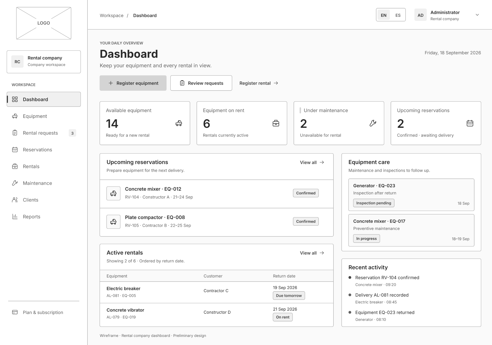

Los registros, cantidades y fechas se presentan como datos ilustrativos para representar la organización de la información.

#### 2. Equipment — Gestión de maquinaria

**Propósito:** Permitir que la empresa de alquiler consulte y administre la maquinaria registrada, identificando rápidamente su disponibilidad, estado y ubicación.

**Elementos clave:**
- Acción principal para registrar maquinaria.
- Barra de búsqueda por nombre o código.
- Filtros por categoría, estado, ubicación y disponibilidad.
- Indicadores de equipos disponibles, alquilados y en mantenimiento.
- Listado de maquinaria con código, categoría, ubicación y estado.
- Acciones para consultar detalles y editar información.

**Desktop Web Browser**

  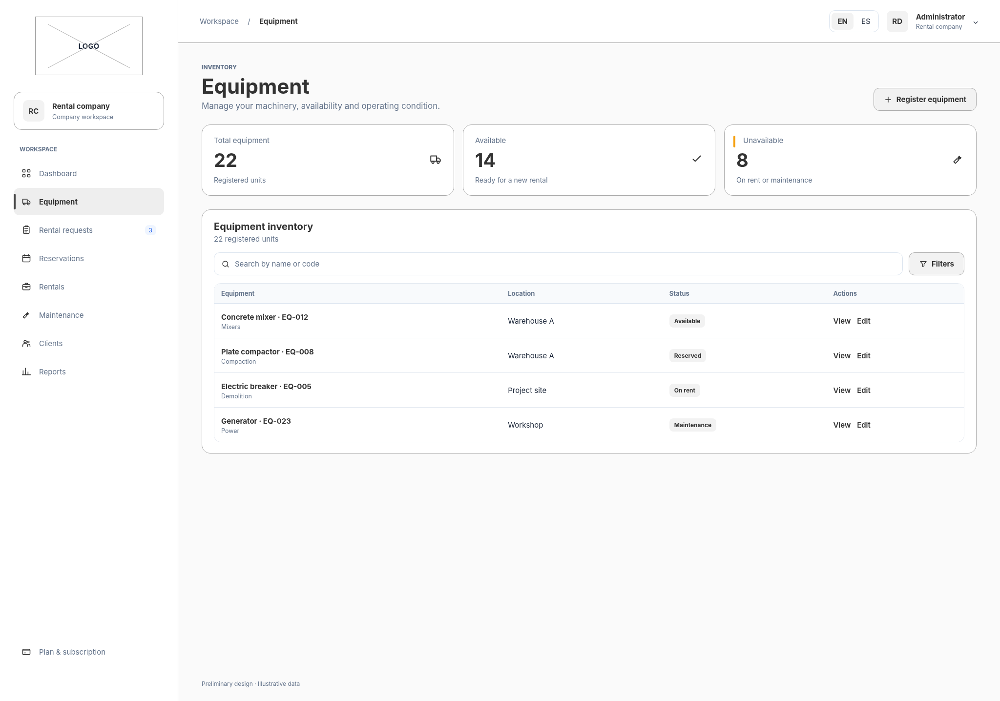

#### 3. Rental Requests — Solicitudes de alquiler

**Propósito:** Permitir que la empresa de alquiler revise las solicitudes recibidas y determine cuáles pueden ser atendidas de acuerdo con la disponibilidad de la maquinaria.

**Elementos clave:**
- Resumen de solicitudes pendientes, aprobadas y rechazadas.
- Filtros por estado y fecha.
- Información del solicitante, equipo solicitado y período.
- Acciones para revisar, aprobar o rechazar solicitudes.
- Etiquetas de estado claramente diferenciadas.

**Desktop Web Browser**

  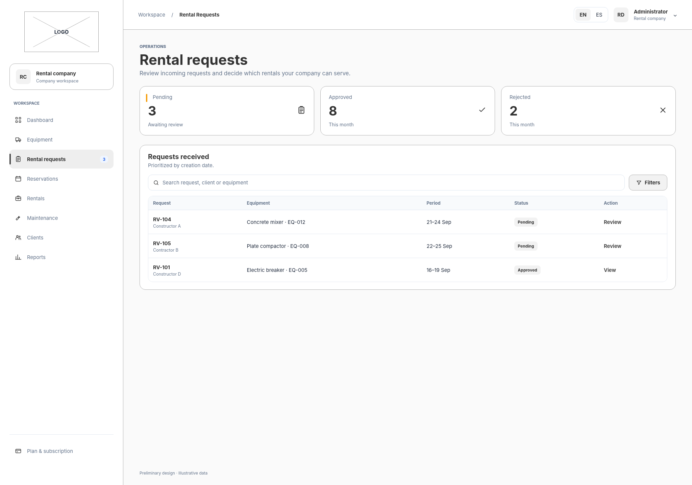

#### 4. Reservations — Reservas

**Propósito:** Permitir que la empresa de alquiler consulte y administre las reservas confirmadas de maquinaria para determinados períodos.

**Elementos clave:**
- Listado de reservas confirmadas.
- Equipo, cliente y período de reserva.
- Próximas fechas de entrega.
- Filtros por período y estado.
- Acceso al detalle de la reserva.
- Acción para continuar con el registro del alquiler.

**Desktop Web Browser**

  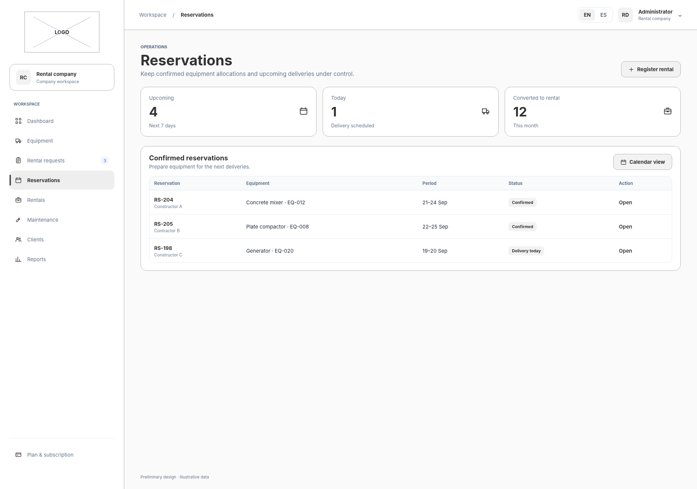

#### 5. Rentals — Alquileres

**Propósito:** Permitir que la empresa de alquiler consulte los alquileres activos y gestione las etapas de entrega y devolución de la maquinaria.

**Elementos clave:**
- Resumen de alquileres activos y próximos a vencer.
- Información de equipo, cliente, fecha de inicio y devolución.
- Estados del alquiler.
- Acciones para registrar entrega y devolución.
- Indicadores para devoluciones próximas o vencidas.

**Desktop Web Browser**

  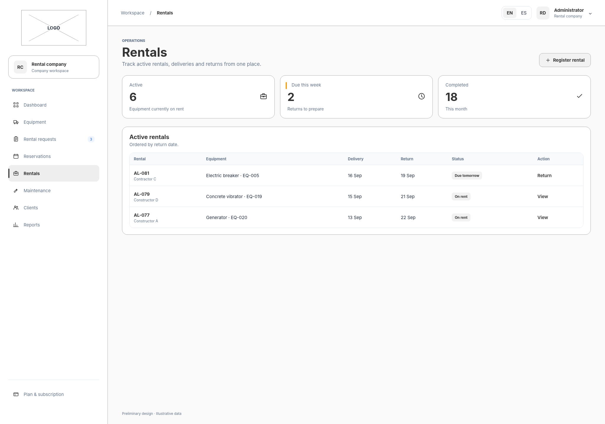

#### 6. Maintenance — Mantenimiento e incidencias

**Propósito:** Permitir que la empresa de alquiler gestione inspecciones, incidencias, mantenimientos programados y el historial operativo de la maquinaria.

**Elementos clave:**
- Resumen de equipos en mantenimiento e inspecciones pendientes.
- Listado de mantenimientos programados y en curso.
- Registro de incidencias asociadas a maquinaria.
- Fecha, tipo y estado de cada mantenimiento.
- Acciones para registrar, programar o consultar mantenimiento.

**Desktop Web Browser**

  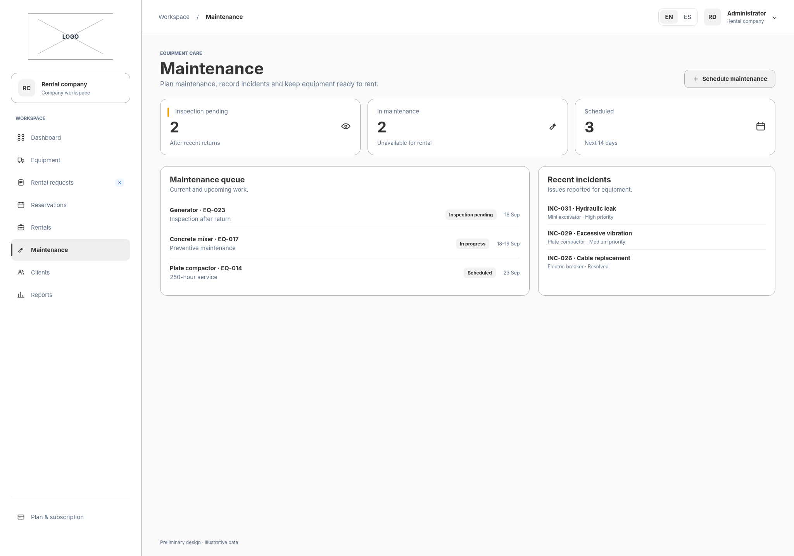

#### 7. Dashboard — Empresa constructora

**Propósito:** Proporcionar a la empresa constructora una vista general de sus solicitudes, reservas y alquileres, permitiéndole conocer rápidamente el estado de la maquinaria requerida para sus proyectos.

**Elementos clave:**
- Navegación hacia Dashboard, Search equipment, My requests, My reservations, My rentals y Profile.
- Acción principal para buscar maquinaria.
- Resumen de solicitudes pendientes y reservas próximas.
- Alquileres activos y fechas de devolución.
- Actividad reciente relacionada con solicitudes y alquileres.

**Desktop Web Browser**

  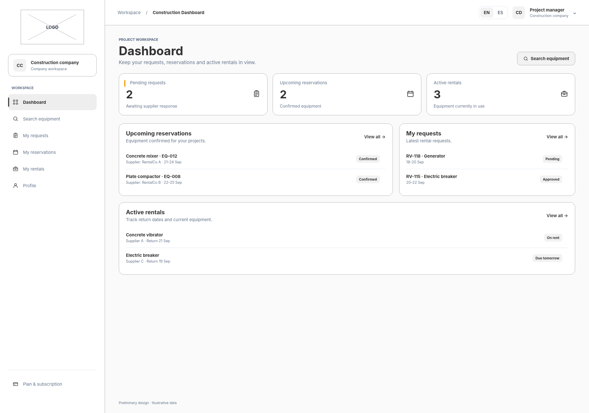

#### 8. Equipment Search — Búsqueda de maquinaria

**Propósito:** Permitir que la empresa constructora encuentre maquinaria de acuerdo con las necesidades de su proyecto.

**Elementos clave:**
- Barra de búsqueda.
- Filtros por categoría, disponibilidad, ubicación y características.
- Cards de maquinaria con nombre, código, categoría y estado.
- Información resumida de disponibilidad.
- Acción para consultar el detalle de un equipo.

**Desktop Web Browser**

  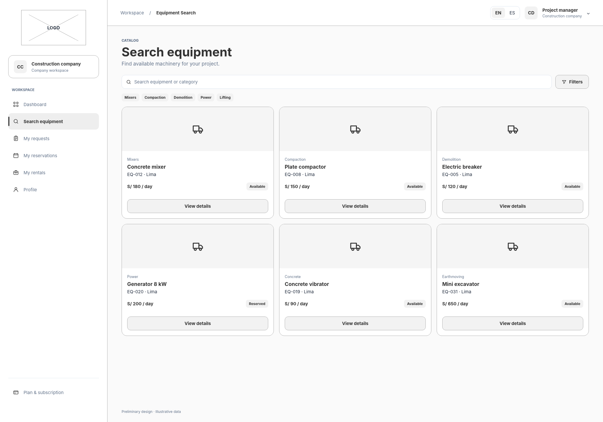

#### 9. Equipment Detail — Detalle de maquinaria

**Propósito:** Permitir que la empresa constructora consulte las características, condiciones y disponibilidad de una maquinaria antes de solicitar su alquiler.

**Elementos clave:**
- Nombre, código, categoría e información descriptiva del equipo.
- Características y condiciones de alquiler.
- Estado y disponibilidad.
- Selección del período requerido.
- Acción para consultar disponibilidad.
- Acción principal para solicitar alquiler.

**Desktop Web Browser**

  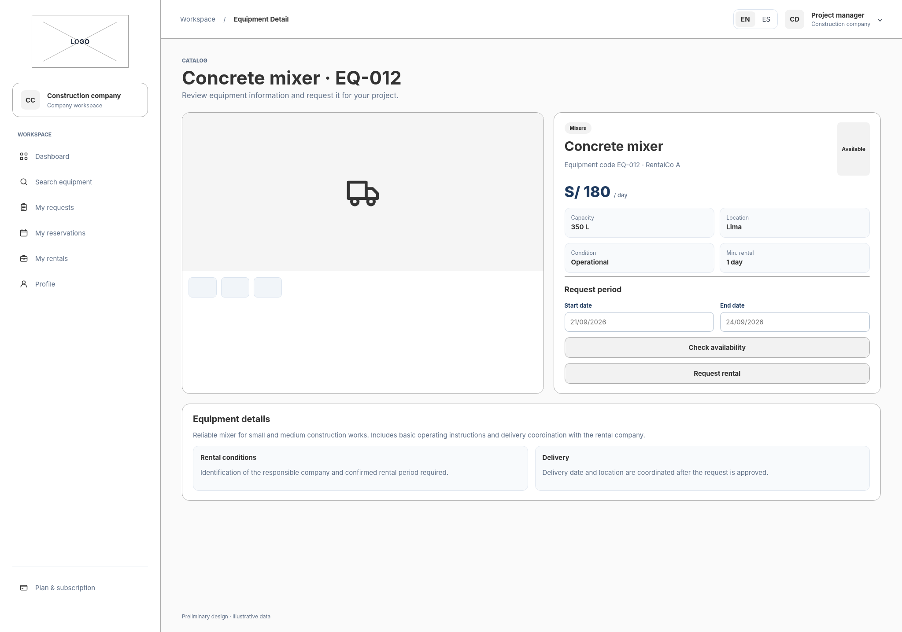

#### 10. My Requests — Mis solicitudes

**Propósito:** Permitir que la empresa constructora consulte el estado de las solicitudes de alquiler realizadas.

**Elementos clave:**
- Listado de solicitudes realizadas.
- Equipo solicitado y período requerido.
- Fecha de creación.
- Estados Pending, Approved y Rejected.
- Acceso al detalle de cada solicitud.

**Desktop Web Browser**

  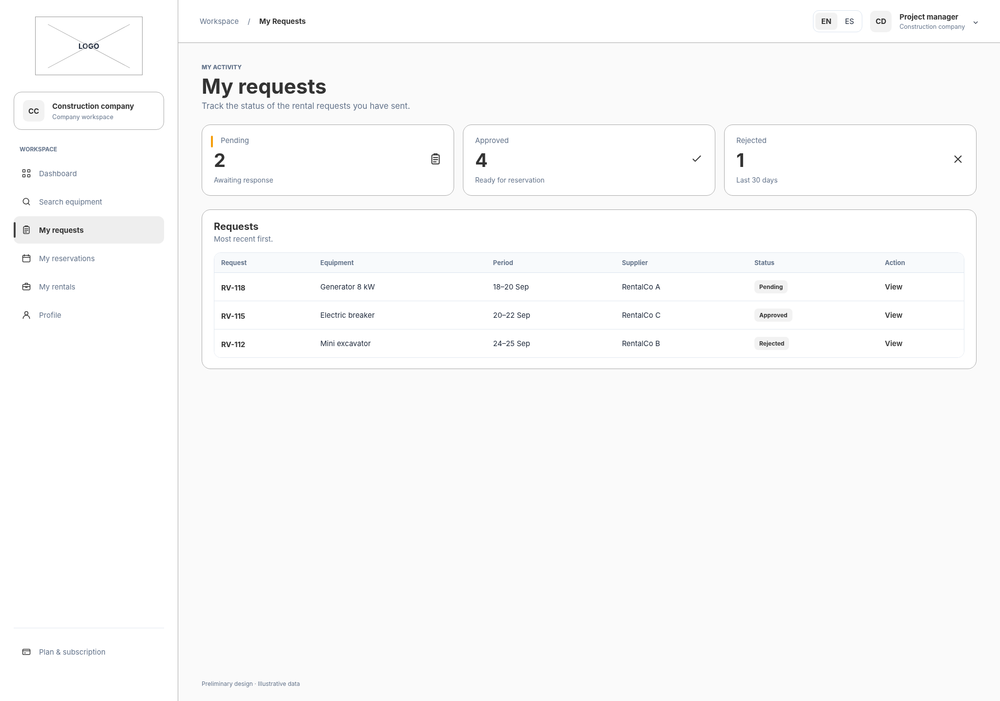

#### 11. My Reservations — Mis reservas

**Propósito:** Permitir que la empresa constructora consulte las reservas confirmadas y conozca las próximas fechas asociadas a la entrega de la maquinaria.

**Elementos clave:**
- Listado de reservas confirmadas.
- Equipo y empresa de alquiler.
- Período reservado.
- Fecha o información de próxima entrega.
- Acceso al detalle de la reserva.

**Desktop Web Browser**

  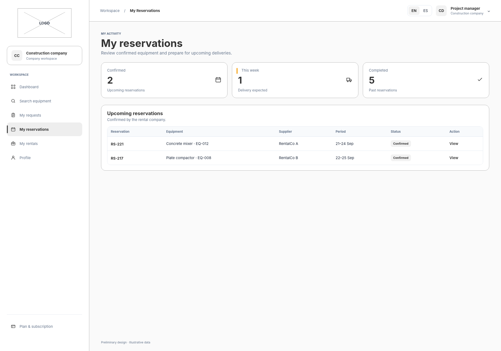

#### 12. My Rentals — Mis alquileres

**Propósito:** Permitir que la empresa constructora realice seguimiento de sus alquileres activos y conozca las fechas de devolución.

**Elementos clave:**
- Listado de alquileres activos.
- Equipo alquilado y empresa proveedora.
- Período del alquiler.
- Fecha de devolución.
- Indicadores para devoluciones próximas.
- Acceso al detalle del alquiler.

**Desktop Web Browser**

  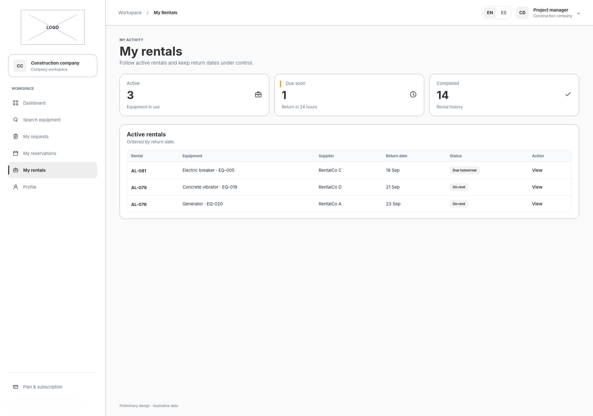

### 4.4.2. Web Applications Wireflow Diagrams

**Trazabilidad del wireflow general:** inventario US06–US10; búsqueda/detalle US11–US13; solicitudes US14/US18/US19/US21; alquileres y retorno US20/US22; mantenimiento US23–US26; planes US15–US17; perfil/acceso US01–US05. El gráfico recuperado es navegación general y no acredita wireflows completos por cada user goal. Su actualización por objetivo y las variantes mobile permanecen pendientes.

Los wireflow diagrams de la Web Application de RentBuild representan la relación entre las principales pantallas del sistema y permiten visualizar el recorrido general de navegación que realizan los usuarios dentro de la plataforma. A diferencia de los wireframes, que muestran la estructura individual de cada interfaz, el wireflow permite comprender cómo se conectan las pantallas entre sí y cómo fluye la experiencia de uso de acuerdo con las acciones y decisiones del usuario.

En el caso de RentBuild, se ha definido un wireflow general que integra los principales recorridos de la aplicación web, desde las pantallas de autenticación hasta las interfaces específicas para los dos segmentos principales de usuarios: las empresas de alquiler de maquinaria y las empresas constructoras. De esta forma, se representa de manera global la navegación principal del sistema, así como las pantallas clave que intervienen en el proceso de gestión y solicitud de maquinaria.

El recorrido inicia en la pantalla de Login, desde la cual el usuario puede registrarse en caso de no contar con una cuenta o recuperar su contraseña si no recuerda sus credenciales. Una vez completado el proceso de autenticación o registro, el flujo contempla una decisión relacionada con el tipo de empresa usuaria. Esta decisión divide la navegación en dos ramas principales.

Por un lado, la rama correspondiente a la empresa de alquiler de maquinaria conduce al dashboard principal de administración. Desde esta vista se accede a pantallas orientadas a la gestión interna de la operación, tales como Equipment, Rental Requests, Reservations, Rentals, Maintenance, Plan & Subscription y Profile. Estas interfaces permiten registrar y administrar maquinaria, revisar solicitudes de alquiler, gestionar reservas confirmadas, controlar alquileres activos, programar mantenimientos y administrar la suscripción del servicio.

Por otro lado, la rama correspondiente a la empresa constructora conduce a su propio dashboard, desde el cual el usuario puede navegar hacia Equipment Search, Equipment Detail, My Requests, My Reservations, My Rentals y Profile. Este recorrido permite buscar maquinaria disponible, consultar sus características, enviar solicitudes de alquiler y dar seguimiento a las reservas y alquileres realizados.

  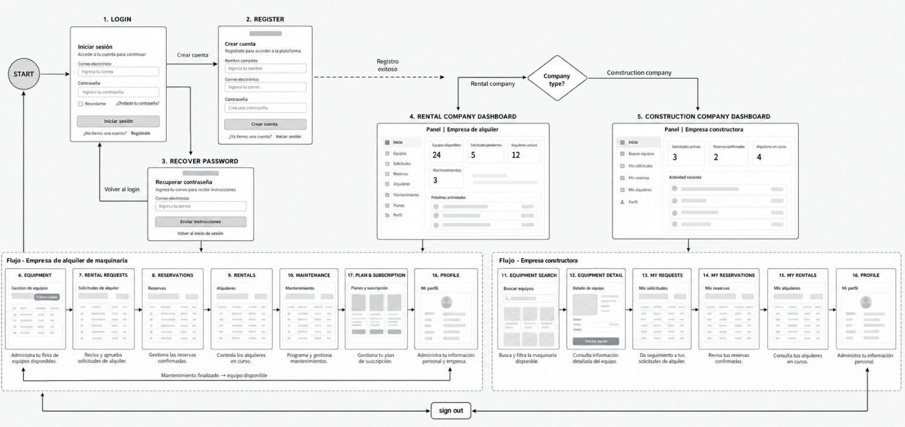

### 4.4.3. Web Applications Mock-ups

Los mock-ups de la Web Application de RentBuild representan la propuesta visual de alta fidelidad de las interfaces definidas mediante los wireframes. Estas vistas incorporan los elementos establecidos en el Design System de RentBuild, como la tipografía Inter, los colores corporativos, la iconografía, los botones, cards, formularios, etiquetas de estado y componentes de navegación.

La propuesta utiliza azul oscuro para la identidad y navegación principal, naranja para destacar las acciones prioritarias, azul para enlaces y acciones secundarias, y fondos claros para mantener una interfaz ordenada y legible. Los componentes mantienen una jerarquía visual consistente y comunican los estados mediante etiquetas textuales, evitando depender únicamente del color.

Las variantes Desktop Web Browser y Mobile Web Browser conservan la misma arquitectura de información y los mismos objetivos de tarea, adaptando únicamente la distribución y densidad de los componentes al espacio disponible.

#### 1. Login

**Propósito:** Presentar una interfaz que permita que los usuarios registrados accedan de forma segura a RentBuild mediante sus credenciales.

**Elementos clave:**
- Logotipo de RentBuild y selector de idioma.
- Campo de correo electrónico y campo de contraseña.
- Acción principal para iniciar sesión.
- Enlace para recuperar la contraseña.
- Enlace para crear una nueva cuenta.

**Desktop Web Browser**

  

#### 2. Registro de usuario

**Propósito:** Permitir la creación de una cuenta y recopilar la información necesaria para identificar al usuario y su organización dentro de RentBuild.

**Elementos clave:**
- Datos personales del usuario.
- Correo electrónico y contraseña.
- Información básica de la empresa.
- Selección del tipo de organización.
- Acción para crear la cuenta.
- Enlace para volver al inicio de sesión.

**Desktop Web Browser**

  

#### 3. Perfil

**Propósito:** Permitir al usuario consultar y gestionar la información asociada a su perfil y organización dentro de RentBuild.

**Elementos clave:**
- Información personal del usuario.
- Información de la empresa u organización.
- Datos de contacto.
- Opciones para editar la información.
- Configuración de la cuenta.

**Desktop Web Browser**

  

#### 4. Dashboard — Empresa de alquiler de maquinaria

**Propósito:** Presentar visualmente al administrador una vista general de la disponibilidad de su maquinaria y de las operaciones de alquiler, facilitando la identificación de próximas entregas, devoluciones y necesidades de mantenimiento.

**Elementos clave:**
- Navegación lateral hacia Dashboard, Equipment, Rental requests, Reservations, Rentals, Maintenance, Clients y Reports.
- Accesos rápidos para registrar maquinaria, revisar solicitudes y registrar un alquiler.
- Indicadores de maquinaria disponible, maquinaria alquilada, maquinaria en mantenimiento y próximas reservas.
- Listado de reservas confirmadas y resumen de alquileres activos con sus fechas de devolución.
- Seguimiento de inspecciones, mantenimiento y actividad reciente.
- Selector de idioma y acceso a la cuenta del administrador.

**Desktop Web Browser**

  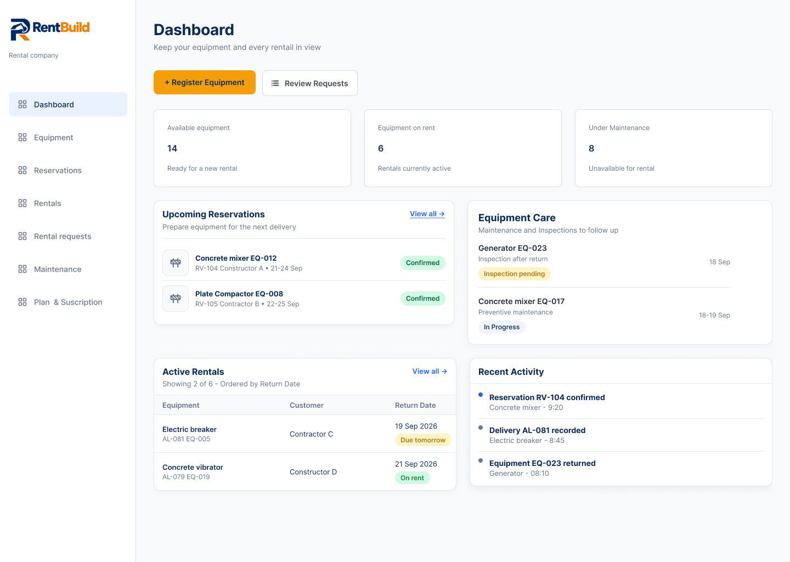

#### 5. Equipment — Gestión de maquinaria

**Propósito:** Presentar una interfaz que permita que la empresa de alquiler consulte y administre la maquinaria registrada, identificando rápidamente su disponibilidad, estado y ubicación.

**Elementos clave:**
- Acción principal para registrar maquinaria.
- Barra de búsqueda por nombre o código.
- Filtros por categoría, estado, ubicación y disponibilidad.
- Indicadores de equipos disponibles, alquilados y en mantenimiento.
- Listado de maquinaria con código, categoría, ubicación y estado.
- Acciones para consultar detalles y editar información.

**Desktop Web Browser**

  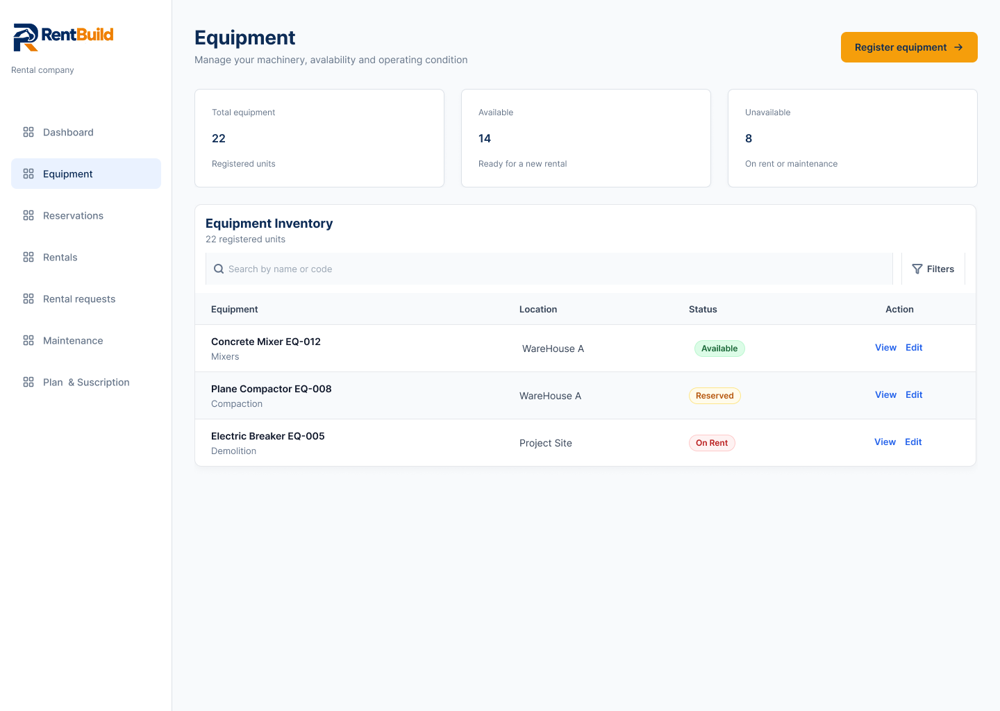

#### 6. Rental Requests — Solicitudes de alquiler

**Propósito:** Presentar una interfaz que permita que la empresa de alquiler revise las solicitudes recibidas y determine cuáles pueden ser atendidas de acuerdo con la disponibilidad de la maquinaria.

**Elementos clave:**
- Resumen de solicitudes pendientes, aprobadas y rechazadas.
- Filtros por estado y fecha.
- Información del solicitante, equipo solicitado y período.
- Acciones para revisar, aprobar o rechazar solicitudes.
- Etiquetas de estado claramente diferenciadas.

**Desktop Web Browser**

  

#### 7. Reservations — Reservas

**Propósito:** Presentar una interfaz que permita que la empresa de alquiler consulte y administre las reservas confirmadas de maquinaria para determinados períodos.

**Elementos clave:**
- Listado de reservas confirmadas.
- Equipo, cliente y período de reserva.
- Próximas fechas de entrega.
- Filtros por período y estado.
- Acceso al detalle de la reserva.
- Acción para continuar con el registro del alquiler.

**Desktop Web Browser**

  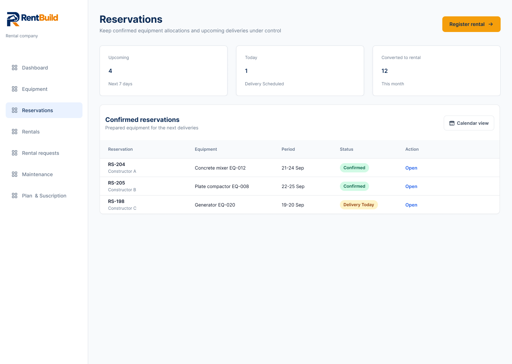

#### 8. Rentals — Alquileres

**Propósito:** Presentar una interfaz que permita que la empresa de alquiler consulte los alquileres activos y gestione las etapas de entrega y devolución de la maquinaria.

**Elementos clave:**
- Resumen de alquileres activos y próximos a vencer.
- Información de equipo, cliente, fecha de inicio y devolución.
- Estados del alquiler.
- Acciones para registrar entrega y devolución.
- Indicadores para devoluciones próximas o vencidas.

**Desktop Web Browser**

  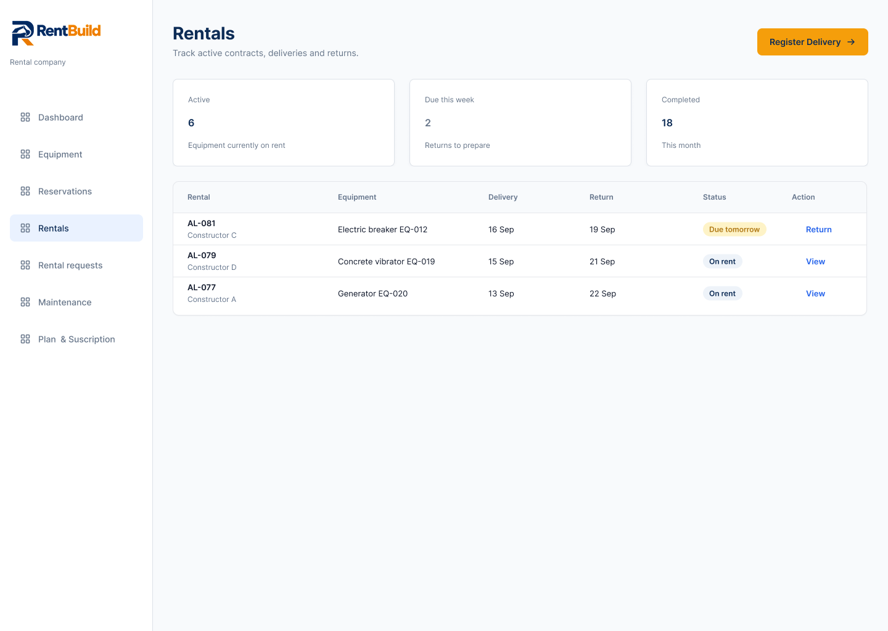

#### 9. Maintenance — Mantenimiento e incidencias

**Propósito:** Presentar una interfaz que permita que la empresa de alquiler gestione inspecciones, incidencias, mantenimientos programados y el historial operativo de la maquinaria.

**Elementos clave:**
- Resumen de equipos en mantenimiento e inspecciones pendientes.
- Listado de mantenimientos programados y en curso.
- Registro de incidencias asociadas a maquinaria.
- Fecha, tipo y estado de cada mantenimiento.
- Acciones para registrar, programar o consultar mantenimiento.

**Desktop Web Browser**

  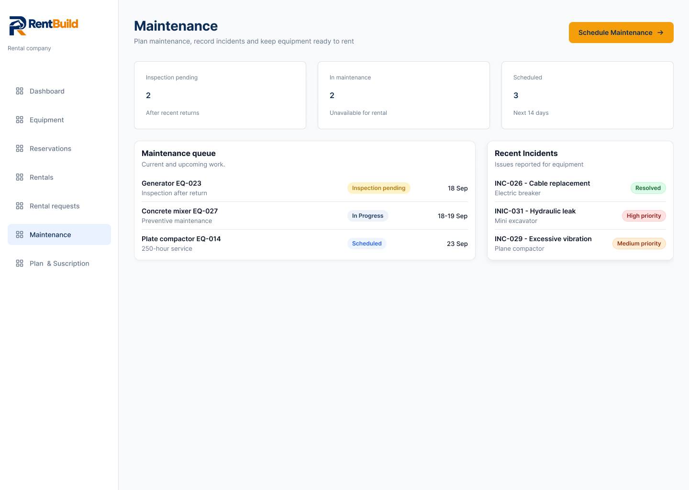

#### 10. Dashboard — Empresa constructora

**Propósito:** Presentar visualmente a la empresa constructora una vista general de sus solicitudes, reservas y alquileres, permitiéndole conocer rápidamente el estado de la maquinaria requerida para sus proyectos.

**Elementos clave:**
- Navegación hacia Dashboard, Search equipment, My requests, My reservations, My rentals y Profile.
- Acción principal para buscar maquinaria.
- Resumen de solicitudes pendientes y reservas próximas.
- Alquileres activos y fechas de devolución.
- Actividad reciente relacionada con solicitudes y alquileres.

**Desktop Web Browser**

  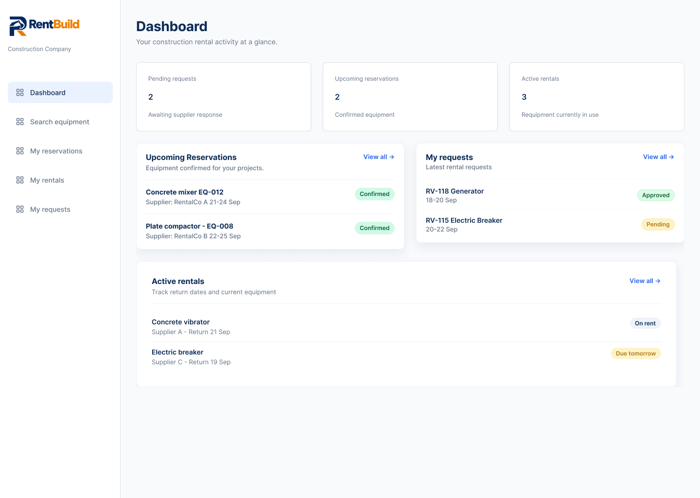

#### 11. Equipment Search — Búsqueda de maquinaria

**Propósito:** Presentar una interfaz que permita que la empresa constructora encuentre maquinaria de acuerdo con las necesidades de su proyecto.

**Elementos clave:**
- Barra de búsqueda.
- Filtros por categoría, disponibilidad, ubicación y características.
- Cards de maquinaria con nombre, código, categoría y estado.
- Información resumida de disponibilidad.
- Acción para consultar el detalle de un equipo.

**Desktop Web Browser**

  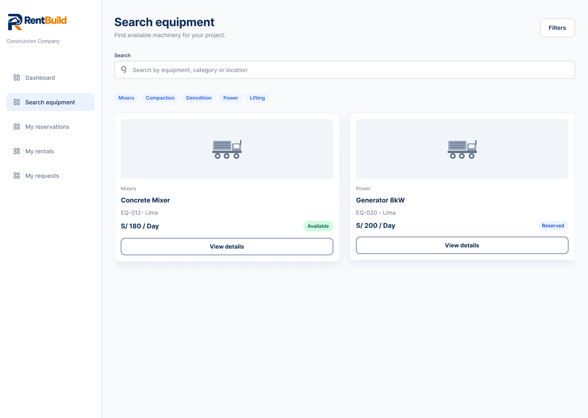

#### 12. Equipment Detail — Detalle de maquinaria

**Propósito:** Presentar una interfaz que permita que la empresa constructora consulte las características, condiciones y disponibilidad de una maquinaria antes de solicitar su alquiler.

**Elementos clave:**
- Nombre, código, categoría e información descriptiva del equipo.
- Características y condiciones de alquiler.
- Estado y disponibilidad.
- Selección del período requerido.
- Acción para consultar disponibilidad.
- Acción principal para solicitar alquiler.

**Desktop Web Browser**

  

#### 13. My Requests — Mis solicitudes

**Propósito:** Presentar una interfaz que permita que la empresa constructora consulte el estado de las solicitudes de alquiler realizadas.

**Elementos clave:**
- Listado de solicitudes realizadas.
- Equipo solicitado y período requerido.
- Fecha de creación.
- Estados Pending, Approved y Rejected.
- Acceso al detalle de cada solicitud.

**Desktop Web Browser**

  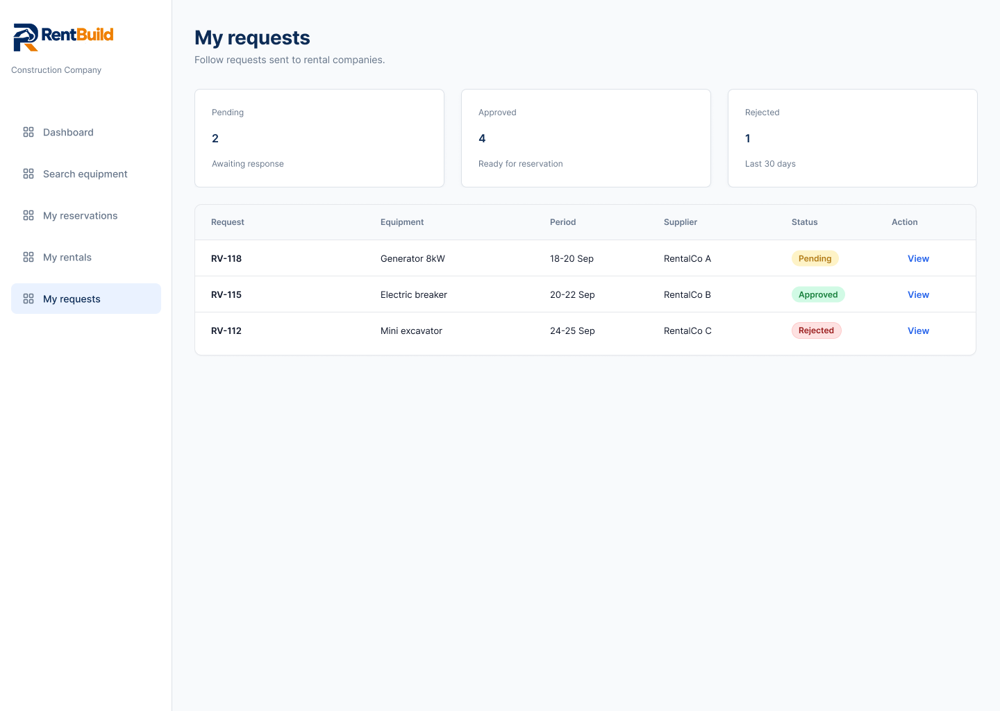

#### 14. My Reservations — Mis reservas

**Propósito:** Presentar una interfaz que permita que la empresa constructora consulte las reservas confirmadas y conozca las próximas fechas asociadas a la entrega de la maquinaria.

**Elementos clave:**
- Listado de reservas confirmadas.
- Equipo y empresa de alquiler.
- Período reservado.
- Fecha o información de próxima entrega.
- Acceso al detalle de la reserva.

**Desktop Web Browser**

  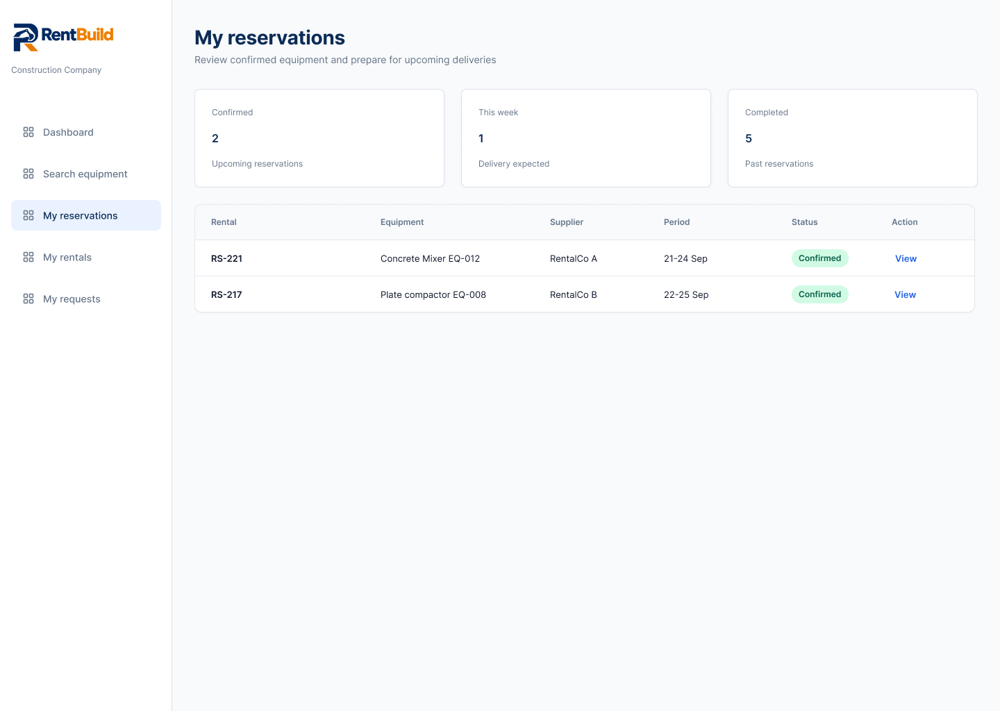

#### 15. My Rentals — Mis alquileres

**Propósito:** Presentar una interfaz que permita que la empresa constructora realice seguimiento de sus alquileres activos y conozca las fechas de devolución.

**Elementos clave:**
- Listado de alquileres activos.
- Equipo alquilado y empresa proveedora.
- Período del alquiler.
- Fecha de devolución.
- Indicadores para devoluciones próximas.
- Acceso al detalle del alquiler.

**Desktop Web Browser**

  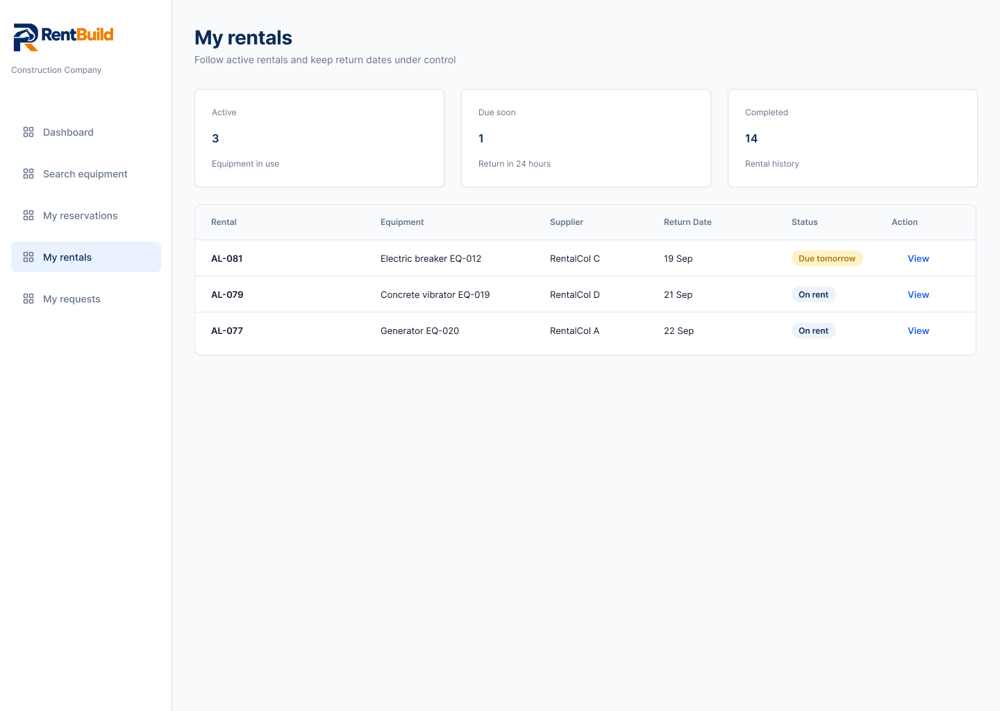

### 4.4.4. Web Applications User Flow Diagrams

**Correspondencia documental con el catálogo:** las imágenes siguientes conservan su export anterior; no se han renombrado ni editado para presentarlas como corregidas. Los flujos son una propuesta y no prueba de ejecución de TB1.

| Flow | US vigentes relacionadas | Límite de la evidencia |
|---|---|---|
| Authentication and Registration | US01, US02, US04, US05; US15–US17 para planes | El pago/activación dibujado no acredita una integración o cobro. |
| Rental Company Core Domain | US06–US10, US18–US20, US22–US26 | Solicitud, reserva y contrato requieren la misma definición en historias, EventStorming, clases y DB; el gráfico todavía debe conciliarse. |
| Construction Company Core Domain | US11–US14, US21 | Cancelación, confirmación de recepción y vistas adicionales dibujadas requieren revisar su cobertura; no se atribuyen a una US con otro rol ni se declaran implementadas. |

La cobertura por cada user goal, los mockups dentro del user flow y sus rutas alternativas deben completarse al actualizar los artefactos. Esta tabla establece relaciones textuales y no reemplaza los diagramas exigidos.

El User Flow Diagram de la Web Application de **RentBuild** representa las acciones, decisiones y resultados que atraviesan los usuarios durante los principales procesos de la plataforma. A diferencia del wireflow, que se enfoca en la relación y navegación entre pantallas, el user flow incorpora puntos de decisión y validaciones que permiten comprender cómo progresa cada tarea hasta alcanzar un resultado determinado.

#### Authentication and Registration User Flow

El Authentication and Registration User Flow representa el proceso transversal mediante el cual una persona obtiene acceso a RentBuild, independientemente del tipo de empresa a la que pertenece. El flujo contempla tanto el ingreso de usuarios existentes como la creación de nuevas cuentas, la recuperación de credenciales y la validación de las condiciones necesarias para acceder al workspace correspondiente.

El recorrido comienza cuando el usuario abre la plataforma y el sistema comprueba si existe una sesión activa. En caso contrario, se presenta la pantalla de inicio de sesión, desde la cual el usuario puede autenticarse, registrarse o iniciar el proceso de recuperación de contraseña. Cuando las credenciales son válidas, el sistema identifica el tipo de compañía y redirige al usuario hacia el entorno que le corresponde.

Durante el registro se distingue entre los dos segmentos atendidos por RentBuild: empresas de alquiler de maquinaria y empresas constructoras o contratistas. Las empresas constructoras pueden activar su cuenta directamente, mientras que las empresas de alquiler deben seleccionar un plan de suscripción y completar el proceso de pago antes de habilitar el acceso a las funcionalidades de la plataforma.

Asimismo, el flujo contempla escenarios alternativos como credenciales incorrectas, pagos no completados, suscripciones inactivas y recuperación de contraseña mediante correo electrónico. De esta manera, el diagrama no representa únicamente el camino exitoso, sino también las principales situaciones que pueden presentarse durante el acceso.

En conjunto, este User Flow permite visualizar cómo RentBuild controla la autenticación, creación de cuentas, diferenciación de segmentos, activación de suscripciones y acceso al workspace adecuado, constituyendo el punto de entrada común para los demás flujos funcionales del sistema.

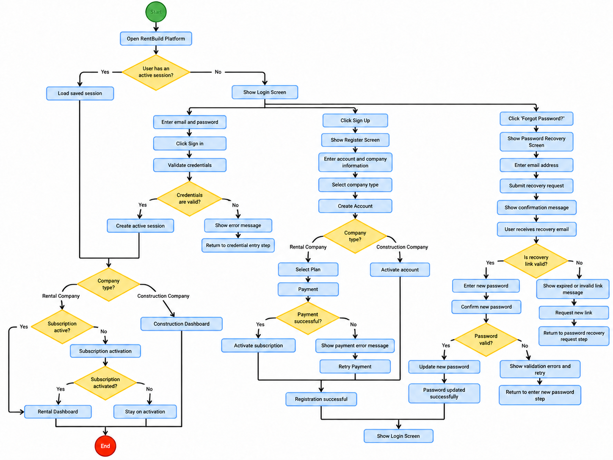

#### Rental Company Core Domain User Flow

El Rental Company Core Domain User Flow representa las principales operaciones que realiza una empresa de alquiler de maquinaria dentro de RentBuild una vez que ha obtenido acceso a su workspace. El flujo se concentra en las actividades directamente relacionadas con la administración de maquinaria y con el ciclo completo de atención de un alquiler.

El recorrido parte desde el Rental Company Dashboard, desde donde el usuario puede acceder a los módulos de Equipment, Rental Requests, Reservations, Rentals y Maintenance. Estos módulos representan las capacidades principales que permiten controlar la disponibilidad y utilización de la maquinaria.

En Equipment, la empresa administra su inventario mediante el registro de nuevos equipos, la actualización de información y la consulta de detalles. Esta información constituye la base para que la maquinaria pueda ser posteriormente encontrada y solicitada por empresas constructoras.

En Rental Requests, la empresa revisa las solicitudes recibidas. Cada solicitud puede ser aprobada o rechazada. Cuando se aprueba, la empresa constructora es notificada y se genera una reserva asociada al equipo y al período solicitado. Si se rechaza, se registra el motivo correspondiente y se comunica la decisión al solicitante.

El módulo Reservations permite administrar las asignaciones ya confirmadas. Una reserva puede consultarse, cancelarse o continuar hacia el registro de un alquiler. Esto establece una separación entre la intención inicialmente aprobada y la operación de alquiler que posteriormente será ejecutada.

En Rentals, la empresa administra las etapas operativas del servicio. El proveedor registra la entrega del equipo y posteriormente espera la confirmación de recepción por parte de la empresa constructora antes de considerar que la maquinaria se encuentra efectivamente en alquiler. Al finalizar el período, la constructora inicia la devolución y la empresa de alquiler revisa el retorno, inspecciona el equipo y confirma su recepción antes de completar el alquiler.

Finalmente, el módulo Maintenance permite programar mantenimientos, actualizar su estado y devolver un equipo a disponibilidad cuando nuevamente se encuentre en condiciones de ser alquilado.

Por ello, este User Flow representa el núcleo operativo de RentBuild para las empresas proveedoras, ya que integra la administración del inventario con la recepción de solicitudes, confirmación de reservas, ejecución de alquileres, entregas, devoluciones y mantenimiento de los equipos.

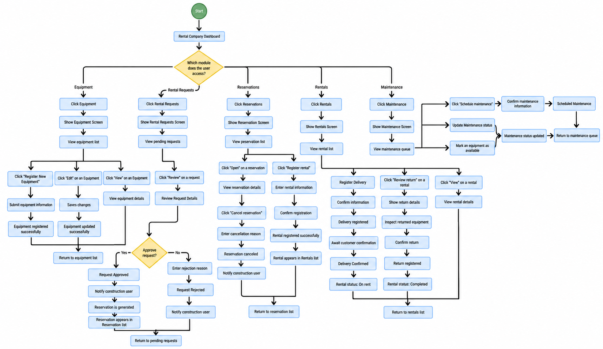

#### Construction Company Core Domain User Flow

El Construction Company Core Domain User Flow representa el recorrido principal de una pequeña empresa constructora o contratista que utiliza RentBuild para encontrar maquinaria, solicitar su alquiler y realizar seguimiento a las operaciones asociadas.

El flujo comienza desde el Construction Company Dashboard, desde donde el usuario puede acceder principalmente a Search Equipment, My Requests, My Reservations y My Rentals. A diferencia de la empresa de alquiler, este segmento no administra inventario propio dentro del sistema, sino que utiliza RentBuild como medio para encontrar y contratar maquinaria ofrecida por proveedores.

En Search Equipment, la empresa constructora explora el catálogo de maquinaria disponible, puede aplicar filtros según categoría, ubicación, disponibilidad u otras características, y acceder al detalle de un equipo. Desde esta vista puede seleccionar el período requerido y comprobar si la maquinaria se encuentra disponible para dichas fechas. Cuando la disponibilidad es favorable, puede generar una solicitud de alquiler.

Las solicitudes realizadas pasan a My Requests, donde la constructora puede consultar su estado. Una solicitud puede encontrarse pendiente mientras espera la respuesta del proveedor, ser aprobada para continuar con el proceso o ser rechazada. Mientras corresponda, el usuario también puede cancelar solicitudes que todavía no hayan avanzado a etapas posteriores.

Una vez confirmada la asignación del equipo, la operación pasa a My Reservations. Desde este módulo la empresa consulta las reservas vigentes, los equipos involucrados, los proveedores y los períodos confirmados. También puede cancelar una reserva cuando ya no requiera la maquinaria, notificando al proveedor y liberando el período previamente reservado.

Posteriormente, cuando la reserva se convierte en alquiler, la operación aparece en My Rentals. Desde allí la constructora puede consultar la maquinaria que se encuentra en uso, revisar las fechas de devolución y realizar las acciones que le corresponden dentro de la operación. Cuando el proveedor registra una entrega, la constructora confirma que recibió el equipo. Al finalizar el uso de la maquinaria, la constructora inicia el proceso de devolución, quedando la confirmación final y la inspección en manos de la empresa de alquiler.

En conjunto, este User Flow representa el journey principal de la empresa constructora dentro de RentBuild, desde la búsqueda de una necesidad de maquinaria hasta la solicitud, reserva, recepción, uso y devolución del equipo. De esta manera, complementa el flujo de la empresa de alquiler y muestra cómo ambos segmentos interactúan dentro del mismo ciclo de negocio.

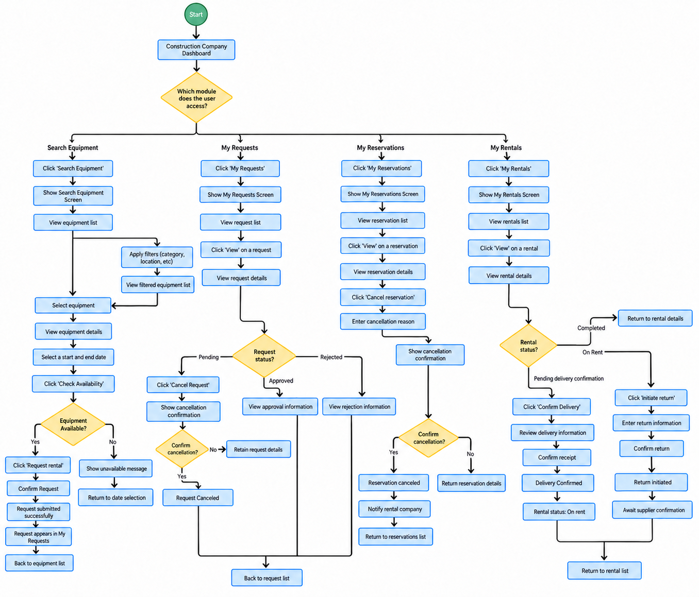

## 4.5. Web Applications Prototyping

Este apartado presenta el prototipo funcional de RentBuild, desarrollado a partir de los wireframes y mock-ups definidos previamente y publicado en Vercel. En él se puede recorrer el flujo principal de la plataforma, desde el inicio de sesión hasta la gestión de inventario, solicitudes de alquiler, mantenimiento y catálogo, de modo que el equipo y los usuarios puedan probar la navegación y validar la propuesta de interfaz. Prototipo: https://dataflux-landing-page.vercel.app/

## 4.6. Domain-Driven Software Architecture

Esta sección describe cómo se estructura RentBuild desde el enfoque Domain-Driven Design. Primero se presenta el Design-Level Event Storming, con el que se delimitan los Bounded Contexts del dominio; luego se detallan los diagramas de contexto, contenedores y componentes del modelo C4, que explican qué piezas conforman el sistema y cómo se comunican entre sí para dar soporte al ciclo completo de alquiler de maquinaria.

### 4.6.1. Design-Level Event Storming

El Design-Level Event Storming permitió profundizar en los procesos identificados durante el Big Picture Event Storming, detallando los eventos, comandos, actores y reglas principales involucrados en el dominio de RentBuild. Este análisis facilita la identificación de los límites y responsabilidades de los diferentes componentes del sistema.

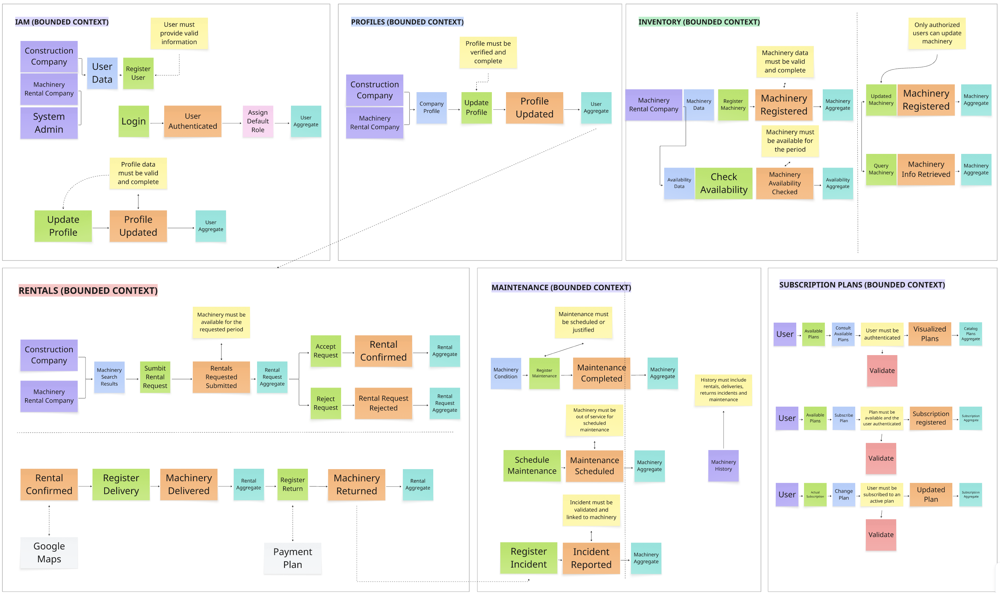

### 4.6.2. Software Architecture Context Diagram

El Software Architecture Context Diagram presenta a **RentBuild** como un único sistema de software y muestra su interacción con los principales usuarios y servicios externos. En este nivel del C4 Model no se representan todavía los componentes internos, containers, bounded contexts ni tecnologías de implementación, ya que el objetivo es delimitar el alcance funcional de la solución y reconocer las dependencias externas con las que se comunica.

Los principales actores que interactúan con RentBuild son:

- **Rental Operator:** representa al usuario perteneciente a una empresa de alquiler de maquinaria. Utiliza RentBuild para administrar equipos, solicitudes de alquiler, reservas, entregas, devoluciones, incidencias y actividades de mantenimiento.
- **Construction Manager:** representa al usuario perteneciente a una empresa constructora. Utiliza la plataforma para buscar maquinaria, revisar disponibilidad, realizar solicitudes de alquiler y efectuar el seguimiento de sus reservas y alquileres activos.
- **System Administrator:** representa al responsable de administrar el acceso a la plataforma, supervisar su operación y atender casos excepcionales que requieran intervención administrativa.

RentBuild también mantiene comunicación con servicios externos necesarios para determinadas capacidades del producto:

- **Google Maps Platform:** proporciona servicios de geolocalización y mapas utilizados para apoyar la localización de maquinaria y la coordinación de entregas y devoluciones.
- **Stripe:** procesa los pagos asociados a los planes de suscripción de RentBuild.
- **SendGrid:** proporciona servicios de correo transaccional para comunicaciones relacionadas con cuentas, reservas, alquileres, suscripciones y otras notificaciones del sistema.

  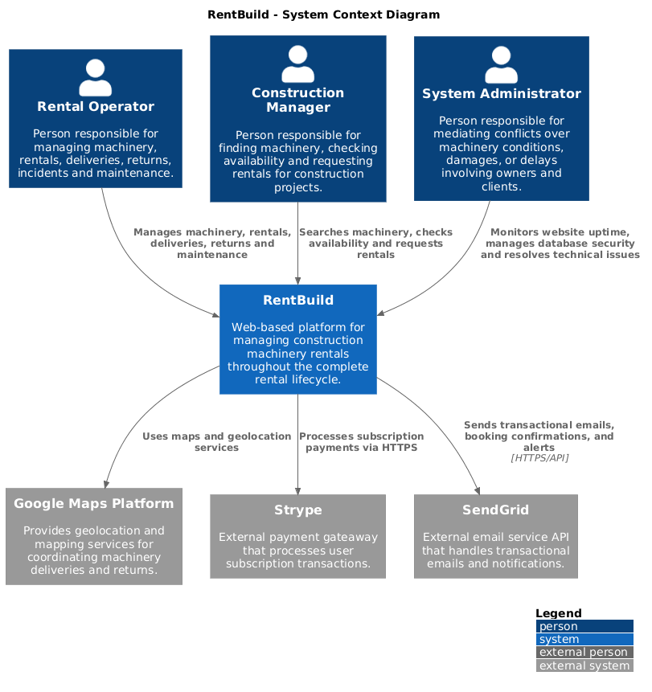

### 4.6.3. Software Architecture Container Diagrams

The Software Architecture Container Diagram presents the main containers that compose the RentBuild platform and the technologies used to implement them.

RentBuild is composed of a public **Landing Page**, a **Single Page Application**, a **RESTful API**, and a **MySQL Database**. The Landing Page provides public information about the platform, while the Single Page Application allows authenticated users to interact with the main business capabilities. The RESTful API exposes the application services and manages access to persistent data.

Additionally, the RESTful API communicates with external services such as **Google Maps Platform** for geolocation capabilities, **Stripe** for subscription payment processing, and **SendGrid** for transactional email delivery.

  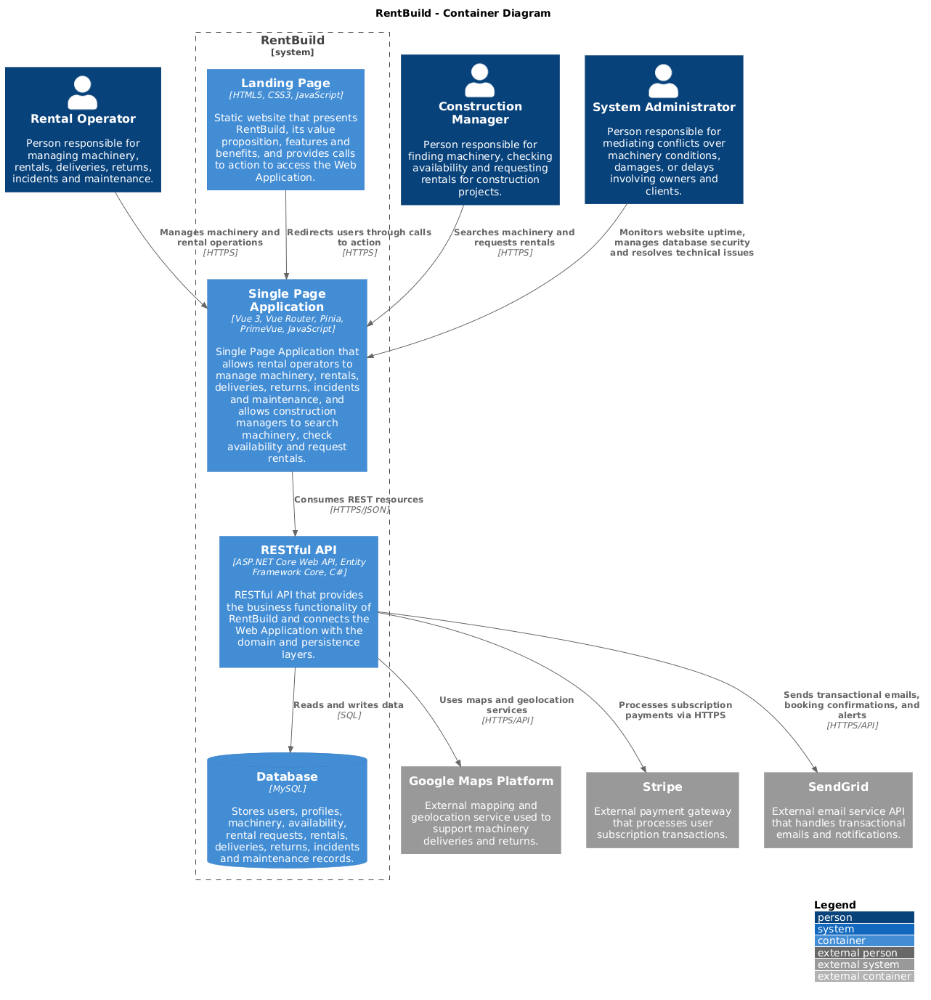

### 4.6.4. Software Architecture Components Diagrams

Los diagramas de componentes de arquitectura de software presentan una vista detallada de la organización interna de los principales contenedores frontend y backend que conforman RentBuild.

A nivel de frontend, la Single Page Application desarrollada con Vue se organiza alrededor de los bounded contexts definidos para la solución: IAM, Profiles, Inventory, Rentals, Maintenance y Subscriptions. Adicionalmente, Shared Frontend concentra componentes, modelos y capacidades técnicas transversales reutilizables por los diferentes contextos de la aplicación. Una vista general de componentes muestra cómo estos elementos se integran dentro de la aplicación frontend, mientras que los diagramas individuales permiten observar su organización interna mediante las capas Presentation, Application, Domain e Infrastructure, según corresponda.

Además, para cada bounded context del frontend se presenta una vista detallada basada en las capas DDD Presentation, Application, Domain e Infrastructure. Estas vistas permiten identificar los componentes internos, sus responsabilidades, tecnologías y relaciones. Complementariamente, se mantiene una vista específica de la Presentation Layer, donde se muestran con mayor detalle los componentes Vue responsables de las páginas, formularios, vistas y elementos de interfaz correspondientes.

A nivel de backend, la RESTful API desarrollada con C# y ASP.NET Core mantiene la misma organización basada en bounded contexts. Una vista general presenta los contextos contenidos dentro de la aplicación backend, mientras que los diagramas individuales descomponen cada bounded context en las capas Interfaces, Application, Domain e Infrastructure siguiendo principios de Domain-Driven Design.

A continuación, se presentan las diferentes vistas de componentes que conforman la arquitectura de RentBuild.

#### Frontend General Components Diagram

El Frontend General Components Diagram presenta la organización general de la Single Page Application de RentBuild. El frontend está implementado con Vue y PrimeVue y se estructura alrededor de los bounded contexts definidos para el dominio del negocio.

Los mecanismos de layout y routing de la aplicación permiten coordinar la navegación hacia IAM, Profiles, Inventory, Rentals, Maintenance y Subscriptions. Asimismo, Shared Frontend proporciona capacidades reutilizables de interfaz y servicios transversales, mientras que la infraestructura del frontend permite la comunicación con la RentBuild Backend API.

  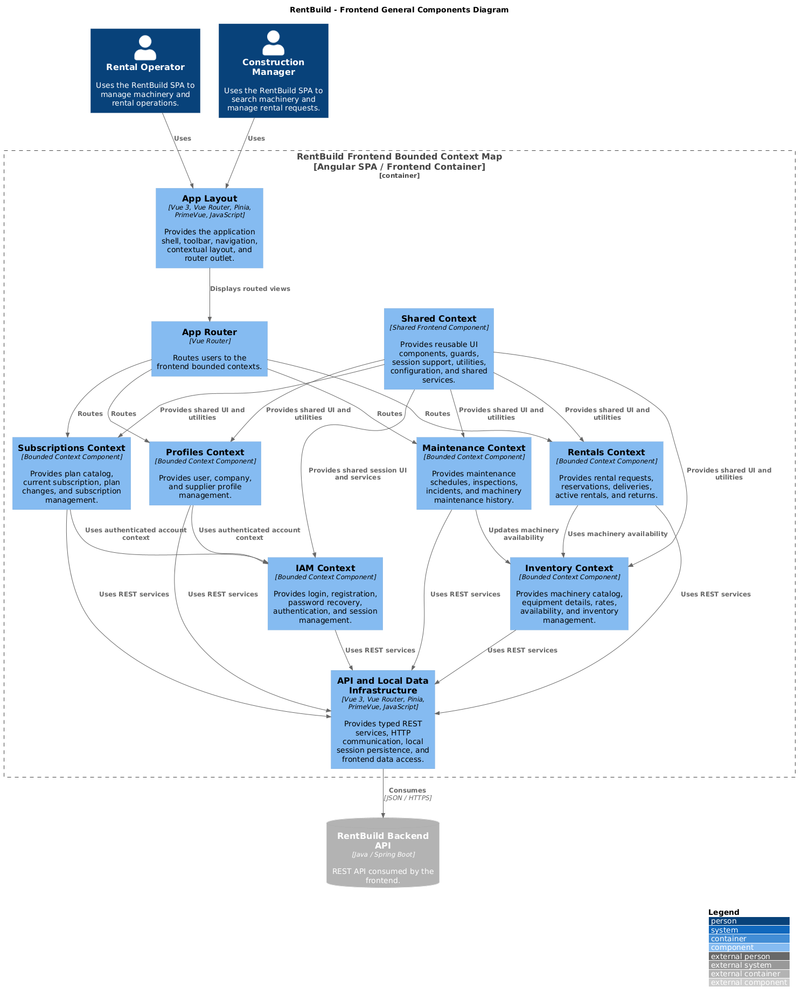

#### IAM Frontend Components Diagram

El bounded context IAM del frontend es responsable de las funcionalidades relacionadas con autenticación, registro, recuperación de contraseña, gestión de sesión y acceso a la cuenta.

La Presentation Layer administra las vistas y las interacciones relacionadas con la autenticación. La Application Layer coordina los flujos de autenticación y el estado de sesión. La Domain Layer contiene los modelos y reglas del frontend asociados con autenticación, mientras que la Infrastructure Layer proporciona la comunicación con los servicios de autenticación del backend y mecanismos técnicos como la persistencia de sesión.

IAM también proporciona información de la cuenta autenticada a otros contextos del frontend y utiliza las capacidades compartidas proporcionadas por Shared Frontend.

  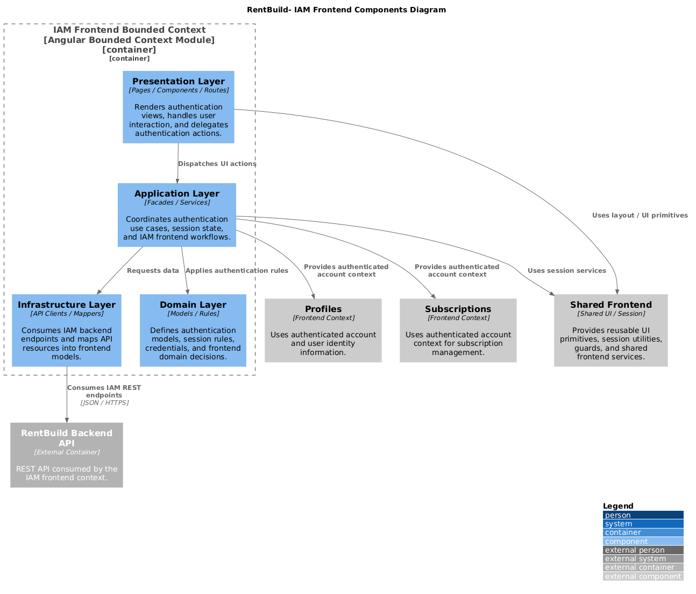

#### IAM Frontend Detailed Component Diagram

El IAM Frontend Detailed Component Diagram presenta una vista más completa de la organización interna del bounded context IAM, integrando las capas Presentation, Application, Domain e Infrastructure y mostrando las relaciones existentes entre sus componentes.

La Presentation Layer está conformada por `LoginComponent`, `RegisterComponent` y `RecoverPasswordComponent`, responsables de las principales interacciones relacionadas con autenticación, registro y recuperación de contraseña.

La Application Layer coordina los casos de uso y el estado asociado con los procesos de autenticación y gestión de sesión. La Domain Layer concentra los modelos y reglas vinculados con credenciales, sesión y conceptos propios del contexto IAM. Por su parte, la Infrastructure Layer permite consumir los servicios REST expuestos por la RentBuild Backend API y transformar los recursos recibidos en modelos utilizados por el frontend.

Este nivel de detalle permite observar cómo los componentes de presentación delegan las operaciones a la capa de aplicación, cómo esta coordina el acceso a infraestructura y dominio, y cómo la infraestructura establece la comunicación con los servicios backend.

  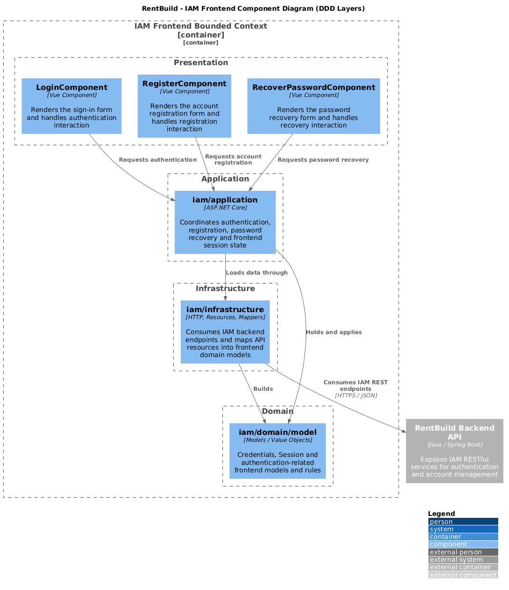

#### Profiles Frontend Components Diagram

El bounded context Profiles del frontend administra la información relacionada con los perfiles de usuarios, empresas y proveedores.

La Presentation Layer contiene las vistas y formularios asociados con los perfiles. La Application Layer coordina las consultas y operaciones de actualización, mientras que la Domain Layer contiene los modelos y reglas correspondientes. La Infrastructure Layer se encarga de la comunicación con los endpoints de Profiles disponibles en el backend.

Este bounded context también utiliza la información de la cuenta autenticada proporcionada por IAM y las capacidades comunes proporcionadas por Shared Frontend.

  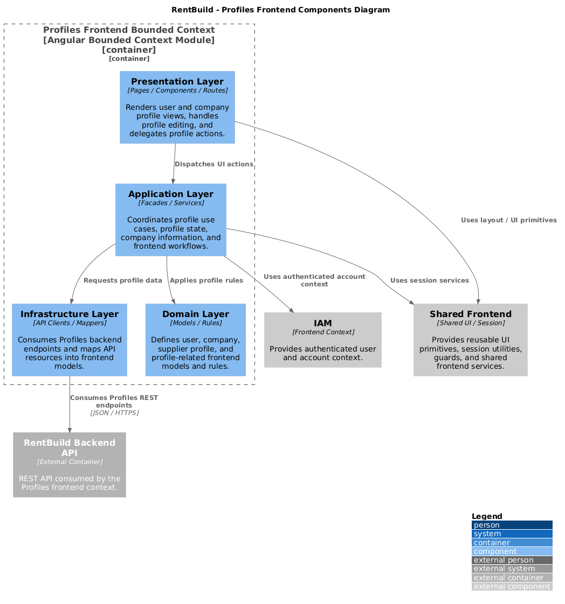

#### Profiles Frontend Detailed Component Diagram

El Profiles Frontend Detailed Component Diagram presenta una vista más completa de la organización interna del bounded context Profiles, integrando las capas Presentation, Application, Domain e Infrastructure y mostrando las relaciones entre sus componentes.

La Presentation Layer está conformada por `ProfileComponent`, `EditProfileComponent` y `CompanyProfileComponent`, responsables de visualizar y actualizar la información correspondiente a los perfiles de usuarios y empresas.

La Application Layer coordina las consultas, actualizaciones y el estado relacionado con la gestión de perfiles. La Domain Layer concentra los modelos y reglas asociados con usuarios, empresas y perfiles. Por su parte, la Infrastructure Layer permite consumir los servicios REST expuestos por la RentBuild Backend API y transformar los recursos recibidos en modelos utilizados por el frontend.

Este nivel de detalle permite observar cómo los componentes de presentación delegan las operaciones a la capa de aplicación, cómo esta coordina el acceso al dominio y a la infraestructura, y cómo la infraestructura establece la comunicación con los servicios backend relacionados con Profiles.

  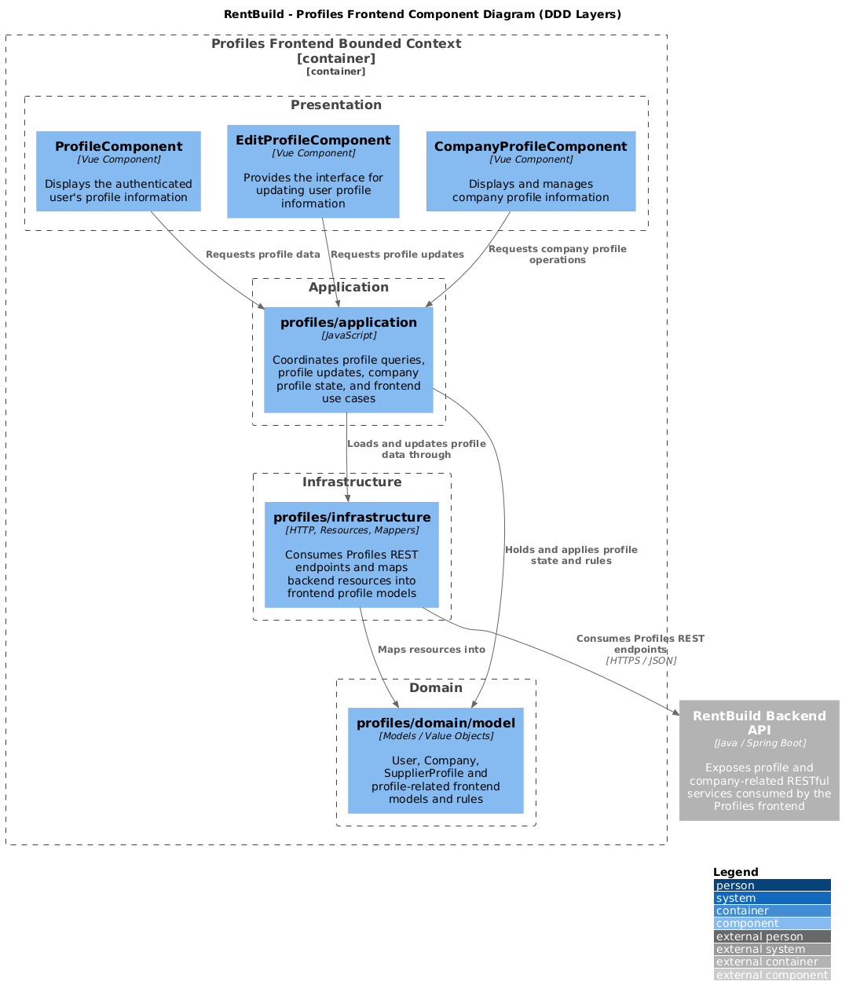

#### Inventory Frontend Components Diagram

El bounded context Inventory del frontend administra el catálogo de maquinaria, los detalles de los equipos, sus categorías, tarifas, estado operativo y disponibilidad.

Su Application Layer coordina los flujos relacionados con la gestión y consulta del inventario, comunicándose con las capas Domain e Infrastructure. Inventory también proporciona información sobre maquinaria y disponibilidad requerida por Rentals y coordina con Maintenance los cambios relacionados con el estado de los equipos.

  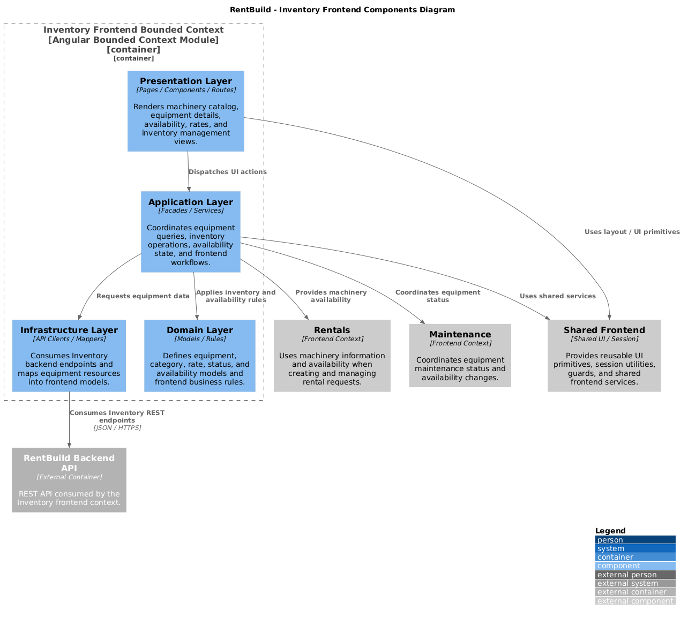

#### Inventory Frontend Detailed Component Diagram

El Inventory Frontend Detailed Component Diagram presenta una vista más completa de la organización interna del bounded context Inventory, integrando las capas Presentation, Application, Domain e Infrastructure y mostrando las relaciones entre sus componentes.

La Presentation Layer está conformada por `EquipmentListComponent`, `EquipmentDetailComponent`, `EquipmentFormComponent`, `EquipmentSearchComponent`, `EquipmentFilterComponent` y `AvailabilityBadgeComponent`. Estos componentes soportan las principales interacciones relacionadas con consulta, detalle, registro, edición, búsqueda, filtrado y visualización de disponibilidad de maquinaria.

La Application Layer coordina los casos de uso y el estado asociado con la gestión del inventario. La Domain Layer concentra los modelos y reglas relacionados con equipos, categorías, tarifas, disponibilidad y estado operativo. Por su parte, la Infrastructure Layer permite consumir los servicios REST expuestos por la RentBuild Backend API y transformar los recursos recibidos en modelos utilizados por el frontend.

Este nivel de detalle permite observar cómo los componentes de presentación delegan las operaciones a la capa de aplicación, cómo esta coordina el acceso al dominio y a la infraestructura, y cómo la infraestructura establece la comunicación con los servicios backend correspondientes al contexto Inventory.

  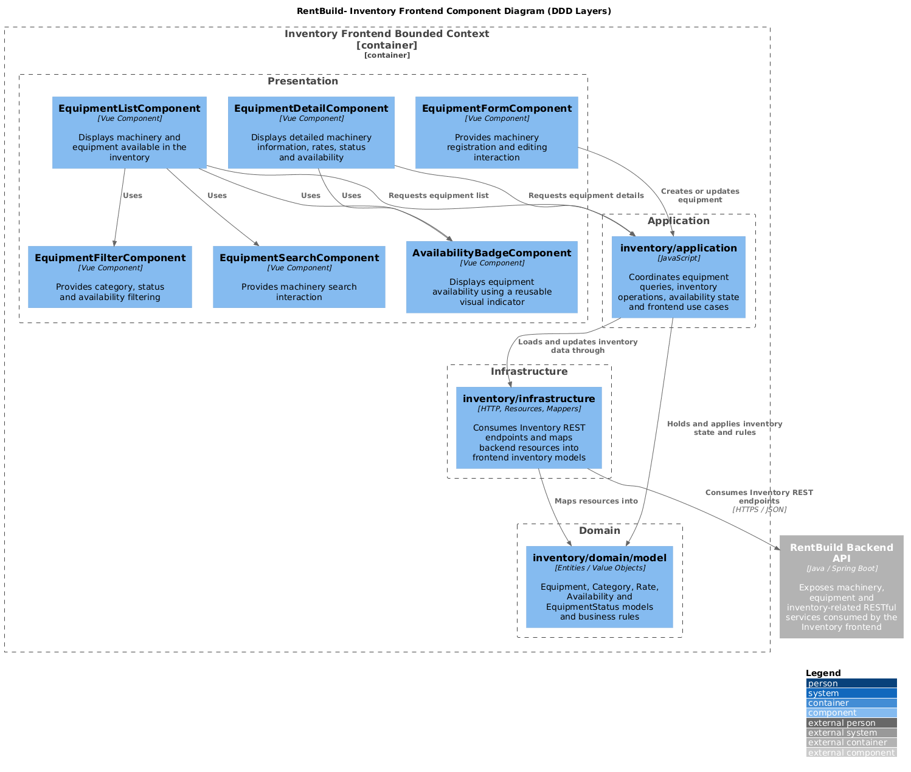

#### Rentals Frontend Components Diagram

El bounded context Rentals del frontend soporta la interacción correspondiente al ciclo de alquiler, incluyendo solicitudes de alquiler, reservas, entregas, alquileres activos y devoluciones.

Este contexto utiliza la información de los equipos y su disponibilidad proporcionada por Inventory, así como la información de empresas y participantes administrada por Profiles. Su Infrastructure Layer se encarga de la comunicación con los endpoints de Rentals expuestos por el backend.

  

#### Rentals Frontend Detailed Component Diagram

El Rentals Frontend Detailed Component Diagram presenta una vista más completa de la organización interna del bounded context Rentals, integrando las capas Presentation, Application, Domain e Infrastructure y mostrando las relaciones entre sus componentes.

La Presentation Layer está conformada por `RentalRequestsComponent`, `RentalRequestDetailComponent`, `ReservationsComponent`, `ActiveRentalsComponent`, `DeliveryFormComponent` y `ReturnFormComponent`. Estos componentes soportan las principales interacciones relacionadas con solicitudes de alquiler, consulta de detalles, reservas, alquileres activos, entregas y devoluciones de maquinaria.

La Application Layer coordina los casos de uso y el estado asociados con el ciclo de alquiler. La Domain Layer concentra los modelos y reglas relacionados con solicitudes de alquiler, reservas, contratos de alquiler, entregas y devoluciones. Por su parte, la Infrastructure Layer permite consumir los servicios REST expuestos por la RentBuild Backend API y transformar los recursos recibidos en modelos utilizados por el frontend.

Este nivel de detalle permite observar cómo los componentes de presentación delegan las operaciones a la capa de aplicación, cómo esta coordina el acceso al dominio y a la infraestructura, y cómo la infraestructura establece la comunicación con los servicios backend correspondientes al contexto Rentals.

  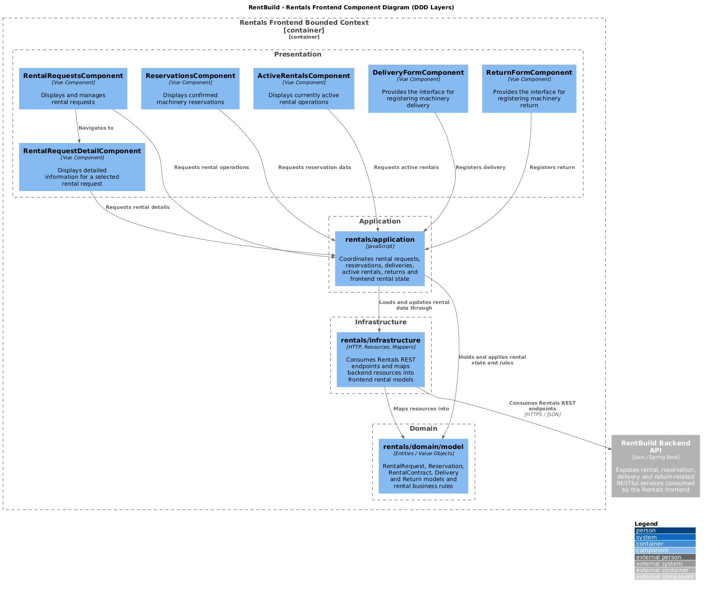

#### Maintenance Frontend Components Diagram

El bounded context Maintenance del frontend administra las programaciones de mantenimiento, inspecciones, incidencias, registros de mantenimiento e historial de mantenimiento de la maquinaria.

Este contexto colabora con Inventory para reflejar cambios en el estado y disponibilidad de los equipos, y con Rentals cuando una incidencia o actividad de mantenimiento afecta a una maquinaria asociada con un alquiler activo.

  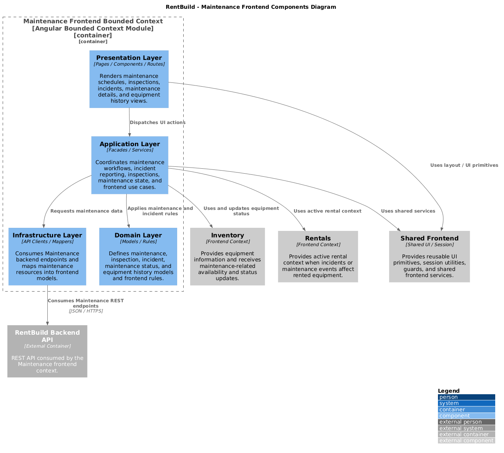

#### Maintenance Frontend Detailed Component Diagram

El Maintenance Frontend Detailed Component Diagram presenta una vista más completa de la organización interna del bounded context Maintenance, integrando las capas Presentation, Application, Domain e Infrastructure y mostrando las relaciones entre sus componentes.

La Presentation Layer está conformada por `MaintenanceListComponent`, `MaintenanceDetailComponent`, `IncidentFormComponent` e `InspectionComponent`. Estos componentes soportan las principales interacciones relacionadas con la consulta de mantenimientos, visualización de detalles, registro de incidencias y gestión de inspecciones de maquinaria.

La Application Layer coordina los casos de uso y el estado asociados con las operaciones de mantenimiento. La Domain Layer concentra los modelos y reglas relacionados con mantenimientos, inspecciones, incidencias, estados de mantenimiento e historial de los equipos. Por su parte, la Infrastructure Layer permite consumir los servicios REST expuestos por la RentBuild Backend API y transformar los recursos recibidos en modelos utilizados por el frontend.

Este nivel de detalle permite observar cómo los componentes de presentación delegan las operaciones a la capa de aplicación, cómo esta coordina el acceso al dominio y a la infraestructura, y cómo la infraestructura establece la comunicación con los servicios backend correspondientes al contexto Maintenance.

  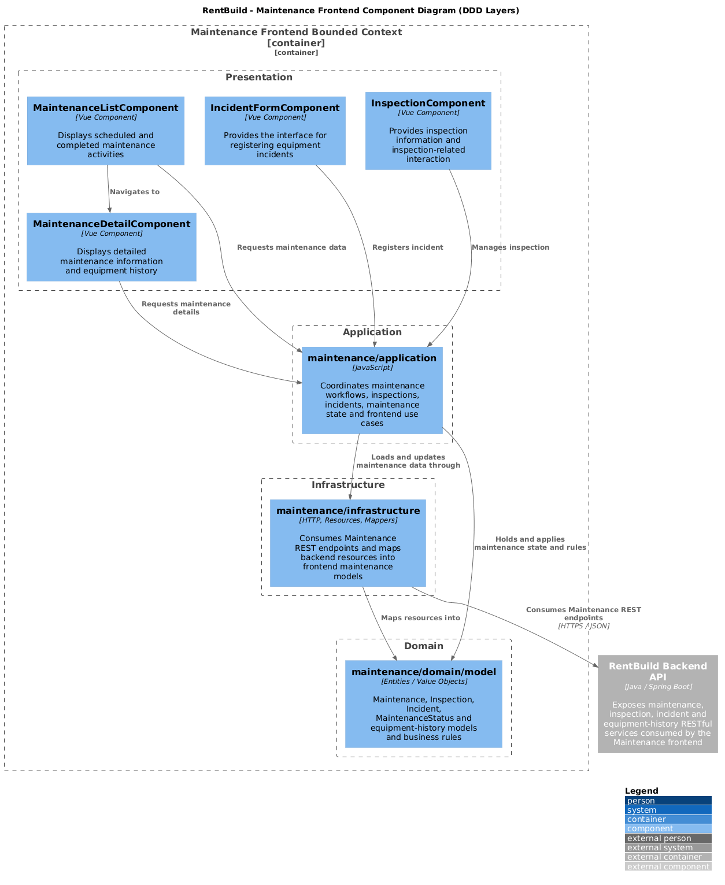

#### Subscriptions Frontend Components Diagram

El bounded context Subscriptions del frontend administra los planes disponibles, la suscripción actual, el estado de la suscripción y los flujos relacionados con la gestión o cambio de plan.

Este contexto utiliza IAM para identificar la cuenta autenticada y Profiles para obtener la información de la empresa asociada con la suscripción. Su Infrastructure Layer se comunica con los servicios correspondientes de Subscriptions disponibles en el backend.

  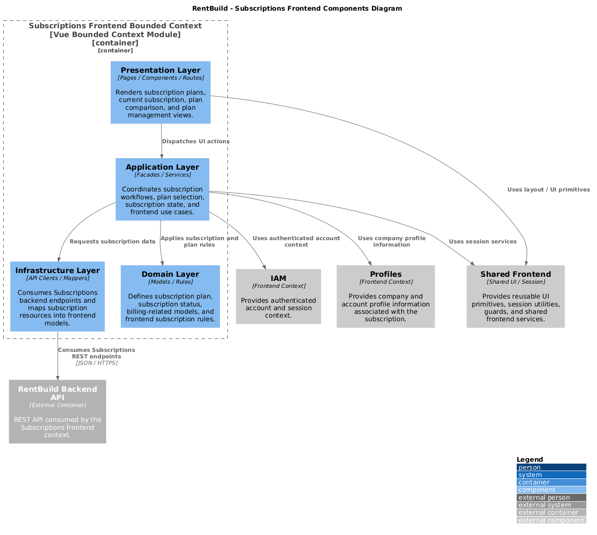

#### Subscriptions Frontend Detailed Component Diagram

El Subscriptions Frontend Detailed Component Diagram presenta una vista más completa de la organización interna del bounded context Subscriptions, integrando las capas Presentation, Application, Domain e Infrastructure y mostrando las relaciones entre sus componentes.

La Presentation Layer está conformada por `PlansComponent`, `CurrentSubscriptionComponent` y `ChangePlanComponent`. Estos componentes soportan las principales interacciones relacionadas con la consulta de planes disponibles, visualización de la suscripción actual y modificación del plan contratado.

La Application Layer coordina los casos de uso y el estado asociados con la gestión de suscripciones. La Domain Layer concentra los modelos y reglas relacionados con suscripciones, planes, períodos de facturación y estados de suscripción. Por su parte, la Infrastructure Layer permite consumir los servicios REST expuestos por la RentBuild Backend API y transformar los recursos recibidos en modelos utilizados por el frontend.

Este nivel de detalle permite observar cómo los componentes de presentación delegan las operaciones a la capa de aplicación, cómo esta coordina el acceso al dominio y a la infraestructura, y cómo la infraestructura establece la comunicación con los servicios backend correspondientes al contexto Subscriptions.

  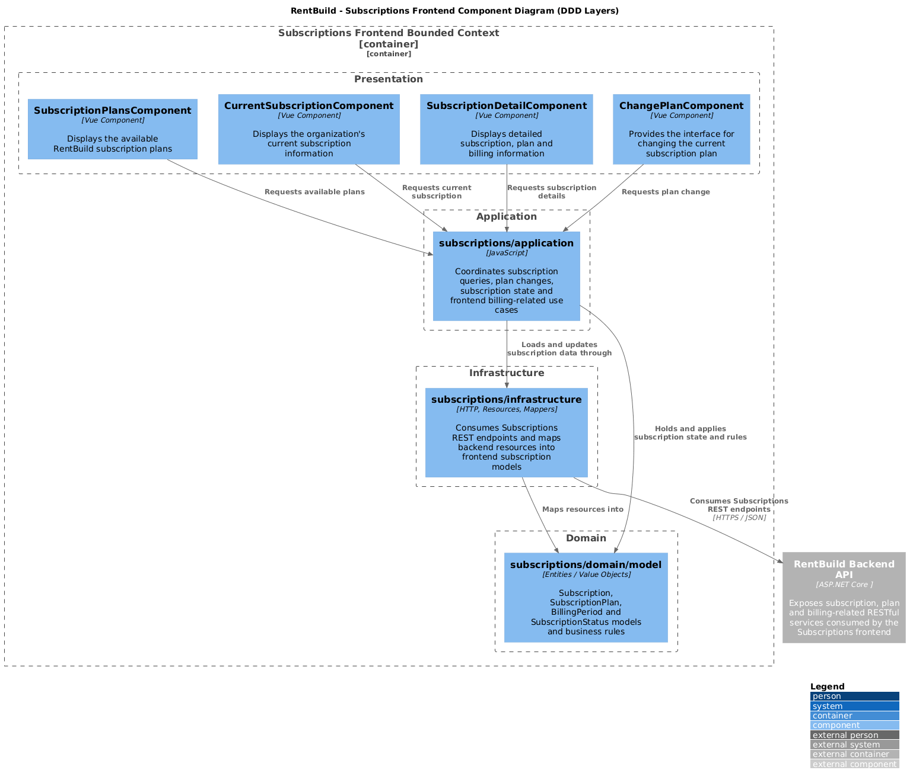

#### Shared Frontend Components Diagram

El Shared Frontend concentra capacidades transversales y reutilizables utilizadas por los diferentes bounded contexts de la Single Page Application de RentBuild.

La Presentation Layer contiene componentes comunes de interfaz como `LayoutComponent`, `NavigationComponent`, `LanguageSwitcherComponent` y `FooterComponent`. Estos elementos proporcionan la estructura visual compartida, la navegación principal, el cambio de idioma y contenido reutilizable entre las diferentes vistas de la aplicación.

La Domain Layer contiene value objects reutilizables que no pertenecen exclusivamente a un bounded context, como `Money` y `DateRange`, permitiendo representar valores comunes mediante objetos autovalidados.

Por su parte, la Infrastructure Layer proporciona mecanismos técnicos compartidos. `ApiClient` centraliza capacidades comunes para la comunicación HTTP con la RentBuild REST API, `AuthInterceptor` incorpora la información de autenticación requerida en las solicitudes salientes y `LocalStorageService` proporciona acceso reutilizable al almacenamiento local del navegador.

De esta manera, Shared Frontend evita duplicar capacidades técnicas y visuales comunes dentro de los bounded contexts y mantiene dichas responsabilidades separadas de los conceptos específicos del dominio.

  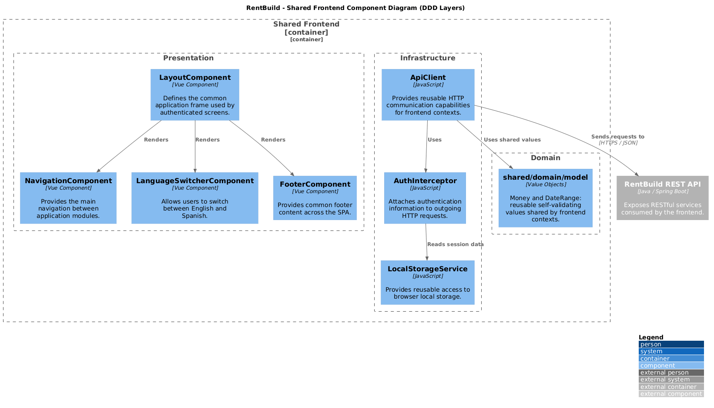

#### Backend General Components Diagram

El Backend General Components Diagram presenta la organización general de la RentBuild API Application implementada con C# y ASP.NET Core.

El contenedor backend está organizado alrededor de seis bounded contexts de negocio: IAM, Profiles, Inventory, Rentals, Maintenance y Subscriptions. Adicionalmente, un componente Shared proporciona capacidades técnicas y transversales reutilizables por los diferentes contextos del backend.

La Single Page Application desarrollada con Vue aparece fuera del límite del backend debido a que actúa como cliente de los servicios REST expuestos por la aplicación. De igual manera, la base de datos MySQL se representa fuera del límite de componentes del backend como el contenedor encargado de la persistencia de la información.

  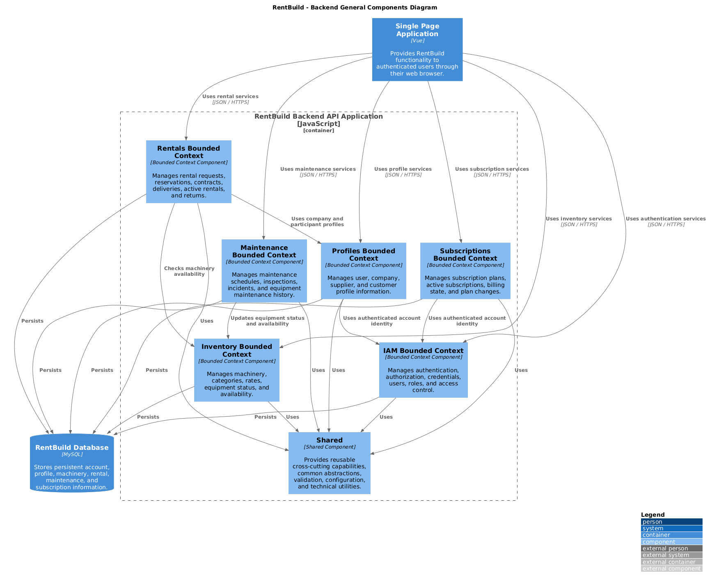

#### IAM Backend Component Diagram

El bounded context IAM del backend administra la autenticación, autorización, credenciales, usuarios, roles y control de acceso.

La Interfaces Layer expone los endpoints REST relacionados con autenticación, registro y administración de cuentas. La Application Layer coordina los casos de uso correspondientes y delega las decisiones de negocio a la Domain Layer. Por su parte, la Infrastructure Layer proporciona los mecanismos de persistencia y adaptadores técnicos necesarios.

Las capacidades relacionadas con seguridad son proporcionadas mediante mecanismos como ASP.NET Core Identity, codificación de contraseñas y autenticación basada en tokens JWT. Además, este contexto puede comunicarse con el servicio externo de correo transaccional para soportar operaciones como recuperación de contraseña y notificaciones relacionadas con la cuenta.

  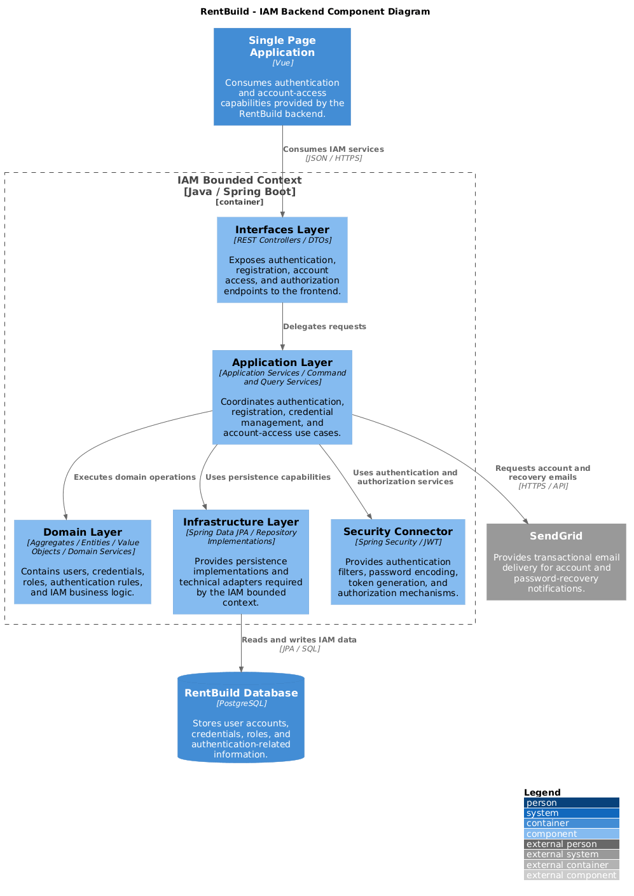

#### Profiles Backend Component Diagram

El bounded context Profiles del backend administra la información correspondiente a usuarios, empresas, proveedores y clientes.

La Interfaces Layer expone los endpoints REST relacionados con perfiles. La Application Layer coordina operaciones de registro, actualización de perfiles, gestión de información empresarial y consultas.

La Domain Layer contiene los conceptos y reglas de negocio relacionados con los perfiles, mientras que la Infrastructure Layer proporciona las implementaciones de repositorios y mecanismos de persistencia. Profiles también colabora con IAM para identificar la cuenta autenticada asociada con cada perfil.

  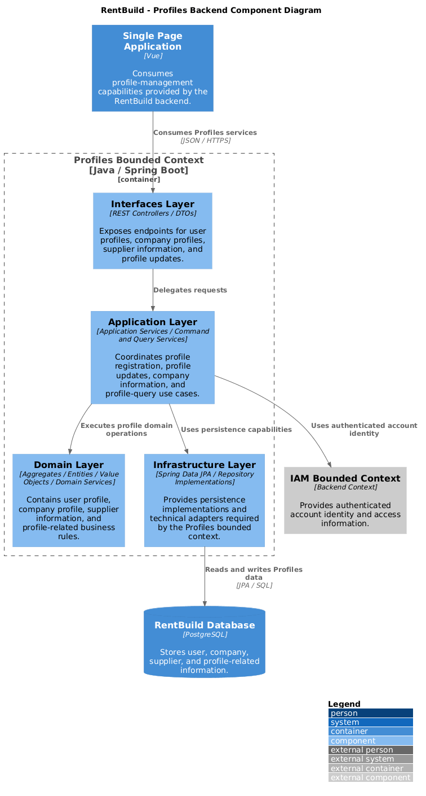

#### Inventory Backend Component Diagram

El bounded context Inventory del backend administra la maquinaria, categorías, tarifas, estado operativo y disponibilidad.

La Interfaces Layer expone los endpoints REST correspondientes a la gestión del inventario. La Application Layer coordina el registro y actualización de maquinaria, consultas de disponibilidad, gestión de tarifas y demás operaciones relacionadas con el inventario.

La Domain Layer contiene los conceptos y reglas de negocio asociados con los equipos, mientras que la Infrastructure Layer proporciona las implementaciones de persistencia mediante Entity Framework Core.

Rentals utiliza Inventory para validar la disponibilidad de la maquinaria, mientras que Maintenance interactúa con este contexto cuando las actividades de mantenimiento modifican el estado operativo o la disponibilidad de los equipos.

  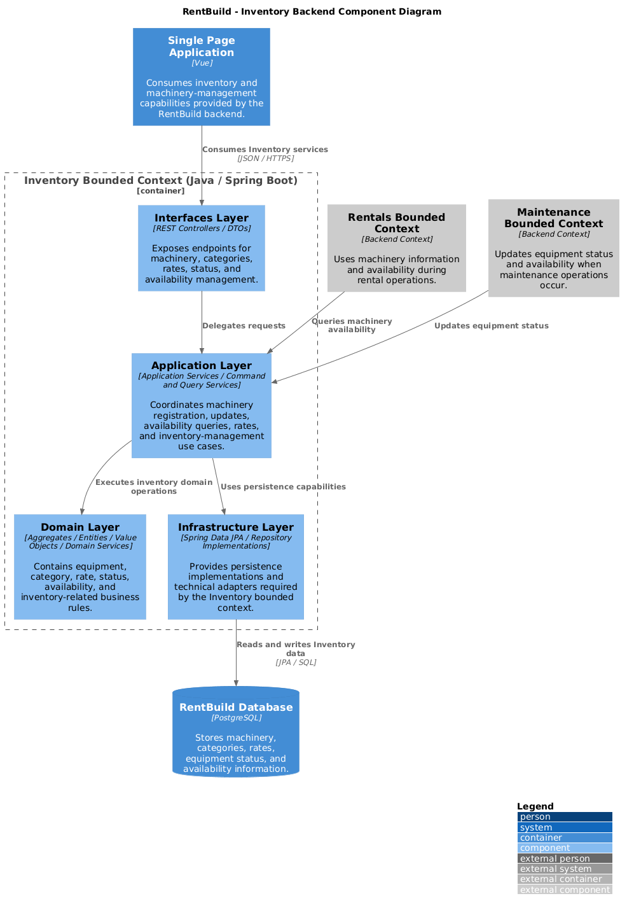

#### Rentals Backend Component Diagram

El bounded context Rentals del backend administra el ciclo completo de alquiler, incluyendo solicitudes, reservas, contratos, entregas, alquileres activos y devoluciones.

La Interfaces Layer expone las operaciones REST requeridas por el frontend. La Application Layer coordina los diferentes flujos del alquiler, mientras que la Domain Layer contiene los agregados, entidades, value objects y reglas de negocio correspondientes.

La Infrastructure Layer proporciona las implementaciones necesarias para la persistencia. Rentals colabora con Inventory para verificar la disponibilidad de la maquinaria y con Profiles para obtener la información de las empresas y participantes involucrados en las operaciones de alquiler.

  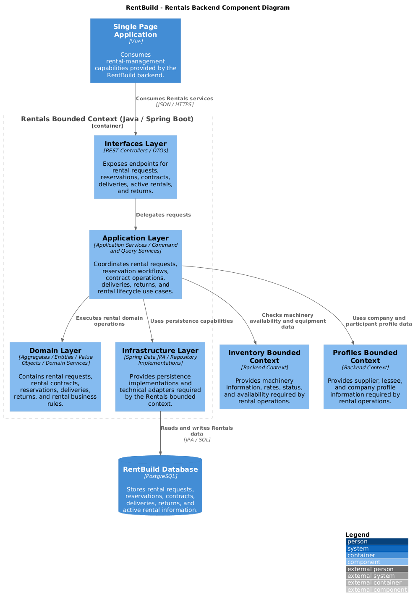

#### Maintenance Backend Component Diagram

El bounded context Maintenance del backend administra las programaciones de mantenimiento, inspecciones, incidencias, registros de mantenimiento e historial de mantenimiento de la maquinaria.

La Interfaces Layer expone los endpoints REST relacionados con estas operaciones. La Application Layer coordina los casos de uso asociados con programación de mantenimiento, inspecciones, registro de incidencias y actualización de mantenimientos.

La Domain Layer contiene los conceptos y reglas de negocio relacionados con el mantenimiento, mientras que la Infrastructure Layer proporciona las implementaciones de repositorios y mecanismos de persistencia.

Maintenance colabora con Inventory para actualizar el estado y disponibilidad de la maquinaria y con Rentals cuando una actividad de mantenimiento o incidencia afecta a un equipo asociado con un alquiler activo.

  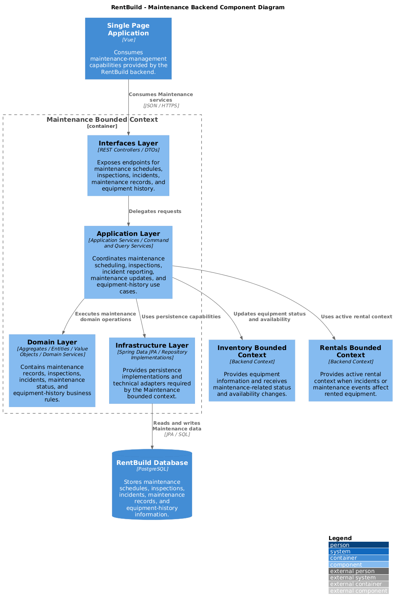

#### Subscriptions Backend Component Diagram

El bounded context Subscriptions del backend administra los planes de suscripción, suscripciones activas, cambios de plan, estado de facturación y operaciones relacionadas con pagos.

La Interfaces Layer expone los endpoints REST necesarios para la gestión de suscripciones. La Application Layer coordina la selección de planes, activación de suscripciones, cambios de plan, estado de facturación y operaciones relacionadas con pagos.

La Domain Layer contiene los conceptos y reglas de negocio correspondientes a las suscripciones, mientras que la Infrastructure Layer proporciona los mecanismos de persistencia necesarios.

Este bounded context utiliza IAM para identificar la cuenta autenticada y Profiles para asociar la suscripción con la información de la empresa. Asimismo, un Payment Connector integra el contexto con Stripe para realizar el procesamiento de los pagos correspondientes a las suscripciones.

  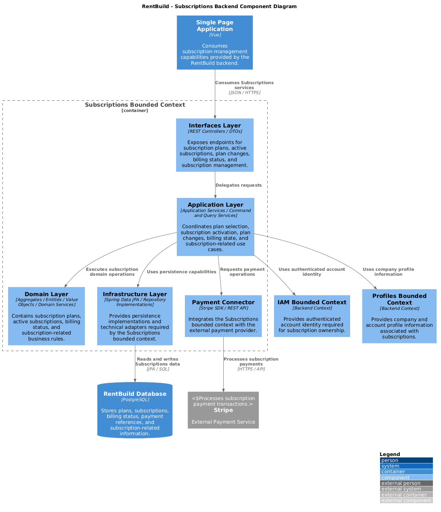

## 4.7. Software Object-Oriented Design

El diseño orientado a objetos detalla la implementación de cada bounded context identificado en la arquitectura. Cada diagrama sigue la misma estructura: entidades del dominio con sus atributos y comportamiento, value objects para conceptos sin identidad propia (periodos, tarifas, direcciones), enumeraciones para los estados del Ubiquitous Language, un repositorio por agregado y un servicio de aplicación que orquesta los casos de uso de las User Stories. Los nombres están en inglés según la convención de nomenclatura del proyecto y los tipos corresponden a C#, el lenguaje de los Web Services; las etiquetas de las relaciones van en español para facilitar la lectura.

#### 4.7.1. Class Diagrams

## Inventory

### A. Domain Layer

**Explicación del Proceso:**

La capa de dominio contiene el agregado raíz `Equipment`, el cual encapsula la lógica de negocio relacionada con la maquinaria. `Equipment` se relaciona con `EquipmentCategory` para su clasificación, utiliza el Value Object `RentalRate` para definir los costos de alquiler y gestiona bloques de indisponibilidad mediante `AvailabilityBlock` y `DateRange`.

**Conexión de la Capa:**

Las entidades del dominio definen los contratos de persistencia `EquipmentRepository` y `EquipmentCategoryRepository`. Estos contratos permiten mantener la lógica de negocio independiente de las tecnologías utilizadas en el backend desarrollado con Node.js, aplicando el principio de Inversión de Dependencias (DIP).

### B. Application Layer

**Explicación del Proceso:**

Contiene `InventoryApplicationService`, responsable de coordinar los casos de uso como el registro de maquinaria mediante `RegisterEquipmentCommand` y la verificación de disponibilidad de equipos para las empresas constructoras.

**Conexión de la Capa:**

`InventoryApplicationService` recibe las solicitudes desde la capa de Interfaces e interactúa con el dominio mediante los contratos definidos en `EquipmentRepository` y `EquipmentCategoryRepository`.

### C. Infrastructure Layer

**Explicación del Proceso:**

Implementa los mecanismos de acceso y persistencia de datos mediante `EquipmentRepositoryImpl` y `EquipmentCategoryRepositoryImpl`, utilizando el entorno Node.js para gestionar la información almacenada en MySQL.

**Conexión de la Capa:**

Implementa los contratos de repositorio definidos en el dominio, permitiendo almacenar y recuperar información de la maquinaria y transformar los Value Objects en estructuras compatibles con la base de datos MySQL.

### D. Interfaces Layer

**Explicación del Proceso:**

A través de `InventoryController`, expone endpoints HTTP REST desarrollados en Node.js que reciben solicitudes JSON desde la aplicación web construida con Vue.js.

**Conexión de la Capa:**

Transforma las peticiones HTTP en objetos de entrada, como `RegisterEquipmentCommand`, y los envía a `InventoryApplicationService` para ejecutar los casos de uso correspondientes.

## Rentals

### A. Domain Layer

**Explicación del Proceso:**

La gestión de alquileres comienza con el agregado `RentalRequest`, inicialmente en estado `PENDING`. Cuando la solicitud es aprobada, se genera la entidad `RentalContract`, que administra la relación contractual y se vincula con `Delivery` y `EquipmentReturn` para registrar la entrega y devolución de la maquinaria.

**Conexión de la Capa:**

Define los contratos `RentalRequestRepository`, `RentalContractRepository`, `EquipmentReturnRepository` y `DeliveryRepository`, además del puerto de integración `InventoryAvailabilityPort`, encargado de validar la disponibilidad de maquinaria.

### B. Application Layer

**Explicación del Proceso:**

`RentalApplicationService` coordina las operaciones relacionadas con los alquileres, incluyendo la aceptación de solicitudes mediante `acceptRequest`, el registro de entregas mediante `registerDelivery` y el procesamiento de devoluciones mediante `registerReturn`.

**Conexión de la Capa:**

Recibe las peticiones provenientes de la capa de Interfaces, utiliza los repositorios correspondientes y se comunica con el contexto de Inventory mediante el puerto de disponibilidad.

### C. Infrastructure Layer

**Explicación del Proceso:**

Contiene las implementaciones concretas de los repositorios de alquiler y el adaptador `InventoryAvailabilityAdapter`, responsables de realizar operaciones de persistencia y facilitar la comunicación con el módulo de inventario.

**Conexión de la Capa:**

Implementa los contratos definidos en el dominio mediante los mecanismos de acceso a datos del backend Node.js, realizando consultas a MySQL para gestionar solicitudes, contratos, entregas y devoluciones de maquinaria.

### D. Interfaces Layer

**Explicación del Proceso:**

`RentalsController` gestiona los endpoints HTTP REST que permiten a los usuarios de la aplicación Vue.js crear solicitudes de alquiler, consultar contratos y actualizar el estado de las operaciones.

**Conexión de la Capa:**

Recibe las peticiones HTTP, procesa los datos enviados en formato JSON e invoca los métodos expuestos por `RentalApplicationService`, devolviendo las respuestas mediante objetos DTO.

## Maintenance

### A. Domain Layer

**Explicación del Proceso:**

Agrupa los agregados `Incident`, encargado de representar los reportes de fallas de maquinaria, y `MaintenanceRecord`, que registra las intervenciones de mantenimiento preventivo y correctivo.

**Conexión de la Capa:**

Un `Incident` no resuelto puede relacionarse con un `MaintenanceRecord`. Además, declara el puerto `EquipmentStatusPort` para comunicar al módulo de inventario los cambios de estado de los equipos que ingresan a mantenimiento.

### B. Application Layer

**Explicación del Proceso:**

`MaintenanceApplicationService` coordina los casos de uso relacionados con el reporte de averías mediante `reportIncident`, la programación de mantenimientos mediante `scheduleMaintenance` y la finalización de trabajos técnicos mediante `completeMaintenance`.

**Conexión de la Capa:**

Utiliza los repositorios del dominio para gestionar las operaciones de mantenimiento y se comunica mediante `EquipmentStatusPort` para actualizar el estado de la maquinaria a `UNDER_MAINTENANCE`.

### C. Infrastructure Layer

**Explicación del Proceso:**

Contiene `IncidentRepositoryImpl`, `MaintenanceRecordRepositoryImpl` y el adaptador `InventoryEquipmentStatusAdapter`, responsables de implementar la persistencia de incidentes y mantenimientos, así como la comunicación con el módulo de inventario mediante el backend Node.js.

**Conexión de la Capa:**

Implementa las operaciones de acceso a datos mediante Node.js y MySQL, permitiendo registrar incidentes, actualizar mantenimientos y comunicar los cambios de estado de la maquinaria.

### D. Interfaces Layer

**Explicación del Proceso:**

`MaintenanceController` expone endpoints HTTP REST que permiten a los usuarios de la aplicación Vue.js registrar incidentes, consultar mantenimientos y actualizar los procesos de reparación de maquinaria.

**Conexión de la Capa:**

Recibe las solicitudes HTTP del cliente web, procesa los datos JSON y delega las operaciones correspondientes a `MaintenanceApplicationService`.

## Subscription

### A. Domain Layer

**Explicación del Proceso:**

Contiene la entidad `SubscriptionPlan`, encargada de definir los planes disponibles, y `UserSubscription`, que representa las suscripciones de los usuarios. Utiliza el Value Object `DateRange` para gestionar los períodos de vigencia, el enumerado `BillingCycle` para establecer la periodicidad de facturación y el atributo booleano `autoRenew` para controlar la renovación automática.

**Conexión de la Capa:**

Define los contratos `UserSubscriptionRepository`, `SubscriptionPlanRepository` y el puerto `PaymentConnector`, que permite integrar servicios externos de procesamiento de pagos sin depender directamente de su implementación.

### B. Application Layer

**Explicación del Proceso:**

`SubscriptionApplicationService` coordina los casos de uso relacionados con la selección de planes, administración de suscripciones y procesamiento de pagos recurrentes.

**Conexión de la Capa:**

Utiliza los repositorios del dominio para consultar y actualizar las suscripciones, y delega las operaciones de pago al puerto `PaymentConnector`.

### C. Infrastructure Layer

**Explicación del Proceso:**

Contiene las implementaciones de los repositorios de suscripciones y el adaptador `StripePaymentConnector`, que permite integrar el backend desarrollado con Node.js con los servicios externos de procesamiento de pagos de Stripe.

**Conexión de la Capa:**

Implementa los contratos del dominio para almacenar información de suscripciones en MySQL y gestionar la comunicación con la pasarela de pagos externa.

### D. Interfaces Layer

**Explicación del Proceso:**

`SubscriptionController` expone endpoints HTTP REST que permiten a los usuarios de la aplicación Vue.js seleccionar, modificar o cancelar sus planes de suscripción.

**Conexión de la Capa:**

Recibe las solicitudes JSON del cliente web y las dirige hacia `SubscriptionApplicationService`, encargado de ejecutar los casos de uso correspondientes.

## IAM

### A. Domain Layer

**Explicación del Proceso:**

Contiene la entidad raíz `User`, encargada de representar las cuentas de usuario. Incorpora el Value Object `Credentials`, que almacena el correo electrónico y el hash de la contraseña, y utiliza `UserRole` y `UserStatus` para gestionar los permisos y estados de las cuentas.

**Conexión de la Capa:**

Define el contrato `UserRepository`, que establece las operaciones necesarias para registrar, consultar y administrar cuentas de usuario, manteniendo la lógica del dominio independiente de las tecnologías de persistencia.

### B. Application Layer

**Explicación del Proceso:**

`AuthenticationService` coordina los procesos de registro, inicio de sesión, validación de credenciales y generación de tokens de sesión mediante `SessionToken`.

**Conexión de la Capa:**

Utiliza `UserRepository` para consultar la información de los usuarios, validar las credenciales y ejecutar las operaciones relacionadas con la autenticación.

### C. Infrastructure Layer

**Explicación del Proceso:**

`UserRepositoryImpl` implementa los mecanismos de persistencia de usuarios mediante el backend Node.js, utilizando MySQL para almacenar la información de las cuentas.

**Conexión de la Capa:**

Implementa el contrato `UserRepository` definido en el dominio y permite almacenar y recuperar los datos de los usuarios desde la base de datos.

### D. Interfaces Layer

**Explicación del Proceso:**

`IAMController` gestiona los endpoints HTTP REST `/register`, `/login` y `/logout`, permitiendo que la aplicación Vue.js realice las operaciones de registro, autenticación y cierre de sesión.

**Conexión de la Capa:**

Recibe solicitudes JSON, transforma los datos de entrada en comandos como `RegisterUserCommand` y `LoginCommand`, y delega su procesamiento a `AuthenticationService`.

## Profiles

### A. Domain Layer

**Explicación del Proceso:**

Contiene `CompanyProfile`, entidad encargada de administrar la información de las organizaciones, que utiliza el Value Object `Address` junto con `GeoCoordinates` para representar su ubicación geográfica. `ProviderProfile` extiende las características del perfil empresarial para incluir información específica de los proveedores de maquinaria y métricas de reputación.

**Conexión de la Capa:**

Define los contratos `CompanyProfileRepository` y `ProviderProfileRepository`, además de las relaciones entre las entidades y los tipos de empresa representados mediante `CompanyType`.

### B. Application Layer

**Explicación del Proceso:**

`ProfileApplicationService` coordina los casos de uso relacionados con la creación, consulta y actualización de perfiles empresariales y de proveedores de maquinaria.

**Conexión de la Capa:**

Recibe los datos procesados por la capa de Interfaces y utiliza los repositorios del dominio para ejecutar las operaciones de administración de perfiles.

### C. Infrastructure Layer

**Explicación del Proceso:**

Implementa los repositorios de perfiles empresariales y proveedores mediante los mecanismos de persistencia del backend Node.js, utilizando MySQL para almacenar y administrar la información.

**Conexión de la Capa:**

Implementa los contratos de repositorio definidos en el dominio y permite registrar, consultar y actualizar la información de las empresas y proveedores en la base de datos.

### D. Interfaces Layer

**Explicación del Proceso:**

`ProfilesController` expone endpoints HTTP REST que permiten a los usuarios de la aplicación Vue.js consultar, registrar y actualizar la información de sus perfiles empresariales.

**Conexión de la Capa:**

Recibe las solicitudes HTTP, transforma los datos JSON en objetos DTO o comandos y los envía a `ProfileApplicationService` para ejecutar los casos de uso correspondientes.

---

## 4.8. Database Design

El modelo de datos traduce las entidades de cada bounded context a tablas relacionales, conservando la separación por contexto: cada grupo de tablas pertenece a un único contexto y las referencias entre contextos se resuelven por identificador (equipment_id, company_profile_id, contract_id), nunca por tablas compartidas. Los value objects se aplanan en columnas de la entidad que los contiene (Address dentro de company_profiles, RentalRate dentro de equipments, RentalPeriod como start_date/end_date). Los estados se almacenan como cadenas cortas que corresponden a las enumeraciones del diseño de clases. El DBMS es MySQL, gestionado desde la API mediante Entity Framework Core y sus migraciones. Las columnas marcadas con viñeta (•) o asterisco son obligatorias.
### 4.8.1. Database Diagrams

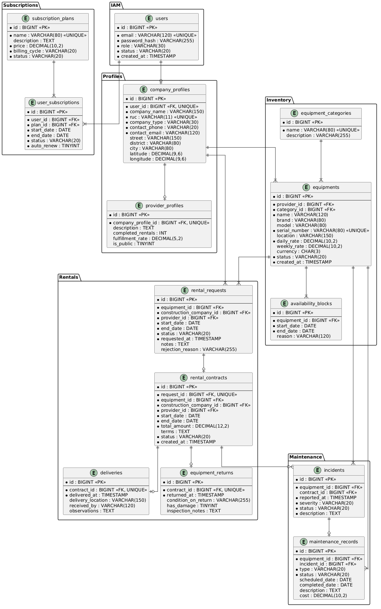

Relaciones principales:

- users 1—0..1 company_profiles: cada usuario tiene a lo sumo un perfil de empresa; company_profiles 1—0..1 provider_profiles: solo las empresas de alquiler tienen perfil público de proveedor.
- company_profiles 1—N equipments: una empresa de alquiler posee muchos equipos; equipment_categories 1—N equipments.
- equipments 1—N availability_blocks: bloqueos de disponibilidad por periodo.
- rental_requests referencia al equipo, a la constructora y al proveedor; rental_requests 1—0..1 rental_contracts: una solicitud aceptada genera exactamente un contrato.
- rental_contracts 1—0..1 deliveries y 1—0..1 equipment_returns: un contrato tiene una entrega y una devolución.
- equipments 1—N maintenance_records y 1—N incidents; incidents 0..1—0..1 maintenance_records: una incidencia puede originar un mantenimiento correctivo; incidents puede referenciar el contrato durante el cual ocurrió.

Restricciones destacadas: users.email, company_profiles.ruc y equipments.serial_number son únicos; rental_contracts.request_id, deliveries.contract_id y equipment_returns.contract_id son únicos para garantizar la relación uno a uno.

---

# Capítulo V: Product Implementation, Validation & Deployment

## 5.1. Software Configuration Management

### 5.1.1. Software Development Environment Configuration

**Project Management**

Para la administración del proyecto RentBuild se recurrió al uso de herramientas de comunicación, planificación y control de versiones. Se creó una organización en GitHub para centralizar la gestión del código fuente y su versionado. En cuanto a la planificación y asignación de tareas del equipo, se utilizó Trello mediante tableros personalizados para cada Sprint. Para la comunicación interna y coordinación de reuniones, se utilizó WhatsApp.

- Organización del trabajo: GitHub
- Planificación y asignación de tareas: Trello
- Comunicación: WhatsApp

Enlaces:

- GitHub: https://github.com/
- Trello: https://trello.com/
- WhatsApp: https://www.whatsapp.com/

**Requirement Management**

Para esta fase, el equipo utilizó Trello como herramienta visual para gestionar y priorizar los requisitos y tareas del proyecto mediante tableros organizados por Sprint. Se utilizó UXPressia para desarrollar los User Personas, Empathy Maps, Journey Maps e Impact Maps correspondientes a los dos segmentos objetivo de RentBuild: empresas de alquiler de maquinaria y pequeñas empresas constructoras.

Enlaces:

- Trello: https://trello.com/
- UXPressia: https://uxpressia.com/

**Product UX/UI Design**

En el diseño de la experiencia e interfaz de usuario, el equipo utilizó Figma para la creación de Wireframes, Mock-ups y Prototipos interactivos del Landing Page y de la Web Application, lo que permitió validar la propuesta visual y de interacción antes de la implementación.

Enlaces:

- Figma: https://www.figma.com/

**Software Development**

Para el desarrollo de la primera versión del Landing Page de RentBuild se utilizaron los lenguajes HTML, CSS y JavaScript en Visual Studio Code.

Enlaces:

- Visual Studio Code: https://code.visualstudio.com/

**Software Documentation**

Para el control de versiones y la colaboración en el desarrollo del informe, se utilizó GitHub siguiendo la estrategia de trabajo GitFlow, mediante el uso de ramas específicas para cada funcionalidad o corrección, lo que facilitó el trabajo colaborativo del equipo. Todo el contenido del proyecto fue centralizado en un repositorio dentro de una organización creada en GitHub. Para la documentación técnica se optó por archivos en formato Markdown, debido a su simplicidad, legibilidad y compatibilidad con GitHub.

Enlaces:

- GitHub: https://github.com/upc-pre-202620-1asi0730-8093-dataflux/dataflux-project-report

**Software Deployment**

Para el despliegue de la primera versión del Landing Page de RentBuild se utilizó Vercel.

Enlaces:

- Vercel: https://dataflux-landing-page.vercel.app/

### 5.1.2. Source Code Management

Para el control de versiones del código fuente de RentBuild, el equipo utiliza Git como sistema de versionado, gestionado a través de GitHub como plataforma de alojamiento. Se ha creado una organización pública en GitHub que centraliza los repositorios correspondientes a cada producto de la solución. Para esta primera entrega (AV1), el repositorio activo corresponde al Landing Page; los repositorios de Web Services (RESTful API) y Frontend Web Applications se incorporarán en las siguientes entregas conforme avance el desarrollo del proyecto.

**Repositorio del proyecto (AV1):**

| Producto | Repositorio |
| :--- | :--- |
| Informe del Proyecto | upc-pre-202620-1asi0730-8093-dataflux/dataflux-landing-page |
| Landing Page | https://dataflux-landing-page.vercel.app/ |

**Workflow de control de versiones: GitFlow**

El equipo aplica GitFlow como estrategia de ramificación, complementando la rama principal (`main`) y la rama de desarrollo (`develop`) con ramas específicas según el tipo de trabajo:

- **Feature branches**: se crean a partir de `develop` para el desarrollo de nuevas funcionalidades. Convención de nombres: `feature/nombre-de-la-funcionalidad` (ej. `feature/landing-hero-section`, `feature/landing-footer`).
- **Release branches**: se crean a partir de `develop` cuando el conjunto de features está listo para una nueva versión. Convención de nombres: `release/vX.Y.Z` (ej. `release/v1.0.0`).
- **Hotfix branches**: se crean a partir de `main` para corregir errores críticos detectados en producción. Convención de nombres: `hotfix/nombre-del-fix` (ej. `hotfix/fix-broken-navbar-link`).

**Semantic Versioning**

Las versiones (Releases) del Landing Page se nombran siguiendo Semantic Versioning 2.0.0, bajo el formato `MAJOR.MINOR.PATCH`:

- **MAJOR**: cambios incompatibles con versiones anteriores.
- **MINOR**: nuevas funcionalidades compatibles con versiones anteriores.
- **PATCH**: correcciones de errores compatibles con versiones anteriores.

Ejemplo: la primera versión desplegada del Landing Page se etiqueta como `v1.0.0`.

**Conventional Commits**

Todos los mensajes de commit siguen la convención de Conventional Commits, con el formato `tipo: descripción breve`, utilizando prefijos como:

- `feat`: para nuevas funcionalidades (ej. `feat: add landing page hero section`)
- `fix`: para corrección de errores (ej. `fix: correct broken footer link`)
- `docs`: para cambios en documentación (ej. `docs: update README with setup instructions`)
- `style`: para cambios de formato que no afectan la lógica
- `refactor`: para reestructuración de código sin cambiar su comportamiento

Esta convención permite mantener un historial de cambios claro y trazable para todo el equipo, incluso en esta etapa inicial del proyecto.

### 5.1.3. Source Code Style Guide & Conventions

El equipo adoptará nomenclatura en inglés para todas las variables, funciones, clases y archivos del proyecto, con el objetivo de mantener flexibilidad, escalabilidad y coherencia en el desarrollo de RentBuild.

**HTML / CSS**

Se sigue el Google HTML/CSS Style Guide. Las clases CSS estarán en `kebab-case`. Se utilizarán etiquetas semánticas e identificadores claros y descriptivos para accesibilidad y mantenimiento. Se usaron diferentes etiquetas para conformar la estructura del Landing Page del producto:

- `header`: Define todo el contenido introductorio de la página, incluyendo el logo de RentBuild y el menú de navegación principal.
- `nav`: Define la sección de la página dedicada a la navegación.
- `main`: Define el contenido principal de la página, agrupando las secciones informativas del Landing Page.
- `section`: Delimita cada bloque temático de la página.
- `div`: Permite la separación de diferentes objetos dentro de la página, lo que nos permitió aplicar hojas de estilo específicas para cada parte de los componentes visuales.
- `img`: Permite la inserción de imágenes en la página web. Todas las imágenes incluyen el atributo `alt` como parte de las prácticas de Accessibility (a11y).
- `ul` / `li`: La etiqueta `ul` define una lista desordenada, usada principalmente para el menú de navegación y la lista de beneficios de la plataforma; `li` define cada elemento dentro de dichas listas.
- `a`: Se usó para definir hipervínculos que trasladan a los usuarios entre las diferentes secciones de la página, así como los Call-to-Action que redirigen al registro/login en la Web Application.
- `p`: Define los párrafos de texto, separándolos del resto del contenido.
- `button`: Declara un botón interactivo que permite al usuario realizar una acción específica.
- `footer`: Define el contenido final de la página, incluyendo enlaces a Términos y Condiciones, Privacy Policy y datos de contacto.
- `h1` - `h4`: Definen los diferentes títulos y subtítulos de la página, siendo `h1` el mayor nivel y `h4` el más bajo.

**JavaScript**

Se sigue el Google JavaScript Style Guide y las MDN JavaScript guidelines. Se utiliza `camelCase` para variables y funciones, `const` y `let` en lugar de `var`, y punto y coma obligatorio al final de cada sentencia. Los nombres de archivo siguen `kebab-case`.

### 5.1.4. Software Deployment Configuration

Para el despliegue del Landing Page de RentBuild se utilizó Vercel, importando el repositorio `dataflux-landing-page` de la organización de GitHub del equipo desde la rama `main`. La configuración del proyecto utiliza el preset de aplicación Vite y el directorio raíz `./`.

Una vez importado el proyecto, Vercel genera el Production Deployment, el cual queda en estado *Ready* y accesible públicamente en el dominio `dataflux-landing-page.vercel.app`. El despliegue toma como fuente la rama `main`, por lo que cada actualización de esta rama se refleja en producción.

## 5.2. Landing Page, Services & Applications Implementation

### 5.2.1. Sprint 1

#### 5.2.1.1. Sprint Planning 1

| | |
| :--- | :--- |
| **Sprint #** | Sprint 1 |
| **Sprint Planning Background** | |
| Date | 2026-09-17 |
| Time | 10:00 PM |
| Location | Vía Discord |
| Prepared By | Luis Angel Cisneros Salas |
| Attendees | Cisneros Salas, Luis Angel Viza Quispe, Marlon Packard Manosalva Tovar, Miroslav Oscar Montalvo Vásquez, Bruno Rodrigo Vargas Manchinelli, Deiby Juan |
| Sprint 1 Review Summary | Durante el Sprint 1, el equipo completó exitosamente el desarrollo de la primera versión del Landing Page de RentBuild utilizando HTML, CSS y JavaScript, tomando como base los Wireframes y Mock-ups diseñados previamente en Figma. Asimismo, se avanzó con las pantallas iniciales de la Web Application correspondientes a la gestión de usuarios (Registro, Login, Perfil), gestión de maquinaria (Inventario, Registro, Detalle, Estado/Disponibilidad), solicitudes de alquiler (Bandeja de solicitudes, Mis solicitudes, Alquileres activos), mantenimiento e incidencias (Registro, Historial), y el Catálogo/búsqueda de maquinaria. El Landing Page se desplegó en un entorno de producción mediante Vercel, permitiendo su acceso público, y todas las tareas planificadas en el Sprint Backlog fueron completadas dentro del tiempo estimado. |
| Sprint 1 Retrospective Summary | En esta sección tuvimos varios aciertos, ya que la división de tareas entre diseño (Figma), desarrollo del Landing Page (HTML/CSS/JS) y desarrollo de las pantallas de la Web Application permitió avanzar en paralelo sin bloqueos. Sin embargo, nos quedamos con dos pendientes específicos: la definición temprana de la herramienta de despliegue y la integración de la lógica de negocio en algunas pantallas de la Web Application, lo cual puso a prueba nuestra capacidad de resolución de problemas sobre la marcha. |
| **Sprint Goal & User Stories** | |
| Sprint 1 Goal | Desarrollar e implementar la primera versión funcional del Landing Page de RentBuild, incluyendo su estructura y diseño visual basado en los prototipos definidos en Figma, así como las pantallas iniciales de la Web Application correspondientes a la gestión de usuarios, maquinaria, solicitudes de alquiler, mantenimiento/incidencias y catálogo de búsqueda, asegurando su despliegue en un entorno de producción accesible públicamente. |
| Sprint 1 Velocity | 59 |
| Sum of Story Points | 59 story points |

#### 5.2.1.2. Aspect Leaders and Collaborators

En esta sección se presenta el Leadership-and-Collaboration Matrix (LACX) elaborado por el equipo para el Sprint 1, el cual identifica al líder y a los colaboradores responsables de cada aspecto dentro del alcance definido para este sprint.

| Team Member (Last, First) | GitHub Username | Diseño visual y maquetación (Landing Page) | Desarrollo Web Application | Despliegue (Vercel) |
| :--- | :--- | :---: | :---: | :---: |
| Cisneros Salas, Luis Angel | LuisCS03 | C | L | C |
| Viza Quispe, Marlon Packard | V8Z5 | L | C | C |
| Manosalva Tovar, Miroslav Oscar | Miroa123 | C | C | L |
| Montalvo Vásquez, Bruno Rodrigo | TartaroZ | C | C | C |
| Vargas Manchinelli, Deiby Juan | poluxbinPe | C | C | C |

#### 5.2.1.3. Sprint Backlog 1

Los IDs de esta tabla se concilian con el catálogo vigente por el título de la función; la versión previa utilizaba aliases como US-03 y una numeración anterior para maquinaria y solicitudes. Se mantienen Work-Items, responsables y estados históricos, sin declarar aceptación nueva. La asignación de IDs corregida no convierte una tarea pendiente en Done.

El propósito central de este Sprint fue construir la primera versión del Landing Page de RentBuild y avanzar en paralelo con las pantallas iniciales de la Web Application, cubriendo la gestión de usuarios, maquinaria, solicitudes de alquiler y mantenimiento/incidencias. El trabajo se organizó a partir de las User Stories asociadas a los Epics comprendidos en este Sprint (EP01, EP02, EP03, EP04, EP05 y EP06). Como herramienta de seguimiento y control de tareas, el equipo optó por Trello.

**Trello:** Pendiente: enlace público de lectura del tablero; la invitación no se publica en el informe

| User Story ID | User Story Title | Work-Item ID | Work-Item Title | Description | Assigned To | Status (To do / In Process / To Review / Done) |
| :--- | :--- | :--- | :--- | :--- | :--- | :--- |
| US01 | Registro | UT-01 | Crear estructura HTML | Maquetar el formulario de registro de usuario | Luis Cisneros | Done |
| US01 | Registro | UT-02 | Añadir estilos CSS | Aplicar estilos según el diseño de Figma | Luis Cisneros | Done |
| US01 | Registro | UT-03 | Añadir validaciones JS | Validar campos y mostrar mensaje de confirmación | Luis Cisneros | Done |
| US02 | Login | UT-04 | Crear estructura HTML | Maquetar formulario de inicio de sesión | Marlon Viza | Done |
| US02 | Login | UT-05 | Añadir estilos CSS | Aplicar estilos según diseño aprobado | Marlon Viza | Done |
| US02 | Login | UT-06 | Añadir lógica JS | Validar credenciales y manejo de errores | Marlon Viza | Done |
| US03 | Perfil de usuario | UT-07 | Crear estructura HTML | Maquetar sección de datos personales | Deiby Vargas | To Do |
| US03 | Perfil de usuario | UT-08 | Añadir estilos CSS | Aplicar estilos según diseño | Deiby Vargas | To Do |
| US06 | Registrar nueva maquinaria | UT-09 | Crear formulario de registro | Maquetar campos del equipo (nombre, tipo, estado) | Miroslav Manosalva | Done |
| US06 | Registrar nueva maquinaria | UT-10 | Añadir validaciones JS | Validar datos ingresados del equipo | Miroslav Manosalva | Done |
| US07 | Inventario de maquinaria | UT-11 | Crear vista de lista | Maquetar tabla/lista de maquinaria registrada | Bruno Montalvo | Done |
| US07 | Inventario de maquinaria | UT-12 | Añadir estilos CSS | Aplicar estilos responsivos a la lista | Bruno Montalvo | Done |
| US09 / US10 / US12 | Detalle + estado/disponibilidad | UT-13 | Crear vista de detalle | Maquetar sección con info, estado y disponibilidad | Luis Cisneros | In Progress |
| US09 / US10 / US12 | Detalle + estado/disponibilidad | UT-14 | Añadir lógica JS | Mostrar estado dinámico (disponible/reservado/alquilado) | Luis Cisneros | In Progress |
| US11 | Catálogo/búsqueda | UT-15 | Crear buscador | Maquetar barra de búsqueda y filtros | Marlon Viza | Done |
| US11 | Catálogo/búsqueda | UT-16 | Añadir lógica JS | Filtrar resultados según criterios | Marlon Viza | Done |
| US18 / US19 | Bandeja de solicitudes | UT-17 | Añadir acciones JS | Maquetar lista de solicitudes recibidas | Miroslav Manosalva | In Progress |
| US20 | Alquileres activos | UT-18 | Crear vista de alquileres | Maquetar lista de equipos alquilados vigentes | Miroslav Manosalva | In Progress |
| US21 | Mis solicitudes | UT-19 | Crear vista de solo lectura | Maquetar estado de solicitudes del cliente | Bruno Montalvo | To Do |
| US23 / US25 | Registrar mantenimiento/incidencia | UT-20 | Crear formulario | Maquetar registro de mantenimiento e incidencias | Deiby Vargas | To Do |
| US23 / US25 | Registrar mantenimiento/incidencia | UT-21 | Añadir validaciones JS | Validar tipo y fecha del registro | Luis Cisneros | In Progress |
| US26 | Historial de maquinaria | UT-22 | Crear vista de historial | Maquetar historial de alquileres/incidencias/mantenimientos | Luis Cisneros | In Progress |
| US26 | Historial de maquinaria | UT-23 | Añadir estilos CSS | Aplicar estilos a la línea de tiempo del historial | Marlon Viza | Done |

#### 5.2.1.4. Development Evidence for Sprint Review

En este primer Sprint, el equipo desarrolló tanto la primera versión del Landing Page como las pantallas iniciales de la Web Application, distribuyendo las tareas según lo definido en el Sprint Backlog. Cada integrante contribuyó con distintas funcionalidades a lo largo del sprint. A continuación, se presenta la tabla con los commits realizados durante este periodo.

| Repository | Branch | Commit Id | Commit Message | Commit Message Body | Commited on (Date) |
| :--- | :--- | :--- | :--- | :--- | :--- |
| RentBuild/Landing-Page | feature/app-features | a4682cd | feat(team): add profile photos for Bruno, Deiby and Miroslav | add profile photos for Bruno, Deiby and Miroslav | 18/09/2026 |
| RentBuild/Landing-Page | feature/app-features | bd3e866 | feat(catalog): add machinery search and filter screen | add machinery search and filter screen | 16/09/2026 |
| RentBuild/Landing-Page | feature/app-features | 8649b7c | feat(inventory): add machinery history screen | add machinery history screen | 16/09/2026 |
| RentBuild/Landing-Page | feature/app-features | c220f22 | feat(maintenance): add register maintenance and incident form | add register maintenance and incident form | 16/09/2026 |
| RentBuild/Landing-Page | feature/app-features | 18b2785 | feat(rentals): add active rentals screen | add active rentals screen | 16/09/2026 |
| RentBuild/Landing-Page | feature/app-features | a0b3479 | feat(requests): add my rental requests screen for construction companies | add my rental requests screen for construction companies | 16/09/2026 |
| RentBuild/Landing-Page | feature/app-features | eb60cf5 | feat(inventory): add machinery detail screen with status and availability | add machinery detail screen with status and availability | 16/09/2026 |
| RentBuild/Landing-Page | feature/app-features | 0a4dc7d | feat(inventory): add register new machinery form | add register new machinery form | 16/09/2026 |
| RentBuild/Landing-Page | feature/app-features | fe84942 | feat(inventory): display machinery list with status and availability | display machinery list with status and availability | 16/09/2026 |
| RentBuild/Landing-Page | feature/app-features | 4c44274 | feat(profile): add user profile screen | add user profile screen | 16/09/2026 |
| RentBuild/Landing-Page | feature/app-features | 8c6ff60 | feat(dashboard): implement user home screen | implement user home screen | 16/09/2026 |
| RentBuild/Landing-Page | feature/app-features | 17e01c2 | feat(auth): implement user registration form | implement user registration form | 16/09/2026 |
| RentBuild/Landing-Page | feature/app-features | 8a81a87 | feat(auth): add login modal for RentBuild | add login modal for RentBuild | 16/09/2026 |
| RentBuild/Landing-Page | feature/app-features | dcb16bb | feat(team): add profile photo for Luis Angel Cisneros Salas | add profile photo for Luis Angel Cisneros Salas | 16/09/2026 |

#### 5.2.1.5. Execution Evidence for Sprint Review

Como equipo, lo que logramos en este primer Sprint fue la exitosa implementación de nuestra Landing Page y su posterior despliegue gracias a la herramienta GitHub Pages. A continuación, presentaremos lo logrado a través de imágenes mostrando las principales vistas.

**Landing Page**

Sección principal (Hero):

Sección "Todo el ciclo de alquiler, conectado":

Sección "Funciones para gestionar mejor tus equipos":

Sección "Mayor control sobre cada alquiler":

Sección "Funciones RentBuild":

Sección "Nuestro equipo":

Sección "RentBuild: Simplificando el alquiler y la gestión de equipos":

Sección "Planes que crecen con tu negocio":

Sección "Contáctanos":

**Web Application**

Inicio de sesión:

Registro de cuenta:

Perfil de usuario:

Inventario de maquinaria:

Registro de nueva maquinaria:

Mis solicitudes de alquiler:

Alquileres activos:

Registro de mantenimiento o incidencia:

Historial de maquinaria:

Catálogo de maquinaria:

#### 5.2.1.6. Services Documentation Evidence for Sprint Review

Dado que el alcance del Sprint 1 se centró en el desarrollo de la primera versión del Landing Page, no se contempló en este sprint la implementación de Web Services. Por consiguiente, no se cuenta aún con endpoints documentados. La documentación de servicios mediante OpenAPI Specification se incorporará a partir de los sprints correspondientes al desarrollo del RESTful API.

#### 5.2.1.7. Software Deployment Evidence for Sprint Review

En esta sección se resumen las actividades realizadas por el equipo en relación con el despliegue de RentBuild durante el Sprint 1. Estas actividades incluyeron la creación de cuentas en el proveedor de hosting vercel, la configuración de los recursos necesarios y el despliegue de la primera versión del Landing Page. A continuación, se presentan capturas de pantalla que evidencian los pasos realizados durante este proceso.

**1.** Ingresando a la cuenta le damos click a *Add New* para añadir un proyecto.

**2.** Le damos click en *Project* para generar un proyecto.

**3.** Le damos click en el proyecto que deseamos importar.

**4.** Nos aparecerá el siguiente recuadro para poder hacer el deploy.

**5.** Finalmente ya tenemos nuestra Landing Page desplegada.

#### 5.2.1.8. Team Collaboration Insights during Sprint

En esta sección se explica cómo se desarrollaron las actividades de implementación del Landing Page durante el Sprint 1, evidenciando la participación colaborativa de todos los integrantes del equipo. A continuación, se presentan capturas de los analíticos de colaboración y commits en GitHub correspondientes al repositorio del proyecto, en los que se refleja el aporte individual de cada miembro del equipo.

### 5.2.2. Sprint 2

**Estado del borrador al 8 de octubre de 2026:** se conserva la planificación documentada para TB1. La reunión, las asignaciones y las estimaciones deben ser confirmadas por el equipo; los commits, las capturas, los videos y los despliegues de este sprint requieren evidencia antes de declarar cumplimiento. Las filas del backlog se mantienen como pendientes y no acreditan ejecución.

#### 5.2.2.1. Sprint Planning 2

| | |
| :--- | :--- |
| **Sprint #** | Sprint 2 |
| **Sprint Planning Background** | |
| Date | 2026-10-07 |
| Time | 9:00 PM |
| Location | Vía Discord |
| Prepared By | Luis Angel Cisneros Salas |
| Attendees | Cisneros Salas, Luis Angel Viza Quispe, Marlon Packard Manosalva Tovar, Miroslav Oscar Montalvo Vásquez, Bruno Rodrigo Vargas Manchinelli, Deiby Juan |
| Sprint 1 Review Summary | En el Sprint 1 se desarrolló y desplegó en Vercel la primera versión del Landing Page de RentBuild, y se avanzó con las pantallas iniciales de la Web Application: registro, login, inventario, registro de maquinaria, catálogo y búsqueda, e historial. Quedaron pendientes o en curso el perfil de usuario (UT-07 y UT-08), el detalle de maquinaria con estado y disponibilidad (UT-13 y UT-14), la bandeja de solicitudes (UT-17), los alquileres activos (UT-18), Mis solicitudes (UT-19) y el registro de mantenimiento e incidencias (UT-20 a UT-22). |
| Sprint 1 Retrospective Summary | La división de tareas entre diseño, Landing Page y Web Application permitió avanzar en paralelo sin bloqueos. Como mejoras, el equipo identificó definir antes la herramienta de despliegue y cerrar la integración de la lógica de negocio en las pantallas ya maquetadas, además de incorporar la retroalimentación recibida en el AV1 sobre los artefactos del informe. |
| **Sprint Goal & User Stories** | |
| Sprint 2 Goal | Nuestro enfoque está en completar el flujo principal de alquiler de RentBuild en la Web Application: consulta de disponibilidad por periodo, solicitud de alquiler, gestión de solicitudes por la empresa de alquiler, y selección y gestión de planes de suscripción. Creemos que esto permitirá a las empresas constructoras y a las empresas de alquiler recorrer el ciclo completo de reserva sin recurrir al teléfono ni a WhatsApp. Esto se confirmará cuando una empresa constructora pueda solicitar un alquiler para un periodo disponible, la empresa de alquiler pueda aprobarlo o rechazarlo, y la primera versión de la Web Application quede desplegada y accesible públicamente desde los call-to-action de la nueva versión del Landing Page. |
| Sprint 2 Velocity | Pendiente de medir con historias aceptadas al cierre del sprint. |
| Sum of Story Points | 41 story points estimados (US03, US05, US08, US13, US14, US18, US19, US21, US15, US16, US17, US33); suma calculada con el Product Backlog vigente, pendiente de aprobación del equipo. |

#### 5.2.2.2. Aspect Leaders and Collaborators

En esta sección se presenta el Leadership-and-Collaboration Matrix (LACX) elaborado por el equipo para el Sprint 2, el cual identifica al líder y a los colaboradores responsables de cada aspecto dentro del alcance del sprint.

| Team Member (Last, First) | GitHub Username | Solicitudes y disponibilidad de alquiler | Gestión de solicitudes y perfil | Planes y suscripciones | Despliegue y correcciones del Landing Page |
| :--- | :--- | :---: | :---: | :---: | :---: |
| Cisneros Salas, Luis Angel | LuisCS03 | L | C | C | C |
| Viza Quispe, Marlon Packard | V8Z5 | C | C | L | C |
| Manosalva Tovar, Miroslav Oscar | Miroa123 | C | L | C | L |
| Montalvo Vásquez, Bruno Rodrigo | TartaroZ | C | C | C | C |
| Vargas Manchinelli, Deiby Juan | poluxbinPe | C | C | C | C |

#### 5.2.2.3. Sprint Backlog 2

US05 corresponde a cierre de sesión; US15, US16 y US17 conservan los títulos del catálogo. Las TS01–TS09 permanecen en el plan técnico de AV2 y no se registran como trabajo ejecutado de Sprint 2.

El propósito central de este Sprint es completar el flujo principal de alquiler en la Web Application de RentBuild, cerrando además los pendientes del Sprint 1 (perfil de usuario y Mis solicitudes). El trabajo se organizó a partir de las User Stories del Product Backlog priorizadas para este sprint. Como herramienta de seguimiento y control de tareas, el equipo utiliza Trello.

Pendiente: captura del tablero de Trello del Sprint 2 en `./assets/md-images-chapter5/sprint-2-trello-board.png`

**Trello:** Pendiente: URL pública del tablero del Sprint 2

| User Story ID | User Story Title | Work-Item ID | Work-Item Title | Description | Estimation (Hours) | Assigned To | Status (To do / In Process / To Review / Done) |
| :--- | :--- | :--- | :--- | :--- | :---: | :--- | :--- |
| US03 | Gestionar perfil | UT-01 | Maquetar sección de datos personales | Crear la vista de perfil con los datos del usuario (arrastra UT-07 y UT-08 del Sprint 1) | 2 | Deiby Vargas | To Do |
| US03 | Gestionar perfil | UT-02 | Editar y guardar perfil | Habilitar la edición de datos con validaciones y mensaje de confirmación | 2 | Deiby Vargas | To Do |
| US05 | Cerrar sesión | UT-03 | Implementar cierre de sesión | Añadir la acción de cerrar sesión y limpiar la sesión del usuario | 1 | Marlon Viza | To Do |
| US08 | Actualizar información de maquinaria | UT-04 | Formulario de edición | Precargar los datos de la maquinaria en un formulario editable | 3 | Miroslav Manosalva | To Do |
| US08 | Actualizar información de maquinaria | UT-05 | Validaciones y confirmación | Validar los campos modificados y confirmar el guardado | 2 | Miroslav Manosalva | To Do |
| US13 | Consultar disponibilidad para un periodo | UT-06 | Selector de periodo | Agregar selector de rango de fechas en el detalle de la maquinaria | 3 | Luis Cisneros | To Do |
| US13 | Consultar disponibilidad para un periodo | UT-07 | Verificación de conflictos | Implementar la lógica que detecta cruces con alquileres o reservas existentes | 4 | Luis Cisneros | To Do |
| US14 | Solicitar alquiler de maquinaria | UT-08 | Formulario de solicitud | Maquetar el formulario con maquinaria, periodo y datos del proyecto | 3 | Luis Cisneros | To Do |
| US14 | Solicitar alquiler de maquinaria | UT-09 | Envío de solicitud | Registrar la solicitud con estado Pendiente y confirmar al usuario | 3 | Luis Cisneros | To Do |
| US18 | Gestionar solicitudes de alquiler | UT-10 | Bandeja de solicitudes | Listar las solicitudes recibidas con filtros por estado (arrastra UT-17 del Sprint 1) | 3 | Miroslav Manosalva | To Do |
| US19 | Confirmar o rechazar una solicitud | UT-11 | Acciones confirmar y rechazar | Agregar las acciones con diálogo de confirmación y actualización del estado | 3 | Miroslav Manosalva | To Do |
| US21 | Consultar estado de una solicitud de alquiler | UT-12 | Vista de estado de solicitudes | Mostrar al cliente el estado de cada solicitud (arrastra UT-19 del Sprint 1) | 2 | Bruno Montalvo | To Do |
| US15 | Visualizar planes disponibles | UT-13 | Vista comparativa de planes | Maquetar los tres niveles de plan con sus características | 3 | Marlon Viza | To Do |
| US16 | Suscribirse a un plan | UT-14 | Flujo de selección de plan | Permitir elegir un plan y confirmar la selección | 3 | Marlon Viza | To Do |
| US17 | Cambiar de plan | UT-15 | Vista de suscripción actual | Mostrar el plan activo y permitir cambiarlo a un plan habilitado | 4 | Bruno Montalvo | To Do |
| US33 | Acceder a la Web Application | UT-16 | Corrección de observaciones del Landing Page | Verificar que los call-to-action de cada segmento redirijan a la vista de la Web Application y unificar el estilo visual | 3 | Luis Cisneros | To Do |
| US33 | Acceder a la Web Application | UT-17 | Despliegue de la Web Application | Importar el repositorio en Vercel y publicar la Web Application | 2 | Miroslav Manosalva | To Do |

#### 5.2.2.4. Development Evidence for Sprint Review

Pendiente de incorporar los commits reales del Sprint 2, con repositorio, rama, identificador, mensaje y fecha verificables. La planificación del backlog no sustituye esta evidencia.

| Repository | Branch | Commit Id | Commit Message | Commit Message Body | Commited on (Date) |
| :--- | :--- | :--- | :--- | :--- | :--- |
| Pendiente de evidencia | Pendiente | Pendiente | Pendiente | Pendiente | Pendiente |

#### 5.2.2.5. Execution Evidence for Sprint Review

La evidencia de ejecución del Sprint 2 está pendiente. Las siguientes vistas pertenecen al alcance planificado y deben comprobarse con capturas y navegación antes de declararse terminadas.

**Web Application**

- Perfil de usuario: Pendiente: captura
- Edición de maquinaria: Pendiente: captura
- Disponibilidad por periodo en el detalle de maquinaria: Pendiente: captura
- Solicitud de alquiler: Pendiente: captura
- Bandeja de solicitudes con confirmar y rechazar: Pendiente: captura
- Mis solicitudes con estado: Pendiente: captura
- Planes de suscripción: Pendiente: captura
- Gestión de la suscripción: Pendiente: captura

**Video de ejecución:** Pendiente: enlace al video de navegación del Sprint 2

#### 5.2.2.6. Services Documentation Evidence for Sprint Review

TB1 exige la primera versión desplegada del frontend; la primera versión desplegada de Web Services corresponde a AV2. En este borrador no se adjunta documentación ni evidencia de ejecución de una API propia para Sprint 2. El origen de los datos del frontend y los servicios utilizados deben documentarse tras la verificación del producto; no se declara aquí una integración o ejecución no comprobada.

#### 5.2.2.7. Software Deployment Evidence for Sprint Review

Pendiente de comprobar y documentar los despliegues de TB1: nueva versión del Landing Page y primera versión de la Web Application. El proveedor, los pasos de configuración y las URLs se incorporarán junto con capturas de la versión efectivamente publicada; este borrador no declara un despliegue realizado.

Pendiente: pasos con capturas del despliegue (importación del repositorio de la Web Application, configuración, Production Deployment), URL pública de la Web Application, URL de la nueva versión del Landing Page y herramienta usada para la fake API.

#### 5.2.2.8. Team Collaboration Insights during Sprint

Pendiente: descripción de la colaboración durante el Sprint 2 y capturas de los analíticos y commits de GitHub que reflejen el aporte individual de cada integrante.

# Conclusiones

## Conclusiones y recomendaciones

**Problema y segmentos.** El análisis del sector (Clements, 2025, indica que el 67 % de las empresas de alquiler opera con sistemas parcialmente integrados que requieren transferencia manual de información) y el User Task Matrix apuntan en la misma dirección. En ambos segmentos, las tareas de mayor frecuencia e importancia son verificar la disponibilidad de los equipos y dar seguimiento a las fechas de devolución. Ambos dependen además del teléfono y de WhatsApp. Esto respalda el Problem Statement y la necesidad de una solución digital centralizada.

1. **Diferenciación.** El análisis competitivo frente a Booqable, Rentman y Odoo Rental mostró un espacio para una plataforma más especializada y simple. RentBuild se enfoca en maquinaria para construcción y en el ciclo completo (reserva, alquiler, entrega, devolución, inspección y mantenimiento), sin la complejidad de plataformas de mayor escala.
2. **Producto del Sprint 1.** La documentación de AV1 contiene capturas de la Landing Page y de pantallas iniciales de la Web Application, commits reportados y pasos de despliegue. El Sprint Backlog conserva tareas marcadas como To Do e In Progress; por ello, no se declara que las 23 tareas ni todos los story points comprometidos hayan sido completados. El cierre de cada tarea debe conciliarse con la evidencia y el estado aprobado por el equipo.
3. **Trabajo en equipo y liderazgo compartido.** El equipo estableció una meta común mediante el Sprint Goal y planificó las tareas con responsables por aspecto en la matriz LACX, donde el liderazgo se repartió entre los integrantes (diseño y maquetación, desarrollo de la Web Application y despliegue). Esta división permitió avanzar en paralelo sin bloqueos. Las ramas de GitFlow, los Conventional Commits y el tablero de Trello dieron trazabilidad al trabajo y permiten que cualquier integrante continúe las tareas de otro.
4. **Mejora continua.** En la retrospectiva el equipo identificó una oportunidad de mejora: la herramienta de despliegue debió definirse antes. La integración de la lógica de negocio en algunas pantallas fue el mayor reto del sprint y se resolvió sobre la marcha. Estos aprendizajes, junto con la retroalimentación del docente, se incorporarán en las siguientes versiones de los artefactos.

**Recomendaciones**

1. Para TB1, desplegar la primera versión de la Web Application y una nueva versión del Landing Page, como pide el enunciado. El RESTful API con ASP.NET Core y su documentación en OpenAPI se exige desde la AV2.
2. Organizar el RESTful API por los Bounded Contexts del Design-Level EventStorming y aplicar los principios de RESTful en las URLs y los verbos HTTP.
3. Incluir pruebas unitarias y de integración o aceptación en el repositorio de Web Services.
4. Priorizar en el Sprint 2 las funcionalidades que aún no existen: reservas con verificación de conflictos de disponibilidad, contratos y pagos, y suscripciones con los tres niveles de plan definidos en los assumptions.
5. Implementar alertas de fechas de devolución y un dashboard operativo con disponibilidad, alquileres activos y mantenimientos. Son las tareas de mayor frecuencia e importancia del User Task Matrix.
6. Usar como servicio externo de terceros un canal de notificaciones (WhatsApp o correo electrónico), ya que ambos segmentos dependen de esos medios. Así se cumple el requisito del enunciado con una integración que aporta valor real.
7. Aplicar inglés como idioma por defecto en la interfaz y la documentación, con soporte para es_419 y atributos ARIA. Publicar además los términos y condiciones y la protección de privacidad en el footer del Landing Page y de la Web Application.
8. Verificar que los call-to-action de cada segmento en el Landing Page redirijan a la vista correspondiente de la Web Application, con un estilo visual consistente entre ambos.

# Video About-The-Team

# Bibliografía

Brandolini, A. (2013). *Introducing EventStorming*. Leanpub.

Clements, K. (2025, January 25). *The 2025 state of rental technology report*. Quipli. https://www.quipli.com/resources/2025-state-of-rental-report/

Cohn, M. (2004). *User stories applied: For agile software development*. Addison-Wesley.

Cohn, M. (2005). *Agile estimating and planning*. Prentice Hall.

Cooper, A., Reimann, R., Cronin, D., & Noessel, C. (2014). *About face: The essentials of interaction design* (4th ed.). Wiley.

Evans, E. (2003). *Domain-driven design: Tackling complexity in the heart of software*. Addison-Wesley.

Garrett, J. J. (2011). *The elements of user experience: User-centered design for the web and beyond* (2nd ed.). New Riders.

Gothelf, J., & Seiden, J. (2016). *Lean UX: Designing great products with agile teams* (2nd ed.). O'Reilly Media.

Gray, D., Brown, S., & Macanufo, J. (2010). *Gamestorming: A playbook for innovators, rulebreakers, and changemakers*. O'Reilly Media.

Newman, S. (2021). *Building microservices: Designing fine-grained systems* (2nd ed.). O'Reilly Media.

Ries, E. (2011). *The lean startup: How today's entrepreneurs use continuous innovation to create radically successful businesses*. Crown Business.

Schwaber, K., & Sutherland, J. (2020). *The Scrum guide: The definitive guide to Scrum*. Scrum.org. https://scrumguides.org/

# Anexos

## Anexo A. Videos de Exposiciones

En este anexo se conserva el registro previsto de videos de exposición de RentBuild. Los archivos, enlaces, permisos y duración están pendientes de comprobar antes de acreditar una entrega. La descripción de un video no sustituye su evidencia.

| Entrega | Características del video                                                                                                                                                                                                                                                                                                                                                                                                                                                                          | Sobre el contenido | Integración y entrega |
|---------|----------------------------------------------------------------------------------------------------------------------------------------------------------------------------------------------------------------------------------------------------------------------------------------------------------------------------------------------------------------------------------------------------------------------------------------------------------------------------------------------------|--------------------|-----------------------|
| **AV1** | **Estado:** pendiente de comprobar archivo y acceso **Cantidad prevista:** 1 video **Enlace:** Pendiente: Ver video AV1 — confirmar archivo y enlace Microsoft Stream con permisos para el evaluador **Nombre de archivo:** pendiente de confirmar y adecuar a la nomenclatura 1ASI0730/DataFlux del statement **Formato:** `.mp4` **Duración reportada en el borrador AV1:** 10:56; pendiente de comprobar | Video de exposición grupal correspondiente al AV1 de RentBuild. Presenta el avance integral del proyecto hasta el Sprint 1, incluyendo Startup Profile, Solution Profile, segmentos objetivo, Requirements Elicitation & Analysis, Needfinding, User Stories, Product Backlog, Product Design, arquitectura de software, diseño e implementación de la Landing Page y las evidencias correspondientes al Sprint 1. | Pendiente de adjuntar el MP4 y el enlace Microsoft Stream con permisos para el evaluador. Hasta verificar el archivo y su contenido, esta fila no acredita la exposición ni la participación del equipo. |

## Anexo B. Videos del proyecto

En este anexo se recuperan las referencias de recursos audiovisuales del borrador AV1. Deben comprobarse los archivos y su contenido; los enlaces con permisos se facilitan por el canal de entrega del curso.

| Tipo de video | Características del video                                                                                                                | Sobre el contenido | Enlace                                                                                                                                                                                                                                                                                                                                                                                             |
|---|------------------------------------------------------------------------------------------------------------------------------------------|---|----------------------------------------------------------------------------------------------------------------------------------------------------------------------------------------------------------------------------------------------------------------------------------------------------------------------------------------------------------------------------------------------------|
| **Needfinding Interviews** | **Estado:** pendiente de comprobar archivo y acceso **Cantidad prevista:** 1 video **Nombre de archivo:** pendiente de confirmar **Formato:** `.mp4`          | Consolida las entrevistas realizadas a representantes de los segmentos objetivo de RentBuild. Las entrevistas permitieron identificar necesidades, problemas y oportunidades relacionadas con la gestión, búsqueda y alquiler de maquinaria. | Pendiente: Ver Needfinding Interviews — confirmar archivo y enlace Microsoft Stream con permisos para el evaluador |
| **Execution Evidence** | **Estado:** pendiente de comprobar archivo y acceso **Cantidad prevista:** 1 video **Nombre de archivo:** pendiente de confirmar **Formato:** `.mp4`   | Presenta la navegación por la primera versión implementada y desplegada del Landing Page de RentBuild. El video demuestra las principales secciones y elementos interactivos desarrollados durante el Sprint 1. | Pendiente: Ver Execution Evidence — confirmar archivo y enlace Microsoft Stream con permisos para el evaluador

**Web Applications Mock-ups:** https://www.figma.com/design/OIBiedVSqvMmmqYcjx14Ec/Sin-t%C3%ADtulo?node-id=0-1

**Lean UX Canvas:** https://www.figma.com/board/OcVqiqyfAERGRZHmmTNKMI/Sin-t%C3%ADtulo?node-id=0-1

**Trello:** Pendiente: enlace público de lectura del tablero; la invitación no se publica en el informe

**Miro:** Pendiente: enlace público de lectura del tablero; la invitación no se publica en el informe

**Web Applications WireFlow:** https://www.figma.com/board/x7IvCSgobEyo1SbH3PRnqg/Rent-Build-WireFlow
